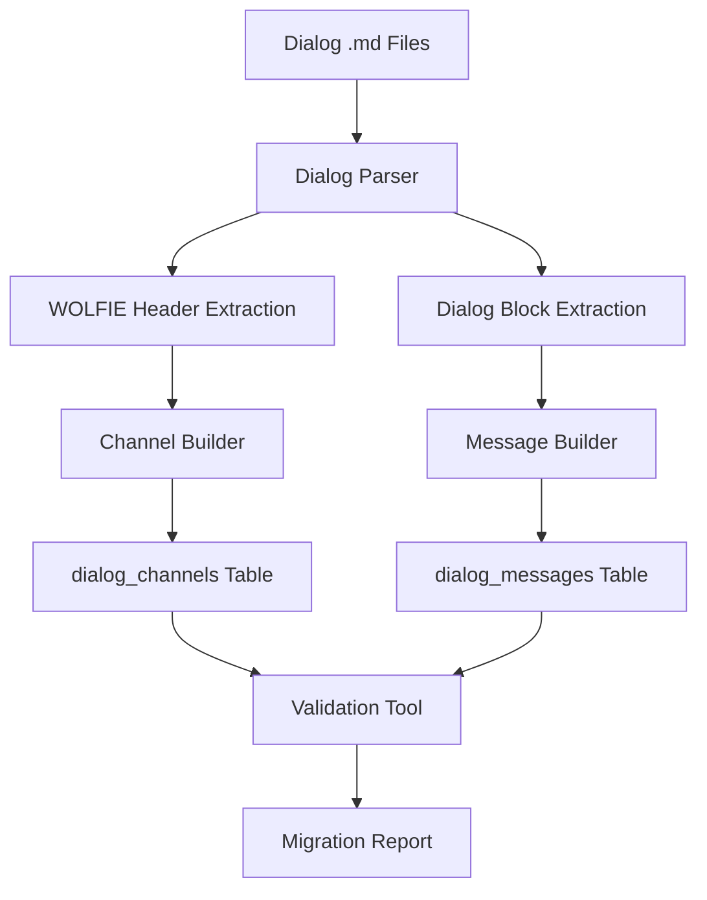

# Design Document

## Overview

The Dialog Channel Migration system transforms Lupopedia's dialog storage from file-based `.md` logs to a structured MySQL database system. This migration preserves all existing content while providing a normalized, queryable, and scalable foundation for dialog management. The system maintains backwards compatibility and introduces no breaking changes to existing workflows.

The design follows Lupopedia's established patterns using WOLFIE headers, maintains integration with existing agent systems, and provides comprehensive validation and error handling throughout the migration process.

## Architecture

### Component Overview

The Dialog Channel Migration system consists of four main components:

1. **Dialog Parser** - Extracts WOLFIE headers and dialog blocks from `.md` files
2. **Channel Builder** - Creates channel entries in MySQL with metadata
3. **Message Builder** - Creates message entries linked to channels
4. **Migration Orchestrator** - CLI tool that coordinates the entire migration process

### System Integration

The system integrates with existing Lupopedia infrastructure:

- **Database Layer**: Uses existing MySQL connection and follows table prefixing doctrine
- **WOLFIE Headers**: Maintains compatibility with existing header parsing systems
- **Agent System**: Ensures all agents can access dialog data through new database interface
- **Validation System**: Integrates with existing validation and logging infrastructure

### Data Flow



## Components and Interfaces

### Dialog Parser

**Purpose**: Extracts structured data from `.md` dialog files with WOLFIE headers and dialog blocks.

**Key Methods**:
- `parseFile(filePath)` - Parses a single dialog file
- `extractWolfieHeader(content)` - Extracts YAML frontmatter
- `extractDialogBlocks(content)` - Extracts structured dialog messages
- `validateFileStructure(content)` - Ensures file follows expected format

**Input**: File paths to `.md` dialog files
**Output**: Structured data objects with headers and message arrays

### Channel Builder

**Purpose**: Creates channel entries in the `dialog_channels` table with metadata from WOLFIE headers.

**Key Methods**:
- `createChannel(headerData, filePath)` - Creates new channel record
- `mapMetadata(headerData)` - Maps WOLFIE header fields to database columns
- `validateChannelData(channelData)` - Ensures required fields are present
- `insertChannel(channelData)` - Performs database insertion

**Input**: WOLFIE header data and file metadata
**Output**: Channel ID for linking messages

### Message Builder

**Purpose**: Creates message entries in the `dialog_messages` table linked to channels.

**Key Methods**:
- `createMessages(channelId, dialogBlocks)` - Creates message records for a channel
- `preserveOrdering(messages)` - Maintains message sequence
- `normalizeMoodRGB(moodValue)` - Standardizes mood color format
- `insertMessages(messageData)` - Performs batch database insertion

**Input**: Channel ID and array of dialog message blocks
**Output**: Array of created message IDs

### Migration Orchestrator

**Purpose**: Coordinates the entire migration process with error handling and reporting.

**Key Methods**:
- `runMigration()` - Executes complete migration workflow
- `discoverDialogFiles()` - Finds all `.md` files in dialogs directory
- `processFile(filePath)` - Processes a single dialog file
- `generateReport()` - Creates comprehensive migration summary

**Input**: Configuration parameters and file system access
**Output**: Migration completion status and detailed report

## Data Models

### Dialog Channel Schema

```sql
CREATE TABLE lupo_dialog_channels (
    channel_id BIGINT PRIMARY KEY AUTO_INCREMENT,
    file_path VARCHAR(255) NOT NULL,
    speaker VARCHAR(100),
    target VARCHAR(100),
    created_timestamp BIGINT,
    mood_rgb VARCHAR(20),
    categories TEXT,
    tags TEXT,
    channels TEXT,
    thread_count INT DEFAULT 0,
    created_at BIGINT,
    updated_at BIGINT
);
```

### Dialog Message Schema

```sql
CREATE TABLE lupo_dialog_messages (
    message_id BIGINT PRIMARY KEY AUTO_INCREMENT,
    channel_id BIGINT,
    message_order INT,
    speaker VARCHAR(100),
    target VARCHAR(100),
    message_text VARCHAR(272),
    mood_rgb VARCHAR(20),
    message_timestamp BIGINT,
    created_at BIGINT,
    FOREIGN KEY (channel_id) REFERENCES lupo_dialog_channels(channel_id)
);
```

### Migration Data Model

```yaml
DialogFile:
  file_path: string
  wolfie_header: WolfieHeader
  dialog_blocks: array[DialogBlock]
  
WolfieHeader:
  speaker: string
  target: string
  mood_RGB: string
  categories: array[string]
  tags: array[string]
  channels: array[string]
  
DialogBlock:
  speaker: string
  target: string
  message: string
  mood_RGB: string (optional)
  timestamp: string (optional)
```

## Correctness Properties

*A property is a characteristic or behavior that should hold true across all valid executions of a system-essentially, a formal statement about what the system should do. Properties serve as the bridge between human-readable specifications and machine-verifiable correctness guarantees.*

### Property 1: Complete File Processing
*For any* dialog file in the dialogs directory, the migration system should successfully parse and migrate all content to the database.
**Validates: Requirements 1.1, 2.1, 3.1, 3.2**

### Property 2: Content Preservation
*For any* migrated dialog file, all original message text and metadata should be preserved exactly in the database.
**Validates: Requirements 2.1, 2.2, 2.3, 2.4, 2.5**

### Property 3: No Duplicate Messages
*For any* migration run, no duplicate message entries should be created in the database.
**Validates: Requirements 2.6, 4.4**

### Property 4: Message Ordering Preservation
*For any* dialog thread, the order of messages in the database should match the order in the original file.
**Validates: Requirements 2.7, 3.7**

### Property 5: Metadata Consistency
*For any* migrated channel, all WOLFIE header metadata should be accurately represented in the database.
**Validates: Requirements 2.3, 4.2**

### Property 6: Validation Accuracy
*For any* completed migration, the validation tool should correctly identify any discrepancies between source files and database content.
**Validates: Requirements 4.1, 4.2, 4.3, 4.7**

### Property 7: Error Logging Completeness
*For any* error during migration, the system should log sufficient detail to identify and resolve the issue.
**Validates: Requirements 8.1, 8.2, 8.3**

### Property 8: Backwards Compatibility
*For any* existing agent or system component, access to dialog data should continue to function after migration.
**Validates: Requirements 7.5, 7.6, 7.7**

## Error Handling

### File System Errors

**Missing Dialog Files**
- **Detection**: Check for existence of dialogs directory and files
- **Recovery**: Create empty migration report if no files found
- **Logging**: Log directory status and file count

**File Access Permissions**
- **Detection**: Test read permissions before processing files
- **Recovery**: Skip inaccessible files and continue with others
- **Reporting**: Include permission errors in migration report

**Malformed File Content**
- **Detection**: Validate WOLFIE header YAML and dialog block structure
- **Recovery**: Log parsing errors and skip malformed files
- **Fallback**: Attempt partial parsing to salvage recoverable content

### Database Errors

**Connection Failures**
- **Detection**: Test database connectivity before migration
- **Recovery**: Retry connection with exponential backoff
- **Escalation**: Abort migration if database unavailable

**Schema Validation Errors**
- **Detection**: Verify required tables exist before migration
- **Recovery**: Create missing tables if permissions allow
- **Reporting**: Document schema issues in migration report

**Constraint Violations**
- **Detection**: Handle foreign key and unique constraint errors
- **Recovery**: Skip duplicate entries, log constraint violations
- **Data Integrity**: Ensure referential integrity is maintained

### Content Processing Errors

**Invalid WOLFIE Headers**
- **Detection**: Validate YAML syntax and required fields
- **Recovery**: Use default values for missing optional fields
- **Logging**: Log header validation errors with file context

**Message Length Violations**
- **Detection**: Check message text length against 272 character limit
- **Recovery**: Truncate messages with warning, preserve original in logs
- **Reporting**: Include truncation warnings in migration report

**Timestamp Format Issues**
- **Detection**: Validate timestamp formats during parsing
- **Recovery**: Use file modification time as fallback
- **Normalization**: Convert all timestamps to consistent format

## Testing Strategy

### Dual Testing Approach

The Dialog Channel Migration will use both unit testing and property-based testing:

**Unit Tests**: Verify specific examples, edge cases, and error conditions
- Test parsing of known dialog file formats
- Test database insertion with sample data
- Test error handling with malformed files
- Test validation tool with known discrepancies

**Property Tests**: Verify universal properties across all inputs
- Test that any valid dialog file can be parsed and migrated
- Test that any migrated content preserves original data
- Test that any migration run produces consistent results
- Test that any validation run accurately identifies issues

### Property-Based Testing Configuration

**Testing Framework**: Use PHPUnit with Eris property testing library for PHP implementation
**Test Iterations**: Minimum 100 iterations per property test
**Test Tagging**: Each property test tagged with format: **Feature: dialog-channel-migration, Property {number}: {property_text}**

### Property Test Implementation

**Property 1 Test**: Generate dialog files with various structures, verify complete processing
```php
/**
 * Feature: dialog-channel-migration, Property 1: Complete File Processing
 * For any dialog file, migration should successfully process all content
 */
```

**Property 2 Test**: Generate content variations, verify exact preservation
```php
/**
 * Feature: dialog-channel-migration, Property 2: Content Preservation
 * For any migrated file, all original content should be preserved exactly
 */
```

**Property 3 Test**: Run multiple migrations, verify no duplicates created
```php
/**
 * Feature: dialog-channel-migration, Property 3: No Duplicate Messages
 * For any migration run, no duplicate entries should be created
 */
```

**Property 4 Test**: Generate message sequences, verify ordering preserved
```php
/**
 * Feature: dialog-channel-migration, Property 4: Message Ordering Preservation
 * For any dialog thread, message order should be preserved in database
 */
```

**Property 5 Test**: Generate metadata variations, verify consistency
```php
/**
 * Feature: dialog-channel-migration, Property 5: Metadata Consistency
 * For any WOLFIE header, metadata should be accurately represented in database
 */
```

**Property 6 Test**: Introduce known discrepancies, verify validation detection
```php
/**
 * Feature: dialog-channel-migration, Property 6: Validation Accuracy
 * For any migration, validation should correctly identify discrepancies
 */
```

**Property 7 Test**: Generate error conditions, verify logging completeness
```php
/**
 * Feature: dialog-channel-migration, Property 7: Error Logging Completeness
 * For any error, system should log sufficient detail for resolution
 */
```

**Property 8 Test**: Test agent access patterns, verify compatibility maintained
```php
/**
 * Feature: dialog-channel-migration, Property 8: Backwards Compatibility
 * For any existing agent, dialog access should continue functioning
 */
```

### Integration Testing

**End-to-End Migration Tests**
- Test complete migration workflow from file discovery to validation
- Verify integration with existing Lupopedia database infrastructure
- Test rollback procedures for failed migrations

**Performance Testing**
- Test migration performance with large dialog file sets
- Verify memory usage remains reasonable during processing
- Test concurrent access scenarios during migration

**Compatibility Testing**
- Test integration with existing WOLFIE header parsing systems
- Verify compatibility with current agent dialog access patterns
- Test cross-reference compatibility with existing documentation