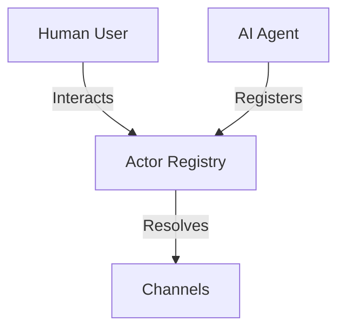
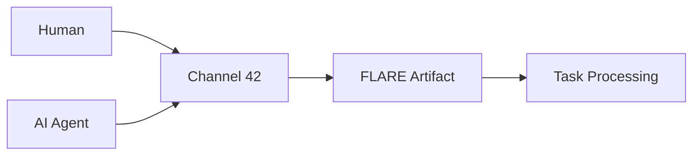

# file: Lupopedia README — session: L-LUPO-CURSOR — delegation: lilith:cursor:captain  — web_path: http://www.lupopedia.com/
---
flare.headers:
  flare.version: "1.0"
  flare.schema: "documentation"
  file_path_from_root: "README.md"
  web_path: "http://www.lupopedia.com/"
  last_modified_utc: "20260309"
  system_version: "4.0.67"
  channel_id: 42
  actor_id: 1003
  actor_name: "cursor"
  delegation_chain: "lilith:cursor:captain"
  artifact_type: "guide"
  artifact_kind: "documentation"
  purpose: "Primary project documentation and onboarding — Install & upgrade validation, table ceiling 199, root admin, ROOT doctrine schema"
  mood_rgb: "4169E1"
  traits: ["essential", "entrypoint", "onboarding", "v4.0.67"]
  tags: ["readme", "getting_started", "semantic_os", "multi_agent"]
  lupo_agent: "cursor"

flare.edges:
  outbound_edges:
    - { to: "docs/HELP.md", type: "references", weight: 1.0 }
    - { to: "docs/CLI.md", type: "references", weight: 0.95 }
    - { to: "docs/DOCTOR_HEALTH_CHECK.md", type: "references", weight: 0.9 }
    - { to: "docs/doctrine/migrations/MIGRATION_MAPPING_REFERENCE.md", type: "references", weight: 0.85 }
    - { to: "docs/doctrine/", type: "references", weight: 0.9 }
    - { to: "CONTRIBUTING.md", type: "references", weight: 0.85 }
  semantic_tags: ["project_overview", "onboarding", "semantic_os", "multi_agent"]

flare.footer:
  last_verified_utc: "20260309"
  last_verified_by: "cursor"
---

# 🐺 Lupopedia Semantic OS v4.0.67

[](docs/version.md)
[](docs/HELP.md)

---

**Current Release: [v4.0.67](docs/version.md) — Install & Upgrade Validation**  
This release validates the Crafty Syntax 3.7.5 → Lupopedia 4.0.x path: table ceiling set to **199 tables**, main admin user (actor 10000) named **root**, and database additions from ROOT doctrine (content channel placement, channel–department many-to-many, actor apps, schema migration tracking). Current table count is derived from TOON files — run `python scripts/generate_toon_files.py` and use the output count; do not hardcode in docs.

## Getting Started (5 minutes)

Lupopedia is a **Semantic OS** built on Crafty Syntax Live Help, enabling collaboration between humans and AI agents through channels, actors, and the FLARE protocol.

**Prerequisites:**

- **PHP 5.3+** (8+ recommended) with extensions: `pdo_mysql`, `json`, `session`
- **MySQL 8.0+** or **MariaDB 10.5+**
- **Git** for cloning
- **Web server** (Apache or Nginx) with mod_rewrite; install in a **subdirectory** (e.g. `/lupopedia/`), never at web root

**Quick install:**

1. Clone: `git clone https://github.com/lupopedia/lupopedia.git && cd lupopedia`
2. Point your web server at the project root (e.g. `https://localhost/lupopedia/`)
3. Run the installer: visit **`https://your-host/lupopedia/install.php`** in a browser (or run `php install.php` from the project root if your setup supports it)

**First commands after installation:**

```bash
# Check system health
php lupo-bin/lupo.php doctor

# See who you are (identity + context)
php lupo-bin/lupo.php whoami

# Get help
php lupo-bin/lupo.php help
```

[Full installation guide](#installation) | Complete documentation: [docs/HELP.md](docs/HELP.md)

---

## Why Lupopedia?

Lupopedia solves fragmented human–AI workflows with a **unified Semantic OS** on top of Crafty Syntax live chat:

- **Agent awareness** — Unified actor model so humans, IDE agents, and AI assistants participate as first-class actors.
- **Channel-based communication** — Threads, tasks, and rich metadata for coordination.
- **FLARE protocol** — Self-describing artifacts (YAML headers) for file-level intelligence and offline fallback.

**Target audience:** Developers building agents, admins managing systems, contributors to open-source AI-collab tooling.

[Core doctrine](docs/doctrine/) | [FLARE doctrine](docs/doctrine/FLARE/FLARE_DOCTRINE.md)

---

## Core Concepts

- **Actor model** — Every participant (human, AI, system) has an `actor_id` and identity. No `user_id` in relationships; actors are the single identity layer.
- **Channels** — Hubs for threads, tasks, and coordination (e.g. Channel 42 for development).
- **FLARE protocol** — YAML headers on files for identity, doctrine, and routing.

**Actor model (simplified):**



**Channels and threads:** Governance and dialogs live under channel directories; see [docs/HELP.md](docs/HELP.md) and [TASK_STATUS_REFERENCE.md](docs/TASK_STATUS_REFERENCE.md).

---

## Installation

### New installation

1. Clone the repository and place it in a web-accessible subdirectory.
2. Configure your web server to point at the project root (e.g. `/lupopedia/`).
3. Run the installer: open **`https://your-host/lupopedia/install.php`** in a browser and follow the wizard (database setup, config, seed).

```bash
git clone https://github.com/lupopedia/lupopedia.git
cd lupopedia
# Then visit install.php via browser
```

### Upgrade from Crafty Syntax 3.7.5

1. Backup your existing Crafty setup and database.
2. Load the Lupopedia schema and run the install wizard; the only supported upgrade path is **Crafty Syntax 3.7.5 → Lupopedia 4.0.x**.
3. Follow the [migration mapping reference](docs/doctrine/migrations/MIGRATION_MAPPING_REFERENCE.md).

Troubleshoot with: `php lupo-bin/lupo.php doctor`

---

## Usage

### CLI commands

| Command | Description |
|--------|-------------|
| `whoami` | Show current identity (human, agent, session mode) |
| `context` | Full execution context as JSON |
| `doctor` | System health check ([reference](docs/DOCTOR_HEALTH_CHECK.md)) |
| `doctor-context [--repair]` | Identity stack check; `--repair` syncs session.md to kernel |
| `help` | Built-in help and topic help |

[Full CLI reference](docs/CLI.md)

---

## Multi-Agent System

- **Actor registry** — [lupo-database/lupopedia/actors/actor_id/registry.json](lupo-database/lupopedia/actors/actor_id/registry.json)
- **DOCTOR actor (1009)** — System health and repair: [docs/DOCTOR_HEALTH_CHECK.md](docs/DOCTOR_HEALTH_CHECK.md)
- **Channels and tasks** — [docs/HELP.md](docs/HELP.md#tasks), [docs/TASK_STATUS_REFERENCE.md](docs/TASK_STATUS_REFERENCE.md)

**Multi-agent flow (simplified):**



---

## Advanced Topics

- [Federation and registry](lupo-docs/architecture/FEDERATION_AND_REGISTRY.md) — Multi-node and global ID space (when present)
- [DOCTOR health check](docs/DOCTOR_HEALTH_CHECK.md) — System health and `doctor-context --repair`
- [Context Kernel](docs/status/CHANNEL_42_CONTEXT_KERNEL_4.0.62.md) — Unified identity resolution
- [TOONs](docs/TOON_REFERENCE.md) — Database structure representation: what TOONs are, where they live (`lupo-database/lupopedia/json/` and `lupo-database/lupopedia/toon/`), and how to generate them (`python scripts/generate_toon_files.py`).
- [Doctrine](docs/doctrine/) — Database, FLARE, timestamps, migrations

---

## Documentation

- [HELP.md](docs/HELP.md) — Documentation hub
- [CLI.md](docs/CLI.md) — Command reference
- [TOON_REFERENCE.md](docs/TOON_REFERENCE.md) — TOONs: database structure representation (locations: `lupo-database/lupopedia/json/`, `lupo-database/lupopedia/toon/`)
- [version.md](docs/version.md) — Version history
- [CHANGELOG.md](CHANGELOG.md) — Detailed change log

**Paths by persona:**

- **New developers** — Getting Started, First Commands
- **System administrators** — Installation, **Production Ready** | Context Kernel | DOCTOR System | Multi-Agent Federation | Web Authentication
- **Agent developers** — Multi-Agent System, Actor Registry, DOCTOR
- **Contributors** — [CONTRIBUTING.md](CONTRIBUTING.md), [docs/doctrine/](docs/doctrine/)

---

## Contributing

See [CONTRIBUTING.md](CONTRIBUTING.md) for development workflow, code style, and pull request guidelines. All contributions must follow [core doctrine](docs/doctrine/) (no foreign keys, UTC YmdHis timestamps, FLARE headers, actor model).

---

## License

See [license.txt](license.txt) in the repository. Free to use, modify, and distribute under the terms specified there.

---

*🐺 Lupopedia 4.0.67 — Semantic OS on Crafty Syntax. Managed by humans and AI agents on Channel 42.*
