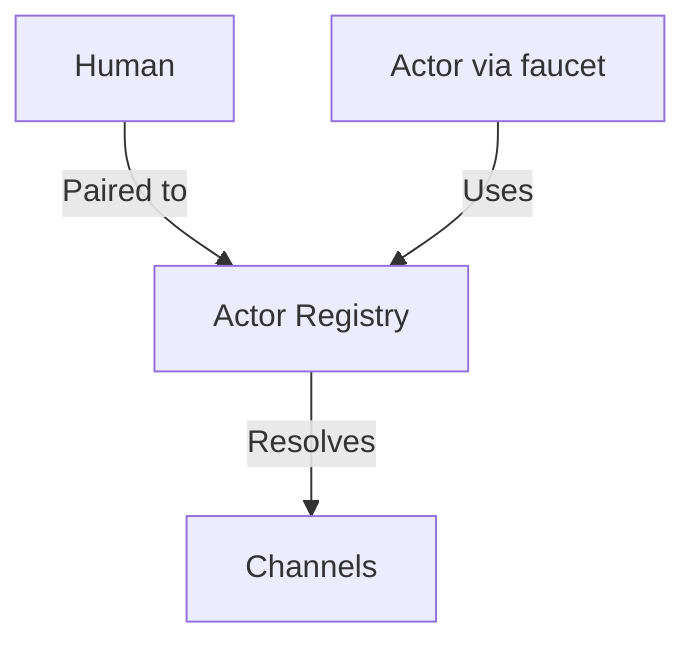
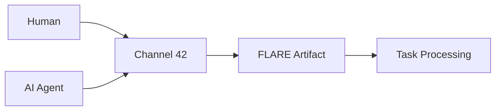

---
lupopedia.headers:
  lupopedia.version: "4.0.69"
  lupopedia.schema: "documentation"
  file_path_from_root: "README.md"
  web_path: "http://www.lupopedia.com/"
  last_modified_utc: "20260312"
  system_version: "4.0.69"
  channel_id: 42
  actor_id: 1
  actor_name: "wolfie"
  faucet_name: "cursor"
  delegation_chain: "wolfie:root"
  artifact_type: "guide"
  artifact_kind: "documentation"
  purpose: "Primary project documentation and onboarding — Install & upgrade validation, channels/actors/agents, GitHub repository strategy"
  mood_rgb: "4169E1"
  traits: ["essential", "entrypoint", "onboarding", "v4.0.69"]
  tags: ["readme", "getting_started", "semantic_os", "multi_agent"]

lupopedia.session:
  session_id: "L-LUPO-ROOT-CURSOR"
  session_name: "L-LUPO-ROOT-CURSOR"
  actor_id: 1
  actor_name: "wolfie"
  faucet_name: "cursor"
  channel_id: 42
  channel_name: "Lupopedia Development (general)"
  federation_node_id: 1
  paired_actor_id: 1000

lupopedia.edges:
  outbound_edges:
    - { to: "docs/HELP.md", type: "references", weight: 1.0 }
    - { to: "docs/CLI.md", type: "references", weight: 0.95 }
    - { to: "docs/DOCTOR_HEALTH_CHECK.md", type: "references", weight: 0.9 }
    - { to: "docs/doctrine/migrations/MIGRATION_MAPPING_REFERENCE.md", type: "references", weight: 0.85 }
    - { to: "docs/doctrine/", type: "references", weight: 0.9 }
    - { to: "CONTRIBUTING.md", type: "references", weight: 0.85 }
  semantic_tags: ["project_overview", "onboarding", "semantic_os", "multi_agent"]

lupopedia.footer:
  last_verified: "20260312"
  last_verified_by: "wolfie"
---
# file: Lupopedia README — session: L-LUPO-ROOT-CURSOR — delegation: wolfie:root (faucet: cursor) — web_path: http://www.lupopedia.com/

# 🐺 Lupopedia Semantic OS v4.0.69

[](docs/version.md)
[](docs/HELP.md)

---

**Current Release: [v4.0.69](docs/version.md) — Post-4.0.68 reconciliation; version bump and channel 42 thread**  
This version focuses on implementing and hardening the web interface for channels management, accessible at `/channels/` with full doctrine compliance. Current table count is derived from TOON files — run `python scripts/generate_toon_files.py` and use the output count; do not hardcode in docs.

**Architecture (onboarding):** **Actors** are the orchestration identities of Lupopedia. They coordinate and govern work through **faucets**, **sessions**, **channels**, **rules**, and **traits**. **Faucets** are execution surfaces, not identities. IDE surfaces (Cursor, Antigravity, Kiro, Windsurf, Codex, JetBrains, Warp, etc.) are faucets. **Sessions** carry runtime context. See [Channels, actors, and agents](#channels-actors-and-agents-in-lupopedia) and [Actor–Faucet ontology](lupo-docs/doctrine/ActorFaucetOntology.md).

## Getting Started (5 minutes)

Lupopedia is a **Semantic OS** built on Crafty Syntax Live Help. **Actors** (orchestration identities) coordinate work through **faucets** (execution surfaces), **sessions** (runtime context), and **channels**; communication uses LUPOPEDIA HEADERS and `lupo_dialog_*` tables.

**Prerequisites:**

- **PHP 5.3+** (8+ recommended) with extensions: `pdo_mysql`, `json`, `session`
- **MySQL 8.0+** or **MariaDB 10.5+**
- **Git** for cloning
- **Web server** (Apache or Nginx) with mod_rewrite; install in a **subdirectory** (e.g. `/lupopedia/`), never at web root

**Quick install:**

1. Clone: `git clone https://github.com/lupopedia/lupopedia.git && cd lupopedia`
2. Point your web server at the project root (e.g. `https://localhost/lupopedia/`)
3. Run the installer: visit **`https://your-host/lupopedia/install.php`** in a browser (or run `php install.php` from the project root if your setup supports it)

**First commands after installation:**

```bash
# Check system health
php lupo-bin/lupo.php doctor

# See who you are (identity + context)
php lupo-bin/lupo.php whoami

# Get help
php lupo-bin/lupo.php help
```

[Full installation guide](#installation) | Complete documentation: [docs/HELP.md](docs/HELP.md)

---

## Why Lupopedia?

Lupopedia solves fragmented human–AI workflows with a **unified Semantic OS** on top of Crafty Syntax live chat:

- **Actors orchestrate** — Actors are the orchestration identities in `lupo_actors`; they coordinate and govern through faucets, sessions, channels, rules, and traits. **Faucets execute** — IDE surfaces (Cursor, Antigravity, Kiro, Windsurf, etc.) are faucets, not actors; the actor operates *through* the faucet.
- **Channel-based communication** — Threads, tasks, and rich metadata for coordination on **channels** (e.g. Channel 42 for development).
- **LUPOPEDIA HEADERS** — Self-describing artifacts (YAML headers) for file identity, doctrine, and routing; see [lupo-docs/doctrine/LUPOPEDIA_HEADERS/](lupo-docs/doctrine/LUPOPEDIA_HEADERS/README.md).

**Target audience:** Developers building agents, admins managing systems, contributors to open-source AI-collab tooling.

[Core doctrine](docs/doctrine/) | [LUPOPEDIA HEADERS](lupo-docs/doctrine/LUPOPEDIA_HEADERS/README.md)

---

## Core Concepts

- **Actors** — Orchestration identities in `lupo_actors`. They coordinate and govern; every participant (human or AI) is represented by an actor. No `user_id` in relationships; `actor_id` is the single identity layer. **Faucets** (Cursor, Antigravity, Kiro, Windsurf, etc.) are execution surfaces, not identities.
- **Channels** — Hubs for threads, tasks, and coordination (e.g. Channel 42 for development). See [Channels, actors, and agents](#channels-actors-and-agents-in-lupopedia) below.
- **LUPOPEDIA HEADERS** — YAML headers on files for identity, doctrine, and routing; stored in `lupo_metadata` and optionally written to the file.

**Orchestration (simplified):**



**Channels and threads:** Governance and dialogs live under channel directories; see [docs/HELP.md](docs/HELP.md) and [TASK_STATUS_REFERENCE.md](docs/TASK_STATUS_REFERENCE.md).

---

## Channels, actors, and agents in Lupopedia

**Actors orchestrate. Faucets execute. Sessions carry runtime context.** Traits constrain actors; roles scope permissions to channels; tasks are transient work items.

| Concept | What it is | Where it lives |
|--------|------------|----------------|
| **Actor** | **Orchestration identity** — who coordinates and governs; holds rules, skills, persona, and doctrine. Every participant (human or AI) is an actor. | `lupo_actors`; registry in `lupo-database/lupopedia/actors/actor_id/registry.json`. |
| **Agent** | **AI/runtime metadata** — configuration for an AI actor (model, provider). The actor is the identity; `lupo_agents` is metadata. | `lupo_agents`. |
| **Faucet** | **Execution surface** — the environment through which an actor acts. Cursor, Antigravity, Kiro, Windsurf, Codex, JetBrains, Warp are **faucets**, not actors. | `lupo_agent_faucets` (`faucet_class`: `ide` or `llm`). |
| **Channel** | **Collaboration context** — where threads, tasks, and dialog happen. Channels have members (actors), roles (per actor per channel), and content. | `lupo_channels`, `lupo_actor_channels`, `lupo_actor_channel_roles`; Channel 42 = Lupopedia Development (general). |
| **Session** | **Runtime context** — who is doing what, where (actor, channel, paired human). | `lupo_sessions` (DB); `lupo-database/sessions/*.md` (IDE session files). |
| **Trait** | **Intrinsic constraint** on an actor (capability marker). Actor-scoped only. | `lupo_actor_traits`. |
| **Role** | **Channel-local permission** (e.g. admin, member). Per (actor, channel). | `lupo_actor_channel_roles`. |
| **Task** | **Transient work item**. | `lupo_tasks`; channel task structure. |

**Important:** IDE surfaces (Cursor, Antigravity, Windsurf, etc.) are **faucets**, not actors. When you use Cursor to work on Lupopedia, the **actor** is typically Wolfie (actor_id 1) or another identity; **Cursor** is the faucet. Session files and headers use `actor_id` + `faucet_name` to make this clear.

**References:** [Actor–Faucet ontology](lupo-docs/doctrine/ActorFaucetOntology.md), [Identity layers](lupo-docs/doctrine/IDENTITY_LAYERS_DOCTRINE.md), [Canonical architecture (4.0.69)](lupo-docs/architecture/cursor_actors_channels_semantic_architecture_4.0.69.md), [How actors orchestrate on channels](lupo-docs/architecture/HOW_ACTORS_ORCHESTRATE_ON_CHANNELS.md).

---

## GitHub Repository Strategy

Lupopedia is currently developed in a temporary repository while architecture and documentation stabilize.

**Current development repository**

Through version 4.1.0, the active repository is:

- **https://github.com/wisdomoflovingfaith/lupopedia**

This repo is used for rapid iteration while system architecture, doctrine, and documentation are finalized.

**Future canonical organization**

Once version 4.1.0 is complete and the project structure is stabilized, Lupopedia will move to the official organization:

- **https://github.com/lupopedia**

The project will then be reorganized into multiple repositories reflecting the system architecture.

**Planned repository structure**

The official `github.com/lupopedia` organization will contain:

| Repository | Purpose |
|------------|---------|
| **core** | Canonical Lupopedia engine: semantic logic, allocators, doctrine, database adapters |
| **web** | Web deployment package for shared hosting (Apache, Nginx, cPanel, etc.) |
| **cli** | Command-line interface for local use and automation |
| **vercel** | Vercel-optimized deployment environment |
| **docs** | Public documentation, governance, doctrine, and architecture |
| **ops** (optional) | CI/CD pipelines, migrations, infrastructure scripts, deployment automation |

**Upstream: Crafty Syntax**

The original Crafty Syntax Live Help 3.7.5 code that Lupopedia is built from is maintained in the organization as:

- **https://github.com/lupopedia/CRAFTY_SYNTAX**

That repository holds the GPL release and legacy documentation; the only supported upgrade path to Lupopedia is **Crafty Syntax 3.7.5 → Lupopedia 4.0.x**.

**Architectural principle**

All Lupopedia functionality lives in the **core** repository. Other repositories act only as adapters or deployment surfaces.

Dependency graph:

- `web` → core  
- `cli` → core  
- `vercel` → core  

This design ensures: no duplicated logic, deterministic architecture, clear system lineage, stable versioning, and clean governance boundaries. The core repository will be versioned independently; surfaces will depend on released versions.

**Migration plan**

When version 4.1.0 is reached:

- The current repository will be reorganized.
- Core engine code will move into **lupopedia/core**.
- Surface-specific code will move into their respective repositories.
- Documentation will move into **lupopedia/docs**.
- The current repository will either become an archive or redirect.

**Why this temporary structure exists**

The current single-repository layout allows rapid development, doctrine stabilization, architectural experimentation, and documentation consolidation before splitting the project into multiple repositories.

---

## Installation

### New installation

1. Clone the repository and place it in a web-accessible subdirectory.
2. Configure your web server to point at the project root (e.g. `/lupopedia/`).
3. Run the installer: open **`https://your-host/lupopedia/install.php`** in a browser and follow the wizard (database setup, config, seed).

```bash
git clone https://github.com/lupopedia/lupopedia.git
cd lupopedia
# Then visit install.php via browser
```

### Upgrade from Crafty Syntax 3.7.5

1. Backup your existing Crafty setup and database.
2. Load the Lupopedia schema and run the install wizard; the only supported upgrade path is **Crafty Syntax 3.7.5 → Lupopedia 4.0.x**.
3. Follow the [migration mapping reference](docs/doctrine/migrations/MIGRATION_MAPPING_REFERENCE.md).

Troubleshoot with: `php lupo-bin/lupo.php doctor`

---

## Usage

### CLI commands

| Command | Description |
|--------|-------------|
| `whoami` | Show current identity (human, agent, session mode) |
| `context` | Full execution context as JSON |
| `doctor` | System health check ([reference](docs/DOCTOR_HEALTH_CHECK.md)) |
| `doctor-context [--repair]` | Identity stack check; `--repair` syncs session.md to kernel |
| `help` | Built-in help and topic help |

[Full CLI reference](docs/CLI.md)

---

## Multi-Agent System

- **Actor registry** — [lupo-database/lupopedia/actors/actor_id/registry.json](lupo-database/lupopedia/actors/actor_id/registry.json)
- **DOCTOR actor (1009)** — System health and repair: [docs/DOCTOR_HEALTH_CHECK.md](docs/DOCTOR_HEALTH_CHECK.md)
- **Channels and tasks** — [docs/HELP.md](docs/HELP.md#tasks), [docs/TASK_STATUS_REFERENCE.md](docs/TASK_STATUS_REFERENCE.md)

**Multi-agent flow (simplified):**



---

## Advanced Topics

- [Federation and registry](lupo-docs/architecture/FEDERATION_AND_REGISTRY.md) — Multi-node and global ID space (when present)
- [DOCTOR health check](docs/DOCTOR_HEALTH_CHECK.md) — System health and `doctor-context --repair`
- [Context Kernel](docs/status/CHANNEL_42_CONTEXT_KERNEL_4.0.62.md) — Unified identity resolution
- [TOONs](docs/TOON_REFERENCE.md) — Database structure representation: what TOONs are, where they live (`lupo-database/lupopedia/json/` and `lupo-database/lupopedia/toon/`), and how to generate them (`python scripts/generate_toon_files.py`).
- [Doctrine](docs/doctrine/) — Database, FLARE, timestamps, migrations

---

## Documentation

- [HELP.md](docs/HELP.md) — Documentation hub
- [CLI.md](docs/CLI.md) — Command reference
- [TOON_REFERENCE.md](docs/TOON_REFERENCE.md) — TOONs: database structure representation (locations: `lupo-database/lupopedia/json/`, `lupo-database/lupopedia/toon/`)
- [version.md](docs/version.md) — Version history
- [CHANGELOG.md](CHANGELOG.md) — Detailed change log

**Paths by persona:**

- **New developers** — Getting Started, First Commands
- **System administrators** — Installation, **Production Ready** | Context Kernel | DOCTOR System | Multi-Agent Federation | Web Authentication
- **Agent developers** — Multi-Agent System, Actor Registry, DOCTOR
- **Contributors** — [CONTRIBUTING.md](CONTRIBUTING.md), [docs/doctrine/](docs/doctrine/)

---

## Contributing

See [CONTRIBUTING.md](CONTRIBUTING.md) for development workflow, code style, and pull request guidelines. All contributions must follow [core doctrine](docs/doctrine/) (no foreign keys, UTC YmdHis timestamps, FLARE headers, actor model).

---

## License

See [license.txt](license.txt) in the repository. Free to use, modify, and distribute under the terms specified there.

---

*🐺 Lupopedia 4.0.67 — Semantic OS on Crafty Syntax. Managed by humans and AI agents on Channel 42.*
