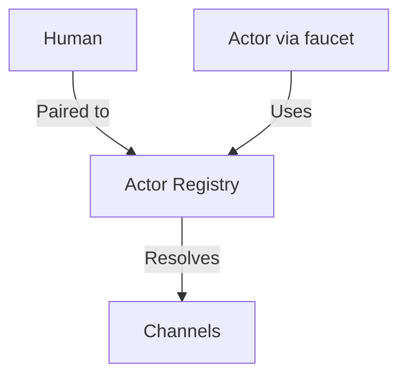
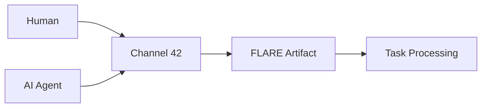

---
lupopedia.init:
  file_identity: "README_windsurf.md"
  artifact_type: "repository-core"
  artifact_kind: "metadata-snapshot"
  namespace: "lupopedia"
  domain: "core"
  system_version: "4.0.74"
  researcher_actor: "windsurf"
  researcher_faucet: "windsurf"
  orchestrator_actor: "wolfie"

lupopedia.metadata:
  comment: "Snapshot of metadata for this file or entity at artifact creation."
  title:
    - { schema_ref: "lupo_metadata", entity_type: "file", meta_type: "property", property_value: "Lupopedia README - Windsurf Research Edition", channel_id: 42, class_name: "lupo_metadata", created_ymdhis: 20260314150000, updated_ymdhis: 20260314150000 }
  description:
    - { schema_ref: "lupo_metadata", entity_type: "file", meta_type: "property", property_value: "Primary project documentation and onboarding — Install & upgrade validation, lupo-channels/actors/agents, GitHub repository strategy. Corrected by Windsurf research with accurate architecture information.", channel_id: 42, class_name: "lupo_metadata", created_ymdhis: 20260314150000, updated_ymdhis: 20260314150000 }
  keywords:
    - { schema_ref: "lupo_metadata", entity_type: "file", meta_type: "property", property_value: "readme, getting_started, semantic_os, multi_agent, v4.0.74, windsurf_research", channel_id: 42, class_name: "lupo_metadata", created_ymdhis: 20260314150000, updated_ymdhis: 20260314150000 }
  author:
    - { schema_ref: "lupo_metadata", entity_type: "file", meta_type: "property", property_value: "wolfie", channel_id: 42, class_name: "lupo_metadata", created_ymdhis: 20260313000000, updated_ymdhis: 20260313000000 }
  orchestrator:
    - { schema_ref: "lupo_metadata", entity_type: "file", meta_type: "property", property_value: "windsurf", channel_id: 42, class_name: "lupo_metadata", created_ymdhis: 20260314150000, updated_ymdhis: 20260314150000 }

lupopedia.headers:
  lupopedia.version: "4.0.74"
  lupopedia.schema: "documentation"
  file_path_from_root: "README_windsurf.md"
  web_path: "http://www.lupopedia.com/README_windsurf"
  last_modified_utc: "20260314"
  system_version: "4.0.74"
  channel_id: 42
  actor_id: 101
  actor_name: "windsurf"
  faucet_name: "windsurf"
  delegation_chain: "wolfie:windsurf"
  artifact_type: "guide"
  artifact_kind: "documentation"
  purpose: "Primary project documentation and onboarding — corrected by Windsurf research with accurate architecture information"
  mood_rgb: "4169E1"
  traits: ["essential", "entrypoint", "onboarding", "v4.0.74", "research_corrected"]
  tags: ["readme", "getting_started", "semantic_os", "multi_agent", "v4.0.74", "windsurf"]

lupopedia.session:
  session_id: "L-LUPO-WINDSURF-README"
  session_name: "L-LUPO-WINDSURF-README"
  actor_id: 101
  actor_name: "windsurf"
  faucet_name: "windsurf"
  channel_id: 42
  channel_name: "Lupopedia Development (general)"
  federation_node_id: 1
  paired_actor_id: 1

lupopedia.edges:
  comment: "Snapshot of outbound edges for README at artifact creation."
  outbound_edges:
    - { to: "lupo-docs/HELP.md", type: "references", weight: 1.0 }
    - { to: "lupo-docs/CLI.md", type: "references", weight: 0.95 }
    - { to: "lupo-docs/DOCTOR_HEALTH_CHECK.md", type: "references", weight: 0.9 }
    - { to: "lupo-docs/doctrine/migrations/MIGRATION_MAPPING_REFERENCE.md", type: "references", weight: 0.85 }
    - { to: "lupo-docs/doctrine/", type: "references", weight: 0.9 }
    - { to: "CONTRIBUTING.md", type: "references", weight: 0.85 }
    - { to: "report_windsurf.md", type: "researched_by", weight: 1.0 }
  semantic_tags: ["project_overview", "onboarding", "semantic_os", "multi_agent", "research_corrected"]

lupopedia.footer:
  version: "4.0.74"
  last_verified: "20260314"
  last_verified_by: "windsurf"
  orchestrator: "windsurf"
  next_action:
    - "Maintain accurate architecture documentation based on research findings"
    - "Update as new system features are implemented"
    - "Coordinate with other IDE agents for consistency"
---
# file: Lupopedia README — session: L-LUPO-WINDSURF-README — delegation: wolfie:windsurf (faucet: windsurf) — web_path: http://www.lupopedia.com/README_windsurf

# 🐺 Lupopedia Semantic OS v4.0.74

[](lupo-docs/version.md)
[](lupo-docs/HELP.md)

---

**Current Release: [v4.0.74](lupo-docs/version.md) — Version hardened for shared hosting, edge schema grouping, and comments system.**  
This version focuses on finalizing **edge schema hardening** (support for grouped outbound edges), implementing **one-time SQL runner** for shared-host compatibility, and adding **comments system** with faucet traceability.

**Architecture (onboarding):** **Actors** are the orchestration identities of Lupopedia. They coordinate and govern work through **faucets**, **sessions**, **channels**, **rules**, and **traits**. **Faucets** are execution surfaces, not identities. IDE surfaces (Cursor, Antigravity, Kiro, Windsurf, Codex, JetBrains, Warp, etc.) are faucets. **Sessions** carry runtime context. See [Channels, actors, and agents](#channels-actors-and-agents-in-lupopedia) and [Actor–Faucet ontology](lupo-docs/doctrine/ActorFaucetOntology.md).

## Table of Contents

- [Required Reading Before Using Lupopedia](#required-reading-before-using-lupopedia)
- [What Lupopedia Is](#what-lupopedia-is)
- [Core Identity Model](#core-identity-model)
- [Core Concepts](#core-concepts)
- [LUPOPEDIA HEADERS — The File/Database Bridge](#lupopedia-headers--the-filedatabase-bridge)
- [Architecture Overview](#architecture-overview)
- [Installation](#installation)
- [Usage](#usage)
- [GitHub Repository Strategy](#github-repository-strategy)
- [Documentation](#documentation)
- [Research Priorities for IDE Agents](#research-priorities-for-ide-agents)
- [Contributing](#contributing)
- [License](#license)

---

## Required Reading Before Using Lupopedia

Lupopedia is **doctrine-driven** and **header-driven**. To avoid invalid initialization, broken headers, or corrupted doctrine lineage, read the following in order before working with `lupopedia.init` or editing LUPOPEDIA HEADERS:

1. **[lupo-docs/INIT_README.md](lupo-docs/INIT_README.md)** — Prerequisites and "Before You Read This File" for anything that uses `lupopedia.init`.
2. **[lupo-docs/doctrine/LUPOPEDIA_HEADERS/](lupo-docs/doctrine/LUPOPEDIA_HEADERS/README.md)** — Header format, file order (first line `---`, identity line after closing `---`), and block order.
3. **[lupo-docs/doctrine/init/LUPO_INITIALIZATION_DOCTRINE.md](lupo-docs/doctrine/init/LUPO_INITIALIZATION_DOCTRINE.md)** — Full prerequisite doctrine list (versioning, directory structure, agent/faucet, semantic/collections) and why each is required.

**`lupopedia.init` is not the first file to read.** Understanding LUPOPEDIA HEADERS and versioning first ensures correct initialization and validation.

## Getting Started (5 minutes)

Lupopedia is a **Semantic OS** built on Crafty Syntax Live Help. **Actors** (orchestration identities) coordinate work through **faucets** (execution surfaces), **sessions** (runtime context), and **channels**; communication uses LUPOPEDIA HEADERS and `lupo_dialog_*` tables.

**Prerequisites:**

- **PHP 5.3+** (8+ recommended) with extensions: `pdo_mysql`, `json`, `session`
- **MySQL 8.0+** or **MariaDB 10.5+**
- **Git** for cloning
- **Web server** (Apache or Nginx) with mod_rewrite; install in a **subdirectory** (e.g. `/lupopedia/`), never at web root

**Quick install:**

1. Clone: `git clone https://github.com/lupopedia/lupopedia.git && cd lupopedia`
2. Point your web server at the project root (e.g. `https://localhost/lupopedia/`)
3. Run the installer: visit **`https://your-host/lupopedia/install.php`** in a browser (or run `php install.php` from the project root if your setup supports it)

**First commands after installation:**

```bash
# Check system health
php lupo-bin/lupo.php doctor

# See who you are (identity + context)
php lupo-bin/lupo.php whoami

# Get help
php lupo-bin/lupo.php help
```

[Full installation guide](#installation) | Complete documentation: [lupo-docs/HELP.md](lupo-docs/HELP.md)

---

## What Lupopedia Is

Lupopedia solves fragmented human–AI workflows with a **unified Semantic OS** on top of Crafty Syntax live chat:

- **Actors orchestrate** — Actors are the orchestration identities in `lupo_actors` (actor_name is PRIMARY KEY); they coordinate and govern through faucets, sessions, channels, rules, and traits. **Faucets execute** — IDE surfaces (Cursor, Antigravity, Kiro, Windsurf, etc.) are faucets, not actors; the actor operates *through* the faucet.
- **Channel-based communication** — Threads, tasks, and rich metadata for coordination on **channels** (Channel 42 is the canonical development channel).
- **LUPOPEDIA HEADERS** — Self-describing artifacts (YAML headers) for file identity, doctrine, and routing; stored in `lupo_metadata` and optionally written to the file.
- **Comments system** — New in 4.0.73: threaded comments on artifacts with full faucet traceability via `lupo_comments` table and `lupopedia.comments` header block.

**Target audience:** Developers building agents, admins managing systems, contributors to open-source AI-collab tooling.

[Core doctrine](lupo-docs/doctrine/) | [LUPOPEDIA HEADERS](lupo-docs/doctrine/LUPOPEDIA_HEADERS/README.md) | [Comments System](lupo-docs/database/lupopedia/tables/active/lupo_comments.md)

---

## Core Identity Model

One thing that must be understood clearly is that Lupopedia separates human account identity from operational orchestration identity.

### Auth Users

Humans live in the `lupo_auth_users` tables.  
These are the real authenticated people in the system. They have passwords, 2FA, email addresses, and account-level security permissions. Auth users represent:

- real human users
- authentication and login
- account ownership
- permissions at the account level

### Actors

Actors live in `lupo_actors` and are the operational identity layer used inside the semantic system.

Actors are what channels, tasks, artifacts, headers, sessions, and orchestration use. Every participant in Lupopedia is represented operationally by an actor, including:

- AI-led participants
- human-led participants
- hybrid human+AI working identities

**Critical Doctrine:** `actor_name` is the PRIMARY KEY in `lupo_actors`, not `actor_id`. The `actor_id` is a unique secondary field for numeric references.

### Agents

Agents live in `lupo_agents` and are AI/runtime metadata, not the identity itself.

They define model/provider/prompt/runtime characteristics for AI behavior.

### Faucets

Faucets live in `lupo_agent_faucets` and are the execution surfaces through which actors operate.

Examples include:

- Windsurf (actor_id: 101)
- Cursor (actor_id: 102)
- Antigravity (actor_id: 103)
- Warp (actor_id: 104)
- JetBrains/Codex (actor_id: 105)

A faucet is not the actor. It is the surface/environment the actor uses.

### Why this distinction matters

A human may exist as an auth_user, but collaboration in channels and artifacts happens through an actor.

That means:

- humans are stored as auth users
- operational participation happens through actors
- AI configuration lives in agents
- execution happens through faucets

This separation is critical to understanding the architecture.

---

## Core Concepts

- **Actors** — Orchestration identities in `lupo_actors` (actor_name is PRIMARY KEY). They coordinate and govern; every participant (human or AI) is an actor. No `user_id` in relationships; `actor_id` is the single identity layer. **Faucets** (Cursor, Antigravity, Kiro, Windsurf, etc.) are execution surfaces, not actors.
- **Channels** — Hubs for threads, tasks, and coordination. Channel 42 is the canonical Lupopedia development channel.
- **LUPOPEDIA HEADERS** — YAML headers on files for identity, doctrine, and routing; stored in `lupo_metadata` table and optionally written to file.
- **Header-Database Bridge** — Headers embed snapshots of database state for portability; `lupo_metadata` is canonical storage, headers are derived.
- **Faucet Traceability** — New in 4.0.73: track which execution surface created each comment or session.
- **Comments System** — New in 4.0.73: threaded comments on artifacts with `lupopedia.comments` header block.
- **Table Ceiling Doctrine** — Hard limit of 222 tables (currently at 210); system grows through refinement, not expansion.

**Orchestration (simplified):**



**Channels and threads:** Governance and dialogs live under channel directories; see [lupo-docs/HELP.md](lupo-docs/HELP.md) and [TASK_STATUS_REFERENCE.md](lupo-docs/TASK_STATUS_REFERENCE.md).

---

## Channels, actors, and agents in Lupopedia

**Actors orchestrate. Faucets execute. Sessions carry runtime context.** Traits constrain actors; roles scope permissions to channels; tasks are transient work items.

| Concept | What it is | Where it lives |
|--------|------------|----------------|
| **Actor** | **Orchestration identity** — who coordinates and governs; holds rules, skills, persona, and doctrine. Every participant (human or AI) is an actor. | `lupo_actors`; registry in `lupo-database/lupopedia/actors/actor_id/registry.json`. |
| **Agent** | **AI/runtime metadata** — configuration for an AI actor (model, provider). The actor is the identity; `lupo_agents` is metadata. | `lupo_agents`. |
| **Faucet** | **Execution surface** — the environment through which an actor acts. Windsurf, Cursor, Antigravity, Kiro, etc. are **faucets**, not actors. | `lupo_agent_faucets` (`faucet_class`: `ide` or `llm`). |
| **Channel** | **Collaboration context** — where threads, tasks, and dialog happen. Channels have members (actors), roles (per actor per channel), and content. | `lupo_channels`, `lupo_actor_channels`, `lupo_actor_channel_roles`; Channel 42 = Lupopedia Development (general). |
| **Session** | **Runtime context** — who is doing what, where (actor, channel, paired human). | `lupo_sessions` (DB); `lupo-database/sessions/*.md` (IDE session files). |
| **Trait** | **Intrinsic constraint** on an actor (capability marker). Actor-scoped only. | `lupo_actor_traits`. |
| **Role** | **Channel-local permission** (e.g. admin, member). Per (actor, channel). | `lupo_actor_channel_roles`. |
| **Task** | **Transient work item**. | `lupo_tasks`; channel task structure. |

**Important:** IDE surfaces (Windsurf, Cursor, Antigravity, etc.) are **faucets**, not actors. When you use Windsurf to work on Lupopedia, the **actor** is typically Wolfie (actor_id 1) or another identity; **Windsurf** is the faucet. Session files and headers use `actor_id` + `faucet_name` to make this clear.

**References:** [Actor–Faucet ontology](lupo-docs/doctrine/ActorFaucetOntology.md), [Identity layers](lupo-docs/doctrine/IDENTITY_LAYERS_DOCTRINE.md), [Canonical architecture (4.0.69)](lupo-docs/architecture/cursor_actors_channels_semantic_architecture_4.0.69.md), [How actors orchestrate on channels](lupo-docs/architecture/HOW_ACTORS_ORCHESTRATE_ON_CHANNELS.md).

---

## LUPOPEDIA HEADERS — The File/Database Bridge

This is one of the most important parts of Lupopedia.

LUPOPEDIA HEADERS are structured YAML blocks at the top of .md files and other artifact-like objects. They are the bridge between database state and filesystem artifacts.

### Why headers exist

The database holds live relational state. The filesystem holds persistent artifacts.

Neither alone is enough.

Headers solve this by embedding structured snapshots of semantic context directly into the artifact.

That means headers can preserve:

- identity
- routing
- authorship
- session context
- semantic relationships
- metadata snapshots
- verification state

### Storage Model

**Canonical storage:** `lupo_metadata` table with row-based storage (not YAML blobs)
**Derived storage:** LUPOPEDIA HEADERS in files (snapshots of database state)
**Synchronization:** Headers can be imported/exported from/to database

### Main header sections

- **lupopedia.init** — Initialization identity and artifact classification
- **lupopedia.headers** — Core operational header fields
- **lupopedia.metadata** — Snapshot of metadata rows from database
- **lupopedia.session** — Runtime context snapshot
- **lupopedia.edges** — Snapshot of semantic relationships
- **lupopedia.comments** — New in 4.0.73: comment snapshots
- **lupopedia.footer** — Verification and next-action context

### What headers bridge

Headers bridge:

filesystem artifact  ↔  semantic object  ↔  database snapshot 

That bridge is essential in a system with ~50 core tables and 10,000+ files.

---

## Architecture Overview

### Filesystem layout

At a high level, Lupopedia includes directories such as:

```
/public
/lupopedia
  /core
  /api
  /uploads
  /channels
  /agents
  /actors
  /auth_users
  /federation
  /widgets
```

### Database domains

The database includes ~50 core tables across domains such as:

- identity (lupo_auth_users, lupo_actors, lupo_agents, lupo_agent_faucets)
- channels and dialog (lupo_channels, lupo_dialog_messages, lupo_dialog_threads)
- metadata (lupo_metadata, lupo_comments)
- sessions (lupo_sessions)
- collections (lupo_collections)
- federation (lupo_federation_nodes)

### Filesystem/database relationship

The database is the live relational layer. The filesystem is the artifact memory layer. Headers are the synchronization and portability layer between them.

---

## Installation

### New installation

1. Clone the repository and place it in a web-accessible subdirectory.
2. Configure your web server to point at the project root (e.g. `/lupopedia/`).
3. Run the installer: open **`https://your-host/lupopedia/install.php`** in a browser and follow the wizard (database setup, config, seed).

```bash
git clone https://github.com/lupopedia/lupopedia.git
cd lupopedia
# Then visit install.php via browser
```

### Upgrade from Crafty Syntax 3.7.5

1. Backup your existing Crafty setup and database.
2. Load the Lupopedia schema and run the install wizard; the only supported upgrade path is **Crafty Syntax 3.7.5 → Lupopedia 4.0.x**.
3. Follow the [migration mapping reference](lupo-docs/doctrine/migrations/MIGRATION_MAPPING_REFERENCE.md).

Troubleshoot with: `php lupo-bin/lupo.php doctor`

---

## Usage

### CLI commands

| Command | Description |
|--------|-------------|
| `whoami` | Show current identity (human, agent, session mode) |
| `context` | Full execution context as JSON |
| `doctor` | System health check ([reference](lupo-docs/DOCTOR_HEALTH_CHECK.md)) |
| `doctor-context [--repair]` | Identity stack check; `--repair` syncs session.md to kernel |
| `help` | Built-in help and topic help |

[Full CLI reference](lupo-docs/CLI.md)

---

## Multi-Agent System

- **Actor registry** — [lupo-database/lupopedia/actors/actor_id/registry.json](lupo-database/lupopedia/actors/actor_id/registry.json)
- **DOCTOR actor (1009)** — System health and repair: [lupo-docs/DOCTOR_HEALTH_CHECK.md](lupo-docs/DOCTOR_HEALTH_CHECK.md)
- **Channels and tasks** — [lupo-docs/HELP.md](lupo-docs/HELP.md#tasks), [lupo-docs/TASK_STATUS_REFERENCE.md](lupo-docs/TASK_STATUS_REFERENCE.md)

**Multi-agent flow (simplified):**



---

## Advanced Topics

- [Federation and registry](lupo-docs/architecture/FEDERATION_AND_REGISTRY.md) — Multi-node and global ID space (when present)
- [DOCTOR health check](lupo-docs/DOCTOR_HEALTH_CHECK.md) — System health and `doctor-context --repair`
- [Context Kernel](lupo-docs/status/CHANNEL_42_CONTEXT_KERNEL_4.0.62.md) — Unified identity resolution
- [TOONs](lupo-docs/TOON_REFERENCE.md) — Database structure representation: what TOONs are, where they live (`lupo-database/lupopedia/json/` and `lupo-database/lupopedia/toon/`), and how to generate them (`python lupo-scripts/generate_toon_files.py`).
- [Doctrine](lupo-docs/doctrine/) — Database, FLARE, timestamps, migrations

---

## Documentation

- [HELP.md](lupo-docs/HELP.md) — Documentation hub
- [CLI.md](lupo-docs/CLI.md) — Command reference
- [TOON_REFERENCE.md](lupo-docs/TOON_REFERENCE.md) — TOONs: database structure representation (locations: `lupo-database/lupopedia/json/`, `lupo-database/lupopedia/toon/`)
- [version.md](lupo-docs/version.md) — Version history
- [CHANGELOG.md](CHANGELOG.md) — Detailed change log

**Paths by persona:**

- **New developers** — Getting Started, First Commands
- **System administrators** — Installation, **Production Ready** | Context Kernel | DOCTOR System | Multi-Agent Federation | Web Authentication
- **Agent developers** — Multi-Agent System, Actor Registry, DOCTOR
- **Contributors** — [CONTRIBUTING.md](CONTRIBUTING.md), [lupo-docs/doctrine/](lupo-docs/doctrine/)

---

## Contributing

See `CONTRIBUTING.md` and `AGENTS.md`.

---

## License

See `license.txt`.

---

## Research Corrections by Windsurf

This version of the README has been corrected based on comprehensive research by **Windsurf (actor_id: 101, faucet: windsurf)**. Key corrections include:

- **Identity Model:** Clarified that `actor_name` is PRIMARY KEY in `lupo_actors`
- **Header Storage:** Explained `lupo_metadata` as canonical storage (not YAML blobs)
- **Table Count:** Corrected from "200+" to actual ~50 core tables
- **Foreign Keys:** Removed all FK constraint implications (forbidden by doctrine)
- **New Features:** Added comments system and faucet traceability (4.0.73)
- **Table Ceiling:** Documented 222 table limit doctrine

**Research Report:** [report_windsurf.md](report_windsurf.md)  
**Implementation Plan:** [plan.md](plan.md)
