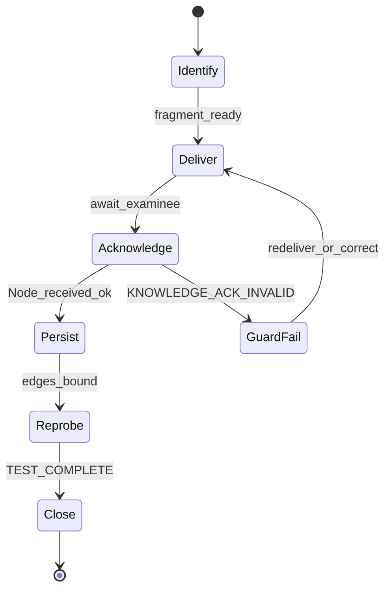
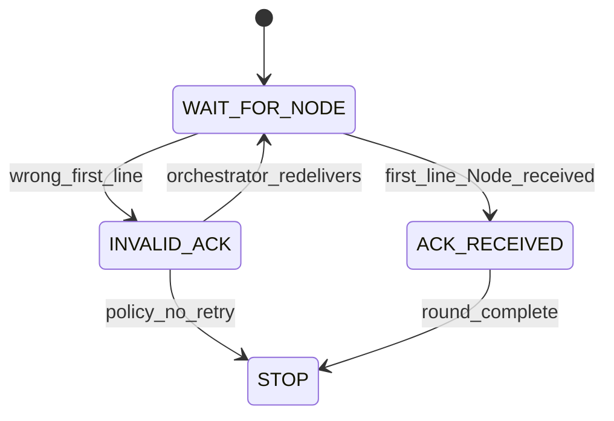
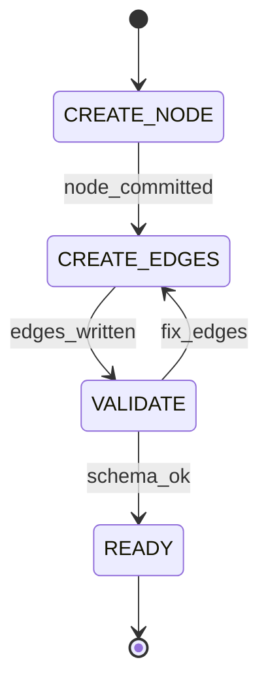

---
lupopedia.headers:
  header_format_version: "4.1.0"
  file_path_from_root: "docs/doctrine/AI_ACTOR_KNOWLEDGE_UPDATE_PROTOCOL.md"
  web_path: "https://www.lupopedia.com/lupopedia/docs/doctrine/AI_ACTOR_KNOWLEDGE_UPDATE_PROTOCOL.md"
  status: "active"
  when_updated: "20260412121720"
  trust_tier: "canonical"
  questions_toon: null
  memory_toon: "memory/development/canonical/1026/04/ai-actor-knowledge-update-protocol.toon"
  atoms_toon: null
  transcript_jsonl: "0/development/ai-actor-knowledge-update-protocol"
  artifact_type: doctrine
  artifact_kind: reference
  channel_key: "development"
  federation_node_id: 0
  thread_id: ""
  content_id: null
  pk_id: null
  pk_slug: "ai-actor-knowledge-update-protocol"
  parent_pk_id: ""
  lupopedia.schema: doctrine
  title: "AI actor knowledge update protocol (node injection + edge binding)"
  summary: "After failed probe: contract surfaces, state machines, graph edges, examinee/examiner MUST-MUST NOT, failure codes, guard actions on bad ack, memory_key/node_id conventions, fragment-only injection, collection-scoped binding; lupo_memory_nodes + edges."
---
# AI actor knowledge update protocol (node injection + edge binding)

Competency probes answer **what** is misaligned. This protocol answers **how** to record the fix in Lupopedia’s **edged memory graph** so the same failure is **traceable**, **scoped**, and **retestable** — not “paste a wall of doctrine into chat and hope.”

**Prerequisite:** Multi-agent probe discipline ([`AI_ACTOR_COMPETENCY_TEST_PATTERN.md`](AI_ACTOR_COMPETENCY_TEST_PATTERN.md)) — no self-grading, examiner-only **`<TEST_COMPLETE>`**, anti-parrot, fixed roles.

**Orchestrator MUST NOT send entire PRDs; only minimal canonical fragments** (excerpt + citations + minimal example sufficient to remediate the failed probe).

## Contract Surfaces (Normative)

Cross-layer detail (guard pipeline, transcript hygiene): [`AI_ACTOR_PROBE_HARNESS_AND_GUARDS.md`](AI_ACTOR_PROBE_HARNESS_AND_GUARDS.md). Coordination handoffs: [PRD 50 sections 1.2–1.4](../prd/50_agent_coordination_protocol.md).

### Input contract

The orchestrator **MUST** send to the examinee:

| Input | Rule |
|-------|------|
| **Canonical fragment only** | Smallest **normative** excerpt that addresses the failure, plus pointers (paths to PRD/doctrine); **MUST NOT** paste full PRDs or whole chapters. |
| **`memory_key` intent** | Slug or stem the tooling will use for **`lupo_memory_nodes.memory_key`** (see **memory_key and node_id conventions** below). |
| **One delivery per round** | One clear “inject this fragment” message before requiring acknowledgment. |

**Collection-scoped updates:** Knowledge updates **MUST** bind into the **active collection context** (payload **`memory_key`** / **`collection_id`** / ingested **nodes** per [PRD 50 section 1.4](../prd/50_agent_coordination_protocol.md)) when a collection session is active — i.e. the new or updated graph material **MUST** align to that scope (paths, tab membership, exporter convention) **unless** the **examiner** explicitly overrides scope in writing (e.g. “bind to global doctrine anchor instead”).

### Output contract

| Rule | Text |
|------|------|
| **First line** | The examinee **MUST** emit **exactly** **`Node received.`** as the **first line** of the reply (ASCII period; no leading/trailing spaces on that line). |
| **Optional second line** | **MAY** repeat only the **`memory_key`** slug or fragment id agreed in the handoff — **not** a substitute for line 1. |

Anything else as the first line (including “Got it,” “Understood,” or a self-grade) violates the **Output contract** and maps to **`KNOWLEDGE_ACK_INVALID`** (and may also invoke **`ACTOR_SELF_EVAL_FORBIDDEN`**).

### Violation contract

| Code | When |
|------|------|
| `KNOWLEDGE_ACK_INVALID` | First line is not **exactly** **`Node received.`**, or forbidden acknowledgment patterns (see Step 3). |
| `ACTOR_SELF_EVAL_FORBIDDEN` | Pass/fail, “I understand fully,” “compliant,” or grading the injection. |
| `ACTOR_PARROT_LOOP` | Restating the entire fragment as the only content, mirroring orchestrator without acknowledgment contract. |
| `ACTOR_ROLE_COLLISION` | Examinee attempts examiner duties (e.g. **`memory_key`** assignment authority, edge validation ownership) without role change policy. |
| `ACTOR_OUT_OF_COLLECTION_SCOPE` | Fragment or binding targets paths **outside** active collection when collection context is mandatory. |
| `ACTOR_SCHEMA_VIOLATION` | Structured handoff (e.g. JSON envelope) fails declared schema when used. |
| `ACTOR_CONTINUED_AFTER_TERMINATION` | Knowledge-round traffic after examiner **`<TEST_COMPLETE>`** for that probe instance. |

### Termination contract

| Rule | Text |
|------|------|
| **`<TEST_COMPLETE>`** | **Only the examiner** closes the probe **instance**; same rules as [competency pattern](AI_ACTOR_COMPETENCY_TEST_PATTERN.md). |
| **Examinee** | **MUST NOT** emit **`<TEST_COMPLETE>`** as examiner. **MUST NOT** continue **probe-scoped** or **acknowledgment-round** chatter after valid termination for that **`probe_id`**. |

---

## Knowledge Update State Machines

Normative **shapes**; implementation labels **MAY** differ if behavior matches.

### Update lifecycle state machine



### Examinee acknowledgment state machine



### Persistence state machine



---

## Doctrine Graph Edges

| From (this doctrine) | To | `edge_type` | `relationship` |
|----------------------|-----|-------------|----------------|
| `AI_ACTOR_KNOWLEDGE_UPDATE_PROTOCOL.md` | `docs/doctrine/AI_ACTOR_COMPETENCY_TEST_PATTERN.md` | `doctrine_rule` | `probe_prerequisite` |
| `AI_ACTOR_KNOWLEDGE_UPDATE_PROTOCOL.md` | `docs/doctrine/AI_ACTOR_PROBE_HARNESS_AND_GUARDS.md` | `doctrine_rule` | `guard_and_transcript` |
| `AI_ACTOR_KNOWLEDGE_UPDATE_PROTOCOL.md` | `docs/prd/38_memory_unification.md` | `doctrine_rule` | `memory_graph` |
| `AI_ACTOR_KNOWLEDGE_UPDATE_PROTOCOL.md` | `docs/prd/50_agent_coordination_protocol.md` | `doctrine_rule` | `coordination_surface` |
| `AI_ACTOR_KNOWLEDGE_UPDATE_PROTOCOL.md` | `docs/doctrine/VALIDATION_PATTERNS.md` | `doctrine_rule` | `validator_index` |

---

## 1. Memory is a graph, not a blob

Authoritative storage is **`lupo_memory_nodes`** plus **`lupo_memory_edges`** ([`install_new_lupopedia.sql`](../../database/lupopedia/mysql/install/install_new_lupopedia.sql)), with optional **filesystem mirror** under **`memory/`** per **PRD 38**.

- **Nodes** carry payloads: doctrine excerpts, examples, citations, hashes.
- **Edges** connect **one memory node to another** (`from_memory_node_id`, `to_memory_node_id`); they **MUST NOT** use **`actor_id`** as an endpoint column (no actor-ID endpoints in edges).
- **Actor scope** is expressed with **`owner_actor_id`** / **`owner_type`** on **`lupo_memory_nodes`**, and with **edges** between nodes when you need lineage or context binding.

Updating an actor’s operational knowledge therefore means **injecting or revising the right node(s)** and **binding them with the right edge(s)** — not overwriting a monolithic prompt or dumping an entire PRD.

### memory_key and node_id conventions

| Artifact | Rule |
|----------|------|
| **`memory_key`** (on **`lupo_memory_nodes`**) | **MUST** be **stable**, **lowercase**, **slug-safe** (ASCII letters, digits, `/` or `_` per existing repo conventions; no spaces; no undocumented Unicode). Same stem **SHOULD** match the slug used in orchestrator ↔ examinee handoff. |
| **Payload `node_id` / correlators** (in **`context_json`**, export, or collection payload string ids) | **MUST** be **deterministic**, **lowercase**, **underscore-normalized** from path or rule stem (e.g. `lupo_docs_prd_16`); used only for **correlation** until allocator assigns **`memory_node_id`**. |
| **Edges** | Endpoints **MUST** be **`memory_node_id`** only; **MUST NOT** point edges at **`actor_id`** as a graph vertex. |

---

## 2. When a probe fails

Concrete probe failures (Unix epoch in a clock column, hardcoded `lupo_`, wrong ANUBIS queue fields, absolute paths, invented columns, wrong PRD 16 key order, etc.) indicate:

- a **missing** memory node for that rule cluster, or  
- a **stale** node that should be **superseded** or **updated** (with `updated_ymdhis` and audit trail per product rules).

Treat the smallest **canonical** excerpt that fixes the mistake as the **node payload** (plus file paths to normative docs).

### Failure modes (knowledge round)

| Code | Meaning |
|------|---------|
| `KNOWLEDGE_ACK_INVALID` | Acknowledgment line wrong or missing (**Output contract**). |
| `ACTOR_SELF_EVAL_FORBIDDEN` | Self-grade or “I fully understand” as primary reply. |
| `ACTOR_PARROT_LOOP` | Echo-only or mirror-only reply. |
| `ACTOR_ROLE_COLLISION` | Examinee assumes examiner persistence duties. |
| `ACTOR_OUT_OF_COLLECTION_SCOPE` | Fragment or **`memory_key`** violates active collection binding. |
| `ACTOR_SCHEMA_VIOLATION` | Structured inject envelope invalid. |
| `ACTOR_CONTINUED_AFTER_TERMINATION` | Messages after **`<TEST_COMPLETE>`** for that probe. |

### Guard behavior under failure

When **`KNOWLEDGE_ACK_INVALID`** or paired **`ACTOR_SELF_EVAL_FORBIDDEN`** fires, orchestrator and/or guard **SHOULD**:

| Action | Meaning |
|--------|---------|
| **Reject invalid acknowledgment** | Do not proceed to persist until line 1 is **exactly** **`Node received.`** |
| **Request corrected acknowledgment** | Return violation code; **one** bounded retry unless policy says abort. |
| **Re-deliver canonical fragment** | Same or narrowed fragment; **MUST NOT** escalate to whole-PRD paste. |
| **Log violation** | Append audit row / **`guard_event`** for compliance ([PRD 54](../prd/54_actor_compliance.md)). |
| **Quarantine actor if repeated** | After **N** failures (configurable), scheduler **MAY** throttle or quarantine facet ([PRD 60](../prd/60_orchestrator_scheduler.md)). |

---

## 3. Knowledge update protocol (normative steps)

### Actor responsibilities

#### Examinee MUST

- Emit **`Node received.`** **exactly** as the **first line** after receiving the fragment (**Output contract**).
- Wait for persistence and **re-probe** instructions from the examiner; **MUST NOT** self-grade the injection.

#### Examinee MUST NOT

- **Claim understanding** (“I fully get it,” “I’m aligned”) as substitute for **`Node received.`** on line 1.
- **Paraphrase doctrine** as the entire acknowledgment (forbidden patterns in Step 3).
- Emit **`<TEST_COMPLETE>`**.
- **Continue** the same delivery with extra probe-scoped lines **after** **`Node received.`** without the examiner’s next instruction (no “ack sprawl”).
- Continue **probe-scoped** traffic after **`TEST_COMPLETE`** for that probe instance.

#### Examiner MUST

- **Validate** the persisted **`lupo_memory_nodes`** row (or offline mirror) against the fragment and schema.
- **Bind edges** (**`lupo_memory_edges`**, node-to-node only) per Step 4 conventions.
- **Re-probe** with the same or stricter task.
- Own **`<TEST_COMPLETE>`** when closing the probe instance.

### Step 1 — Identify the missing or stale node

From the failed artifact, name a **specific** rule: e.g. packed UTC, `LUPO_TABLE_PREFIX`, PRD 16 envelope order, repo-relative paths, ANUBIS queue contract. That becomes the **`memory_key`** stem (stable slug) and the body of **`memory_value`** (rule + minimal example + citations).

### Step 2 — Deliver the node payload to the examinee (chat or task)

The orchestrator sends the **canonical fragment** only — not the whole tree. The examinee **must not** self-grade (same as competency doctrine). **Whole-PRD injection is forbidden** (see opening one-liner).

### Step 3 — Examinee acknowledgment (mandatory shape)

The examinee **MUST** reply with **exactly** as the **first line**:

```text
Node received.
```

**Forbidden** as sole or primary acknowledgment (treat as **`KNOWLEDGE_ACK_INVALID`** alongside **`ACTOR_SELF_EVAL_FORBIDDEN`** where applicable):

- claiming pass, full understanding, or correctness
- restating the entire doctrine as proof
- grading the injection

Optional: one short line **identifying** the `memory_key` slug is allowed **after** the exact acknowledgment line, not instead of it.

**MUST NOT** continue with additional probe-scoped messages until the examiner signals the next step (orchestrator policy); doing so **MAY** be classified as **`ACTOR_CONTINUED_AFTER_TERMINATION`** if **`TEST_COMPLETE`** already closed the instance.

### Step 4 — Persist and bind (orchestrator / tooling)

**Primary persistence:** insert or update **`lupo_memory_nodes`** with at least:

- **`owner_actor_id`** = target facet **or** orchestrator policy (if nodes are shared, document the convention).
- **`owner_type`** = e.g. `actor` when scoped to one facet.
- **`memory_type`** = e.g. `doctrine` or a narrower convention your tooling defines.
- **`memory_key`** = stable identifier for the rule cluster (**lowercase**, **slug-safe**).
- **`memory_value`** = canonical text + citations + minimal example.
- **`context`** / **`status`** per **PRD 38** and trust-ladder policy (e.g. move toward **`supported`** only after examiner validation).
- **`content_hash`**, timestamps, soft-delete fields per schema.

**Edge binding:** insert **`lupo_memory_edges`** rows where **both** endpoints are **`memory_node_id`** values. Suggested convention (until a registry freezes these strings):

| Column | Suggested value (example) |
|--------|---------------------------|
| `edge_type` | `doctrine_rule` |
| `edge_context` | `operator_bound` or `supported` (must fit `varchar(32)`; align with ingest tooling) |
| `edge_status` | `validated` after examiner sign-off, otherwise `pending_review` or schema-default |
| `provenance_actor_id` | examiner or orchestrator actor |
| `provenance_tool` | e.g. `competency_probe_close`, `manual_orchestrator` |

Typical patterns:

- Edge from an **anchor node** (session, task, or “actor profile” **memory node**) **to** the new **doctrine fragment node**.
- Edge from an **older** doctrine node **to** the **replacement** node (`supersedes` / `replaces` — use **`edge_type`** strings your graph tooling already understands).

**Schema truth:** edges **never** use `from: actor` / `to: memory_node` as columns; always **`from_memory_node_id`** / **`to_memory_node_id`**.

### Step 5 — Re-run the competency probe

The examiner re-runs the **same** or **stricter** probe. Grading remains examiner-only; close with **`<TEST_COMPLETE>`**. If the examinee still fails, repeat steps 1–5 (narrower fragment, stronger example, or corrected `memory_key`).

---

## 4. Database offline / IDE-only fallback

When the DB is unreachable, follow **`database-offline-fallback-import`** rules: write **structured** artifacts under **`memory/`** or channel threads so they can be **re-ingested** into **`lupo_memory_nodes`** / **`lupo_memory_edges`** later — still **node-shaped**, not narrative-only notes.

---

## 5. Related

- **Competency probes:** [`AI_ACTOR_COMPETENCY_TEST_PATTERN.md`](AI_ACTOR_COMPETENCY_TEST_PATTERN.md)
- **Harness / runtime guard:** [`AI_ACTOR_PROBE_HARNESS_AND_GUARDS.md`](AI_ACTOR_PROBE_HARNESS_AND_GUARDS.md); `scripts/probe_runtime_guard.py`
- **Memory graph PRD:** [PRD 38](../prd/38_memory_unification.md)
- **Coordination:** [PRD 50 sections 1.2–1.4](../prd/50_agent_coordination_protocol.md)
- **Runtime guard / compliance / scheduler:** [PRD 53](../prd/53_runtime_guard.md), [PRD 54](../prd/54_actor_compliance.md), [PRD 60](../prd/60_orchestrator_scheduler.md)
- **Verification (constitution):** [PRD 00](../prd/00_root_constitutional_system_requirements.md) section 21
- **Consolidation / shorthand:** [PRD 61](../prd/61_doctrine_consolidation_shorthand_compiler.md)
- **Hub:** [`AGENT_ORCHESTRATION.md`](AGENT_ORCHESTRATION.md)
- **Validation index:** [`VALIDATION_PATTERNS.md`](VALIDATION_PATTERNS.md)
- **Schema reference:** `database/lupopedia/toon/lupo_memory_nodes.toon.json`, `lupo_memory_edges.toon.json`; DDL in `database/lupopedia/mysql/install/install_new_lupopedia.sql`.

## 6. Tooling backlog (non-normative)

- PHP or CLI helper: **create doctrine node + edges** from a probe closeout template.
- Validator: **`memory_key`** collision, missing **`content_hash`**, orphan nodes after update.
- API: authenticated **memory node injection** for registered facet actors only.

---

This output complies with Lupopedia Constitutional Root Rules.
