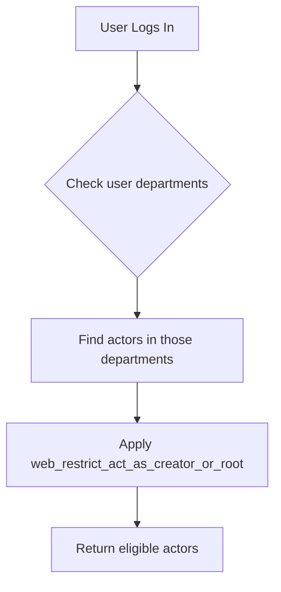

---
lupopedia.headers:
  header_format_version: "4.1.4"
  file_path_from_root: docs/prd/17_A_DECISIONS_FORMAT.md
  web_path: "https://www.lupopedia.com/lupopedia/docs/prd/17_A_DECISIONS_FORMAT.md"
  status: active
  when_updated: "20260422232349"
  trust_tier: canonical
  questions_toon: null
  memory_toon: memory/development/canonical/1026/04/17_decisions_format.toon
  atoms_toon: null
  transcript_jsonl: 0/development/decisions-format
  artifact_type: prd
  artifact_kind: specification
  channel_key: development
  federation_node_id: 0
  thread_id: null
  content_id: null
  content_parent_id: null
  default_collection_id: null
  lupopedia.schema: prd
  prd_cluster: 00_A_17_A
  title: "PRD: Decision Thread Format Specification"
  summary: "Channel-first decisions/ at repo root decisions/{channel_key}/; questions+answers co-located in questions/; decisions derived from resolved questions; THREAD_INDEX; edges; pseudocode; PRD 45 staged UI; version via body/footer not path. Cross-refs PRD 02 16 29 31 38 51."
---
# PRD: Decision Thread Format Specification

## Overview

This PRD defines the **canonical filesystem layout**, **filename patterns**, **`THREAD_INDEX.md`** discipline, and **`lupopedia.edges`** linking for **decision threads** (questions, answers-as-files, comments, and formal decisions).

**Channel-first rule:** New **global** decision work is **not** grouped by product version directory. Threads live under **`decisions/{channel_key}/`** at the **repository root**, keyed by **`channel_key`** (see [PRD 02](02_channels_discussions.md) and the channel registry). **Version applicability** is **metadata** inside each artifact (body table or **`lupopedia.footer`**), **not** a parent folder such as `docs/versions/{version}/`.

**Parallel trees (still valid):** **`channels/{federation_node_id}/{channel_key}/{thread_key}/`** per [PRD 02](02_channels_discussions.md) / [PRD 29](29_project_structure.md), and **`docs/implementations/{prd_file_stem}/`** per [PRD 31](31_implementation_folder_guidelines.md), continue to use the **same filename, THREAD_INDEX, and edge rules** as this PRD. **Legacy** `docs/versions/<version>/` thread folders remain **read/migrate** only for older material.

## Core doctrine: decisions are derived, not primary

**A decision-class file under `decisions/{channel_key}/decisions/` SHALL NOT be created without a resolved question thread** (except **supersedes** chains that explicitly replace an earlier decision file that already satisfied this rule).

**Lifecycle (normative):**

1. **Question raised** ??? `decisions/{channel_key}/questions/YYYYMMDD_HHIISS_QUESTION_title.md`
2. **Discussion (optional)** ??? `decisions/{channel_key}/comments/YYYYMMDD_HHIISS_COMMENT_title.md`
3. **Answer proposed** ??? `decisions/{channel_key}/questions/YYYYMMDD_HHIISS_ANSWER_title.md` (**same folder** as questions; **TYPE** in the filename distinguishes `QUESTION` vs `ANSWER`)
4. **Resolution** ??? question thread reaches **RESOLVED** (status in body and/or channel policy)
5. **Decision formalized** ??? `decisions/{channel_key}/decisions/YYYYMMDD_HHIISS_DECISION_STATUS_title.md`

The decision file **MUST** link back to the question (and answers as needed) via **`lupopedia.edges`** (see [Canonical edge types for decision threads](#canonical-edge-types-for-decision-threads)).

**Anti-pattern:** Creating a **DECISION** file with no **`resolves`** / **`resulted_in`** edge path to the originating **QUESTION**. Validators and reviewers **SHOULD** treat that as **non-canonical**.

**Version association (PRD 16 envelope):** The **22-key `lupopedia.headers` envelope** ([PRD 16](16_lupopedia_headers.md)) does **not** yet define **`target_version`** / **`affects_versions`**. Until extended, those values **SHALL** appear in a **Markdown body** table (recommended: `## Decision context`) and/or **`lupopedia.footer`** ??? **not** inside `lupopedia.headers`.

---

## Staged Development Workflow (Required)

Lupopedia development follows a **staged** path from specification to ship-facing code:

1. **PRD / doctrine** ??? Normative intent, data shapes, and constraints are written or updated first.
2. **`templates/`** ??? Mockups, partials, admin fragments, and HTML/PHP **fragments** live in the template tree **before** they are the only copy of the UI.
3. **Language arrays / localization** ??? Keys and English strings are added to locale catalogs (`includes/lang/`, **`lupo_t()`** when wired); other locales mirror keys per locale doctrine.
4. **Public runtime assembly** ??? Controllers and public pages **include**, **require**, or **compose** documented template partials; behavior matches PRD.

**Normative rules**

- Agents **must not** treat "PRD updated" as authorization to edit **only** live public runtime files as the first implementation step.
- Public paths (**`channels/index.php`**, **`admin.php`**, themes, public handlers) are **assembly** layers: they integrate artifacts that already exist under **`templates/`** (and documented PRD or thread decisions), not ad hoc markup dumps.
- Skipping documentation or skipping the **`templates/`** bridge is a **process violation**, not a shortcut.

**Anti-pattern:** Do **not** implement UI or operator-facing behavior **only** in public runtime files before the **PRD** and **template fragment** exist.

**Cross-references:** [PRD 45 ??? Template-First Staged UI Workflow](45_template_first_staged_ui_workflow.md); [PRD 31 ??? Implementation folder guidelines](31_implementation_folder_guidelines.md); [PRD 00 ??? Root constitutional requirements](00_root_constitutional_system_requirements.md) (UI strings / locale).

---

## Template-First Implementation Rule

**UI-facing** and **operator-facing** surfaces (forms, panels, dashboards, channel chrome) **must** appear first as:

- template partials  
- mockups  
- code fragments  
- admin staged views  

under **`templates/`** (including **`templates/admin/`** and other subtrees as policy defines), **then** be wired into authenticated or public entrypoints.

**Normative**

- Templates are **not** optional decoration. They are the **controlled staging layer** between decision records and runtime.
- Runtime files **consume** templates; they do not replace them as the sole long-term home for new markup.
- Detailed staging order (English template pass, review, localization, integration) is **[PRD 45](45_template_first_staged_ui_workflow.md)**.

**Anti-pattern:** Large blocks of new UI markup exist **only** in **`channels/index.php`** or **`admin.php`** with no corresponding **`templates/`** partial.

---

## Language Array Integration Rule

**Multilingual readiness** is a **shipping** requirement, not optional polish.

- Crafty Syntax shipped with **fourteen** languages; Lupopedia **must** preserve equivalent readiness (catalogs, keys, locale boundaries per PRD 00 and **`LupoLocale`** doctrine).
- **English-first** text in PRDs, mockups, and channel comments is acceptable during design.
- **Assembled ship-facing code** **must not** leave user-visible English as hard-coded final state: add **`lupo_t('semantic.key', 'English fallback')`** (or successor helper) and catalog entries **in the same delivery** that exposes the UI, unless the surface is explicitly non-ship scratch only.

**Ordering with staged workflow:** Stage 2 (templates) may use literal English for velocity; Stage 3 adds keys and **`lupo_t()`** before or with Stage 4 public wiring.

**Anti-pattern:** Do **not** ship UI features as **English-only** public code with no catalog key and no path to additional locales.

**References:** [PRD 45](45_template_first_staged_ui_workflow.md); **`includes/lang/`**; **`lupo_t()`** / **`LupoLocale`** in AGENTS.md and PRD 00.

---

## Artifact progression (normative)

| Stage | Artifact | Purpose |
|-------|----------|---------|
| 1 | PRD / doctrine | Binding specification and constitutional alignment |
| 2 | **`templates/`** partials, mockups, fragments | Controlled iteration and review before runtime assembly |
| 3 | Language arrays / **`lupo_t()`** wiring | Multilingual-ready operator and visitor strings |
| 4 | Public runtime integration | Thin composition: includes, routing, services |

Each stage has a **distinct** purpose. **Do not collapse** stage 1 into stage 4.

---

## Pseudocode Directory ??? Dual Constitutional Purposes

The directory **`decisions/pseudocode/`** (under **`decisions/{channel_key}/decisions/`** for global threads, or under the inner **`decisions/`** of implementations, channel threads, agents, etc.) has **two** constitutional purposes. The subsections below are **normative**; the [Pseudocode Directory (`decisions/pseudocode/`)](#pseudocode-directory-decisionspseudocode) section later in this PRD supplies operational naming, examples, and validator notes.

### Purpose 1 ??? Cave-Man Shorthand (Token-Efficient Constitution Layer)

1. Purpose 1 files provide ultra-compressed, low-token directives for external LLMs and IDE agents.
2. These files summarize binding rules ("do X, never Y") without full PRD detail.
3. They serve as the quickload constitutional layer when full PRDs are too large to load.
4. Naming pattern: `*_constitution.pseudo.md`.
5. Content must be factual, minimal, and derived from canonical PRDs.
6. No production code, no schema, no DDL, no implementation details.
7. These files are REQUIRED for external-AI onboarding.

### Purpose 2 ??? Design Pseudocode (Implementation Planning)

1. Purpose 2 files are comment-heavy design artifacts.
2. They document Option A vs B, tradeoffs, rationale, TODOs, and design flows.
3. They may include PHP-shaped pseudocode (`*.pseudo.php`) or markdown (`*_design.pseudo.md`).
4. They MUST NOT contain executable code or DDL.
5. They are for human/agent deliberation, not runtime.

### Shared Constitutional Requirements

1. Both Purpose 1 and Purpose 2 files MUST include full `lupopedia.headers`.
2. Both MUST live under the inner **`decisions/pseudocode/`** directory for that context (global: **`decisions/{channel_key}/decisions/pseudocode/`**).
3. Both MUST be indexed in `decisions/pseudocode/THREAD_INDEX.md`.
4. Purpose 1 files MUST be safe for low-context external agents.
5. Purpose 2 files MUST NOT be used as runtime code.
6. Validators MUST enforce:
   - No plain `.php` files in pseudocode/
   - No DDL in pseudocode/
   - Required headers present
   - Naming patterns respected

---

## Thread filename pattern (authoritative)

This section is the **single source of truth** for thread artifact filenames under **`decisions/{channel_key}/`** (canonical **global** tree at repository root), and for **parallel** contexts (**`channels/...`**, **`docs/implementations/...`**, **`agents/...`**) that use the **same** `TYPE` / optional `STATUS` rules.

### Pattern by directory (channel-first root)

Paths below are relative to **`decisions/{channel_key}/`** (example: `decisions/development/`).

| Directory | Pattern | Example |
|-----------|---------|---------|
| `questions/` | `YYYYMMDD_HHIISS_QUESTION_title.md` | `20260403_143000_QUESTION_header_format.md` |
| `questions/` | `YYYYMMDD_HHIISS_ANSWER_title.md` | `20260403_150000_ANSWER_header_format_v4_1_3.md` |
| `comments/` | `YYYYMMDD_HHIISS_COMMENT_title.md` | `20260403_120000_COMMENT_channel_42_review.md` |
| `decisions/` | `YYYYMMDD_HHIISS_DECISION_STATUS_title.md` | `20260403_160000_DECISION_APPROVED_adopt_v4_1_3.md` |

**Rules:**

- **`STATUS`** segment (`APPROVED`, `PENDING`, `REJECTED`, `SUPERSEDED`, ???) appears **only** under the inner **`decisions/`** folder (between **`DECISION`** and **`title`**). **`questions/`** and **`comments/`** filenames **do not** include **`_STATUS_`**.
- **Questions and answers share `questions/`** ??? the **`QUESTION`** vs **`ANSWER`** token in the filename distinguishes role (no sibling **`answers/`** folder in the canonical layout).
- **`TITLE`:** lowercase segments separated by underscores; ASCII; no spaces.

**Legacy / parallel contexts:** Older trees may still have a sibling **`answers/`** folder. **New** global work **SHOULD NOT** add **`answers/`** under **`decisions/{channel_key}/`**; migrate answers into **`questions/`** when touching a thread.

### Timestamp prefix (UTC)

- **Preferred (new files):** `YYYYMMDD_HHIISS_` ??? underscore between the date and the time.
- **Also valid:** `YYYYMMDDHHIISS_` ??? fourteen digits with no separator between date and time (same instant; may appear in existing artifacts).

### `HHIISS` (time of day)

Two-digit hour (`00`???`23`), two-digit minute, two-digit second. No colons. Example: `143000` = 14:30:00 UTC.

### `TYPE` tokens (routine)

| Token | Folder under `decisions/{channel_key}/` |
|-------|----------------------------------------|
| `QUESTION` | `questions/` |
| `ANSWER` | `questions/` |
| `COMMENT` | `comments/` |
| `DECISION` | `decisions/` (requires **`_STATUS_`** segment in filename) |

Use **sparingly** when clearer: **`PROPOSAL`**, **`CLARIFICATION`**, **`RESOLUTION`** ??? typically under inner **`decisions/`** using the same **`???_DECISION_STATUS_title.md`** shape.

**Reference:** [PRD 02 ??? Channels & Discussions](02_channels_discussions.md); [PRD 29 ??? Project structure](29_project_structure.md).

---

## `lupopedia.edges` linking (normative)

All relationships between questions, answers, decisions, and comments **MUST** be expressed with **`lupopedia.edges`** (shape per [PRD 16](16_lupopedia_headers.md)). Do **not** invent parallel link keys in `lupopedia.headers`.

### Example (question and answer in shared `questions/` folder)

**Question file** `questions/20260402_120000_QUESTION_header_format.md`:

```yaml
lupopedia.edges:
  outbound_edges:
    - to: "20260402_150000_ANSWER_header_format_v4_1_3.md"
      type: "has_answer"
      weight: 1.0
```

**Answer file** `questions/20260402_150000_ANSWER_header_format_v4_1_3.md`:

```yaml
lupopedia.edges:
  outbound_edges:
    - to: "20260402_120000_QUESTION_header_format.md"
      type: "answers"
      weight: 1.0
      reason: "Proposes v4.1.3 header envelope"
```

(Paths in **`to:`** are **sibling-relative** under the same **`questions/`** directory unless a policy document requires repo-root-relative paths.)

### Canonical edge types for decision threads

| Edge type | Typical direction | Meaning |
|-----------|-------------------|---------|
| `has_answer` | Question ??? Answer | This question has this proposed answer |
| `answers` | Answer ??? Question | This answer responds to this question |
| `resolves` | Decision ??? Question | This decision resolves this question |
| `resulted_in` | Question ??? Decision | This closed question resulted in this decision |
| `clarifies` | Answer ??? Answer | This answer clarifies another answer |
| `supersedes` | Decision ??? Decision (or Answer ??? Answer when policy allows) | Replacement / succession |

**Rule:** Every **`DECISION`** file **MUST** have a **`resolves`** edge to the **`QUESTION`** it closes **and/or** the **`QUESTION`** **MUST** have a **`resulted_in`** edge to that **`DECISION`** (at least one direction materialized; tools **MAY** mirror both).

### Benefits

| Aspect | Ad-hoc cross-links | `lupopedia.edges` |
|--------|-------------------|-------------------|
| **Queryable** | No | Yes (via `lupo_edges` and importers) |
| **Validation** | None | Validators can require endpoints to exist |
| **Agent routing** | Grep | Deterministic graph walks |

---

## Channel-first filesystem layout (canonical)

### Repository root (normative for new global threads)

```
decisions/
+-- {channel_key}/
    +-- THREAD_INDEX.md
    +-- questions/
    |   +-- THREAD_INDEX.md
    |   +-- YYYYMMDD_HHIISS_QUESTION_title.md
    |   +-- YYYYMMDD_HHIISS_ANSWER_title.md
    +-- comments/
    |   +-- THREAD_INDEX.md
    |   +-- YYYYMMDD_HHIISS_COMMENT_title.md
    +-- decisions/
        +-- THREAD_INDEX.md
        +-- pseudocode/          # optional ??? see [Pseudocode Directory](#pseudocode-directory-decisionspseudocode)
        |   +-- THREAD_INDEX.md
        |   +-- *.pseudo.php / *.pseudo.md / *.pseudo.txt
        +-- YYYYMMDD_HHIISS_DECISION_STATUS_title.md
```

- **`{channel_key}`** MUST be an authorized coordination channel key ([PRD 02](02_channels_discussions.md); channel registry / `lupo_channels` policy). Examples include **`development`**, **`headers`**, **`federation`** ??? not free-form labels.
- **Inner `decisions/`** holds **DECISION** threads only (filename includes **`_STATUS_`**). **`questions/`** holds **QUESTION** and **ANSWER** files. **`comments/`** holds **COMMENT** files.
- **Every** folder shown above **MUST** ship **`THREAD_INDEX.md`** when the folder exists and is non-empty (see [THREAD_INDEX.md (folder index)](#thread_indexmd-folder-index)).
- **No** **`docs/versions/{version}/`** prefix for **new** global threads ??? **version is metadata**, not a parent directory (see [Core doctrine: decisions are derived, not primary](#core-doctrine-decisions-are-derived-not-primary)).

### Parallel contexts (same filename rules; different root)

| Root | Notes |
|------|--------|
| `channels/{federation_node_id}/{channel_key}/{thread_key}/` | Operational coordination per [PRD 02](02_channels_discussions.md) / [PRD 29](29_project_structure.md). Prefer **`questions/`** for both questions and answers for **new** files. |
| `docs/implementations/{prd_file_stem}/` | [PRD 31](31_implementation_folder_guidelines.md) mirrors ??? same **`THREAD_INDEX.md`** and edge rules. |
| `agents/{agent_key}/` | Agent-local policy when used. |

### Legacy `docs/versions/<version>/` (read / migrate only)

Version-scoped **`decisions/`**, **`questions/`**, **`answers/`**, **`comments/`** trees under **`docs/versions/`** are **legacy**. **Do not** add new thread files there; migrate into **`decisions/{channel_key}/`** (or an implementation mirror / channel tree) and record **`target_version`** in the artifact body or **`lupopedia.footer`**.

### Monolithic `decisions.md` (forbidden for new work)

The single-file **`decisions.md`** under **`docs/versions/<version>/`** is **deprecated** for new entries. Parse into per-thread files when migrating.

### Migration checklist (global threads)

1. Choose **`channel_key`** for the topic.
2. Create **`decisions/{channel_key}/`** subtree per the tree above.
3. Move or create **QUESTION** / **ANSWER** files under **`questions/`**; update **`lupopedia.edges`** (no **`../answers/`** for new work).
4. Add **`DECISION`** files only after resolution; link with **`resolves`** / **`resulted_in`**.
5. Update **every** affected **`THREAD_INDEX.md`** in the **same commit** as new thread files.

**Reference:** [README.md](../README.md); [PRD 16 ??? Lupopedia Headers](16_lupopedia_headers.md); [LUPOPEDIA_HEADERS/README.md](../doctrine/LUPOPEDIA_HEADERS/README.md).

## Database threads (web application)

- **Format:** numeric **`dialog_thread_id`** (and related DB rows) per install schema ??? not governed by this PRD???s filesystem naming.
- **Used for:** web chat and operator UI backed by **`lupo_dialog_threads`** / **`lupo_dialog_messages`**.

## Header Requirements

Every thread file MUST ship the **PRD 16 v4.1.3** **`lupopedia.headers`** envelope (exactly **22** keys in **??4.2** order ??? see **[PRD 16](16_lupopedia_headers.md)**). **`artifact_type`**, **`artifact_kind`**, and **`lupopedia.schema`** MUST be consistent per PRD 16 **??4.2.2**. When this PRD and PRD 16 disagree, **PRD 16 wins**.

### Header example (channel-first **DECISION** file)

```yaml
lupopedia.headers:
  header_format_version: "4.1.3"
  file_path_from_root: "decisions/development/decisions/20260402_120000_DECISION_APPROVED_header_format.md"
  web_path: "https://www.lupopedia.com/lupopedia/decisions/development/decisions/20260402_120000_DECISION_APPROVED_header_format.md"
  status: "active"
  when_updated: "20260402120000"
  trust_tier: "canonical"
  questions_toon: null
  memory_toon: "memory/development/canonical/1026/04/header_format_decision.toon"
  atoms_toon: null
  transcript_jsonl: "0/development/decisions/header-format"
  artifact_type: "documentation"
  artifact_kind: "guide"
  channel_key: "development"
  federation_node_id: 0
  thread_id: "header-format-decision"
  content_id: null
  content_parent_id: null
  content_slug: "header-format-decision"
  default_collection_id: null
  lupopedia.schema: "documentation"
  title: "Header Format Decision"
  summary: "Formal decision after resolving header format question (v4.1.3 scope)."
```

**Version metadata (not in the 22-key header):** after the closing `---`, include a body section such as:

```markdown
## Decision context

| Key | Value |
|-----|-------|
| target_version | 4.1.3 |
| affects_versions | 4.1.0, 4.1.3 |
```

Optional **`lupopedia.footer`** MAY duplicate the same keys for tooling that reads footers ??? do **not** add **`target_version`** to **`lupopedia.headers`** until PRD 16 ratifies new envelope keys.

In committed **Markdown** thread files, wrap the **`lupopedia.headers`** YAML between line-1 **`---`** delimiters per **[PRD 16](16_lupopedia_headers.md)** (the fenced block above omits those delimiters for readability).


## THREAD_INDEX.md (folder index)

Every folder that participates in the thread system **MUST** contain **`THREAD_INDEX.md`** when that folder exists and may hold threads:

- **`decisions/{channel_key}/THREAD_INDEX.md`** (channel aggregate)
- **`decisions/{channel_key}/questions/THREAD_INDEX.md`**
- **`decisions/{channel_key}/comments/THREAD_INDEX.md`**
- **`decisions/{channel_key}/decisions/THREAD_INDEX.md`**
- **`decisions/{channel_key}/decisions/pseudocode/THREAD_INDEX.md`** when pseudocode exists

If **`decisions/pseudocode/`** is present under any context, it **MUST** have its own **`THREAD_INDEX.md`** (see [Pseudocode Directory](#pseudocode-directory-decisionspseudocode)).

### Channel root index (`decisions/{channel_key}/THREAD_INDEX.md`)

**MUST** list **all** threads across **`questions/`**, **`comments/`**, and inner **`decisions/`** (including pseudocode index rows or a pointer row to **`decisions/pseudocode/THREAD_INDEX.md`**).

Suggested columns: **Filename**, **Type** (`Q` / `A` / `C` / `D` for Question / Answer / Comment / Decision), **Status**, **Linked to** (neighbor filename or slug).

Rows **MUST** be sorted **DESC** by the **`YYYYMMDD_HHIISS`** filename prefix (newest first), unless a channel policy document defines a different stable order.

### Per-folder indexes

Each **`questions/`**, **`comments/`**, and inner **`decisions/`** index lists **only** that folder???s files, same **DESC** sort, same commit rule: **new thread file and index row in one commit**.

**Validators SHOULD** warn when **`THREAD_INDEX.md`** is missing, when a non-empty folder lacks a row for a file, or when sort order is not **DESC** by UTC prefix.

### Example (inner `decisions/` folder)

```markdown
# Decisions index (development)

| Filename | Title | Author | Status | Date |
|----------|-------|--------|--------|------|
| 20260402_120000_DECISION_APPROVED_header_format.md | Header format | LILITH | APPROVED | 2026-04-02 |
```

## Pseudocode Directory (`decisions/pseudocode/`)

**Constitutional summary:** [Pseudocode Directory ??? Dual Constitutional Purposes](#pseudocode-directory--dual-constitutional-purposes) (above).

### Dual purpose (LILITH audit ??? approved)

The same **`decisions/pseudocode/`** directory serves **two** distinct intents. Use **file naming** to signal which intent applies.

#### Purpose 1 ??? Shorthand constitution (external AI)

- **Goal:** A **short** extract of binding rules (typically distilled from [PRD 00](00_root_constitutional_system_requirements.md)) so external LLMs / IDE agents can load a compact checklist instead of the full constitutional PRD.
- **Naming pattern:** **`*_constitution.pseudo.md`** (example: **`00_constitution_shorthand.pseudo.md`**).
- **Content:** Forbidden vs required tables, one-liner quick reference, pointers to PRD sections for depth. **Not** a replacement for PRD 00 in disputes ??? **canonical** text remains **`docs/prd/00_root_constitutional_system_requirements.md`**.
- **Shipped example:** **`docs/implementations/00_root_constitutional_system_requirements/decisions/pseudocode/00_constitution_shorthand.pseudo.md`**.

#### Purpose 2 ??? Implementation planning (design notes)

- **Goal:** Bridge **decisions to design**: sketch signatures, document **Option A vs Option B**, trade-offs, open questions (`TODO:` / `QUESTION:`), and task-level drivers **before** ship-ready production code exists. **Ship-facing UI** still obeys **[Staged Development Workflow (Required)](#staged-development-workflow-required)** ( **`templates/`** , then **`lupo_t()`** / catalogs, then public assembly); pseudocode does **not** replace that sequence.
- **Naming pattern:** **`*_design.pseudo.md`** and/or **`*.pseudo.php`** (same extension rules as below).
- **Content:** Comment-heavy pseudocode, mermaid or prose flows, links to sibling **`../`** decision files.

### Naming conventions (summary)

| Pattern | Typical intent |
|---------|----------------|
| **`*_constitution.pseudo.md`** | Purpose 1 ??? shorthand rules for external AI |
| **`*_design.pseudo.md`** | Purpose 2 ??? markdown design notes |
| **`*.pseudo.php`** | Purpose 2 ??? PHP-shaped class/method sketches |

### Location (global channel-first)

```
decisions/{channel_key}/decisions/
+-- THREAD_INDEX.md
+-- YYYYMMDD_HHIISS_DECISION_STATUS_title.md
+-- pseudocode/
    +-- THREAD_INDEX.md
    +-- 00_constitution_shorthand.pseudo.md
    +-- feature_design.pseudo.md
    +-- ClassName.pseudo.php
    +-- ...
```

Parallel contexts use the **same** inner **`decisions/`** + **`pseudocode/`** shape under their own root (for example **`channels/0/development/my-thread/decisions/`**).

### Use cases (primarily Purpose 2)

| Use case | Example |
|----------|---------|
| **Implementation planning** | Function signatures before coding |
| **Design choices** | Comment blocks explaining why approach A over B |
| **Related function grouping** | Pseudo-class files grouping related methods |
| **Driver files for tasks** | Task-specific design documents |
| **Incomplete code** | Intent that is not ship-ready |
| **Algorithm exploration** | Alternate approaches in comments |
| **Constitution shorthand** | Purpose 1 ??? send `*_constitution.pseudo.md` to external agents (still requires headers below) |

### Rules (limited)

| Rule | Description |
|------|-------------|
| **No production code** | Pseudocode files are **never** loaded by the application |
| **`.pseudo.php` MAY contain** | Function signatures, class structure, **TODO** / **QUESTION** markers, stub bodies, and explanatory comments |
| **`.pseudo.php` MUST NOT contain** | Executable runtime logic intended for production, real database queries against live schema, or production-ready code blocks suitable for copy-paste into ship paths without an explicit decision |
| **No schema migrations** | Do not put DDL here (`CREATE TABLE`, `ALTER TABLE`, etc.) |
| **File extension** | `.pseudo.php`, `.pseudo.md`, or `.pseudo.txt` ??? **not** plain `.php`, `.js`, or other runtime extensions |
| **Comment-heavy** | Prefer blocks that explain **why**, not only **what** |
| **LUPOPEDIA HEADERS required** | Every **`*.pseudo.md`**, **`*.pseudo.php`**, and **`*.pseudo.txt`** **must** include **`lupopedia.headers`** with at least **`file_path_from_root`** (repo-relative), **`when_updated`**, **`last_modified_utc`**, author/delegation, **`artifact_type`**, **`artifact_kind`**, **`purpose`**, **`tags`** ??? same expectations as [PRD 16 ??? Header applicability and scope](16_lupopedia_headers.md#header-applicability-and-scope). **Markdown:** YAML front matter, line 1 `---`. **PHP:** YAML inside a block comment immediately after `<?php`. **Why:** external AI and IDE handoff; without **`file_path_from_root`**, recipients cannot anchor the file in the tree. Optional **`lupopedia.edges`** / **`lupopedia.footer`** encouraged when useful. |
| **Can reference decisions** | Link back with relative paths to sibling decision files |
| **No strict schema** | Free-form body layout; organize as the author prefers |

### Example: `pseudocode/KairosConsolidationService.pseudo.php`

```php
<?php
/*
---
lupopedia.headers:
  header_format_version: "4.1.3"
  lupopedia.schema: documentation
  file_path_from_root: "channels/0/example/decisions/pseudocode/KairosConsolidationService.pseudo.php"
  web_path: "https://www.lupopedia.com/lupopedia/channels/0/example/decisions/pseudocode/KairosConsolidationService.pseudo.php"
  when_updated: "20260403120000"
  last_modified_utc: "20260403120000"
  federation_node_id: 0
  channel_id: 42
  thread_id: "example-pseudocode-kairos"
  author:
    type: "actor"
    id: 102
    name: "CURSOR"
  actor_id: 102
  actor_name: "CURSOR"
  delegation_chain: "cursor:root"
  artifact_type: "documentation"
  artifact_kind: "guide"
  purpose: "Pseudocode ??? KAIROS consolidation design (not runtime)"
  tags:
    - "pseudocode"
    - "kairos"
---
*/
/**
 * KAIROS Memory Consolidation - Design Exploration
 *
 * Decision reference: ../20260403_120000_DECISION_APPROVED_kairos_consolidation.md
 *
 * This is PSEUDOCODE. Not loaded by the application.
 *
 * Design choices documented in comments below.
 */

/**
 * Class: KairosConsolidationService
 *
 * Design choice: Use batch processing rather than real-time
 * Reasoning: Real-time would block chat operations on large threads
 * Alternative considered: Queue-based (rejected due to complexity)
 */
class KairosConsolidationService {

    /**
     * Consolidate observations for a thread
     *
     * @param int $thread_id
     * @return array
     *
     * Implementation note: Use THREAD_INDEX.md for ordering
     * instead of filesystem timestamps (per Temporal Discipline)
     */
    public function consolidateThread($thread_id) {
        // TODO: Read THREAD_INDEX.md first
        // TODO: Follow supersedes edges
        // TODO: Group by semantic similarity

        // Pseudo-implementation:
        // 1. Get all messages in thread
        // 2. Group by parent_dialog_message_id
        // 3. Detect contradictions
        // 4. Merge observations
        // 5. Store in lupo_memory_nodes (unified memory graph; PRD 38)

        return array('consolidated' => true);
    }
}
```

### Example: `pseudocode/decision_flow.pseudo.md`

````markdown
# Decision Flow: Department-First Actor Model

## Decision Reference
[20260403_222041_DECISION_APPROVED_department_first_actor_model_prd_alignment.md](../20260403_222041_DECISION_APPROVED_department_first_actor_model_prd_alignment.md)

## Design Flow



## Implementation Choices

### Choice 1: Department join vs direct binding

**Option A (selected):** Department intersection (sketch only; not executable SQL).

**Option B (rejected):** Edge-based act-as ??? rejection reason: harder to maintain, less performant.

### Choice 2: Session storage for active actor

Store in `lupo_sessions.metadata` JSON, not a separate table. Reason: actor switching is per-session, not per-user.

## Driver Files

| Task | Driver File | Status |
|------|-------------|--------|
| AuthSessionManager update | `AuthSessionManager.pseudo.php` | Draft |
| ActorService delegation | `ActorService.pseudo.php` | Draft |
````

### `THREAD_INDEX.md` for pseudocode

```markdown
# Pseudocode Index

| File | Purpose | Type | Related |
|------|---------|------|---------|
| `00_constitution_shorthand.pseudo.md` | Shorthand rules for external AI | Constitution | [PRD 00](00_root_constitutional_system_requirements.md) |
| `KairosConsolidationService.pseudo.php` | Memory consolidation design | Implementation | 20260403_120000_DECISION_... |
| `decision_flow.pseudo.md` | Department-first actor flow | Implementation | 20260403_222041_DECISION_... |
| `AuthSessionManager.pseudo.php` | Auth session design | Implementation | 20260403_222041_DECISION_... |
```

### Integration with PRD 31

The `pseudocode/` directory is **not** subject to the full [PRD 31 ??? Implementation folder guidelines](31_implementation_folder_guidelines.md) rules:

- No required `README.md`, `authors.md`, or `edges.md` for pseudocode alone
- **Optional** tooling: **`scripts/validate_pseudocode_discipline.py`** (warnings for Purpose 2 design files) ??? see [Pseudocode reasoning discipline](#pseudocode-reasoning-discipline-for-ide-agents-lilith-approved). **Mandatory** checks remain [minimal pseudocode checks](#validation-rules-minimal) below.
- No `questions/` or `answers/` subdirectories under `pseudocode/` ??? use the parent context???s **`questions/`** (both **QUESTION** and **ANSWER** files); legacy trees may still reference a sibling **`answers/`** folder until migrated.

**Rationale:** Pseudocode is design artifact, not an implementation deliverable tree.

### Why two purposes in one directory?

| Purpose | Audience | When |
|---------|----------|------|
| **Shorthand constitution** | External LLMs, quick IDE context | Before coding; when full PRD 00 is too heavy to paste |
| **Implementation planning** | Implementers, reviewers, LILITH | While exploring options and recording **A vs B** |

**One directory (`decisions/pseudocode/`), two naming patterns** ??? see [Naming conventions (summary)](#naming-conventions-summary).

### Shipped bundle ??? ???send to new AI" (Priority 1???3 PRDs)

**Location (canonical):** **`docs/implementations/00_root_constitutional_system_requirements/decisions/pseudocode/`**

| File | Role |
|------|------|
| **`lupopedia_quickstart.pseudo.md`** | One-page map + links to all shorthands below ??? **start here** for external agents. |
| **`00_constitution_shorthand.pseudo.md`** | PRD 00 digest (database, PHP, installer, security, UI, indexing). |
| **`05_auth_user_actor_agent_transformation_constitution.pseudo.md`** | PRD 05 ??? identity / visitor chat / department act-as. |
| **`15_actors_constitution.pseudo.md`** | PRD 15 ??? actors ??? departments. |
| **`16_lupopedia_headers_constitution.pseudo.md`** | PRD 16 ??? headers, import, validators. |
| **`26_five_layer_documentation_architecture_constitution.pseudo.md`** | PRD 26 ??? Tier 1 vs Tier 2, five layers. |
| **`31_implementation_folder_guidelines_constitution.pseudo.md`** | PRD 31 ??? **`implementations/{prd_file_stem}/`**, scaffold, threads. |
| **`28_semantic_monitoring_widget_constitution.pseudo.md`** | PRD 28 ??? Eye / Tier 2 / API dual routing. |
| **`33_softaculous_certification_4_1_0_gate_constitution.pseudo.md`** | PRD 33 ??? hosting / 4.1.0 gate / Crafty parity. |

**Index:** **`THREAD_INDEX.md`** in that folder. **Optional (Priority 4):** PRD **36** (ROSE), **37** (KAIROS) ??? read full PRDs when needed; no shipped shorthand required in this bundle.

**Rule:** Shorthands are **Purpose 1** pseudocode; they **must** still carry **`lupopedia.headers`** (**`file_path_from_root`**, etc.). **Canonical** meaning remains each **`docs/prd/*.md`**.

### Edge types for pseudocode

| Edge type | Direction | Meaning |
|-----------|-----------|---------|
| `has_pseudocode` | Decision ??? Pseudocode | This decision has pseudocode exploration |
| `implements_pseudocode` | Implementation ??? Pseudocode | Implementation follows this pseudocode |
| `refines` | Pseudocode ??? Pseudocode | This pseudocode refines another |

### Validation rules (minimal)

Validators **should** consider:

1. **No plain `.php` (or other runtime extension) without `.pseudo.` in the basename** under `decisions/pseudocode/` ??? reduces risk of accidental inclusion or confusion with shipped code.
2. **`lupopedia.headers` required** on every **`*.pseudo.md`**, **`*.pseudo.php`**, **`*.pseudo.txt`** under `decisions/pseudocode/`, including **`file_path_from_root`** (and placement per [PRD 16](16_lupopedia_headers.md#header-applicability-and-scope)).
3. **No migration DDL** ??? flag `CREATE TABLE`, `ALTER TABLE`, and similar in pseudocode content when policy calls for it.
4. **Purpose 2 discipline (optional automation)** ??? run **`python scripts/validate_pseudocode_discipline.py`** on changed paths; it emits **warnings** for missing decision anchors and thin rationale (see [Pseudocode reasoning discipline](#pseudocode-reasoning-discipline-for-ide-agents-lilith-approved)).

### Pseudocode reasoning discipline for IDE agents (LILITH approved)

**Problem:** IDE/LLM tools are tuned for **fast completion**, not **slow deliberation**. In **`decisions/pseudocode/`**, that mismatch causes agents to **guess** schema, **fill in** stubs, and **skip** documented options ??? the opposite of this directory???s intent for **Purpose 2**.

**Intent:** For **Purpose 2** ([Implementation planning](#purpose-2--implementation-planning-design-notes)), pseudocode is a **design deliberation space** ??? document **why** and **which options**, not ship **what**. For **Purpose 1** ([Shorthand constitution](#purpose-1--shorthand-constitution-external-ai)), files are **digests** (tables, pointers); they are **exempt** from the ???deliberation shape" rules below except **zero-guessing** when **extending** a digest with new factual claims (must cite PRD / TOON / install SQL).

**Scope summary**

| Artifact kind | Zero-guessing (schema, API facts) | Option blocks / decision anchor | Comment-heavy / rationale density |
|-------------|-----------------------------------|--------------------------------|-----------------------------------|
| Purpose 1 `*_constitution.pseudo.md`, shipped `00_*` digests in bundle | **Yes** ??? no invented columns or tables | **Anchor** via **`lupopedia.edges`** + PRD link in body (no single sibling decision file required) | **Not required** ??? tables and one-liners are normal |
| Cross-cutting `docs/decisions/pseudocode/00_*.pseudo.md` (routers, anti-patterns) | **Yes** | **Edges** to PRD 00 + related digests | **Not required** |
| Purpose 2 `*_design.pseudo.md`, other exploratory `*.pseudo.md` in `pseudocode/` | **Yes** | **Required** ??? see **Decision reference** below | **SHOULD** ??? target **high** comment-to-rationale ratio (see **Rationale density**) |
| Purpose 2 `*.pseudo.php` | **Yes** | **Required** ??? comment or docblock **Decision reference** near top | **SHOULD** ??? skeleton code only; **TODO** / **QUESTION** for unknowns |

#### Zero-guessing doctrine (required)

Agents **must not invent** as facts:

- table or column names not in **TOON** / **install SQL** / table docs  
- function/class/method names as **final** API without a decision or PRD pointer  
- executable **SQL** as ???the" schema when DDL is forbidden here  
- control flow or return contracts **presented as decided** when options are still open  

If a fact is **not** anchored in a cited artifact, the agent **must** stop and record an explicit block (markdown or comment):

```markdown
# ASSUMPTION REQUIRED
# Option A: ???
# Option B: ???
# Open question: ???
```

**No implementation code** in production trees may be written **as if** the assumption were decided until the thread records resolution.

#### Deliberate reasoning (required behavior)

When authoring or editing **Purpose 2** pseudocode, agents **must**:

- treat the file as **thinking space**, not a **stub to complete**  
- avoid **collapsing** unresolved forks into one path without recording **why**  
- avoid **skipping** ???Option A / Option B" when the PRD or thread still has competing approaches  

This PRD does **not** bind external model ???temperature" APIs; it binds **repository behavior**: **document forks and unknowns** instead of **silent completion**.

#### Mandatory option blocks (required when forks exist)

When more than one approach is plausible, **Purpose 2** markdown **must** include labeled options and an explicit pending marker, for example:

```markdown
# OPTION A ??? ??? (pros / cons)
# OPTION B ??? ??? (pros / cons)
# DECISION PENDING ??? do not treat either as final in production code
```

If the agent introduces the word **OPTION** or **Alternative** for a real fork, **`DECISION PENDING`** (or a link to a **resolved** `DECISION_` file) **must** appear in the same section.

#### Executable-looking content (Purpose 2)

- **`*.pseudo.php`:** Skeletal PHP is **allowed** (signatures, stub bodies, **TODO**). It **must** remain **non-runtime** (`.pseudo.` in basename; not loaded by the app). If the file starts to read like **copy-paste production**, add a banner comment: **`// PSEUDOCODE ONLY ??? not ship-ready`** and **stop** until design is recorded.  
- **Markdown pseudocode:** Prefer **fenced blocks** labeled as sketch (e.g. `pseudo`, `text`), not blocks that look like **drop-in** `php` production. Short **illustrative** snippets that contradict a forbidden pattern (e.g. ???wrong" SQL in a dodo-bird doc) are **allowed** when labeled as **anti-example**.

#### Rationale density (Purpose 2 SHOULD)

For **`*_design.pseudo.md`**, aim for **high** rationale in comments and prose ??? approximately **60%** of non-empty lines carrying **`#` comments**, blockquotes, or explanatory prose is a **target**, not a hard gate. If the file is mostly code-shaped lines, add:

```markdown
# COMMENT EXPANSION REQUIRED ??? insufficient rationale density for Purpose 2
```

#### No forward inference (required)

Do not infer **live** schema, PK names, or layer boundaries from "typical PHP projects." **Sources:** PRD, decision file, **TOON**, **install SQL**, **table docs** ??? per [TOON / schema doctrine](00_root_constitutional_system_requirements.md) and workspace rules.

**Scope:** The **no-forward-inference** rule applies to **binding facts**: **schema**, **database structure**, **API contracts**, and similar surfaces that must match shipped SQL and code. **Controlled inference** is still appropriate for **design exploration**: labeled **Option A / Option B** blocks, exploratory prose, and **explicitly marked assumptions** (for example `# ASSUMPTION REQUIRED`) that are **not** presented as decided or ship-ready truth.

#### Decision reference (required for Purpose 2)

Every **Purpose 2** pseudocode file **must** anchor to the thread, for example:

- **Markdown:** a **`## Decision Reference`** (or `# DECISION REFERENCE:`) section with a relative link to **`../YYYYMMDD_HHIISS_DECISION_*.md`** or to the relevant **`questions/`** artifact (**QUESTION** or **ANSWER** filename).  
- **PHP:** a **docblock** or leading comment with the same path (see [example `KairosConsolidationService.pseudo.php`](#example-pseudocodekairosconsolidationservicepseudophp)).

**Purpose 1** files **must** include **`lupopedia.edges`** to the canonical PRD(s); a prose ???**Canonical:** ???" line in the body satisfies the **anchor** expectation when no single decision file exists.

#### Reviewer posture

**LILITH** and human reviewers **may reject** Purpose 2 pseudocode that **guesses** schema, **omits** decision anchors, or **pretends** unresolved options are decided. **Purpose 1** digests are judged on **fidelity to PRD 00**, not on comment ratio.

## Entry Types

### Type Taxonomy

| Type | ID Prefix | Purpose | Status Options |
|------|-----------|---------|----------------|
| Decision | D-xx | Formal architectural decision | Proposed, Accepted, Completed, Deprecated, Superseded |
| Question | Q-xx | Open question needing answer | Open, Answered, Resolved |
| Answer | A-xx | Response to a Question | N/A (linked to parent) |
| Dialog | DG-xx | Ongoing discussion | Open, Resolved, Closed |
| Action | ACT-xx | Task to be completed | Pending, In Progress, Completed, Blocked |
| Warning | W-xx | Identified risk or issue | Acknowledged, Mitigated, Resolved |
| Observation | O-xx | Lesson learned | Noted, Integrated |
| Comment | (inline) | Brief note | N/A (attached to parent) |


### Entry Format

Each thread file should follow this structure:

```markdown
# [Title]

## Type
[Type from taxonomy]

## Status
[Status appropriate to type]

## Author
[Name] (actor_id [ID]) - [Role]

## Date
YYYY-MM-DD

## Context
[What led to this entry?]

## Question (for Question type)
[What needs to be answered?]

## Options (for Question type)
| Option | Description | Pros | Cons |
|--------|-------------|-----|------|
| A | ... | ... | ... |

## Answer (for Answer type)
[The response to the question]

## Rationale (for Answer type)
[Why this answer was chosen]

## Decision (for Decision type)
[What was decided?]

## Consequences (for Decision type)
[What changed?]

## Content (for Dialog/Warning/Observation)
[Relevant details]

## Resolution (for Dialog/Warning)
[How was this resolved?]

## Implementation Notes (for Answer/Action)
Describe the agreed **build path** using **[Staged Development Workflow (Required)](#staged-development-workflow-required)**. For **UI-facing** work, cite **`templates/`** partials and **[Language Array Integration Rule](#language-array-integration-rule)** before pointing to public runtime edits. Placeholder: [How to implement].

## Comments
*YYYY-MM-DD [Author]*: [Comment text]

## Parent ID (optional, for Answer type only)
[ID of parent Question, if used. **Note:** Use `lupopedia.edges` for canonical linking; Parent ID is for backward compatibility.]
```


## Channel vs Thread vs Context

### Distinction

| Field | Purpose | When Used |
|-------|---------|-----------|
| `channel_key` | Discussion location | During initial discussion, brainstorming, debate |
| `thread_id` | Specific discussion thread | During ongoing conversation within a channel |
| `context_id` | Finalized knowledge | After decision is made, when moved to formal context |

### Lifecycle

```
1. Discussion begins in Channel (channel_key)
   +-- Specific thread (thread_id)
       +-- Decisions documented in decision thread files (channel_key, thread_id)

2. Decision matures
   +-- Context created in contexts/ (context_id assigned)
       +-- decision thread file header updated with context_id
           +-- Context becomes source of truth for finalized knowledge
```

### Example

```yaml
# During discussion phase
lupopedia.headers:
  channel_key: "development"
  thread_id: "version-4.0.93-decisions"
  # context_id not yet assigned

# After finalization
lupopedia.headers:
  channel_key: "development"
  thread_id: "version-4.0.93-decisions"
  context_id: 1001  # Now linked to finalized context
```

## Action Items Section

This section documents a **markdown / filesystem convention** for human-readable planning inside decision-thread templates. **Operational task execution** in the product uses **`lupo_dialog_pending_tasks`**, task APIs, and the routing system (see for example **PRD 02** and **PRD 50**); treat the tables here as **documentation-layer placeholders**, not the authoritative runtime task ledger.

After entries, include an Action Items section:

```markdown
## Action Items

### High Priority (Immediate)

| ID | Action | Owner | Status | Target |
|----|--------|-------|--------|--------|
| A-01 | ... | ... | ... | ... |

### Medium Priority (This Week)

| ID | Action | Owner | Status | Target |
|----|--------|-------|--------|--------|
| ... | ... | ... | ... | ... |

### Low Priority (This Month)

| ID | Action | Owner | Status | Target |
|----|--------|-------|--------|--------|
| ... | ... | ... | ... | ... |

### Completed Actions

| ID | Action | Owner | Completed |
|----|--------|-------|-----------|
| ... | ... | ... | ... |
```

## Session Notes & Observations

Include a section for session notes and key observations:

```markdown
## Session Notes & Observations

### YYYY-MM-DD: [Author]
- [Observation 1]
- [Observation 2]

## Key Lessons Learned

1. [Lesson 1]
2. [Lesson 2]
```

## Footer

Every decisions.md file MUST include a footer with next actions:

```markdown
---

**Next Review**: YYYY-MM-DD
**Canonical Reference**: This decisions/ folder is the single source of truth for decision threads and action items for Lupopedia [version].
```


## Validation Rules

Validators MUST enforce:

1. **Header completeness** - All required header fields present
2. **Filename convention** - All thread files follow **[Thread filename pattern (authoritative)](#thread-filename-pattern-authoritative)** (including `STATUS` only under `decisions/`)
3. **THREAD_INDEX.md** - Present and up to date in each folder; rows sorted **DESC** by thread UTC filename prefix; new thread and index update in the **same commit** (validators SHOULD warn on violations per **[THREAD_INDEX.md (folder index)](#thread_indexmd-folder-index)** above)
4. **Status values** - Status values match allowed set for type (in header)
5. **Date format** - Dates are YYYY-MM-DD
6. **Thread linkage** - thread_id matches discussion thread
7. **Context linkage** - If context_id present, context file must exist
8. **Edge validation** - All Q&A and related links use `lupopedia.edges` (see PRD 16 for canonical edge format)
9. **Pseudocode** - When `decisions/pseudocode/` exists, validators **should** apply the [minimal checks](#validation-rules-minimal) in the Pseudocode Directory section (naming, **required** `lupopedia.headers` on `*.pseudo.*`, no DDL)
10. **Staged UI delivery** (process audits) - For **new UI-facing** merges, reviewers **should** verify existence of **`templates/`** partials and **`lupo_t()`** / catalog keys per **[Staged Development Workflow (Required)](#staged-development-workflow-required)** before approving large **public-runtime-only** diffs.


## Example implementation

**Channel-first:** inspect **`decisions/`** at the repository root (for example **`decisions/development/`**) as new trees land.

**Parallel examples:** **`docs/implementations/{prd_file_stem}/`** mirrors and **`channels/{federation_node_id}/{channel_key}/{thread_key}/`** trees illustrate the **same** filename, **`THREAD_INDEX.md`**, and **`lupopedia.edges`** rules under different roots.

**Legacy:** **`docs/versions/*/decisions/`** may still contain historical threads ??? **read-only** reference for migration; do **not** extend.

**UI discipline:** these examples do **not** waive **[Staged Development Workflow (Required)](#staged-development-workflow-required)**; operator surfaces follow **[PRD 45](45_template_first_staged_ui_workflow.md)**.

See [PRD 16](16_lupopedia_headers.md) for canonical **`lupopedia.edges`** usage.

---

**Status:** ACTIVE  
**Constitutional adherence:** FULL  
**Version:** 1.3 (channel-first global `decisions/{channel_key}/`; questions+answers co-located; derived-decision doctrine; 2026-04-18 UTC)

---

## Memory graph doctrine (moved)

The former **Context-Typed, Status-Aware, Directional Edged Memory Doctrine** appendix is **not** part of this PRD. Canonical memory-graph rules live in **[PRD 03 ??? Goals and success criteria](03_goals_and_success_criteria.md)**, **[PRD 38 ??? Memory unification](38_memory_unification.md)**, and **[PRD 51 ??? Memory graph authority](51_memory_graph_as_source_of_truth.md)**.

This output complies with Lupopedia Constitutional Root Rules.
