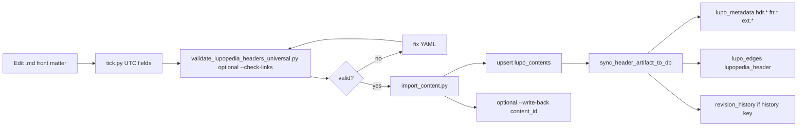

---
lupopedia.headers:
  header_format_version: 2
  lupopedia.schema: documentation
  when_updated: "20260405204205"
  file_path_from_root: "lupo-docs/implementations/16_lupopedia_headers/decisions/pseudocode/prd16_headers_lifecycle.pseudo.md"
  web_path: "http://www.lupopedia.com/lupopedia/lupo-docs/implementations/16_lupopedia_headers/decisions/pseudocode/prd16_headers_lifecycle.pseudo.md"
  questions_toon: null
  federation_node_id: 0
  channel_key: null
  trust_tier: null
  memory_key: null
  artifact_type: documentation
  artifact_kind: guide
  thread_id: "16-lupopedia-headers-pseudocode"
  content_id: null
  pk_id: null
  pk_slug: ""
  title: ""
  status: ""
  parent_pk_id: ""
  summary: ""
  module: null
  dialog_transcript: null
---
# PRD 16 — LUPOPEDIA HEADERS lifecycle (pseudocode narrative)

**This file is pseudocode / design notes.** It is not loaded by the application.

**Canonical spec:** [`lupo-docs/prd/16_lupopedia_headers.md`](../../../../prd/16_lupopedia_headers.md)  
**Doctrine:** [`lupo-docs/doctrine/LUPOPEDIA_HEADERS/LUPOPEDIA_HEADERS_FORMAT.md`](../../../../doctrine/LUPOPEDIA_HEADERS/LUPOPEDIA_HEADERS_FORMAT.md), [`LUPOPEDIA_HEADERS_DOCTRINE.md`](../../../../doctrine/LUPOPEDIA_HEADERS/LUPOPEDIA_HEADERS_DOCTRINE.md), [`VALIDATORS_AND_TOOLING.md`](../../../../doctrine/LUPOPEDIA_HEADERS/VALIDATORS_AND_TOOLING.md)

## 0. Scope (which files need headers)

PRD 16 **[Header applicability and scope](../../../../prd/16_lupopedia_headers.md#header-applicability-and-scope)** is authoritative: **required** for in-scope **`.md`**, **`.php`**, **`.js`**, **`.py`**, **`.sql`**, **`.html`**, **`.htm`**, hand-authored **`.txt`**; **not** required for binaries, generated TOON/CSV/minified output, vendor trees, lockfiles.

**PRD 17 + PRD 16:** Under **`decisions/pseudocode/`**, **`*.pseudo.md`**, **`*.pseudo.php`**, and **`*.pseudo.txt`** **must** include **`lupopedia.headers`** (with **`file_path_from_root`**, etc.) so **external AI** and **IDE** recipients can anchor the file in the repo when snippets are pasted or shared. **PHP:** YAML in a block comment immediately after `<?php` (see `sync_header_artifact_to_db.pseudo.php` in this folder).

---

## 1. File shape (authoring)

### 1.1 Mandatory layout (Markdown)

1. **Line 1** must be `---` (nothing before it).
2. **One** YAML front matter block: opening `---`, YAML body, closing `---`.
3. **Body** starts after the closing `---` (e.g. `# Title`).

See workspace rule **lupopedia-headers-file-order** and PRD 16 **Header Structure**.

### 1.2 Blocks you may include (top-level YAML keys)

| Block | Role |
|-------|------|
| `lupopedia.headers` | Identity, schema, author/delegation, artifact_type/kind, timestamps, optional `content_id` after import |
| `lupopedia.edges` | `outbound_edges` → graph links to other artifacts (repo-relative `to:` paths) |
| `lupopedia.footer` | Verification: `last_verified`, `verified_by`, `next_action`, etc. |
| `lupopedia.history` | Optional list of revision events → persisted to **`lupo_contents.revision_history`** on import |
| Other `lupopedia.*` | Additional custom blocks → synced under metadata `block.*` keys (see sync pseudocode) |

### 1.3 Timestamps (do not guess)

- **`when_updated`**, **`last_modified_utc`**, footer **`last_verified`**: use **real UTC** via `python lupo-bin/tick.py`, then paste **`current_utc`** (14 digits) for the batch.
- **Filename** timestamps (elsewhere): `YYYYMMDD_HHIISS` with valid hour/minute/second ranges.

### 1.4 Author vs legacy `actor_id` (auto-inject)

- **Preferred:** structured `author.type` / `author.id` / `author.name` (PRD 16).
- **`lib/header_validation.validate_header`** and **`validate_lupopedia_headers_universal.py`** call **`inject_legacy_actor_from_author`**: if **`author`** is present and **`actor_id`** / **`actor_name`** are missing or empty, they are **filled from `author.id` / `author.name`** (name falls back to string form of **`id`** if name absent).
- You may still **mirror explicitly** in the file for readability; non-empty legacy fields are **not overwritten**.

### 1.5 Conditional fields (sketch)

- **PRD files:** `prd_id`, `prd_slug`, `title`, `status` (enforced by universal validator for `artifact_type: prd`).
- **Discussions:** `channel_id`, `thread_id` where applicable.
- **Implementations:** `parent_prd`, `status`; sometimes `version`.
- **Content paths:** `file_path_from_root` repo-relative, no leading `/`; `web_path` must include `/lupopedia/` for this install.

---

## 2. How to verify

### 2.1 Local YAML / policy (no DB)

```text
python lupo-scripts/validate_lupopedia_headers_universal.py <path-to.md>
python lupo-scripts/validate_lupopedia_headers_universal.py <path-to.md> --check-links
```

- Broad rules: author structure, type/kind pairing, PRD-specific fields, path shapes, optional `context_id` (18 digits), etc.
- **`--check-links`:** every repo-relative **`to:`** under **`lupopedia.edges.outbound_edges`** must exist on disk ( **`http://` / `https://` skipped**). Fails validation if any target is missing.
- **Logical timestamps:** if **`lupopedia.footer.last_verified`** is present, **`lupopedia.headers.when_updated`** must be **≥** **`last_verified`** (14-digit or 8-digit `YYYYMMDD` normalized to midnight for comparison).

```text
python lupo-scripts/validate_lupopedia_headers.py <path-to.md>
```

- Focused pass; shared patterns in `lupo-scripts/lib/header_validation.py`.

### 2.2 File vs database (after import)

When **`content_id`** is present in the file and DB is configured:

```text
python lupo-scripts/validate_lupopedia_headers_universal.py <path-to.md> --check-db
```

**Intent (pseudocode):**

1. Parse front matter → `lupopedia.headers`, `lupopedia.edges`, `lupopedia.history`, `lupopedia.footer`.
2. Load **`lupo_contents`** row by **`content_id`**.
3. Compare **edges** on disk to **`lupo_edges`** where **`edge_category = lupopedia_header`**.
4. Compare **`lupopedia.history`** to **`lupo_contents.revision_history`** (warn if file has history key but DB JSON empty).

### 2.3 Runtime / admin (PHP)

- **`import_lupopedia_headers.php`** path: parse YAML → **`HeaderValidationService::validate`** → write file.
- **`LupopediaHeaderValidator.php`**: additional checks (e.g. `web_path` contains `/lupopedia/`, deprecated fields).

### 2.4 Verification authority (footer semantics)

- **`lupopedia.footer.verified_by`**: who validated (parallel structure to `author`; legacy `identity_type` deprecated per PRD 16).
- **Stale rule:** artifacts with **`last_verified < 20260301000000`** should be re-verified under **THOTH** policy (PRD 16).
- **Evidence:** commit messages such as `revalidated: [reason]`.

---

## 3. How edges are added

### 3.1 In the file

Under **`lupopedia.edges`**:

```yaml
lupopedia.edges:
  outbound_edges:
    - to: "lupo-docs/prd/00_root_constitutional_system_requirements.md"
      type: references
      weight: 1.0
      reason: "Constitutional anchor"
```

**Rules:**

- **`to:`** = repo-relative path, **no** leading `/`.
- **`type`**: semantic edge type (e.g. `references`, `implements`).
- **`weight`**: float; sync maps to integer score where needed.

### 3.2 After `import_content.py` (database)

**Pseudocode flow** (see also `sync_header_artifact_to_db.pseudo.php`):

1. Upsert **`lupo_contents`** (body + header-derived fields).
2. Call **`sync_header_artifact_to_db`** with parsed YAML + **`content_id`** (inside the **same DB transaction** as the **`lupo_contents`** upsert — **`import_content.py`** commits once after both; rollback on any error avoids orphan edges/metadata).
3. Delete prior sync metadata rows for this content (**`class_name = lupopedia_header_sync`**).
4. Soft-delete or replace prior **`lupo_edges`** with **`edge_category = lupopedia_header`** for this left object.
5. For each outbound edge:
   - Resolve **`to:`** path → **`right_object_type`** + **`right_object_id`**:
     - If target has a **`lupo_contents`** row → **`content`** + that **`content_id`**.
     - Else → **`reference_object`** / **`file_path_ref`** (stable slug) so the edge still stores a right side.
   - Insert new **`lupo_edges`** row with **`edge_category = lupopedia_header`**, **`edge_type`**, weights, **`flare_reason`** from optional **`reason`**, etc.

### 3.3 Regeneration (DB → file)

- **`generate_headers_from_db.py`** / **`build_yaml_data_from_db`**: reads metadata + edge rows and rebuilds YAML so file matches DB snapshot.

---

## 4. How history is added

### 4.1 In the file

**`lupopedia.history`** must be a **YAML list** (top-level key **`lupopedia.history`** — validator treats parsed structure accordingly).

Example shape (fields are policy-defined; keep consistent with doctrine / validators):

```yaml
lupopedia.history:
  - event_id: 1
    when_utc: "20260405202839"
    actor_id: 102
    summary: "Initial import"
```

### 4.2 On import (merge policy)

| Case | Policy |
|------|--------|
| **`lupopedia.history` present** (YAML list) | **OVERWRITE** (default): file list replaces **`revision_history`** JSON for that **`content_id`**. |
| **`lupopedia.history` absent** | **PRESERVE**: DB **`revision_history`** is **not** cleared by sync (unchanged column / touch **`updated_ymdhis`** only). |
| **`--append-history`** on **`import_content.py`** | **APPEND**: new list events are concatenated **after** existing DB JSON array (both must be lists; see **`sync_header_artifact_to_db(..., append_history=True)`**). |

### 4.3 Validation

- **`--check-db`**: warn if file declares **`lupopedia.history`** but **`revision_history`** is null/empty in DB.

---

## 5. How to add / refresh the footer

### 5.1 Block: `lupopedia.footer`

Typical fields (PRD 16):

- **`last_verified`**: UTC **`YYYYMMDDHHIISS`** (quoted string).
- **`verified_by`**: preferred object with **`type`**, **`id`**, optional **`name`** (mirror author pattern).
- **`verified_via`**: e.g. `type: direct`, `faucet_slug: …`
- **`orchestrator`**: delegation label.
- **`next_action`**: list of maintenance strings.

### 5.2 Persistence

On **`sync_header_artifact_to_db`**:

- Each footer key → **`lupo_metadata`** row with property key **`ftr.<key>`** (e.g. `ftr.last_verified`), same **`class_name = lupopedia_header_sync`**, **`entity_type = content`**, **`entity_id = content_id`**.
- Extra top-level keys **`lupopedia.*`** other than headers/footer/edges/history → property keys **`ext.<full_block_name>`** (e.g. `ext.lupopedia.see`). **`build_yaml_data_from_db`** reads both **`ext.`** and legacy **`block.`** prefixes.

### 5.3 Verification process (human)

1. Re-read artifact against repo truth (TOONs, code, other docs).
2. Run validators; fix errors.
3. Update **`last_verified`** with **tick.py** UTC.
4. Set **`verified_by`** to the acting actor/agent.
5. Record evidence in commit message if required.

---

## 6. End-to-end import sequence (single diagram)

````markdown

````

---

## 7. Quick command cheat sheet

| Goal | Command / location |
|------|-------------------|
| Validate file | `python lupo-scripts/validate_lupopedia_headers_universal.py <file.md>` |
| Validate + broken edge paths | `… <file.md> --check-links` |
| Validate + DB parity | `… <file.md> --check-db` |
| Import + sync | `python lupo-scripts/import_content.py <file.md>` (see script for `--write-back`, **`--append-history`**, DB env) |
| UTC for headers | `python lupo-bin/tick.py` — optional **`--copy`** copies **`current_utc`** to clipboard if **`pyperclip`** is installed |
| Sync implementation | `lupo-scripts/lib/header_db_sync.py` → **`sync_header_artifact_to_db`** |
| Doctrine mapping | `LUPOPEDIA_HEADERS_DOCTRINE.md` — table of block → table mapping |
