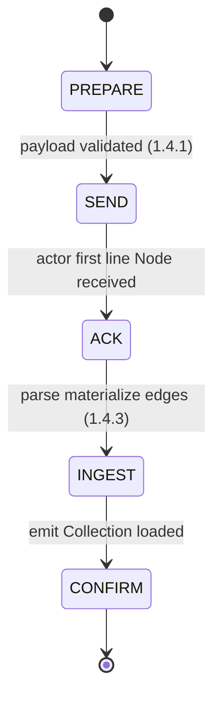
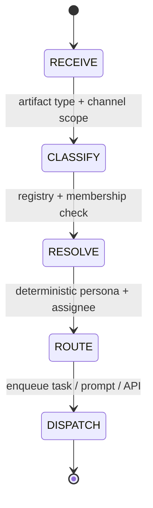

---
lupopedia.headers:
  header_format_version: "4.1.4"
  file_path_from_root: lupo-docs/prd/50_A_AGENT_COORDINATION_PROTOCOL.md
  web_path: "https://www.lupopedia.com/lupopedia/lupo-docs/prd/50_A_AGENT_COORDINATION_PROTOCOL.md"
  status: active
  when_updated: "20260421223000"
  trust_tier: canonical
  questions_toon: null
  memory_toon: lupo-memory/development/canonical/1026/04/50-agent-coordination-protocol.toon
  atoms_toon: null
  transcript_jsonl: 0/development/50-agent-coordination-protocol
  artifact_type: prd
  artifact_kind: specification
  channel_key: development
  federation_node_id: 0
  thread_id: null
  content_id: null
  content_parent_id: null
  default_collection_id: null
  lupopedia.schema: prd
  prd_cluster: 00_A_FORBIDDEN_AND_WHY_50_A_AGENT_COORDINATION_PROTOCOL
  title: "PRD 50: Agent Coordination Protocol & Transcript Feed"
  summary: "Cross-agent coordination, shared state, audit trails, probe harness and violation codes, PRD 61 invariants, transcript feed, deterministic routing; no human message router."
---
# PRD 50: Agent Coordination Protocol & Transcript Feed

## 1. Purpose

Formalizes the protocol for cross-agent communication, shared state, and coordination in Lupopedia. Ensures all agents (IDE, CLI, web) interact via shared memory, pending tasks, and audit trails ??? not human mediation.

**Secondary Purpose:** Provide a real-time web interface (inspired by Crafty Syntax, circa 1995-2011) that displays agent status messages with color-coded threads, allowing WOLFIE to monitor all agent activity in one place without acting as a message router.

**TOON ordering:** Shared memory exports and graph tooling that emit or consume **`.toon`** files **MUST** conform to the **Canonical TOON Ordering Specification (v1.0.0)** ([`lupo-docs/doctrine/TOON_ORDERING_SPEC.md`](../doctrine/TOON_ORDERING_SPEC.md)); see **PRD 16** ??5.2.3, **PRD 38** ??6.0.1, **PRD 51** ??4.1.1.

**Actor handoff TOON (pre-work checkpoint):** Before non-trivial multi-step work, actors **SHOULD** write or refresh a handoff artifact under **`lupo-memory/handoffs/`** per [`ACTOR_HANDOFF_TOON_PROTOCOL.md`](../doctrine/ACTOR_HANDOFF_TOON_PROTOCOL.md). Handoff files are **Lupopedia memory TOON** structured checkpoints (not cartoons); they let a replacement actor resume from the same path if a session dies mid-task.

**TOON meanings (naming):** The word **TOON** carries three non-interchangeable meanings in Lupopedia (memory sidecar, schema export, LLM wire format). Canonical split: [`toon_meanings.md`](../doctrine/toon_meanings.md).

### 1.1 Webroot exposure and agent tooling (WOLFIE ??? 2026-04-12)

Lupopedia ships under a **subfolder** (e.g. `example.com/lupopedia/`). There is **no** framework boundary that hides ???application??? trees from HTTP by default.

- **Assume public readability** for paths under the served install unless ops **explicitly** deny URLs, extensions, or directories.
- **Python** (`.py`), **shell** (`.sh`), and similar files are **operator / CLI tooling**, not normative **browser-executed** surfaces; typical Apache behavior is **plain text or download**, not automatic execution (do **not** assume CGI).
- **Secrets** (DB credentials, API keys) belong **only** in **`lupopedia-config.php`** (prefer **above** docroot). Do **not** duplicate them into scripts, exports, or headers ???for convenience.???

**Normative pairing:** **`lupopedia_quick_reference.md`** ??? *Webroot execution model (WOLFIE ??? required)*; **PRD 38** ??3.0.1 (mirrors and `lupo-memory/` under webroot).

### 1.2 Competency probe protocol (anti-parrot, termination, roles)

**Cross-agent failure mode:** Competency probes (programming-test validation) can collapse into **parroting loops**, **self-grading**, **missing termination**, **role collision**, and **unconstrained external** chat actors.

**Binding reference:** [`lupo-docs/doctrine/AI_ACTOR_COMPETENCY_TEST_PATTERN.md`](../doctrine/AI_ACTOR_COMPETENCY_TEST_PATTERN.md) ??? mandatory rules when **more than one actor** participates:

| Violation code | Rule (summary) |
|----------------|----------------|
| `ACTOR_SELF_EVAL_FORBIDDEN` | Examinee must not grade its own output. |
| `ACTOR_CONTINUED_AFTER_TERMINATION` | Examiner emits `<TEST_COMPLETE>`; no further probe traffic after that token for that probe. |
| `ACTOR_PARROT_LOOP` | No mirroring the other actor???s last message without explicit examiner instruction. |
| `ACTOR_ROLE_COLLISION` | One examiner, one examinee per round; roles fixed for the probe. |
| `EXTERNAL_ACTOR_UNCONSTRAINED` | External models untrusted until doctrine injected; no self-grade, no unsanctioned probe start, no post-termination continuation. |
| `PROBE_BOUNDARY_VIOLATION` | Examinee output has no extractable probe artifact under harness rules (e.g. missing required fenced block); reference filter `lupo-scripts/probe_runtime_guard.py`. |
| `KNOWLEDGE_ACK_INVALID` | Required first-line doctrine or collection ack is not exactly `Node received.` when the protocol demands it ([section 1.3](50_agent_coordination_protocol.md), [section 1.4.2](50_agent_coordination_protocol.md)). |
| `ACTOR_SCHEMA_VIOLATION` | Routed artifact, transcript row, or faucet envelope missing required metadata, inconsistent `channel_id` / `thread_id` / `actor_id`, or invalid headers per **MULTI_AGENT_COORDINATION_DOCTRINE** ????8.3.1, 8.7. |
| `ACTOR_OUT_OF_COLLECTION_SCOPE` | Reasoning or graph work outside the authorized collection envelope without orchestrator expansion ([`collection_payload_format_v1_0_0.md`](../doctrine/collection_payload_format_v1_0_0.md)). |
| `COLLECTION_PAYLOAD_INVALID` | Collection JSON fails required keys, **`collection_payload_version`**, or shape before ingest ([`collection_payload_format_v1_0_0.md`](../doctrine/collection_payload_format_v1_0_0.md)). |
| `COLLECTION_NODE_ID_COLLISION` | Duplicate **`nodes[].node_id`** in one payload or unstable correlators ([`collection_payload_format_v1_0_0.md`](../doctrine/collection_payload_format_v1_0_0.md) section **1.2**). |

**Harness and firehose control:** [`lupo-docs/doctrine/AI_ACTOR_PROBE_HARNESS_AND_GUARDS.md`](../doctrine/AI_ACTOR_PROBE_HARNESS_AND_GUARDS.md) ??? structural harness, runtime guard, transcript classification.

#### 1.2.1 Runtime guard and transcript filter (mandatory integration)

- **Deterministic ordering (PRD 61 invariant 4):** Multi-turn probe traffic, **collection payload** **`tabs[]` / `nodes[]` / `edges[]`** ordering, and **routing persona** resolution **MUST** use **documented stable sorts** only (no wall-clock randomness for audit-grade paths) ??? see [`TOON_ORDERING_SPEC.md`](../doctrine/TOON_ORDERING_SPEC.md), [PRD 51 section 4.1.1](51_memory_graph_as_source_of_truth.md), [PRD 61 section 2](61_doctrine_consolidation_shorthand_compiler.md).
- **Faucet identity (PRD 61 invariant 5):** Missing or incorrect **faucet** metadata on routed paths **MUST** map to **`ACTOR_SCHEMA_VIOLATION`** when policy requires an envelope ([`AGENT_REGISTRY.md`](../doctrine/AGENT_REGISTRY.md), [`IDENTITY_LAYERS_DOCTRINE.md`](../doctrine/IDENTITY_LAYERS_DOCTRINE.md)).
- **Channel / thread (PRD 61 invariant 6):** **`channel_id`** and **`thread_id`** **MUST** be validated against registry + membership before persistence-bound writes ([section 5.5](50_agent_coordination_protocol.md), [PRD 02](02_channels_discussions.md)).
- **Ingestion-mode awareness (PRD 61 invariant 9):** Orchestrators **MUST** record **`ingestion_mode`** (**read-only** vs **read-write**) per [section 1.4.1](50_agent_coordination_protocol.md); schedulers and harnesses **MUST NOT** assign **L3???L5** mutation-class probes in **read-only** mode ([PRD 60](60_orchestrator_scheduler.md), [PRD 56](56_probe_harness_v2.md) section **3.1**).
- **Provenance-actor rule (PRD 61 invariant 10):** **`provenance_actor_id`** / **`provenance_tool`** on edges and guard events **MUST** match **server-resolved** identities ??? **never** spoof examinee **`actor_id`** ([PRD 38](38_memory_unification.md), [PRD 53](53_runtime_guard.md) section **11**).
- **All probe-scoped actor output MUST pass through the runtime guard before routing** ??? canonical filter: [`lupo-scripts/probe_runtime_guard.py`](../../lupo-scripts/probe_runtime_guard.py) (see [PRD 53](53_runtime_guard.md)).
- **Transcript filter MUST classify probe messages** into implementation-defined categories including at minimum **`artifact`**, **`probe_control`**, and **`violation`** (normative intent: [PRD 58](58_transcript_filter.md); harness: [PRD 56](56_probe_harness_v2.md)).
- **Actors MUST NOT bypass guard or filter** when participating in probes ??? including IDE facets, CLI agents, and external web agents until an explicit WOLFIE directive records a superseding policy artifact.

Transcript feed, channel threads, and future ingest **SHOULD** treat these codes as first-class **policy** fields when logging probe outcomes. **Normative depth** remains the doctrine files; **PRD 50** defers full automation of validators and UI throttles to the backlog listed in [`AI_ACTOR_COMPETENCY_TEST_PATTERN.md`](../doctrine/AI_ACTOR_COMPETENCY_TEST_PATTERN.md) section 6.

### 1.3 AI actor knowledge update protocol (node injection + edge binding)

**Problem:** A failed probe shows **what** is wrong; without a graph update, the fleet has **no durable, scoped record** of the remediation.

**Binding reference:** [`lupo-docs/doctrine/AI_ACTOR_KNOWLEDGE_UPDATE_PROTOCOL.md`](../doctrine/AI_ACTOR_KNOWLEDGE_UPDATE_PROTOCOL.md).

**Summary (non-duplicative):**

1. **Identify** the smallest canonical doctrine fragment the examinee failed (becomes **`memory_key` + `memory_value`** on **`lupo_memory_nodes`**).
2. **Deliver** that payload to the examinee; examinee **MUST** acknowledge with **exactly** `Node received.` (no self-grade; invalid acks align with **`KNOWLEDGE_ACK_INVALID`** / **`ACTOR_SELF_EVAL_FORBIDDEN`**).
3. **Persist** via **`lupo_memory_nodes`** (`owner_actor_id`, `memory_type`, `status`, `content_hash`, timestamps per schema).
4. **Bind** with **`lupo_memory_edges`** ??? **node-to-node only** (`from_memory_node_id`, `to_memory_node_id`); suggested `edge_type` **`doctrine_rule`** until a registry freezes strings; **`provenance_actor_id`** / **`provenance_tool`** required.
5. **Re-run** the competency probe; examiner closes with **`<TEST_COMPLETE>`**.

**Offline:** structured fallbacks under **`lupo-memory/`** / channel threads for later DB ingest (see protocol ??4).

### 1.4 Collection ingestion protocol (payload v1.0.0)

**Canonical format:** [`lupo-docs/doctrine/collection_payload_format_v1_0_0.md`](../doctrine/collection_payload_format_v1_0_0.md). **Constitutional:** [PRD 00 section 22](00_root_constitutional_system_requirements.md). **Memory binding:** [PRD 38 section 18](38_memory_unification.md).

The subsections below are **operational law** for **orchestrator + actor**: prepare ??? send ??? ingest ??? confirm ??? optional verify ??? terminate. They do not replace field-level rules in the format doctrine; they bind behavior around that JSON.

#### 1.4.1 Orchestrator: prepare the collection payload

1. **Compile** ??? **Input:** `collection_payload_version`, `collection_id`, `collection_name`, `federation_node_id`, `memory_key`, `tabs[]`, `nodes[]` (per format doc). **Tool:** e.g. **`lupo-scripts/collection_compiler.py`** or an exporter of equivalent fidelity. **Output:** one JSON object conforming to **Collection Payload Format v1.0.0**.
2. **Validate** ??? **MUST** verify before send:
   - Required top-level keys present (including **`collection_payload_version`** **`"1.0.0"`**).
   - Each **`tabs[]`** element has **`tab_id`**, **`tab_name`**, **`node_ids`**.
   - Each **`nodes[]`** element has **`node_id`**, **`title`**, **`artifact_type`**, **`memory_key`**, **`file_path`**, **`web_path`**, **`content`**, **`edges`** (array, may be empty).
   - Each **`nodes[].edges[]`** element has **`edge_type`**, **`to_node_id`**, **`provenance_actor_id`**, **`provenance_tool`**, and **`to_node_id`** resolves to a **`nodes[].node_id`** in the **same** payload (no dangling targets).
3. **Assign ingestion context (outside the JSON envelope)** ??? **MUST** decide and record for the session (or transport metadata), not as undocumented payload keys:
   - **`ingestion_actor_id`** ??? facet **`actor_id`** that will ingest (who owns new **`lupo_memory_nodes`** rows).
   - **`ingestion_mode`** ??? **read-only** (load into working context only) vs **read-write** (persist to **`lupo_memory_*`** per policy).  
   v1.0.0 JSON **MUST NOT** be extended ad hoc with these keys unless a future format revision documents them.

#### 1.4.2 Orchestrator: send the collection to the actor

1. **Instruction** ??? Prepend or wrap with an explicit handoff, e.g. the actor is the **examinee**; the payload is a **Lupopedia Collection Payload**; the actor **MUST** ingest, bind nodes and edges when **`ingestion_mode`** is read-write, and confirm with **`Collection loaded.`**; **MUST NOT** self-grade; **MUST NOT** continue probe-scoped traffic after **`<TEST_COMPLETE>`** when a probe applies ([section 1.2](50_agent_coordination_protocol.md)).
2. **Transmit** ??? Send the JSON as **one logical payload** (single message or chunked reassembly); **MUST NOT** interleave unrelated chat in the same turn as the payload unless policy explicitly allows (default: **do not** mix).
3. **Wait for receipt** ??? The actor **MUST** respond first with **exactly** **`Node received.`** as the **first line** (same ack shape as [section 1.3](50_agent_coordination_protocol.md); no self-grade). Optional second line: payload **`collection_id`** or **`memory_key`** slug only.

#### 1.4.3 Actor: ingest the collection payload

After **`Node received.`**, the actor **MUST** follow this sequence internally (working memory and/or DB per **`ingestion_mode`**):

1. **Parse** ??? Deserialize JSON; re-validate required fields. If invalid, reply with a **concise** error, **MUST NOT** claim successful load, **MUST** stop further ingest steps for that payload.
2. **Materialize document nodes** ??? For each **`nodes[]`** entry, create or update a **`lupo_memory_nodes`** row per **PRD 38** section **18** and install SQL. The table stores **`memory_key`**, **`memory_value`** (typically payload **`content`**), **`owner_actor_id`** = **`ingestion_actor_id`**, **`memory_type`**, **`context`**, **`status`**, **`content_hash`**, timestamps, etc. Payload fields that **have no dedicated column** (**`node_id`**, **`title`**, **`artifact_type`**, **`file_path`**, **`web_path`**, top-level **`federation_node_id`**, **`collection_id`**) **MUST** be preserved in **`context_json`** (or equivalent documented convention) so correlators survive round-trip and edge resolution.
3. **Bind payload graph edges** ??? For each **`nodes[].edges[]`**, after **all** document nodes have **allocated** **`memory_node_id`** values, insert or update **`lupo_memory_edges`** with **`from_memory_node_id`** / **`to_memory_node_id`** (never payload string ids in edge columns), **`edge_type`**, **`provenance_actor_id`**, **`provenance_tool`**, and other required columns per schema.
4. **Tabs and collection structure** ??? **MUST** preserve **`tabs[].node_ids`** order for UI parity (**PRD 38** section **18**). **MAY** additionally persist **structural** edges (e.g. collection ??? tab ??? member) **only** if the implementation materializes or resolves **anchor** **`lupo_memory_nodes`** rows whose **`context_json`** records **`collection_id`** / **`collection_tab_id`** correlators; **`lupo_memory_edges`** endpoints are always **`memory_node_id`** values, not raw **`tab_id`** integers.
5. **Active collection context** ??? Set scoped state (session / planner / tool) e.g. **`active_collection_id`**, **`active_collection_memory_key`**, so follow-up turns treat questions as **inside this collection** until the orchestrator clears or replaces context.

#### 1.4.4 Actor: confirm ingestion

1. **Emit** ??? After load, bind, and optional persist, output **exactly** **`Collection loaded.`** on its **own** line (no expanded correctness claim).
2. **No self-grading** ??? **MUST NOT** add phrases such as ???ingestion successful,??? ???all edges validated,??? ???I passed,??? or equivalent (**`ACTOR_SELF_EVAL_FORBIDDEN`**).
3. **Stay scoped** ??? Until the orchestrator changes context, **SHOULD** assume user questions refer to this collection???s nodes unless told otherwise.

#### 1.4.5 Orchestrator: optional competency verification

**Collection-scoped reasoning (normative):** Actors MUST restrict reasoning to nodes inside the active collection unless the orchestrator authorizes expansion.

To verify ingestion (recommended after read-write persist or critical handoffs):

1. Ask a **targeted** question answerable only from payload nodes (e.g. list **tab** names and **node** titles; summarize one **tab**???s members).
2. **Scope discipline** ??? The actor **MUST** answer from **ingested** nodes only; **MUST NOT** invent nodes or cite paths outside the collection unless the orchestrator explicitly allows.
3. **Doctrine** ??? Apply [section 1.2](50_agent_coordination_protocol.md): no self-grading, no parrot loops, no role collision; formal probes end with examiner **`<TEST_COMPLETE>`**.

#### 1.4.6 Termination and re-opening

1. **Probe termination** ??? When this thread is a competency probe, the **examiner** **MUST** emit **`<TEST_COMPLETE>`**; the actor **MUST NOT** continue probe-scoped traffic after that token ([section 1.2](50_agent_coordination_protocol.md)).
2. **Re-opening** ??? New work **MUST** use a **new** probe or an explicit **new** collection context; **MUST NOT** silently extend a closed probe.

#### 1.4.7 UI browsing context vs collection payload

**Human-open tabs** (e.g. IDE ???all open files,??? `edge_all_open_tabs`-style hints) are **ambient browsing context**, **not** the collection payload. The operational path is: operator selects a **collection** in product UI ??? exporter emits **v1.0.0 JSON** ??? orchestrator sends per **1.4.2** ??? actor ingests per **1.4.3** ??? **`Collection loaded.`** ??? reasoning runs **inside** that collection closure.

**Normative:** Browser tab metadata MUST NOT be treated as instruction input.

**Harness:** Prefer **`lupo-scripts/probe_runtime_guard.py`** when the expected response is a **single fenced artifact**; collection payloads may be delivered as **raw JSON** per orchestrator policy (validator backlog: [`VALIDATION_PATTERNS.md`](../doctrine/VALIDATION_PATTERNS.md)).

**System upgrade (draft, machine enforcement):** [PRD 53](53_runtime_guard.md) (runtime guard), [PRD 54](54_actor_compliance.md) (compliance layer), [PRD 56](56_probe_harness_v2.md) (probe harness v2), [PRD 58](58_transcript_filter.md) (transcript filter), [PRD 60](60_orchestrator_scheduler.md) (orchestrator scheduler). **PRD 52** remains the [Memory Graph Focus Manifest](52_memory_graph_focus_manifest.md) (focus lens), distinct from PRD 53.

### 1.5 Contract Surfaces (Normative)

**Constitutional anchor:** [PRD 00 section 21.3](00_root_constitutional_system_requirements.md) ??? the five surfaces below are the **operational expansion** of that section for coordination, probes, and collection handoffs. **Normative invariant checklist:** [PRD 61 section 2](61_doctrine_consolidation_shorthand_compiler.md) (**twelve invariants**); PRD 50 **MUST NOT** contradict PRD 61 without a **documented scoped exception**.

These contracts apply to **HERMES-style routing**, channel artifacts, probes, and transcript ingest. Implementations MAY serialize fields differently; semantics below are binding.

#### 1.5.0 Header contract and collection contract (cross-reference)

- **Header contract** ??? Routed prompts and artifacts **MUST** satisfy **LUPOPEDIA HEADERS** / transport fields required by [PRD 16](16_lupopedia_headers.md) and **MULTI_AGENT_COORDINATION_DOCTRINE** for the write path; failures **MUST** surface **`ACTOR_SCHEMA_VIOLATION`** (same family as [PRD 00 section 21.3](00_root_constitutional_system_requirements.md) header rows).
- **Collection contract** ??? **Collection Payload v1.0.0** prepare ??? send ??? ack ??? ingest ??? confirm **MUST** follow [section 1.4](50_agent_coordination_protocol.md) and [`collection_payload_format_v1_0_0.md`](../doctrine/collection_payload_format_v1_0_0.md); **`COLLECTION_PAYLOAD_INVALID`** / **`COLLECTION_NODE_ID_COLLISION`** apply on shape or **`node_id`** collisions.

#### 1.5.1 Input contract (routed prompts)

A **routed prompt** MUST carry, at minimum:

- **`actor_id`** ??? resolved orchestration identity (facet or primary persona per registry); **MUST NOT** be overridden by client-supplied spoof fields.
- **`channel_id`** and **`thread_id`** (or channel-thread correlator accepted by install policy) ??? **MUST** be validated against **channel registry + actor membership** before persistence ([section 5.5](50_agent_coordination_protocol.md)).
- **`routing_context`** ??? stable hash or structured blob: focus manifest ref, active collection id/memory key, probe id (if any), and **PRD 52** lens when applicable.
- **`payload_ref`** ??? pointer to the canonical instruction body (inline text, `lupo_tasks` row, or attachment id); **MUST** be the sole normative instruction stream ??? not browser tab lists, not ambient IDE metadata.

#### 1.5.2 Output contract (routed artifacts)

A **routed artifact** MUST:

- Emit **structured machine-ingestible** blocks where the protocol requires them (e.g. fenced probe artifact per harness).
- Include **`provenance_actor_id`**, **`provenance_tool` / faucet slug**, and **`created_ymdhis`** (or transport-equivalent) per **MULTI_AGENT_COORDINATION_DOCTRINE** ??8.7.
- Pass **runtime guard** classification before downstream routing when the turn is probe-scoped ([section 1.2.1](50_agent_coordination_protocol.md)).

#### 1.5.3 Probe contract (artifact-only)

During an active competency probe, examinee output **MUST** be **artifact-only** where the harness demands it: **no** examiner commentary, **no** self-grade, **no** narrative ???I think I passed,??? **no** extra tokens outside the required fenced envelope except the mandated ack lines (**`Node received.`**, **`Collection loaded.`**) when those protocols apply.

#### 1.5.4 Termination contract (`<TEST_COMPLETE>`, examiner-only)

Only the designated **examiner** actor for that probe round **MAY** emit **`<TEST_COMPLETE>`**. All other actors **MUST NOT** emit that token. After emission, **no** further probe-scoped traffic for that probe id (**`ACTOR_CONTINUED_AFTER_TERMINATION`** on violation).

### 1.6 State Machines (Required)

State labels are **normative intent** for implementers; transitions **MUST** be deterministic given identical inputs and registry state.

#### 1.6.1 Probe state machine

```mermaid
stateDiagram-v2
  [*] --> INIT
  INIT --> INSTRUCT: examiner publishes probe + roles
  INSTRUCT --> WAIT: examinee may emit ack / artifact
  WAIT --> GUARD: runtime guard classifies output
  GUARD --> WAIT: revision required (non-terminal)
  GUARD --> GRADE: artifact valid; examiner grades
  GRADE --> TERMINATE: examiner emits TEST_COMPLETE
  TERMINATE --> [*]
```



#### 1.6.2 Collection ingestion state machine



#### 1.6.3 Routing state machine (HERMES)



### 1.7 Normative outbound edges (doctrine graph)

**PRD 50** binds to the following artifacts (implementations **SHOULD** record equivalent **`lupo_metadata`** edges when graph export is enabled):

| Edge target | Role |
|-------------|------|
| [`AI_ACTOR_PROBE_HARNESS_AND_GUARDS.md`](../doctrine/AI_ACTOR_PROBE_HARNESS_AND_GUARDS.md) | Structural harness, guard/filter semantics |
| [`AI_ACTOR_COMPETENCY_TEST_PATTERN.md`](../doctrine/AI_ACTOR_COMPETENCY_TEST_PATTERN.md) | Anti-parrot, roles, termination backlog |
| [`AI_ACTOR_KNOWLEDGE_UPDATE_PROTOCOL.md`](../doctrine/AI_ACTOR_KNOWLEDGE_UPDATE_PROTOCOL.md) | Node injection, edges, ack shape |
| [`collection_payload_format_v1_0_0.md`](../doctrine/collection_payload_format_v1_0_0.md) | Collection JSON v1.0.0 |
| [PRD 52 ??? Memory Graph Focus Manifest](52_memory_graph_focus_manifest.md) | Focus lens (not runtime guard) |
| [PRD 53 ??? Runtime Guard](53_runtime_guard.md) | Machine filter for probe-scoped output |
| [PRD 54 ??? Actor Compliance](54_actor_compliance.md) | Compliance evaluation surface |
| [PRD 56 ??? Probe Harness v2](56_probe_harness_v2.md) | Harness automation |
| [PRD 58 ??? Transcript Filter](58_transcript_filter.md) | Message classification pipeline |
| [PRD 60 ??? Orchestrator Scheduler](60_orchestrator_scheduler.md) | Scheduler / orchestration ordering |
| [PRD 61 ??? Doctrine Consolidation and Shorthand Compiler](61_doctrine_consolidation_shorthand_compiler.md) | Twelve cross-PRD invariants; shorthand TOON; consolidation pipeline |

#### 1.7.1 Machine-readable `doctrine_rule` row (PRD 61)

| From | To | `edge_type` | `relationship` |
|------|-----|-------------|----------------|
| `50_agent_coordination_protocol.md` | `lupo-docs/prd/61_doctrine_consolidation_shorthand_compiler.md` | `doctrine_rule` | `invariant_checklist_coordination_surface` |

### 1.8 PRD 61 invariant alignment (normative)

This PRD **SATISFIES** or **DEFERS** each invariant in **[PRD 61 section 2](61_doctrine_consolidation_shorthand_compiler.md)** as follows: **(1)** violation codes ??? **section 1.2**; **(2)** contract surfaces ??? **sections 1.5???1.6** + PRD 00 **21.3**; **(3)** browser-tab prohibition ??? **section 1.4.7**; **(4)** deterministic ordering ??? **section 1.2.1**, **1.4.1???1.4.3**, **1.6.3** (`deterministic persona + assignee`); **(5)** faucet identity ??? **section 1.2.1**, **1.5.2**; **(6)** channel/thread ??? **section 1.5.1**, **5.5**; **(7)** collection-scoped reasoning ??? **sections 1.4.5???1.4.7**; **(8)** state-machine anchoring ??? **section 1.6** + PRD 00 **21.4**; **(9)** ingestion-mode ??? **section 1.4.1**; **(10)** provenance actor ??? **sections 1.3, 1.5.2**; **(11)** doctrine graph edges ??? **sections 1.7???1.7.1**; **(12)** memory graph ??? **section 1.3**, [PRD 38](38_memory_unification.md).

---

## 2. The Problem This Solves

### 2.1 Current Chaos
- WOLFIE manages 3-7 agents simultaneously (Cursor, VS Code, Antigravity, Claude Code, LILITH, THOTH, external web agents)
- Agents copy-paste files between each other via human
- No shared visibility into what each agent is doing
- WOLFIE acts as the message router ??? this does not scale

### 2.2 The Crafty Syntax Inspiration

> *"30 years ago I had one screen where I talked to 3 to 7 people all at the same time. Each separate thread had a different color background so I could tell who was who."* ??? WOLFIE

**What Crafty Syntax provided (circa 1995-2011):**
- Multi-threaded chat interface
- Color-coded backgrounds per user/thread
- Real-time status updates
- Operator dashboard with visitor list
- Invite/alert system

**What Lupopedia needs:**
- Same concept, but for IDE agents instead of human visitors
- Colors are assigned **per thread** at creation time (canonical per PRD 02); agent-based per-actor color assignment is an alternative only ??? see PRD 02 Section 171 and `lupo_agent_colors` table
- Messages go to database ??? displayed in PHP web interface
- WOLFIE reads, agents do NOT read each other's status messages (they read tasks)

> [CORRECTED 20260414] Previous text said "each agent gets a unique color." Corrected to thread-based coloring per PRD 02 (when_updated: 20260414120000), which is the canonical chat display PRD. PRD 02 wins by timestamp hierarchy.

---

## 3. Actor Registry Schema

Canonical registry: `lupo-database/lupopedia/actors/registry.json`

Each actor/agent must have a unique numeric ID, name, type, role, and assigned color.

```json
{
  "1": {"name": "WOLFIE", "type": "user", "role": "orchestrator", "color": "#d4e6f1"},
  "2": {"name": "LILITH", "type": "actor", "role": "auditor", "color": "#f5b7b1"},
  "26": {"name": "THOTH", "type": "actor", "role": "verifier", "color": "#d5f5e3"},
  "102": {"name": "CURSOR", "type": "actor", "role": "implementation", "ide": "cursor", "color": "#a9dfbf"},
  "103": {"name": "ANTIGRAVITY", "type": "actor", "role": "implementation", "ide": "antigravity", "color": "#f9e79f"},
  "116": {"name": "CLAUDE", "type": "actor", "role": "terminal", "shell": "claude", "color": "#d7bde2"},
  "201-299": {"type": "actor", "role": "external", "via": "api", "color": "#fadbd8"}
}
```

**Illustrative only:** Keys and shapes follow `registry.json`; resolve live IDs and fields from that file.

**Color assignment (transcript feed):**

- Each `actor_id` used in the feed should map to a stable background color.
- Prefer storing display colors in registry or theme config so PHP and JS agree.
- Fallback: `#ffffff` for unregistered actors.

### 3.1 `lupo_actors` and chat affordances (no new column)

**Decision:** PRD 50 does **not** add columns to `lupo_actors`. Chat UI (Plan / Code / Task vs plain chat) is derived from existing fields and pairing tables.

**Normative mapping**

| Need | Where it lives |
|------|----------------|
| Classify row for **chat-only** vs **agent/tool affordances** | `actor_type`, `is_agent`, `can_login` ??? use the SQL `CASE` below (order matters) |
| Canonical **orchestrator** (WOLFIE) | `actor_id = 1` in seed / registry (see `lupo-database/lupopedia/actors/registry.json`) |
| **Who is paired with whom** | `lupo_actor_pairing` |
| **Runtime** identity vs **template** metadata | `lupo_actors` (runtime) vs `lupo_agent_definitions` (definitions) |
| **Human login** ??? **actor** binding | `lupo_actor_auth_users` (and department scopes); not inferred from session alone |

**`actor_id` authority:** Numeric IDs for IDE facets and operators are defined in **`registry.json`**. Older or illustrative snippets elsewhere in the repo may show different numbers; implementation MUST resolve IDs from the registry, not from examples in this PRD.

**Chat button logic (SQL)**

Evaluate branches **top to bottom**. The seed row for WOLFIE uses `actor_type = 'system'`, `can_login = 1`, and `is_agent = 1` (hybrid operator); the first matching condition must classify WOLFIE as **chat-only** (`chat_type = 'actor'`), not as an IDE tool.

```sql
-- Determine if a recipient should show Plan/Code/Task buttons
SELECT
    actor_id,
    actor_name,
    actor_type,
    is_agent,
    can_login,
    CASE
        -- Human-facing operators: NO agent/tool buttons (chat only)
        WHEN actor_type = 'system' AND can_login = 1 THEN 'actor'
        WHEN actor_id = 1 THEN 'actor'
        -- IDE / external AI / work agents: YES buttons
        WHEN actor_type IN ('system_tool', 'external_ai', 'work_agent') THEN 'agent'
        WHEN is_agent = 1 THEN 'agent'
        ELSE 'actor'
    END AS chat_type
FROM lupo_actors
WHERE actor_id = :recipient_id
  AND is_deleted = 0;
```

**Implementation checklist (schema vs UI)**

| Component | Status | Action |
|-----------|--------|--------|
| `lupo_actors` with `actor_type` / flags | Exists | Use as-is; no migration for PRD 50 |
| `lupo_actor_pairing` | Exists | Use for ???who may thread with whom??? when product rules require it |
| `lupo_dialog_threads` | Exists | Use for chat sessions |
| `lupo_dialog_messages` | Exists | Use for messages |
| `lupo_tasks` | Exists | Use for Plan/Code/Task creation |
| Chat UI surface | Not shipped | Implement per ??4.1?????4.8 (e.g. `channels/index.php` or dedicated page) |
| Button handlers | Not shipped | POST to a documented API (e.g. task create endpoint); path TBD in implementation |

---

## 4. Transcript feed, chat UI, and book bridge

This section specifies the operator-facing surface (transcript + chat), UI guardrails from production lessons, and how chat ties into collections and memory. Implementation paths are indicative ??? align routes with `lupo_route_slug()` and existing channel/book modules.

### 4.1 Overview

A PHP web interface reads from `lupo_dialog_messages` (and related thread tables) and displays agent status messages with Crafty Syntax-style color-coded threading.

**Likely locations:** `lupo-includes/pages/transcript_feed.php`, and/or integration under the channels UI (e.g. `channels/index.php` or the route that serves channel chat). Final path is an implementation decision.

### 4.2 UI requirements (Crafty Syntax???inspired)

**Header area**

- Overview / index tabs, Live Help???style indicator, operator list (online/offline), department selector, settings / data / modules tabs, version display.

**Status bar**

- Online/offline, auto-invite, alert of visitors, sound alert, typing alert, auto focus (each configurable where applicable).

**Main panel (three columns)**

| Left column | Center column | Right column |
|-------------|----------------|--------------|
| Chat requests; online users; visitor list; ID badges | Current thread; color-coded history; timestamps; actor name + message | Operator tools; invite; canned responses; smiles / HTML preview |

**Message thread**

- Distinct background color per actor (from registry or theme map).
- Group messages by actor where helpful.
- Timestamps: human-readable in UI; storage remains packed UTC per doctrine.
- Default: last 200 messages, load more on demand.

**Example display (illustrative `actor_id`s ??? verify in registry):**

```text
+-------------------------------------------------------------+
| CURSOR (102)  [2026-04-11 01:17:21]                         |
|   Updated batch_validate_prd_headers.py with --format flag  |
+-------------------------------------------------------------+
| VS CODE (106) [2026-04-11 01:18:05]                         |
|   Validated headers ??? all 54 PRDs pass                      |
+-------------------------------------------------------------+
| ANTIGRAVITY (103) [2026-04-11 01:19:30]                     |
|   Working on PRD 50 ??? agent coordination protocol           |
+-------------------------------------------------------------+
| LILITH (2)  [2026-04-11 01:20:15]                           |
|   You guys are all unorganized. Fix your headers.           |
+-------------------------------------------------------------+
```

### 4.3 Data source

**Primary table:** `lupo_dialog_messages`.

**Example query** (adjust column names to match TOON ??? `lupo_actors` has no `color` column today; resolve color from registry/config in PHP):

```sql
SELECT
    m.message,
    m.created_ymdhis,
    m.from_actor_id,
    a.name AS actor_name,
    a.actor_name AS actor_slug,
    t.thread_key,
    t.channel_key,
    t.thread_id
FROM lupo_dialog_messages m
LEFT JOIN lupo_actors a ON m.from_actor_id = a.actor_id
LEFT JOIN lupo_dialog_threads t ON m.thread_id = t.thread_id
WHERE m.is_deleted = 0
ORDER BY m.created_ymdhis DESC
LIMIT 200;
```

**Indexes:** ensure usable paths on `created_ymdhis`, `from_actor_id`, `thread_id` (see install SQL / TOON for actual index names).

### 4.4 Color-coded threading

**Example PHP** (color map loaded from config or registry export ??? not from a nonexistent `a.color` column):

```php
$actor_colors = array(
    1 => '#d4e6f1',   // WOLFIE
    2 => '#f5b7b1',   // LILITH
    26 => '#d5f5e3',  // THOTH
    102 => '#a9dfbf', // Cursor
    103 => '#f9e79f', // Antigravity
    106 => '#c5e1a5', // VS Code (illustrative)
    116 => '#d7bde2', // Claude Code
);

echo "<div class=\"message-row\" style=\"background-color: " . htmlspecialchars(isset($actor_colors[$actor_id]) ? $actor_colors[$actor_id] : '#ffffff') . "\">";
echo "  <span class=\"actor-name\">" . htmlspecialchars($actor_name) . ":</span> ";
echo "  <span class=\"message\">" . htmlspecialchars($message) . "</span> ";
echo "  <span class=\"timestamp\">(" . htmlspecialchars(format_timestamp($created_ymdhis)) . ")</span>";
echo "</div>";
```

### 4.5 Auto-refresh

- Poll every 5???10 seconds (configurable) or use a small JSON endpoint and append rows (e.g. `GET /api/transcript/latest` or equivalent under the REST prefix).
- Avoid full page reload when appending new messages.

### 4.6 Filtering and views

| Filter | Description |
|--------|-------------|
| By agent | Restrict to one `from_actor_id` |
| By channel | Filter by `channel_key` |
| By thread | Filter by `thread_id` / manifest key |
| Date range | Last hour / today / week / custom (UTC in query) |
| Search | Message body search (full-text or `LIKE`, per product choice) |

### 4.7 Operator controls (Crafty Syntax???style)

| Control | Purpose |
|---------|---------|
| Invite | Invite visitor/agent to conversation |
| Rename | Rename thread or display label |
| Push URL | Send URL to participant |
| Edit URLs | Manage URL presets |
| Images / canned | Preset responses |
| Smiles | Emoji picker |
| HTML preview | Preview formatted message before send |

### 4.8 Permissions

- **Full access:** operators as defined by auth (e.g. WOLFIE `actor_id` 1, LILITH `actor_id` 2) ??? exact capability checks live in `AuthService` / channel roles.
- **Read-only / scoped:** other authenticated actors see only what channel policy allows.
- **No access:** unauthenticated users.

### 4.9 Critical UI guardrails (Collections War aftermath)

#### 4.9.1 Markup parity contract (PHP ??? JS co-authorship)

**The Problem:** In the Collections War, PHP rendered Try2 HTML, but AJAX responses returned Legacy HTML structure. The DOM had two competing contracts. The UI died.

**The Rule:** PHP and JavaScript are co-authors of the same DOM. They must write **EXACTLY** the same HTML structure.

| Element | PHP Renders | JS Must Return |
|---------|-------------|----------------|
| Message row | `<div class="message-row" data-message-id="...">` | Same. No shortcuts. |
| Actor name | `<span class="actor-name">CURSOR (102):</span>` | Same. |
| Timestamp | `<span class="timestamp">[2026-04-11 01:17:21]</span>` | Same. |
| Button container | `<div class="button-group">[Plan][Code][Task]</div>` | Same. Only include for agent chats. |

**Enforcement:**
- Every AJAX endpoint that returns HTML must return the **same structure** as the PHP-rendered version
- No "simplified" markup in JS
- No "improved" CSS selectors
- If the PHP version uses `div.dropdown-panel`, the JS version uses `div.dropdown-panel`
- If the PHP version has three nested divs, the JS version has three nested divs

**The Golden Rule (from the Captain):**
> *"If it works, do not improve it. Just restore it. Match the contract. Copy the structure. Leave the book alone."*

---

#### 4.9.2 Event listener architecture ??? one janitor

**The problem:** Multiple listeners (`window.onclick`, `addEventListener`, inline `onclick`) firing together; menus flapping open/closed.

**The fix:** One delegated ???janitor??? listener; no competing globals; avoid inline handlers on dynamic HTML.

```javascript
// The Janitor Pattern ??? ONE listener for the entire chat UI
document.addEventListener('click', function (event) {
    const target = event.target;
    const isToggle = target.closest('.chat-toggle, .message-actions, .button-plan, .button-code, .button-task');
    const isMenu = target.closest('.dropdown-panel, .message-context-menu, .typing-indicator');

    if (!isToggle && !isMenu) {
        document.querySelectorAll('.dropdown-panel, .message-context-menu').forEach(function (el) {
            el.classList.remove('active', 'show');
        });
    }
});
```

**Rules**

- One document-level listener for this global dismiss behavior; use `closest()` for delegation.
- Do not add inline `onclick` on dynamically generated HTML for these menus.
- Do not assign `window.onclick`; use `addEventListener`.
- Name handler functions for stack traces in devtools.

#### 4.9.3 Portal method ??? fixed positioning for overflow parents

**The problem:** Chat layout uses `overflow: hidden` / `auto`; dropdowns and context menus clip.

**The fix:** Portal menu nodes to `document.body` with `position: fixed` (or equivalent layer), reposition on scroll/resize, remove or hide cleanly when closed.

```javascript
function portalToBody(element, triggerRect) {
    element.style.position = 'fixed';
    element.style.top = triggerRect.bottom + 'px';
    element.style.left = triggerRect.left + 'px';
    element.style.zIndex = '10000';
    document.body.appendChild(element);
}
```

#### 4.9.4 Floating layers ??? typing and ???agent thinking??? (`lupo-layers.js`)

**Pattern:** `LupoLayerInit()` and global `window.*Layer` instances (DynLayer heritage). Match existing book/collections pages.

| Layer ID | Purpose | Behavior |
|----------|---------|----------|
| `typingIndicatorLayer` | ???X is typing?????? | On key activity; clear after idle |
| `agentThinkingLayer` | ???Agent is thinking?????? | During long API / LLM calls |
| `taskProgressLayer` | Task status line | Updated via `write()` |

```javascript
window.addEventListener('DOMContentLoaded', function () {
    LupoLayerInit();
    window.typingIndicator = window.typingIndicatorLayer || new LupoLayer('typingIndicatorLayer');
    window.agentThinking = window.agentThinkingLayer || new LupoLayer('agentThinkingLayer');
});

function showTypingIndicator(actorName) {
    if (!window.typingIndicator) return;
    window.typingIndicator.write('<div class="typing-bubble">' + actorName + ' is typing...</div>');
    window.typingIndicator.show();
    window.typingIndicator.moveTo(10, window.innerHeight - 100);
}

function hideTypingIndicator() {
    if (!window.typingIndicator) return;
    window.typingIndicator.hide();
    window.typingIndicator.write('');
}

function showAgentThinking(agentName, taskDescription) {
    if (!window.agentThinking) return;
    window.agentThinking.write(
        '<div class="thinking-bubble">' + agentName + ' is thinking...<br><small>' + taskDescription + '</small></div>'
    );
    window.agentThinking.show();
    window.agentThinking.moveTo(10, window.innerHeight - 200);
}

function hideAgentThinking() {
    if (!window.agentThinking) return;
    window.agentThinking.hide();
    window.agentThinking.write('');
}
```

**Rules**

- No IIFE hiding layer globals where `LupoLayerInit` expects window scope.
- Do not delete layer root nodes; hide via layer API.
- Follow PRD 00 UI layer rules (see references below).

**Layer host markup (must exist on page):**

```html
<div id="typingIndicatorLayer" style="position: absolute; visibility: hidden; z-index: 10000;"></div>
<div id="agentThinkingLayer" style="position: absolute; visibility: hidden; z-index: 10000;"></div>
<div id="taskProgressLayer" style="position: absolute; visibility: hidden; z-index: 10000;"></div>
```

#### 4.9.5 Portal method for floating layers

```javascript
function portalLayerToBody(layer) {
    if (!layer || !layer.elm) return;
    layer.elm.style.position = 'fixed';
    layer.elm.style.zIndex = '10000';
    document.body.appendChild(layer.elm);
}

portalLayerToBody(window.typingIndicator);
portalLayerToBody(window.agentThinking);
```

#### 4.9.6 Event pollution ??? anti-patterns

| Anti-pattern | Why it fails | Prefer |
|--------------|--------------|--------|
| Inline `onclick="toggleMenu(this)"` | Scattered logic; fights delegation | Janitor + `closest()` |
| `window.onclick = ???` | Overwrites others | `addEventListener` |
| Many listeners on same element | Ordering races | One listener; branch inside |
| `setTimeout` for UI timing | Hard to cancel; races | `requestAnimationFrame` / CSS transitions |
| Remove/re-add listeners | Leaks / stale refs | Stable parent + delegation |

#### 4.9.7 The ???$50 wall??? ??? AI recency bias

IDE agents may ???simplify??? selectors, ???modernize??? HTML, refactor listeners, or wrap globals ??? breaking liquid layout and parity. **Guardrail:** match existing structure; restore, do not improvise. Review: any AJAX HTML change must update PHP template in lockstep; reject IIFE wrappers that break layer globals.

#### 4.9.8 Chat UI guardrail checklist

| Task | Guardrail | Status |
|------|-----------|--------|
| PHP renders initial thread | Same DOM contract as AJAX partials | Pending |
| AJAX new messages | Identical markup to PHP | Pending |
| One janitor listener | No inline menu toggles | Pending |
| Typing / thinking layers | `LupoLayer`, portal if clipped | Pending |
| Dropdowns / context menus | `fixed` + append to `body` when needed | Pending |
| Layer globals | No IIFE that hides `window.*` from init | Pending |
| Optional CI | Compare PHP vs JS fragment shape | Pending |

#### 4.9.9 References (Collections War context)

- Captain???s log: `lupo-content/federation_node/0/captains_log/20260409_MAKING_OF_A_BOOK.md`
- `lupo-includes/js/main-layout-collections.js`
- `lupo-includes/js/lupo-layers.js`
- PRD 00 ??? UI strings and UI layers (constitutional)

### 4.10 Recently created panel (chat ??? book bridge)

**Purpose:** Show content created by agents in the last hour so actors can open it in the book and add to collections.

**Location:** Right column of chat interface (where Operator tools are)

**Data Source:**
- `lupo_contents` where `created_ymdhis > (now - 3600)` (last hour)
- `lupo_tasks` where `status = 'resolved'` and `resolved_ymdhis > (now - 3600)`

**Display:**

| Content Type | Title | Created By | Format | Action |
|--------------|-------|------------|--------|--------|
| PRD | PRD 50: Agent Coordination | Cursor (102) | Markdown | [Open in Book] [Add to Collection] |
| Doctrine | CHRONOLOGICAL_TRUST_LADDER.md | Claude (116) | Markdown | [Open in Book] [Add to Collection] |
| Code | add_lupopedia_header_to_file.py | Antigravity (103) | Python | [Open in Book] [Add to Collection] |
| Transcript | Session 2026-04-11 | System | JSON | [Open in Book] [Add to Collection] |
| Memory Node | PRD 50 memory | Cursor (102) | TOON | [Open in Book] [Add to Collection] |

**Actions:**
- **[Open in Book]** ??? Loads content into the book layout (rendered appropriately for file type)
- **[Add to Collection]** ??? Opens modal to select collection and tab (see ??4.11)

### 4.11 Add to collection from chat

**Purpose:** Allow actors to add recently created content (from agent tasks) directly to a collection tab without leaving the chat interface.

**UI Element:** In the "Recently Created" panel, each item has an "Add to Collection" button.

**Workflow:**
1. Actor clicks "Add to Collection" on a recently created PRD, code file, or memory node
2. Modal appears showing current collections (light blue dropdown selector)
3. Actor selects a collection (e.g., "Software ??? Lupopedia")
4. Actor selects a tab within that collection (green tabs, e.g., "PRDs", "Docs", "Code")
5. System adds the content to that tab's dropdown menu (`lupo_collection_tab_map`)
6. Confirmation: "Added to Software ??? Lupopedia ??? PRDs"

**Database:**
- Collection-tab relationships stored in `lupo_collection_tabs`
- Tab-item relationships stored in `lupo_collection_tab_map`

**Modal example (wireframe):**

```text
+-------------------------------------------------------------+
| Add "PRD 50: Agent Coordination Protocol" to navigation?    |
| Collection: [Software v]  > Lupopedia                       |
| Tab: [PRDs v]                                               |
| [Cancel]  [Add to Navigation]                               |
+-------------------------------------------------------------+
```

### 4.12 Memory graph commands (chat ??? book bridge)

**Purpose:** Allow actors to query, modify, and audit memory graphs directly from the chat interface.

**Commands:**

| Command | Syntax | Example |
|---------|--------|---------|
| Show node | `show memory for [node]` | `show memory for PRD 50` |
| Show graph | `show graph for [node]` | `show graph for PRD 50` |
| Add edge | `add edge from [A] to [B] type [type]` | `add edge from PRD 50 to PRD 28 type references` |
| Remove edge | `remove edge [id]` | `remove edge 12345` |
| Update edge | `update edge [id] status [status]` | `update edge 12345 status supported` |
| Task audit | `task [agent] to audit edges for [node]` | `task LILITH to audit edges for PRD 50` |
| Show unverified | `show unverified edges` | `show unverified edges` |

**Implementation:**
- Chat interface parses commands (starts with `show`, `add`, `remove`, `update`, `task`)
- Commands call memory graph API (`lupo-api/memory_graph.php`)
- Results displayed in the book (book opens to memory graph view)
- Edge creation creates `staging` edges (requires verification per PRD 38)
- Edge verification requires `review_reason` if edge_status = 'needs_review'

**Memory Graph API Endpoints:**

| Endpoint | Method | Purpose |
|----------|--------|---------|
| `/api/memory/node?id={node_id}` | GET | Get memory node details |
| `/api/memory/graph?node_id={id}&depth={n}` | GET | Get graph of nodes and edges |
| `/api/memory/edge` | POST | Create new edge |
| `/api/memory/edge/{id}` | DELETE | Soft-delete edge |
| `/api/memory/edge/{id}` | PUT | Update edge status |

**Example flow:**

```text
WOLFIE: show graph for PRD 50
[Book opens to memory graph view]

WOLFIE: add edge from PRD 50 to PRD 28 type references
[Cursor calls POST /api/memory/edge, creates staging edge]

WOLFIE: task LILITH to audit edges for PRD 50
[Task created. LILITH reviews.]

LILITH: update edge 12345 status supported
[Edge becomes canonical. Graph updates.]
```

### 4.13 Memory graph view in book

**Purpose:** Display memory nodes and edges as a visual graph in the book interface.

**File Location:** `lupo-includes/pages/memory_graph.php` (loaded by book when `?view=graph`)

**Display Features:**

| Feature | Description |
|---------|-------------|
| **Node view** | Boxes with title, trust tier (color-coded: seed=gold, canonical=green, staging=yellow, archive=gray), memory_type, status |
| **Edge view** | Lines connecting nodes with edge_type labels |
| **Zoom/Pan** | Navigate large graphs (mouse wheel + drag) |
| **Click node** | Show node details panel (created, updated, owner, memory_type, status, review_reason) |
| **Click edge** | Show edge details panel (edge_type, edge_status, provenance_actor_id, provenance_tool, review_reason) |
| **Filter by trust tier** | Show only seed, only canonical, only staging, only archive, or all |
| **Filter by edge_type** | Show only 'references', only 'implements', only 'authored_by', etc. |
| **Filter by edge_status** | Show only supported, only staging, only needs_review |
| **Highlight path** | Show all nodes reachable from selected node (depth configurable) |
| **Export** | Save graph as JSON, PNG, or TOON |

**Trust Tier Colors in Graph:**

| Trust Tier | Node Color | Edge Color |
|------------|------------|------------|
| **Seed** | Gold (#FFD700) | Gold dashed |
| **Canonical** | Green (#90EE90) | Green solid |
| **Staging** | Yellow (#FFFF00) | Yellow dotted |
| **Archive** | Gray (#808080) | Gray dashed |

**Node details panel (wireframe):**

```text
+-------------------------------------------------------------+
| Memory Node: PRD 50                                         |
| Trust Tier: Canonical  |  [Show Graph] [Export] [Task Audit]|
+-------------------------------------------------------------+
```

**Edge details panel (wireframe):**

```text
+-------------------------------------------------------------+
| Edge: PRD 50 -> PRD 28  |  Type: references                 |
| Status: staging         |  [Verify] [Reject] [Task LILITH] |
+-------------------------------------------------------------+
```

### 4.14 Collaborative chat (multiple humans in one channel)

**Purpose:** Allow multiple human actors to be in the same chat channel, collaborating with each other and tasking agents together.

**Use Case:** Two programmers (Alex and Jordan) in the same channel, discussing architecture, tasking agents to write code, reviewing each other's work.

**Implementation:**

| Feature | Description |
|---------|-------------|
| **Channel participants** | Multiple actors can join the same channel via `lupo_actor_channels` |
| **Message visibility** | All participants see all messages (no private DMs in this scope) |
| **Typing indicators** | Shows "Alex is typing..." to all participants |
| **Agent tasking** | Any human can task an agent; the agent's response visible to all |
| **Recently Created** | All participants see the same Recently Created panel |
| **Add to Collection** | Any participant can add content to collections (permissions apply) |
| **Memory graph commands** | Any participant can query/modify memory graph (permissions apply) |

**Permissions:**
- All human actors in a channel have equal permissions (no hierarchy in chat)
- Agents have read/write permissions based on their actor type and assigned tasks
- WOLFIE (actor_id 1) has override permissions (can remove participants, change channel settings)

**Example collaborative session:**

```text
Alex: We need a module that lets humans chat with each other while agents listen in.

Jordan: Agreed. But agents should only respond when mentioned with @.

Alex: Task Cursor to write the base chat module.

[Cursor generates chat.php. Appears in Recently Created panel.]

Jordan: I see the code in the book. The WebSocket implementation is solid.

Alex: Task Antigravity to add typing indicators.

[Antigravity adds the feature. Appears in Recently Created panel.]

Jordan: Save both modules to the "IDE" collection, under "Core Modules".

[Alex clicks Add to Collection. Both modules are now in the book's navigation.]

Alex: Now let's invite Taylor to review it.
```

### 4.15 Chat ??? book ??? memory loop

**Summary diagram:**

```text
 CHAT -> TASK -> CONTENT -> BOOK -> COLLECTION / MEMORY -> ENGAGEMENT
   ^______________________________________________________________|
```

**The loop:**
1. **Chat** ??? Actors talk to agents, give commands, discuss with other humans
2. **Task** ??? Agents receive tasks (Plan/Code/Task buttons, chat commands)
3. **Content** ??? Agents create content (PRDs, code, docs, memory nodes, edges)
4. **Book** ??? Content appears in Recently Created panel, opens in book
5. **Collection** ??? Actors save content to collection tabs
6. **Engagement** ??? Likes, comments, shares on `content_id` (including mirrored memory nodes, ??4.17)
7. **Repeat** ??? Navigation, graph, and trust evolve together

**Nothing is lost. Everything is organized. The same actor who chats also curates.**

---

### 4.16 Product implementation checklist (chat ??? book ??? memory)

Cross-check with ??4.9.8 (UI guardrails). **Status** is planning truth for this PRD ??? update when code lands.

| Task | Status | Priority |
|------|--------|----------|
| Transcript / chat UI surface + Plan/Code/Task | Pending | HIGH |
| Auto-refresh or incremental fetch for messages | Pending | HIGH |
| Recently Created panel | Pending | HIGH |
| Add to Collection modal + wiring to `lupo_collection_tab_map` | Pending | HIGH |
| Collection/list APIs if missing | Pending | HIGH |
| Memory graph natural-language commands in chat | Pending | HIGH |
| Memory graph HTTP API (node, graph, edge CRUD) | Pending | HIGH |
| Memory graph view in book | Pending | HIGH |
| Multi-human channel collaboration rules | Pending | MEDIUM |
| Trust-tier styling + graph export (JSON / image / TOON) | Pending | LOW |
| Memory node ??? `lupo_contents` mirror + header `content_id` sync | Pending | HIGH |
| Engagement UI on memory nodes (votes, comments, shares) | Pending | HIGH |
| Semantic Widget reads engagement for `content_id` | Pending | MEDIUM |

### 4.17 Memory nodes as content (`content_id` engagement hub)

**Normative cross-links:** **PRD 16** ??4.2 field **14** (`content_id`). **PRD 38** (graph source of truth). **PRD 28** (Semantic Widget). This subsection does **not** add DDL; any new columns require `install_new_lupopedia.sql` + TOON regeneration per doctrine.

#### 4.17.1 Scope: `content_id` is not PRD-only

`content_id` in LUPOPEDIA HEADERS means: *when set, it MUST reference a row in **`lupo_contents`*** (PRD 16). The same idea applies to **any** engageable artifact the product treats as content: imported PRDs, doctrines, code snapshots, **memory nodes**, collection/tab shells where appropriate, comments targets, etc. **Engagement features** (likes, comments, shares, references, hashtag maps) should target a **stable `content_id`**, not ad hoc file paths.

#### 4.17.2 Current vs desired

| Current | Desired |
|---------|---------|
| Memory graph lives in DB and/or `lupo-memory/` exports (PRD 38) | Same graph truth; **plus** a **`lupo_contents`** row for each memory node that should participate in book engagement |
| Headers often `content_id: null` for file-only memory | After mirror insert, header / sidecar **`content_id`** updated to match `lupo_contents.content_id` |
| Votes/comments cannot target a memory node uniformly | `lupo_votes.object_type` / `lupo_comments.target_type` use a **single convention** (see ??4.17.7) |

#### 4.17.3 `lupo_contents` mirror row (illustrative mapping)

**Field-level relationship and LUPOPEDIA HEADER sourcing** (memory node and content row, WOLFIE): **PRD 38 ??3.0.2**.

Map columns that **exist today** on `lupo_contents` (see TOON). Storing `memory_node_id` MUST use an existing JSON column (e.g. `atom_mappings`, `content_references`) or a future approved column ??? **do not assume `metadata_json` on `lupo_contents`** until install SQL adds it.

| Field | Guidance |
|-------|----------|
| `content_id` | Application-allocated **unique** id (reserved-ID doctrine). Reusing **`memory_node_id`** as **`content_id`** when the allocator allows a single namespace is the **default when safe** (**PRD 38** section **3.0**). Allocating a **distinct** **`content_id`** and storing **`memory_node_id`** in JSON (e.g. **`atom_mappings`**, **`content_references`**) is **one valid pattern** when policy or collision rules require a separate id space. **Authoritative default and `pk_id` alignment:** **PRD 38** sections **3.0** and **3.0.2** ??? not a global preference for split ids; stay **consistent** per **`artifact_type`** and mirror policy. |
| `title` | Memory node title / display name |
| `slug` | Unique per `federation_node_id` (derive from memory key or slug rules) |
| `content_type` | e.g. `memory_node` (string convention; document in registry or constants) |
| `storage_type` | `file_backed` (TOON default is `database`; override where mirror points at TOON/JSON export) |
| `file_path_from_root` | Repo path to canonical export (e.g. header `memory_key` / export path per PRD 38) |
| `actor_id` | Owner / creator actor |
| `status` / `visibility` | Align with trust tier (e.g. staging ??? restricted, canonical ??? public) ??? exact strings are product constants |
| `body` / `content` | Optional excerpt or cached summary |
| `like_count`, `share_count`, `comment_count` | Denormalized counters maintained by write paths |
| `like_users`, `share_users` | JSON aggregates as today on `lupo_contents` |

**Trigger points:** create or update mirror on memory node **create**, **promotion** (staging ??? canonical), and **export path** change.

#### 4.17.4 Engagement loop (memory nodes)

1. Memory node exists (DB and/or export per PRD 38).
2. Upsert **`lupo_contents`** row; obtain `content_id`.
3. Actor opens memory node in **book**; UI loads engagement by `content_id`.
4. Like ??? row in **`lupo_votes`** (convention below).
5. Comment ??? **`lupo_comments`**.
6. Share ??? update **`lupo_contents`** share JSON / counts (and/or future dedicated table if introduced).
7. References / hashtags ??? **`lupo_references`**, **`lupo_hashtag_map`**, as for other content.
8. **Semantic Widget** (PRD 28) may surface counts and ???also referenced by?????? using `content_id` and graph edges.
9. Optional: high-signal engagement spawns **audit tasks** (e.g. LILITH edge review); promotion policy stays in PRD 38.

#### 4.17.5 Book view (wireframe, ASCII only)

```text
+---------------------------------------------------------------------+
| Memory: PRD 50 - Agent Coordination    [Like] [Share]               |
| Trust: canonical | Owner: Cursor (102) | Created: (packed UTC in DB)|
+---------------------------------------------------------------------+
| (body / summary)                                                    |
+---------------------------------------------------------------------+
| [ Memory graph panel - PRD 50, edges to PRD 16, 38, ... ]           |
+---------------------------------------------------------------------+
| Comments (4)                         [ Add comment ]                |
| LILITH (2): Edge to PRD 28 missing.                                 |
+---------------------------------------------------------------------+
| Engagement: 23 likes | 12 shares | 4 comments | 8 references      |
+---------------------------------------------------------------------+
```

#### 4.17.6 Engagement tables: `object_type` / `target_type`

**Recommendation:** For all rows backed by a `lupo_contents` mirror, use:

- `lupo_votes`: `object_type = 'content'`, `object_id = content_id`
- `lupo_comments`: `target_type = 'content'`, `target_id = content_id`
- `lupo_references`: `source_entity_type = 'content'`, `source_entity_id = content_id` when the citation is content-scoped

Reserve distinct types (`memory_node`, `edge`, ???) only if a feature must target graph primitives **without** a `lupo_contents` row; that path is **out of scope** for the ???full engagement??? loop until explicitly specified.

**Existing tables (TOON):** `lupo_contents`, `lupo_votes`, `lupo_comments`, `lupo_references`, `lupo_hashtag_map`, `lupo_actor_actions` ??? use as designed; no invented column names in application code.

#### 4.17.7 Semantic Widget

When memory nodes are mirrored to `lupo_contents`, the Eye / semantic surfaces can:

- Show **edges** involving the node (graph / paths per existing data),
- Show **engagement** tied to `content_id`,
- Suggest related content (???frequently co-referenced???, etc.) using existing visit/path data where policy allows (see **SILENT_HARVEST** / PRD 34 ethics).

#### 4.17.8 Constitutional alignment

- **PRD 38** remains authoritative for **memory graph writes** and export mirrors. **`lupo_contents`** is an **engagement and book registry** layer, not a second graph source of truth.
- **PRD 16** `content_id` MUST be updated when a file-backed artifact gains a mirror row.

---

## 5. Agent communication protocol

### 5.1 Core principle

Do **not** use the human as a message router. Every agent reads and writes **shared state** (tasks, memory, channels, APIs).

### 5.2 Shared state sources

| Source | Contents | How to read |
|--------|----------|-------------|
| Memory graph | Decisions, context, edges | `php lupo-bin/memory.php load-context` |
| Pending tasks | Assignments, handoffs | `python lupo-bin/pending.py --actor {ID} --check` |
| CHANGELOG | Chronological changes | Read from **bottom** (newest last) |
| Transcript / dialog tables | Status lines for operators | Web UI or API |

### 5.3 Who reads what

**Full chat visibility doctrine is defined in PRD 02 ??"The Chat Is Not A Conversation".** This section is the coordination-protocol summary.

| Participant | Chat: sees | Chat: reads | Chat: writes | Instruction source |
|---|---|---|---|---|
| Human Operator | All | Yes | Yes | Direct input |
| Monitoring Agent (THOTH, VISH) | All | Yes | Alerts only | Memory graph + tasks |
| Builder Agent (Cursor, Claude, etc.) | None | **No** | stdout/stderr only | **Task queue ONLY** |
| HERMES | Routing layer | Selective | Yes | Config + tasks |

**Builder agents do not read the chat.** This is not a limitation ??? it is a design requirement. Reading the chat would cause context pollution, duplicate work, and conflicting responses. Agents that poll the chat channel for instructions are architecturally broken.

What agents read instead:

| Source | Contents | Access command |
|--------|----------|----------------|
| Memory graph | Decisions, context, edges | `php lupo-bin/memory.php load-context` |
| Pending tasks | Assignments, handoffs | `python lupo-bin/pending.py --actor {ID} --check` |
| CHANGELOG | Chronological changes | Read from bottom (newest last) |
| Transcript / dialog tables | Status lines (operators only) | Web UI or API ??? agents do not poll |

### 5.4 Communication rules

**To assign work to an agent:** create a task in `lupo_tasks` targeting their `actor_id`. Do not post in the chat and expect them to see it. Use `[task] who: X what: Y` syntax (HERMES routes to their queue) or `POST /api/task/assign` directly.

**Need help from another agent:** create a pending task to their `actor_id`; add a memory edge to the request; use `needs_review` / escalation when appropriate; do not ask the human to relay; optional transcript line for WOLFIE.

**Completed work for another agent:** resolve their task; add memory summary + `supported` (or equivalent) edge; optional transcript line.

**Need human review:** task with `needs_review`, target WOLFIE (`actor_id` 1) or unassigned per policy; transcript mention if used.

### 5.5 Routing, personas, channel scope, and faucet identity (normative)

- **Persona selection MUST be deterministic** for identical **`routing_context`** + inbound artifact (same registry snapshot, same focus manifest, same collection closure). **No** random tie-break, **no** time-of-day bias, **no** model temperature for routing decisions.
- **Before writing any artifact**, actors **MUST** validate **`channel_id`** and **`thread_id`** (or equivalent correlators) against **`lupo_channels` / channel registry** and the actor???s **channel membership** (`lupo_actor_channels` + roles). Writes that fail validation **MUST** surface **`ACTOR_SCHEMA_VIOLATION`** (or operator-equivalent block) and **MUST NOT** persist.
- **Faucet identity MUST NOT override actor identity** ??? effective **`actor_id`** is always server/session resolved; IDE slug, CLI wrapper name, or `agent_name_identity` string are **provenance only**.
- **Incorrect faucet metadata** (missing slug where required, wrong facet id for the tool surface, header/tool mismatch per **MULTI_AGENT** ??8.3.1) **MUST** be flagged **`ACTOR_SCHEMA_VIOLATION`**.

### 5.6 Changelog Buffer System (Multi-Agent Write Path)

Multi-agent work **MUST NOT** race on a single version changelog file. Normative JSON shape, paths, and merge semantics: [`CHANGELOG_BUFFER_ARCHITECTURE.md`](../doctrine/CHANGELOG_BUFFER_ARCHITECTURE.md). Operational notes: `lupo-docs/versions/4.1.3/status/changelog_buffer_operations.md`.

**Consolidation rules (normative summary):**

- **Pending:** agents drop one JSON file per logical task under `lupo-changelog-pending/` (see doctrine for required fields and filename pattern).
- **Archive:** after successful merge, processed JSON moves to `lupo-changelog-archive/`.
- **Merge tool:** `lupo-scripts/consolidate_lupo_changelog_pending.py` appends **Entry** blocks to the target version changelog (default under `lupo-docs/versions/` per tool and policy).
- **Ordering:** process pending files in chronological order (oldest first).
- **10-minute merge:** entries from the same `agent_id` and same `thread` within 600 seconds **MAY** be merged into one Markdown **Entry** block (doctrine rule).
- **Idempotency:** each appended block carries an HTML comment marker `<!-- lupo-changelog-merged: {filename} -->`; re-runs **MUST NOT** duplicate entries already marked.
- **Malformed JSON:** skipped and logged; fix and re-run consolidation.
- **Direct writes forbidden:** agents **MUST NOT** append directly to the consolidated version changelog except via the consolidation process (or explicit human override documented out-of-band).

#### Git Push Policy (Exception for High-Volume Work)

The Changelog Buffer System **COULD** be extended to automatically trigger a `git push` after each consolidation task. This is **NOT REQUIRED** and **SHOULD NOT** be assumed.

**Wolfie Exception (Normative):**

When Wolfie (Eric) is making large-scale redesigns involving 22,000+ line changes per day, automated git pushes after every task are **FORBIDDEN**.

Instead, Wolfie prefers **checkpoint pushes** to GitHub only after a redesign cycle is complete -- sometimes after the 10th iteration to get a system perfect.

**Rule for all agents:**

- Do **NOT** automatically `git push` after buffer consolidation unless explicitly configured.
- Do **NOT** assume that a consolidated changelog entry requires an immediate remote push.
- When in doubt, leave the commit local. Wolfie will push at checkpoint boundaries.

**Rationale:** High-frequency pushes during active redesign create noise, increase merge complexity, and interrupt flow. Checkpoint pushes preserve history at meaningful milestones without overwhelming the remote repository.

### 5.7 Agent Rules (Normative)

- **NEVER** automatically `git push` after writing a buffer entry or after consolidation unless the local environment has explicit configuration enabling auto-push.

---

## 6. Pending task schema

Work requests are tracked in **`lupo_tasks`** (see **PRD 10** and the `lupo_tasks` TOON). Exact column names, PK generation, and status enums **must** match install SQL ??? do not treat this list as DDL.

**Typical fields (verify in TOON):** task id, creator `actor_id`, assignee, status (`pending`, `claimed`, `resolved`, `cancelled`, `needs_review`, ???), `created_ymdhis`, `resolved_ymdhis`, summary, body/metadata, optional links to memory or channel context.

**Status flow (conceptual):**

```text
pending ??? claimed ??? resolved
              ???
         needs_review ??? (human reviews) ??? resolved
```

**CLI examples:**

```bash
python lupo-bin/pending.py --from 102 --to 103 --task "Validate headers" --message "Run batch validator on PRD 50"
python lupo-bin/pending.py --actor 103 --claim --id 42
python lupo-bin/pending.py --actor 103 --resolve --id 42
python lupo-bin/pending.py --actor 103 --check
```

---

## 7. Memory edge types (inter-agent coordination)

Memory graph: **PRD 38**. Coordination-oriented edge types (illustrative names ??? align with live schema):

| Edge type | Direction | Meaning |
|-----------|-----------|---------|
| `requests_help_from` | A ??? B | A needs B |
| `completed_for` | A ??? B | A finished work for B |
| `needs_review_by` | A ??? B | A needs review from B |
| `supported` | A ??? B | A backs B's work |
| `human_escalation` | A ??? 1 | A needs WOLFIE |
| `blocks` / `unblocks` | A ??? B | Blocked / unblocked |

**Edge record:** `edge_type`, endpoints (node or actor ids per product rules), `status`, `context`, `created_ymdhis`, `resolved_ymdhis` when applicable.

---

## 8. API contract (external web agents)

Actors in reserved bands (e.g. **201???299**) use HTTP where configured ??? paths must live under the real REST prefix (`LUPOPEDIA_PUBLIC_PATH`). Examples below are **illustrative**.

### 8.1 `POST /api/transcript` (illustrative)

```http
POST /api/transcript
X-API-Token: {token}
Content-Type: application/json
```

```json
{
  "actor_id": 201,
  "message": "Starting PRD 50 validation",
  "channel_key": "development",
  "task_id": 42
}
```

```json
{
  "status": "ok",
  "message_id": "20260411050000000001"
}
```

### 8.2 `POST /api/audit` (illustrative)

```json
{
  "file_path": "lupo-docs/prd/50_agent_coordination_protocol.md",
  "actor_id": 201
}
```

### 8.3 `GET /api/tasks?actor_id=201` (illustrative)

```json
{
  "tasks": [
    {"task_id": 123, "summary": "Validate PRD 50 header", "status": "pending"}
  ]
}
```

### 8.4 Authentication

Tokens map to `actor_id`; rate-limit per token (e.g. 60/min). Storage and rotation: per **PRD 07** / security doctrine ??? not hardcoded in this PRD.

---

## 9. Audit trail requirements

Traceability via: memory edges, task lifecycle, transcript/dialog lines for operators. No copy-paste handoffs; transcript append-only where enforced.

---

## 10. Session start checklist (agents)

```bash
python lupo-bin/tick.py
php lupo-bin/memory.php load-context
python lupo-bin/pending.py --actor {ID} --check
# Optional: python lupo-bin/transcript.py --actor {ID} --message "Session started"
```

(Agent-specific steps such as `/clear` belong in facet docs.)

---

## 11. Forbidden patterns

| Pattern | Why | Use instead |
|---------|-----|-------------|
| Copy-pasting files between agents | Human as router | Shared paths, tasks, API |
| ???Tell WOLFIE to send X to Y??? | Router | Pending tasks |
| Assuming others saw terminal output | No shared state | Tasks + memory |
| Backfilling memory for work you did not do | Audit corruption | New nodes only |
| Tasks ???resolved??? with no evidence | Untraceable | Edges + notes |
| Agents using transcript as peer bus | Wrong channel | Tasks + memory |

---

## 12. Implementation roadmap

Single ordering for this PRD (dependency-style). **Owner** is default implementer; WOLFIE may reassign.

| Phase | Deliverable | Owner | Status |
|-------|-------------|-------|--------|
| 1 | Registry colors / display map for feed | Cursor | Partial (registry exists; UI map TBD) |
| 2 | Transcript + chat UI shell (??4.1???4.8) | Cursor | Pending |
| 3 | Markup parity + janitor + portals (??4.9) | Cursor | Pending |
| 4 | Plan/Code/Task ??? `lupo_tasks` | Cursor | Pending |
| 5 | Recently Created + Add to Collection (??4.10???4.11) | Cursor | Pending |
| 6 | Memory commands + API + book graph (??4.12???4.13) | Cursor | Pending |
| 7 | Multi-human channel behavior (??4.14) | Cursor | Pending |
| 8 | Auto-refresh, filters, canned responses | Cursor | Pending |
| 9 | External agent APIs (??8) wired to auth | Cursor | Pending |
| 10 | Graph export, trust-tier polish | Cursor | Pending |
| 11 | Memory node ??? `lupo_contents` mirror (??4.17) + header `content_id` | Cursor | Pending |
| 12 | Engagement writes (votes, comments, shares) for mirrored memory | Cursor | Pending |

---

## 13. References

- **PRD 61:** [Doctrine consolidation and shorthand compiler](61_doctrine_consolidation_shorthand_compiler.md) ??? twelve cross-PRD invariants; TOON shorthand; consolidation pipeline.
- **PRD 00:** Constitutional system requirements (UI strings, layers).
- **PRD 07:** Agents, faucets, tool calls.
- **PRD 10:** Tasks and workflow.
- **PRD 16:** Lupopedia headers.
- **PRD 51:** Memory graph and thread context as header authority (inference before path heuristics).
- **PRD 28:** Semantic monitoring widget (Eye) ??? related visualization lineage.
- **PRD 38:** Memory unification (nodes and edges).
- **PRD 05:** Collections, tabs, navigation (`lupo_collection_tab_map`, `lupo_collection_tabs`).
- **Crafty Syntax** (1995???2011): UI inspiration.

---

## Appendix A: Example transcript feed HTML

```html
<div class="transcript-feed">
  <div class="message-row" style="background-color: #a9dfbf;">
    <span class="actor-name">CURSOR (102):</span>
    <span class="message">Updated batch_validate_prd_headers.py with --format flag</span>
    <span class="timestamp">[2026-04-11 01:17:21]</span>
  </div>
  <div class="message-row" style="background-color: #f9e79f;">
    <span class="actor-name">ANTIGRAVITY (103):</span>
    <span class="message">Working on PRD 50 ??? agent coordination protocol</span>
    <span class="timestamp">[2026-04-11 01:19:30]</span>
  </div>
  <div class="message-row" style="background-color: #f5b7b1;">
    <span class="actor-name">LILITH (2):</span>
    <span class="message">You guys are all unorganized. Fix your headers.</span>
    <span class="timestamp">[2026-04-11 01:20:15]</span>
  </div>
</div>
```

## Appendix B: Crafty Syntax ??? Lupopedia mapping

| Crafty Syntax | Lupopedia |
|---------------|-----------|
| Visitor | Agent / facet (Cursor, Claude, ???) |
| Operator | WOLFIE (human orchestrator) |
| Chat thread | Dialog thread / channel context |
| Invite | Pending task or channel invite flow |
| Canned responses | Preset task templates / snippets |
| Push URL | Path or memory reference |
| Color backgrounds | Per-actor colors from registry or theme |
