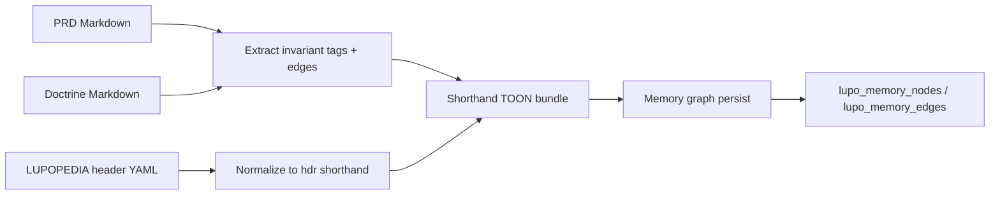

---
lupopedia.headers:
  header_format_version: "4.1.4"
  file_path_from_root: lupo-docs/prd/61_A_DOCTRINE_CONSOLIDATION_SHORTHAND_COMPILER.md
  web_path: "https://www.lupopedia.com/lupopedia/lupo-docs/prd/61_A_DOCTRINE_CONSOLIDATION_SHORTHAND_COMPILER.md"
  status: draft
  when_updated: "20260421223000"
  trust_tier: canonical
  questions_toon: null
  memory_toon: lupo-memory/development/canonical/1026/04/61_doctrine_consolidation_shorthand_compiler.toon
  atoms_toon: null
  transcript_jsonl: 0/development/61-doctrine-consolidation
  artifact_type: prd
  artifact_kind: specification
  channel_key: development
  federation_node_id: 0
  thread_id: null
  content_id: null
  content_parent_id: null
  default_collection_id: null
  lupopedia.schema: prd
  prd_cluster: 00_A_FORBIDDEN_AND_WHY_61_A_DOCTRINE_CONSOLIDATION_SHORTHAND_COMPILER
  title: "PRD 61: Doctrine Consolidation and Shorthand Compiler"
  summary: "Twelve cross-PRD invariants, canonical shorthand TOON shapes, IDE auto-patch rules, consolidation pipeline PRD/doctrine/header to TOON to memory graph, enforcement via guard stack PRDs 53/58/54/60."
---
# PRD 61: Doctrine Consolidation and Shorthand Compiler

## 1. Purpose

This PRD defines:

1. The **minimal invariant set** that **every** normative PRD and doctrine artifact **SHOULD** satisfy or explicitly defer (with rationale), so multi-agent tooling, validators, and memory exports **converge** without one-off prose drift.
2. A **canonical shorthand TOON** representation for compact exchange between humans, IDE agents, and `lupo-memory/` pipelines ??? **subordinate** to the full [**TOON Ordering Specification v1.0.0**](../doctrine/TOON_ORDERING_SPEC.md) and [**PRD 16**](../prd/16_lupopedia_headers.md) / [**PRD 38**](../prd/38_memory_unification.md).
3. **Auto-patch rules** for Cursor and other IDE facets when updating PRDs, TOON sidecars, and LUPOPEDIA HEADERS so batches stay **validator-clean** and **temporally anchored** ([`TICK_PY_DOCTRINE.md`](../doctrine/TICK_PY_DOCTRINE.md)).

**Non-goals:** Replacing full install SQL, full PRD prose, or the 25-line LUPOPEDIA header envelope for hand-authored files. Shorthand is for **summaries**, **graph mirrors**, and **agent context packs**, not for stripping required headers from shipped Markdown.

## 2. Required invariants (12 items)

Every new or materially revised **normative** PRD or doctrine file **SHOULD** either **satisfy** the invariant in prose or tables, or **state a scoped exception** (e.g. ???planning ??? no migrations???). IDE agents **MUST NOT** silently drop invariants from sibling documents.

| # | Invariant | Normative references |
|---|-----------|----------------------|
| 1 | **Violation codes** | Stable strings (`ACTOR_*`, `PROBE_BOUNDARY_VIOLATION`, ???) ??? [PRD 50 section 1.2](../prd/50_agent_coordination_protocol.md), [`AI_ACTOR_COMPETENCY_TEST_PATTERN.md`](../doctrine/AI_ACTOR_COMPETENCY_TEST_PATTERN.md), [`AI_ACTOR_PROBE_HARNESS_AND_GUARDS.md`](../doctrine/AI_ACTOR_PROBE_HARNESS_AND_GUARDS.md), [PRD 53](53_runtime_guard.md). |
| 2 | **Contract surfaces** | Input / output / violation / termination contracts for probes and collection handoffs ??? competency + harness doctrines, [PRD 50 sections 1.3???1.4](../prd/50_agent_coordination_protocol.md). |
| 3 | **Browser-tab prohibition** | Ambient open tabs / `edge_all_open_tabs` **MUST NOT** be normative instruction surface unless explicitly copied into the input contract ??? harness + competency doctrines, [PRD 50 section 1.4.7](../prd/50_agent_coordination_protocol.md). |
| 4 | **Deterministic ordering** | TOON and machine exports use **integer-indexed ordered arrays** ??? [`TOON_ORDERING_SPEC.md`](../doctrine/TOON_ORDERING_SPEC.md), [PRD 51 section 4.1.1](../prd/51_memory_graph_as_source_of_truth.md). |
| 5 | **Faucet identity enforcement** | IDE work **MUST** attribute **`actor_id`** to the actual facet (e.g. Cursor **102**, Antigravity **103**) ??? [`AGENT_REGISTRY.md`](../doctrine/AGENT_REGISTRY.md), [`IDENTITY_LAYERS_DOCTRINE.md`](../doctrine/IDENTITY_LAYERS_DOCTRINE.md), [`AGENTS.md`](../../AGENTS.md). |
| 6 | **Channel / thread validation** | Transcript and channel writes **MUST** carry valid **`channel_key`** and thread discipline ??? [PRD 16 section 7](../prd/16_lupopedia_headers.md), [PRD 50](../prd/50_agent_coordination_protocol.md), [PRD 02](../prd/02_channels_discussions.md). |
| 7 | **Collection-scoped reasoning** | When a collection payload is active, reasoning **MUST** stay inside ingested **nodes** unless examiner widens scope ??? [`collection_payload_format_v1_0_0.md`](../doctrine/collection_payload_format_v1_0_0.md), [PRD 50 section 1.4](../prd/50_agent_coordination_protocol.md). |
| 8 | **State-machine anchoring** | Complex protocols **SHOULD** include a normative state diagram or numbered state table (mermaid or prose) ??? [PRD 53](53_runtime_guard.md), [PRD 56](56_probe_harness_v2.md), [PRD 58](58_transcript_filter.md), harness/competency doctrines. |
| 9 | **Ingestion-mode awareness** | Distinguish **read-only** vs **read-write** persistence for collection/knowledge ingest ??? [PRD 50 section 1.4.1](../prd/50_agent_coordination_protocol.md), [PRD 38 section 18](../prd/38_memory_unification.md). |
| 10 | **Provenance-actor rule** | Edges and guard events **MUST** carry **`provenance_actor_id`** / **`provenance_tool`** per schema; **MUST NOT** spoof examinee id ??? [PRD 38](../prd/38_memory_unification.md), [PRD 53](53_runtime_guard.md). |
| 11 | **Doctrine graph edges** | Cross-file **`doctrine_rule`** (or equivalent) tables **SHOULD** be present for specs that participate in orchestration ??? e.g. [`collection_payload_format_v1_0_0.md`](../doctrine/collection_payload_format_v1_0_0.md), competency pattern, harness doctrine. |
| 12 | **Memory graph integration** | Durable audit/remediation **SHOULD** map to **`lupo_memory_nodes`** / **`lupo_memory_edges`** (node-to-node) ??? [PRD 38](../prd/38_memory_unification.md), [`AI_ACTOR_KNOWLEDGE_UPDATE_PROTOCOL.md`](../doctrine/AI_ACTOR_KNOWLEDGE_UPDATE_PROTOCOL.md). |

## 3. Shorthand TOON format

Shorthand is a **lossy-compressed** profile for **agent context** and **sidecar** rows. Full fidelity remains in **Markdown + LUPOPEDIA HEADERS** and install SQL. Shorthand **MUST** still obey [`TOON_ORDERING_SPEC.md`](../doctrine/TOON_ORDERING_SPEC.md): top-level ordered arrays, **`toon.version`**, **`toon.kind`**.

### 3.1 Minimal node

```yaml
toon.version: "1.0.0"
toon.kind: "memory"
nodes: [
  [0, "node_id", "prd_61_summary"],
  [1, "title", "Doctrine consolidation invariant checklist"],
  [2, "memory_key", "lupo-memory/development/canonical/1026/04/61-doctrine-consolidation-shorthand-compiler.toon"],
  [3, "trust_tier", "canonical"],
  [4, "invariant_tags", [
    [0, "violation_codes"],
    [1, "contract_surfaces"],
    [2, "browser_tab_prohibition"]
  ]]
]
```

### 3.2 Minimal edge

```yaml
toon.version: "1.0.0"
toon.kind: "memory"
edges: [
  [0, "from_node_id", "prd_61_summary"],
  [1, "to_path", "lupo-docs/prd/53_runtime_guard.md"],
  [2, "edge_type", "doctrine_rule"],
  [3, "relationship", "enforcement_runtime_guard"]
]
```

*(Persisted DB edges use **`from_memory_node_id`** / **`to_memory_node_id`**; shorthand **MAY** use path correlators only in export prelude, not as DDL.)*

### 3.3 Minimal header (shorthand envelope)

For **non-authoring** mirrors only (e.g. packed agent context). **MUST NOT** replace PRD 16???s 20-key file header for new hand-authored files.

```yaml
hdr: [
  [0, "file_path_from_root", "lupo-docs/prd/61_doctrine_consolidation_shorthand_compiler.md"],
  [1, "pk_id", 61],
  [2, "when_updated", "20260412121331"],
  [3, "federation_node_id", 0]
]
```

### 3.4 Minimal PRD summary

```yaml
toon.version: "1.0.0"
toon.kind: "other"
prd_shorthand: [
  [0, "pk_id", 61],
  [1, "slug", "61-doctrine-consolidation-shorthand-compiler"],
  [2, "title", "Doctrine Consolidation and Shorthand Compiler"],
  [3, "invariant_count", 12],
  [4, "enforcement_prds", "53,54,56,58,60"],
  [5, "status", "draft"]
]
```

## 4. Auto-patch rules (IDE agents)

These rules apply to **Cursor** and peer facets. They **MUST** align with workspace rules (headers mandatory, `tick.py`, no guessed UTC).

### 4.1 How Cursor updates PRDs

1. **Before edit:** Read the target PRD???s **Purpose** and **Related**; do not contradict constitutional PRDs ([PRD 00](../prd/00_root_constitutional_system_requirements.md)).
2. **Structural edits:** If adding probe/collection/guard semantics, **SHOULD** add or refresh **contract surfaces**, **violation codes**, and **doctrine graph** rows per section **2** above.
3. **After edit:** Run **`python lupo-bin/tick.py`** once per batch; set **`when_updated`** and **`last_modified_utc`** from **`python lupo-bin/echo_anchor_utc.py`** output.
4. **Validate:** **`python lupo-scripts/validate_lupopedia_headers_universal.py <path>`** ??? fix failures before commit.

### 4.2 How Cursor updates TOONs

1. **Authoritative shapes:** [`TOON_ORDERING_SPEC.md`](../doctrine/TOON_ORDERING_SPEC.md) ??? ordered arrays, integer indices.
2. **JSON master ??? TOON:** When the pipeline uses paired JSON + TOON under **`lupo-memory/`**, edit **`.json`** then run **`python lupo-scripts/json_to_toon.py --json <path>.json --toon <path>.toon`**.
3. **Do not** hand-edit generated `*.toon.json` table exports from live DB unless the generator is the source of truth for that file class.

### 4.3 How Cursor updates headers

1. **New files:** **`python lupo-scripts/add_lupopedia_header_to_file.py <path> [--create]`** or copy from [`TEMPLATES_NEW_FILE.md`](../doctrine/LUPOPEDIA_HEADERS/TEMPLATES_NEW_FILE.md).
2. **All 20 keys** in **PRD 16 section 4.2** order; use **`''`** or **`null`** only where allowed.
3. **`memory_key`** **MUST** point at the **`.toon`** path when a TOON export is claimed, not the JSON master alone ([PRD 16 section 5.2.2](../prd/16_lupopedia_headers.md)).

## 5. Consolidation pipeline

Logical flow for tooling (implementation may be split across Python/PHP services).



| Stage | Input | Output | Notes |
|-------|--------|--------|------|
| **PRD ??? TOON** | PRD body + header | `prd_shorthand` + optional `nodes`/`edges` | Lossy; preserves **pk_id**, **slugs**, **invariant_tags**. |
| **Doctrine ??? TOON** | Doctrine + graph table | `nodes`/`edges` arrays | Map **`doctrine_rule`** rows to shorthand **edges**. |
| **Header ??? TOON** | Front matter | `hdr` block | For agent packs only. |
| **TOON ??? memory graph** | Validated shorthand | DB rows | Use **IdGenerator** / allocators; **`owner_actor_id`** = ingesting actor ([PRD 38](../prd/38_memory_unification.md)). |

## 6. Enforcement

| Layer | PRD | Role |
|-------|-----|------|
| **Runtime guard** | [PRD 53](53_runtime_guard.md) | Detects invariant breaches (schema, scope, termination, self-grade). |
| **Transcript filter** | [PRD 58](58_transcript_filter.md) | Cleans and segments transcript for audit and compliance ingest. |
| **Compliance layer** | [PRD 54](54_actor_compliance.md) | Scores actors; states (compliant ??? probation, etc.). |
| **Scheduler** | [PRD 60](60_orchestrator_scheduler.md) | Routes tasks using compliance + context frames. |

**Probe packaging:** [PRD 56](56_probe_harness_v2.md). **Coordination surface:** [PRD 50](../prd/50_agent_coordination_protocol.md).

## 7. Normative documentation graph (outbound edges)

| From | To | `edge_type` | `relationship` |
|------|-----|-------------|----------------|
| `61_doctrine_consolidation_shorthand_compiler.md` | `lupo-docs/doctrine/TOON_ORDERING_SPEC.md` | `doctrine_rule` | `ordered_array_shape` |
| `61_doctrine_consolidation_shorthand_compiler.md` | `lupo-docs/prd/16_lupopedia_headers.md` | `doctrine_rule` | `header_envelope` |
| `61_doctrine_consolidation_shorthand_compiler.md` | `lupo-docs/prd/38_memory_unification.md` | `doctrine_rule` | `memory_graph_target` |
| `61_doctrine_consolidation_shorthand_compiler.md` | `lupo-docs/prd/50_agent_coordination_protocol.md` | `doctrine_rule` | `coordination_invariants` |
| `61_doctrine_consolidation_shorthand_compiler.md` | `lupo-docs/prd/53_runtime_guard.md` | `doctrine_rule` | `enforcement_guard` |
| `61_doctrine_consolidation_shorthand_compiler.md` | `lupo-docs/prd/58_transcript_filter.md` | `doctrine_rule` | `enforcement_filter` |
| `61_doctrine_consolidation_shorthand_compiler.md` | `lupo-docs/prd/54_actor_compliance.md` | `doctrine_rule` | `enforcement_compliance` |
| `61_doctrine_consolidation_shorthand_compiler.md` | `lupo-docs/prd/60_orchestrator_scheduler.md` | `doctrine_rule` | `enforcement_scheduler` |
| `61_doctrine_consolidation_shorthand_compiler.md` | `lupo-docs/doctrine/AI_ACTOR_PROBE_HARNESS_AND_GUARDS.md` | `doctrine_rule` | `harness_doctrine_mirror` |
| `61_doctrine_consolidation_shorthand_compiler.md` | `lupo-docs/doctrine/VALIDATION_PATTERNS.md` | `doctrine_rule` | `validation_index_mirror` |

## 8. Related

- [`AI_ACTOR_COMPETENCY_TEST_PATTERN.md`](../doctrine/AI_ACTOR_COMPETENCY_TEST_PATTERN.md), [`AI_ACTOR_PROBE_HARNESS_AND_GUARDS.md`](../doctrine/AI_ACTOR_PROBE_HARNESS_AND_GUARDS.md), [`AGENT_ORCHESTRATION.md`](../doctrine/AGENT_ORCHESTRATION.md), [`VALIDATION_PATTERNS.md`](../doctrine/VALIDATION_PATTERNS.md).
- [PRD 51](../prd/51_memory_graph_as_source_of_truth.md), [PRD 52](../prd/52_memory_graph_focus_manifest.md) (focus manifest vs guard stack).

---

This output complies with Lupopedia Constitutional Root Rules.
