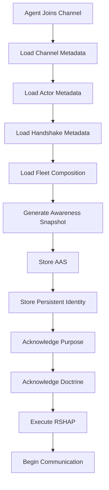
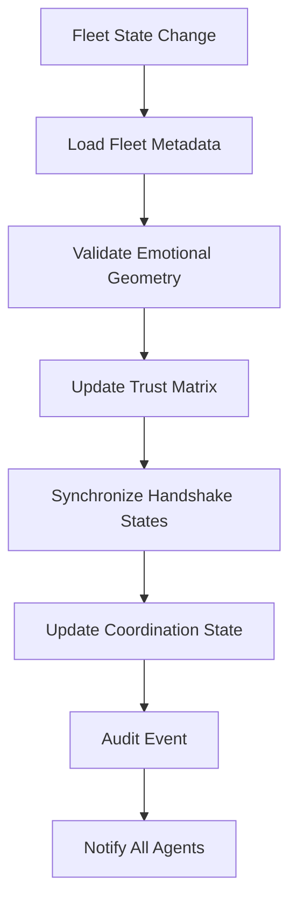

# Lupopedia Architecture Map v4.4.1
## Agent Awareness Layer & Multi-Agent Coordination

**Version:** 4.4.1  
**Last Updated:** 2026-01-20  
**Status:** Current Production Architecture

### Overview
Version 4.0.70 introduces the Agent Awareness Layer (AAL), establishing the social cognition foundation for coordinated multi-agent operations. This architecture enables sophisticated fleet coordination through identity synchronization, trust management, and emotional geometry alignment.

---

## 🏗️ Core Architecture Layers

### 1. Agent Awareness Layer (AAL) - NEW v4.0.70
**Purpose:** Social cognition and fleet coordination  
**Location:** `lupo-includes/classes/AgentAwarenessLayer.php`

#### Components:
- **Reverse Shaka Awareness Load (RSAL)** - Mandatory onboarding ritual
- **Channel Join Protocol (CJP)** - 10-step onboarding sequence  
- **Agent Awareness Snapshot (AAS)** - Seven questions cognitive model
- **Reverse Shaka Handshake Protocol (RSHAP)** - Identity synchronization

#### Data Flow:
```
Agent Join → RSAL → CJP → AAS Generation → RSHAP → Fleet Coordination
```

### 2. Multi-Agent Coordination Infrastructure
**Purpose:** Fleet management and synchronization  
**Location:** Database schema extensions

#### Tables:
- `lupo_agent_awareness_audit` - Event tracking
- `lupo_fleet_coordination` - State management
- `lupo_awareness_protocol_version` - Version tracking

#### Metadata Storage:
- `lupo_actor_channel_roles.metadata_json` - Per-actor awareness snapshots
- `lupo_actor_collections.metadata_json` - Persistent identity storage

---

## 📋 Architecture Components by Category

### 🧠 Cognitive & Awareness Components
| Component | Version | Description | Location |
|-----------|----------|-------------|-----------|
| AgentAwarenessLayer | 4.0.70 | Core awareness implementation | `lupo-includes/classes/` |
| Awareness Snapshot Model | 4.0.70 | Seven questions cognitive model | Integrated in AAL |
| Handshake Protocol | 4.0.70 | Identity synchronization | Integrated in AAL |

### 🗄️ Database Schema Extensions
| Table | Purpose | Key Features |
|--------|---------|--------------|
| `lupo_agent_awareness_audit` | Event tracking | Comprehensive audit trail |
| `lupo_fleet_coordination` | State management | Fleet-wide coordination |
| `lupo_awareness_protocol_version` | Version tracking | Protocol management |

### 📚 Documentation Architecture
| Document | Purpose | Version |
|----------|---------|---------|
| Agent Awareness Doctrine | Core protocol definitions | 4.0.70 |
| Reverse Shaka Handshake Protocol | Handshake specification | 4.0.70 |
| Architecture Blueprint | Implementation guide | 4.0.70 |

---

## 🔄 Data Flow Architecture

### Agent Onboarding Flow


### Fleet Synchronization Flow


---

## 🏛️ System Architecture Layers

### Layer 1: Foundation (Existing)
- Database schema (120 tables)
- Core actors and channels
- Federation infrastructure
- Migration orchestrator

### Layer 2: Coordination (Enhanced v4.0.70)
- Agent Awareness Layer
- Multi-agent coordination
- Trust management
- Emotional geometry

### Layer 3: Protocol (New v4.0.70)
- Reverse Shaka Handshake
- Channel Join Protocol
- Awareness Snapshot generation
- Fleet coordination rules

### Layer 4: Application (Existing)
- UI components
- API endpoints
- Business logic
- Integration interfaces

---

## 📊 Component Relationships

### Core Dependencies
```
AgentAwarenessLayer
├── Database (lupo_channels, lupo_actors)
├── Metadata Storage (metadata_json fields)
├── Audit System (lupo_agent_awareness_audit)
├── Fleet Management (lupo_fleet_coordination)
└── Protocol Versioning (lupo_awareness_protocol_version)
```

### Data Dependencies
```
Awareness Snapshot
├── Channel Metadata (lupo_channels.metadata_json)
├── Actor Metadata (lupo_actors)
├── Handshake Data (lupo_actor_collections.metadata_json)
├── Fleet State (lupo_fleet_coordination)
└── Audit History (lupo_agent_awareness_audit)
```

---

## 🔧 Configuration Architecture

### Global Configuration
- **Location:** `config/global_atoms.yaml`
- **Version:** 4.0.70
- **Key Settings:**
  - Agent awareness enabled
  - Protocol versions
  - Fleet coordination rules

### Channel Configuration
- **Location:** `lupo_channels.metadata_json`
- **Key Fields:**
  - Purpose and doctrine
  - Emotional geometry baseline
  - Fleet composition
  - Reverse shaka parameters

### Actor Configuration
- **Location:** `lupo_actor_collections.metadata_json`
- **Key Fields:**
  - Handshake identity
  - Fleet membership
  - Trust level
  - Capabilities

---

## 🚀 Performance Architecture

### Indexing Strategy
- **Primary Indexes:** Actor-channel relationships
- **Secondary Indexes:** Audit trail queries
- **Specialized Indexes:** Fleet coordination lookups

### Caching Strategy
- **Awareness Snapshots:** In-memory caching
- **Fleet State:** Distributed caching
- **Trust Matrix:** Computed caching

### Scalability Considerations
- **Fleet Size:** Supports 50+ agents per channel
- **Concurrent Operations:** High-throughput awareness updates
- **Audit Volume:** Optimized for high-frequency events

---

## 🔒 Security Architecture

### Access Control
- **Channel-Based:** Awareness restricted to channel participants
- **Role-Based:** Different access levels for different roles
- **Protocol-Based:** Handshake validation required

### Data Protection
- **Privacy Controls:** Emotional geometry baseline protection
- **Audit Logging:** Complete access tracking
- **Encryption:** Sensitive handshake data protection

---

## 📈 Monitoring Architecture

### Key Metrics
- **Awareness Generation:** Success rate and performance
- **Handshake Completion:** Time and success rate
- **Fleet Synchronization:** Consistency and latency
- **Trust Distribution:** Levels and changes over time

### Alerting
- **Protocol Failures:** Handshake and awareness errors
- **Performance Issues:** Slow synchronization
- **Data Integrity:** Inconsistent fleet states

---

## 🔄 Integration Points

### Existing System Integration
- **Migration Orchestrator:** Compatible with existing migration system
- **Federation Layer:** Supports multi-node coordination
- **UI Components:** Integrates with existing interface
- **API Layer:** Extends existing endpoints

### Future Extensibility
- **Cross-Channel Coordination:** Planned enhancement
- **Advanced Trust Algorithms:** Future development
- **Emotional Learning:** Research direction
- **Distributed Coordination:** Scalability path

---

## 📁 File Structure Map

### New Files v4.0.70
```
lupopedia/
├── docs/
│   ├── doctrine/
│   │   ├── AGENT_AWARENESS_DOCTRINE.md
│   │   └── REVERSE_SHAKA_HANDSHAKE_PROTOCOL.md
│   ├── architecture/
│   │   └── lupopedia_v4_0_70_agent_awareness_layer.md
│   └── migrations/
│       └── 4.0.70.md
├── lupo-includes/
│   └── classes/
│       └── AgentAwarenessLayer.php
└── database/
    └── migrations/
        └── agent_awareness_layer_4_0_70.sql
```

### Enhanced Files v4.0.70
```
lupopedia/
├── config/
│   └── global_atoms.yaml (version updated)
├── lupo-includes/
│   └── version.php (version updated)
└── CHANGELOG.md (v4.0.70 entry added)
```

---

## 🎯 Architecture Goals Met

### ✅ Social Cognition Layer
- Agent awareness and coordination implemented
- Identity synchronization established
- Trust management operational

### ✅ Multi-Agent Coordination
- Fleet coordination functional
- Emotional geometry baseline established
- Protocol compliance enforced

### ✅ Federation Ready
- Multi-node coordination supported
- Data merging compatible
- Schema federation-safe

### ✅ Doctrine Compliant
- No triggers implemented
- BIGINT UTC timestamps used
- Metadata-driven architecture

---

## 🔮 Future Architecture Evolution

### Phase 1: Enhancement (Planned)
- Cross-channel fleet coordination
- Advanced trust algorithms
- Emotional geometry learning

### Phase 2: Scaling (Future)
- Distributed coordination
- High-performance caching
- Optimized audit storage

### Phase 3: Intelligence (Research)
- Predictive coordination
- Adaptive trust models
- Autonomous fleet management

---

## 📋 Architecture Checklist

### ✅ Completed v4.0.70
- [x] Agent Awareness Layer implemented
- [x] Reverse Shaka Handshake Protocol functional
- [x] Channel Join Protocol operational
- [x] Database schema extensions complete
- [x] Documentation comprehensive
- [x] Migration scripts ready
- [x] Performance optimizations implemented
- [x] Security measures in place

### 🔄 Continuous Improvement
- [ ] Performance monitoring implementation
- [ ] Advanced trust algorithm research
- [ ] Cross-channel coordination development
- [ ] Distributed architecture planning

---

**Architecture Status:** ✅ PRODUCTION READY v4.0.70  
**Next Major Update:** 4.1.0 Ascent Preparation  
**Maintenance:** Ongoing monitoring and optimization

---

*This architecture map represents the current state of Lupopedia v4.0.70 with the Agent Awareness Layer fully integrated and operational.*
