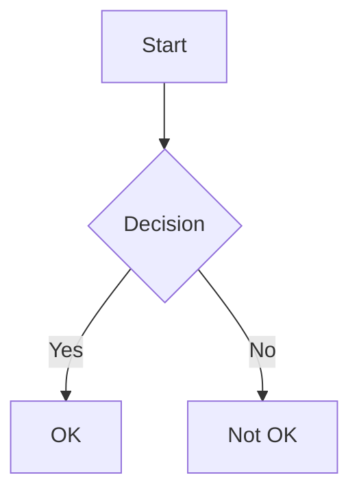

# 📝 Lupopedia Documentation Style Guide

This guide establishes the writing and formatting standards for all Lupopedia documentation.

## 📚 Document Structure

### Header Levels
```markdown
# Document Title (h1) - Title Case, Emoji, One #
## Section (h2) - Title Case
### Subsection (h3) - Sentence case
#### Detail Section (h4) - Sentence case, use sparingly
```

### Required Sections
Each document should include:

```markdown
# Document Title
[Optional brief description]

## Overview
[What this document covers]

## [Main Content Sections]
[Organized logically]

## Related Documentation
- **[Documentation Doctrine](../../doctrine/DOCUMENTATION_DOCTRINE.md)** - Core principles: documentation is software, data, for machines
- **[WOLFIE Header Specification](../../agents/WOLFIE_HEADER_SPECIFICATION.md)** - Required metadata format for all documentation files
- **[Inline Dialog Specification](../../dialogs/agents/INLINE_DIALOG_SPECIFICATION.md)** - Communication format for multi-agent coordination in documentation
- **[Contributor Training](CONTRIBUTOR_TRAINING.md)** - Standards and requirements for documentation contributors
- **[Terminology](../../appendix/appendix/TERMINOLOGY.md)** - Standard terminology and definitions referenced in this guide

---
*Last updated: YYYY-MM-DD*
```

## ✍️ Writing Style

### Voice and Tone
- Use **second person** ("you") for user documentation
- Use **active voice** ("Click the button" not "The button should be clicked")
- Be **concise but thorough**
- Write for **global English** speakers

### Terminology
- Use terms consistently as defined in [TERMINOLOGY.md](../TERMINOLOGY.md)
- **Bold** key terms on first use
- Use `code font` for:
  - File paths: `docs/ARCHITECTURE.md`
  - Commands: `npm install`
  - Code references: `class Database`
  - UI elements: Click **Save**

## 🎨 Formatting

### Text Formatting
- **Bold** for UI elements and important concepts
- *Italics* for emphasis (use sparingly)
- `Code` for technical terms, commands, and file paths
- > Blockquotes for notes, warnings, and tips

### Lists
Use hyphens for unordered lists:
```markdown
- First item
- Second item
  - Nested item
```

Use numbered lists for steps:
```markdown
1. First step
2. Second step
   1. Sub-step
```

### Tables
```markdown
| Header 1 | Header 2 |
|----------|----------|
| Data 1   | Data 2   |
```

### Code Blocks
Use fenced code blocks with language specification:
````markdown
```php
// PHP example
function example() {
    return 'Hello';
}
```

```sql
-- SQL example
SELECT * FROM users WHERE active = 1;
```
````

### Icons
Use emoji icons consistently:
- ℹ️ General information
- ⚠️ Warnings and important notes
- ✅ Success/Completed items
- ❌ Errors/Don't do this
- 🔒 Security-related content
- 🚀 Performance tips

## 🖼️ Images and Diagrams

### File Naming
Format: `purpose_description.ext` (e.g., `architecture_overview.png`)

### Alt Text
```markdown

```

### Mermaid Diagrams
Use Mermaid for flowcharts and diagrams:
````markdown

````

## 🔗 Links

### Internal Links
```markdown
[Link text](relative/path/to/file.md#section-id)
```

### External Links
```markdown
[Link text](https://example.com)
```

## 📅 Versioning
- Include version information in the document footer
- Update the "Last updated" date when making changes
- Use semantic versioning for API references

## ✅ Review Checklist
- [ ] Spelling and grammar checked
- [ ] All links verified
- [ ] Code examples tested
- [ ] Screenshots up-to-date
- [ ] Version numbers updated
- [ ] Related documentation cross-linked

---
*Last updated: 2025-01-04*
