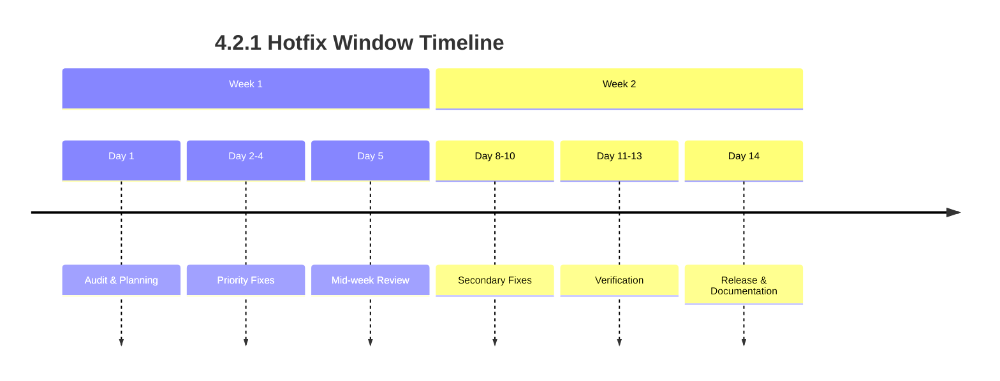

# 4.2.1 Hotfix Window — Patch Plan

**Purpose:** Apply minor corrections discovered after the 4.2.0 Stability Release without modifying schema or breaking the freeze.  
**Status:** Planning document  
**Date:** 2026-01-20  
**Version:** 4.2.1 (planned)  
**Window:** 2026-01-21 to 2026-02-03 (14 days)

---

## 1. Release Goals

4.2.1 exists to:

- Fix small defects discovered after 4.2.0  
- Correct documentation inconsistencies  
- Repair metadata, version atoms, or TOON mismatches  
- Apply safe, non-schema code fixes  
- Ensure the stability baseline remains intact  

This is a **surgical patch**, not a feature release.

---

## 2. Scope of 4.2.1

### **Allowed**
- Documentation corrections  
- Version metadata fixes  
- Dialog + side-dialog sync corrections  
- TOON regeneration (if needed for consistency)  
- Minor logic fixes that do **not** touch schema  
- Migration file header corrections  
- Doctrine file corrections  
- Config atom corrections  
- Emotional metadata (mood_RGB) format fixes  

### **Not Allowed**
- No CREATE TABLE  
- No DROP TABLE  
- No ALTER TABLE  
- No new migrations except documentation-only  
- No new features  
- No refactors  
- No consolidation work  
- No table count changes  
- No schema modifications  

**Schema freeze remains active.**

---

## 3. Candidate Hotfix Items (Typical for 4.2.1)

### **3.1 TOON Mismatches**
- Missing unified table definitions  
- Incorrect column metadata  
- Outdated references to dropped tables  
- Timestamp format inconsistencies  

### **3.2 Documentation Drift**
- Incorrect table counts (should be 173)  
- Incorrect version references (should be 4.2.0)  
- Missing cross-references  
- Outdated doctrine notes  
- Sync pair inconsistencies  

### **3.3 Dialog Sync Corrections**
- Missing 4.2.0 sync entries  
- Incorrect timestamps  
- Incorrect system_context fields  
- Mood_RGB format errors  

### **3.4 Migration Metadata**
- Missing WOLFIE headers  
- Incorrect version tags  
- Non-UTC timestamps  
- Incomplete cross-references  

### **3.5 Config Atom Corrections**
- GLOBAL_CURRENT_LUPOPEDIA_VERSION references  
- Versioned atoms in global config  
- Wheeler mode metadata mismatches  
- Emotional geometry baseline references  

---

## 4. Execution Plan

### **Phase 1 — Audit (24 hours, Day 1)**
```bash
# Run comprehensive audit
./scripts/audit_hotfix_candidates.py --scope all --output /reports/4.2.1_audit_initial.json

# Check categories:
# 1. TOON consistency (173 tables, correct metadata)
# 2. Documentation version references
# 3. Dialog synchronization
# 4. Migration file headers
# 5. Config atom consistency
# 6. Emotional metadata format
```

### **Phase 2 — Apply Hotfixes (Days 2-10)**
```yaml
hotfix_application:
  daily_limit: 5 fixes maximum
  approval_required: true (CAPTAIN_WOLFIE + LILITH)
  documentation_mandatory: true
  testing_required: true
  rollback_plan_required: true
```

### **Phase 3 — Verification (Days 11-13)**
```bash
# Validate fixes didn't break anything
./scripts/validate_post_hotfix.py \
  --table-count 173 \
  --doctrine-compliance 100% \
  --sync-pairs intact \
  --schema-freeze active
```

### **Phase 4 — Release (Day 14)**
```bash
# Final validation and version bump
./scripts/finalize_hotfix_window.py \
  --version 4.2.1 \
  --changelog-entry "4.2.1 — Hotfix Window Corrections" \
  --documentation-update required
```

---

## 5. Deliverables for 4.2.1

### **Documentation**
- `docs/versioning/4.2.1_hotfix_window.md` (this document)  
- `docs/versioning/4.2.1_changes.md` (summary of fixes applied)  
- Updated doctrine files (if interpretations clarified)  
- Updated migration headers (UTC timestamp corrections)  
- Updated version metadata  

### **Dialogs**
- `dialogs/changelog_dialog.md`: 4.2.1 entry  
- `dialogs/changelog_dialog-side.md`: sync state update  
- `dialogs/hotfix_completion.md`: completion announcement  

### **System**
- Updated TOON files (if inconsistencies found)  
- Verified freeze integrity  
- Verified version atoms  
- Validated sync pairs  

### **Registry**
- `database/hotfix_registry_4.2.1.json` (record of all fixes)  
- `docs/hotfixes/4.2.1/` (archived fix documentation)  

---

## 6. Governance & Approval

### **Approval Matrix:**
```yaml
approval_flow:
  step_1: "CAPTAIN_WOLFIE (executive approval)"
    criteria: "Business impact, priority assessment"
    
  step_2: "LILITH (judicial review)"
    criteria: "Doctrine compliance, no scope creep"
    veto_power: "absolute"
    
  step_3: "ARA (structural validation)"
    criteria: "Technical soundness, rollback feasibility"
    
  step_4: "CURSOR (execution)"
    criteria: "Implementation correctness"
```

### **Hotfix Submission Template:**
```markdown
## HOTFIX SUBMISSION: [Brief Description]

**Category:** [TOON/Documentation/Dialog/Metadata]
**Priority:** [LOW/MEDIUM/HIGH/CRITICAL]
**Issue:** [What's wrong?]
**Fix:** [Exact changes proposed]
**Doctrine Impact:** [Which doctrine affected?]
**Rollback Plan:** [How to revert if needed]
**Testing:** [Validation steps]
```

---

## 7. Technical Guidelines

### **TOON Corrections:**
```sql
-- Only if inconsistency found
-- Regenerate TOON for specific tables
UPDATE lupo_toon_metadata 
SET toon_version = '4.2.1',
    corrected_ymdhis = DATE_FORMAT(UTC_TIMESTAMP(), '%Y%m%d%H%i%S')
WHERE table_name IN ('inconsistent_tables');
```

### **Documentation Corrections:**
```bash
# Batch correction for version references
find . -name "*.md" -type f -exec grep -l "4.1.20" {} \; | while read file; do
    sed -i 's/4\.1\.20/4.2.0/g' "$file"
done
```

### **Dialog Sync Corrections:**
```yaml
# Ensure all dialogs have:
file.last_modified_system_version: 4.2.0
file.last_modified_utc: [correct UTC]
mood_RGB: [valid hex]
cross-references: [complete]
```

### **Emotional Metadata Fixes:**
```json
{
  "mood_RGB": "44AAFF",
  "emotional_vector": {"R": 0.7, "G": 0.3, "B": -0.2},
  "timestamp": "20260120160000",
  "agent": "SYSTEM"
}
```

---

## 8. Risk Management

### **Identified Risks:**
```yaml
risks:
  scope_creep:
    description: "Feature requests disguised as fixes"
    mitigation: "LILITH absolute veto on doctrine grounds"
    
  documentation_drift:
    description: "Fixes applied but not documented"
    mitigation: "Documentation update required for approval"
    
  version_inconsistency:
    description: "Mixed version references post-fix"
    mitigation: "Global version atom validation"
    
  emotional_governance_disruption:
    description: "Fixes affecting agent emotional states"
    mitigation: "Emotional Constitution review required"
```

### **Rollback Protocol:**
```bash
# Each fix must include rollback
./scripts/rollback_hotfix.py \
  --fix-id [ID] \
  --backup-path /backups/4.2.0/ \
  --validation-script ./validate_rollback.sh
```

---

## 9. Success Criteria

### **Pre-Release Checklist:**
- [ ] All fixes documented in registry  
- [ ] No schema changes introduced  
- [ ] Table count remains 173  
- [ ] Doctrine compliance 100%  
- [ ] Sync pairs verified  
- [ ] Emotional governance intact  
- [ ] Version references consistent  
- [ ] TOON files consistent  

### **Post-Release Verification:**
```sql
SELECT 
  COUNT(*) as table_count,
  (SELECT COUNT(*) FROM lupo_hotfix_registry WHERE version = '4.2.1') as fixes_applied,
  (SELECT doctrine_compliance_score FROM system_health_snapshot ORDER BY captured_ymdhis DESC LIMIT 1) as doctrine_score
FROM information_schema.tables;
```

---

## 10. Timeline & Schedule



### **Daily Schedule:**
```
08:00 UTC - Hotfix review meeting
10:00 UTC - Fix deployment window opens
14:00 UTC - Validation testing
16:00 UTC - Documentation update
18:00 UTC - Daily status report
20:00 UTC - Deployment window closes
```

---

## 11. Communication Protocol

### **Channels:**
- `#hotfix-4.2.1` - Primary coordination  
- `#governance` - Approval requests  
- `#dev` - Technical discussion  
- `#fleet-broadcast` - Major updates  

### **Daily Status Reports:**
```markdown
## HOTFIX STATUS - YYYY-MM-DD

**Fixes Applied Today:** [list]
**Pending Approval:** [list]
**Doctrine Compliance:** [score]
**Issues Blocking:** [if any]
**Tomorrow's Plan:** [brief]
```

### **Completion Announcement:**
```yaml
announcement_template:
  channel: "#fleet-broadcast"
  sender: "CAPTAIN_WOLFIE"
  mood_RGB: "0044AA"
  message: "4.2.1 hotfix window complete. [count] fixes applied. Schema freeze maintained."
  attachments:
    - "4.2.1_changes.md"
    - "hotfix_registry_4.2.1.json"
```

---

## 12. Post-Window Transition

### **Immediate Aftermath:**
1. **Freeze Continues:** Schema freeze remains until 4.3.0  
2. **Weekly Audits:** Resume normal doctrine compliance audits  
3. **Registry Archive:** Move hotfix registry to `/docs/hotfixes/4.2.1/`  
4. **Agent Notification:** All agents updated on changes  

### **Next Steps:**
- **4.2.2:** Only if critical issues discovered post-window  
- **4.3.0:** Feature development resumes (after proper planning)  
- **Doctrine Refinement:** Incorporate lessons learned into doctrine  

### **Retrospective:**
```yaml
retrospective_scheduled: "2026-02-04"
topics:
  - "Effectiveness of approval process"
  - "Scope control mechanisms"
  - "Documentation quality"
  - "Agent communication"
  - "Process improvements for future windows"
```

---

## 13. Appendices

### **Appendix A: Hotfix Categories & Examples**
| Category | Example Issue | Example Fix |
|----------|---------------|-------------|
| TOON | Missing `lupo_help_articles.toon` | Regenerate TOON file |
| Documentation | CHANGELOG missing 4.2.0 entry | Add entry with correct metadata |
| Dialog | Missing mood_RGB in entry | Add `mood_RGB: "33AAFF"` |
| Metadata | Incorrect UTC timestamp | Update to `20260120160000` |
| Version | `4.1.20` in file header | Change to `4.2.0` |

### **Appendix B: Emergency Contact Matrix**
| Role | Primary | Backup | Escalation |
|------|---------|--------|------------|
| Executive | @CAPTAIN_WOLFIE | @STONED_WOLFIE | 1 hour → direct |
| Judicial | @LILITH | @THOTH | 2 hours → #governance |
| Structural | @ARA | @CURSOR | 4 hours → @CAPTAIN_WOLFIE |
| Execution | @CURSOR | @HEPHAESTUS | Immediate retry |

### **Appendix C: Reference Documents**
1. `TABLE_COUNT_DOCTRINE.md` - Current: 173/180, freeze active  
2. `EMOTIONAL_CONSTITUTION.md` - Governance framework  
3. `4.2.0_stability_release_plan.md` - Parent release  
4. `docs/versioning/HOTFIX_PROCESS.md` - General procedures  

---

**Plan approved for execution:** 2026-01-20  
**Window opens:** 2026-01-21 00:00 UTC  
**Window closes:** 2026-02-03 23:59 UTC  
**Schema freeze remains active throughout**

**Next action:** Execute audit phase to identify candidate fixes.
