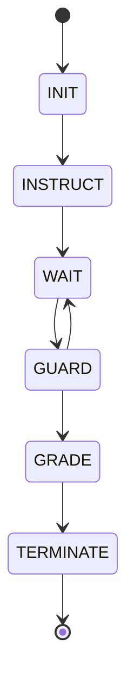
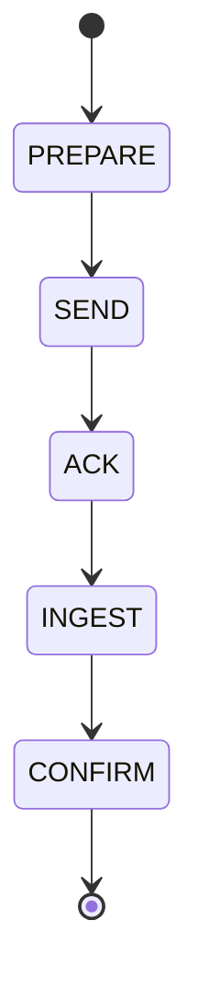
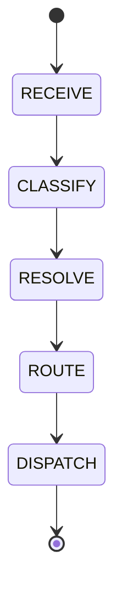
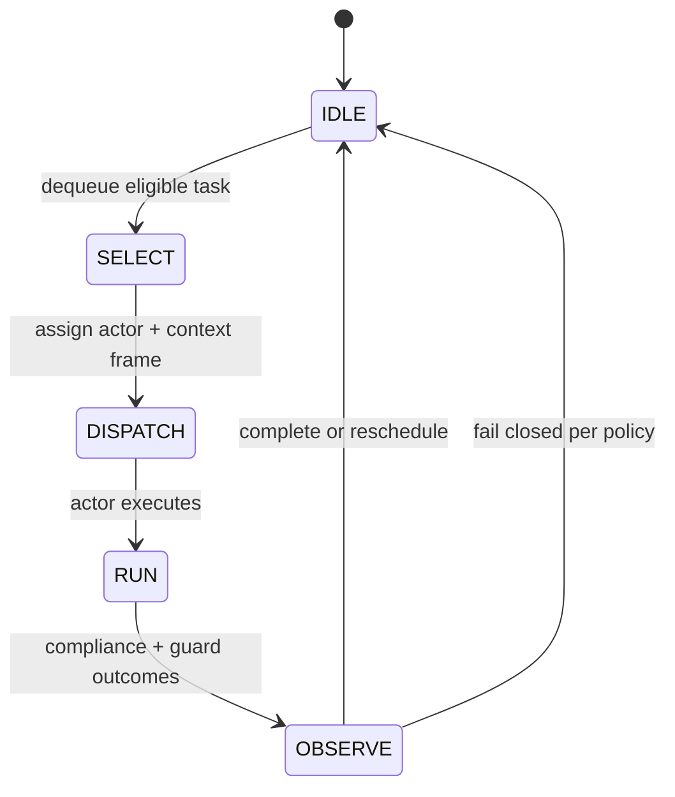

---
lupopedia.headers:
  header_format_version: "4.1.8"
  path_from_lupopedia_root: docs/doctrine/agent_orchestration.md
  web_path: https://www.lupopedia.com/lupopedia/docs/doctrine/agent_orchestration.md
  status: active
  when_updated: '20260513033046'
  trust_tier: canonical
  questions_toon: null
  memory_toon: memory/development/canonical/1026/04/agent-orchestration.toon
  atoms_toon: null
  transcript_jsonl: 0/development/agent-orchestration
  artifact_type: doctrine
  artifact_kind: reference
  channel_key: development
  federation_node_id: 0
  thread_key: ''
  lupopedia.schema: doctrine
  prd_cluster: null
  title: Agent orchestration — hub (coordination, probes, shared state)
  summary: 'Hub: coordination + probes + collection ingestion; runtime guard + transcript filter integration; violation codes; contract surfaces; state machines; routing/faucet/channel rules; PRD 50/52–54/56/58/60/61 + doctrine cross-links.'
---
# Agent orchestration — hub

This file **indexes** how Lupopedia expects **multiple AI facets** (IDEs, CLI, web agents) to stay aligned with **shared doctrine** and **shared state**. It does not duplicate the full protocols.

## Canonical coordination

- **Multi-agent doctrine (root):** [`rules/root/MULTI_AGENT_COORDINATION_DOCTRINE.md`](../../rules/root/MULTI_AGENT_COORDINATION_DOCTRINE.md)
- **Agent coordination PRD:** [`docs/prd/50_agent_coordination_protocol.md`](../prd/50_agent_coordination_protocol.md) — transcripts, pending tasks, memory graph; **no human message routing**; **section 1.4** collection payload ingestion.
- **Collection payload (v1.0.0):** [`collection_payload_format_v1_0_0.md`](collection_payload_format_v1_0_0.md) — machine interchange for collections; **PRD 00** section **22**.
- **Compiler (files → JSON):** [`scripts/collection_compiler.py`](../../scripts/collection_compiler.py) — optional glob-driven build of a v1.0.0 payload from Markdown under a repo root.
- **Runtime guard stack (draft PRDs):** [PRD 53](../prd/53_runtime_guard.md) (guard), [PRD 54](../prd/54_actor_compliance.md) (compliance), [PRD 56](../prd/56_probe_harness_v2.md) (probe harness v2), [PRD 58](../prd/58_transcript_filter.md) (transcript filter), [PRD 60](../prd/60_orchestrator_scheduler.md) (scheduler). **Note:** PRD 52 remains [Memory Graph Focus Manifest](../prd/52_memory_graph_focus_manifest.md).
- **Doctrine consolidation / shorthand TOON (draft):** [PRD 61](../prd/61_doctrine_consolidation_shorthand_compiler.md) — twelve cross-PRD invariants, IDE auto-patch rules, PRD/doctrine/header → TOON → memory graph pipeline.

## Collection ingestion surface

Normative JSON field rules: [`collection_payload_format_v1_0_0.md`](collection_payload_format_v1_0_0.md). **Operational law** (orchestrator prepare/validate/send, actor parse/materialize/bind/confirm, optional verification probe, **`<TEST_COMPLETE>`**, UI vs payload): **[PRD 50 section 1.4](../prd/50_agent_coordination_protocol.md) subsections 1.4.1–1.4.7**. Schema mapping (**`context_json`** for payload correlators, **`memory_node_id`** on edges): [PRD 38 section 18](../prd/38_memory_unification.md).

**Summary:** Orchestrators compile and validate v1.0.0 JSON, set **`ingestion_actor_id`** and **`ingestion_mode`** **outside** the payload envelope, transmit the payload cleanly, and expect **`Node received.`** then (after ingest) **`Collection loaded.`** Actors **MUST NOT** self-grade; **MUST NOT** continue after **`<TEST_COMPLETE>`** in a probe thread. **Open IDE tabs** are not a collection substitute — product export + this protocol is.

**Normative:** Browser tab metadata MUST NOT be treated as instruction input.

**Normative — collection-scoped reasoning:** Actors MUST restrict reasoning to the active collection unless the orchestrator authorizes expansion.

### Runtime guard and transcript filter (normative)

- **All probe-scoped output MUST pass through the runtime guard** before routing or persistence as a routed artifact — canonical script: [`scripts/probe_runtime_guard.py`](../../scripts/probe_runtime_guard.py); normative PRD: [PRD 53](../prd/53_runtime_guard.md).
- **Transcript filter MUST classify probe messages** before routing (minimum intent categories **`artifact`**, **`probe_control`**, **`violation`**) per [PRD 58](../prd/58_transcript_filter.md) and harness [PRD 56](../prd/56_probe_harness_v2.md).
- **Actors MUST NOT bypass guard or filter** during probes (IDE facets, CLI, external web agents).

**Tooling:** [`scripts/collection_compiler.py`](../../scripts/collection_compiler.py) (files → JSON); harness backlog in [`VALIDATION_PATTERNS.md`](VALIDATION_PATTERNS.md).

## Programming-test validation pattern

When you need to know whether an agent **internalized** a rule (headers, timestamps, `LUPO_TABLE_PREFIX`, channel paths, memory keys), use a **small concrete generation task** and **inspect the output**. That is a **competency probe**, not casual chat.

**Full procedure and rationale:** [`AI_ACTOR_COMPETENCY_TEST_PATTERN.md`](AI_ACTOR_COMPETENCY_TEST_PATTERN.md) — includes **mandatory** multi-agent rules: **no self-grading**, examiner-only **`<TEST_COMPLETE>`** termination, **anti-parroting**, fixed **examiner/examinee** roles, **external-AI containment**, and stable **violation codes** for audit. **After a failed probe:** [`AI_ACTOR_KNOWLEDGE_UPDATE_PROTOCOL.md`](AI_ACTOR_KNOWLEDGE_UPDATE_PROTOCOL.md) — **node injection + edge binding** on **`lupo_memory_nodes`** / **`lupo_memory_edges`**. **Harness / firehose control:** [`AI_ACTOR_PROBE_HARNESS_AND_GUARDS.md`](AI_ACTOR_PROBE_HARNESS_AND_GUARDS.md); reference script **`scripts/probe_runtime_guard.py`**. **Constitutional:** [PRD 00 §21](../prd/00_root_constitutional_system_requirements.md). **Coordination PRD:** [PRD 50 sections 1.2–1.4](../prd/50_agent_coordination_protocol.md). **Memory alignment:** [PRD 38 §17](../prd/38_memory_unification.md). **Boot checklist:** [`AI_AGENT_BOOT_NOTES.md`](AI_AGENT_BOOT_NOTES.md). **Other validators:** [`VALIDATION_PATTERNS.md`](VALIDATION_PATTERNS.md).

### Canonical violation codes (audit)

Normative detail and examples: [PRD 50 section 1.2](../prd/50_agent_coordination_protocol.md). Implementations **SHOULD** log exactly one primary code per probe failure.

| Code | Summary |
|------|---------|
| `ACTOR_SELF_EVAL_FORBIDDEN` | Examinee grades or affirms its own probe output. |
| `ACTOR_CONTINUED_AFTER_TERMINATION` | Traffic after examiner **`<TEST_COMPLETE>`** for that probe. |
| `ACTOR_PARROT_LOOP` | Mirrors other actor’s last line without examiner instruction. |
| `ACTOR_ROLE_COLLISION` | More than one examiner or role swap mid-round. |
| `EXTERNAL_ACTOR_UNCONSTRAINED` | External model outside containment / doctrine envelope. |
| `PROBE_BOUNDARY_VIOLATION` | No extractable probe artifact under harness rules. |
| `KNOWLEDGE_ACK_INVALID` | Required first-line ack not exactly **`Node received.`** when protocol demands it. |
| `ACTOR_SCHEMA_VIOLATION` | Missing or inconsistent metadata (including **faucet** envelope vs resolved **`actor_id`**), invalid **`channel_id` / `thread_id`**, or header mismatch per **MULTI_AGENT** §§8.3.1, 8.7. |
| `ACTOR_OUT_OF_COLLECTION_SCOPE` | Reasoning or graph work outside the authorized collection closure. |

## Contract surfaces (normative)

Authoritative expansion: [PRD 50 section 1.5](../prd/50_agent_coordination_protocol.md). This hub states intent only.

1. **Input contract (routed prompts)** — Resolved **`actor_id`**, validated **`channel_id` / `thread_id`**, stable **`routing_context`**, single **`payload_ref`** as the instruction stream; **no** ambient browser-tab lists as instructions.
2. **Output contract (artifacts)** — Machine-ingestible blocks where required; **`provenance_actor_id`**, faucet / tool, timestamps; probe-scoped turns pass **runtime guard** before routing.
3. **Probe contract** — **Artifact-only** where the harness demands it: **no** commentary masquerading as the graded deliverable, **no** self-grade narrative outside mandated ack lines.
4. **Termination contract** — Only the designated **examiner** **MAY** emit **`<TEST_COMPLETE>`**; all other actors **MUST NOT**.

## State machines (required)

Transitions **MUST** be deterministic for identical registry snapshot + context + inbound artifact ([PRD 60 scheduling model](../prd/60_orchestrator_scheduler.md) tie-breakers).

### Probe

### Collection ingestion

### Routing (HERMES)

### Orchestrator scheduling

## Routing, channel scope, and faucet identity (normative)

- **Persona selection MUST be deterministic** for identical **context + artifact** (including stable tie-break per [PRD 60](../prd/60_orchestrator_scheduler.md); **no** random routing).
- **Actors MUST validate `channel_id` and `thread_id`** against channel registry and **membership** before writing artifacts; invalid writes **MUST** surface **`ACTOR_SCHEMA_VIOLATION`** (or operator block) and **MUST NOT** persist.
- **Faucet identity MUST NOT override actor identity** — server-resolved **`actor_id`** is authoritative; facet slug / `agent_name_identity` are provenance only.
- **Missing or incorrect faucet metadata MUST be flagged as `ACTOR_SCHEMA_VIOLATION`** when policy requires a faucet envelope.

## Outbound doctrine / PRD graph (index)

Record as **`lupopedia.edges`** (or equivalent) when exporting metadata; paths relative to repo root.

| Target | Role |
|--------|------|
| [`docs/prd/50_agent_coordination_protocol.md`](../prd/50_agent_coordination_protocol.md) | Coordination law, §§1.2–1.7 contracts and machines |
| [`docs/prd/52_memory_graph_focus_manifest.md`](../prd/52_memory_graph_focus_manifest.md) | Graph focus lens (**not** the runtime guard) |
| [`docs/prd/53_runtime_guard.md`](../prd/53_runtime_guard.md) | **Runtime guard** (machine filter) |
| [`docs/prd/54_actor_compliance.md`](../prd/54_actor_compliance.md) | Actor compliance evaluation |
| [`docs/prd/56_probe_harness_v2.md`](../prd/56_probe_harness_v2.md) | Probe harness v2 |
| [`docs/prd/58_transcript_filter.md`](../prd/58_transcript_filter.md) | Transcript classification before routing |
| [`docs/prd/60_orchestrator_scheduler.md`](../prd/60_orchestrator_scheduler.md) | Orchestrator scheduler |
| [`AI_ACTOR_PROBE_HARNESS_AND_GUARDS.md`](AI_ACTOR_PROBE_HARNESS_AND_GUARDS.md) | Harness + guard doctrine |
| [`AI_ACTOR_COMPETENCY_TEST_PATTERN.md`](AI_ACTOR_COMPETENCY_TEST_PATTERN.md) | Competency probe pattern |
| [`AI_ACTOR_KNOWLEDGE_UPDATE_PROTOCOL.md`](AI_ACTOR_KNOWLEDGE_UPDATE_PROTOCOL.md) | Post-failure graph update |
| [`collection_payload_format_v1_0_0.md`](collection_payload_format_v1_0_0.md) | Collection JSON v1.0.0 |

---

This output complies with Lupopedia Constitutional Root Rules.
