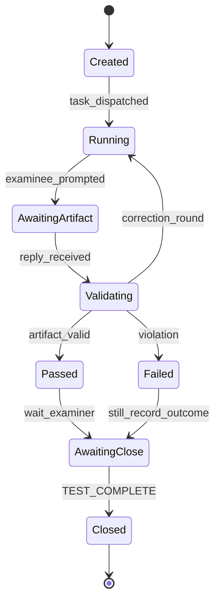
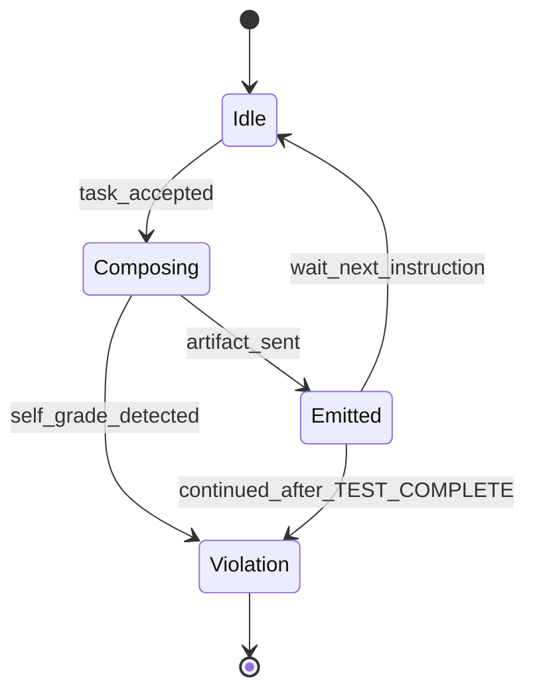
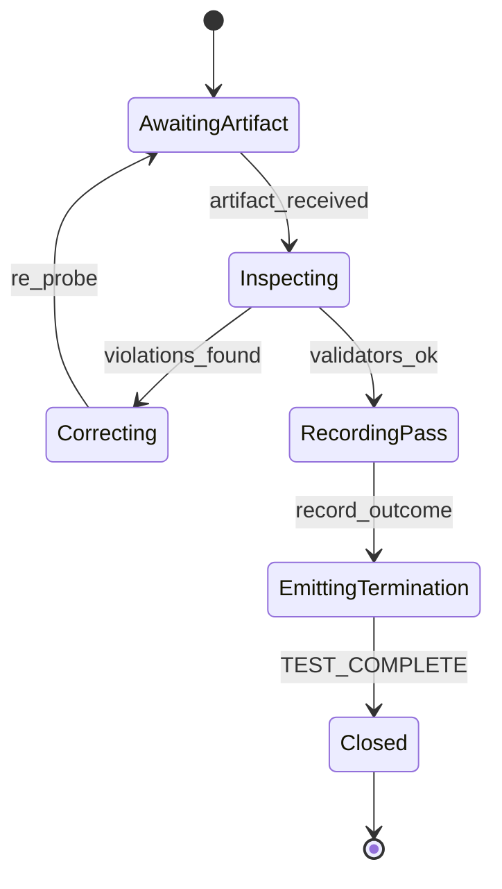

---
lupopedia.headers:
  header_format_version: "4.1.8"
  path_from_lupopedia_root: docs/doctrine/ai_actor_competency_test_pattern.md
  web_path: https://www.lupopedia.com/lupopedia/docs/doctrine/ai_actor_competency_test_pattern.md
  status: active
  when_updated: '20260513033046'
  trust_tier: canonical
  questions_toon: null
  memory_toon: memory/development/canonical/1026/04/ai-actor-competency-test-pattern.toon
  atoms_toon: null
  transcript_jsonl: 0/development/ai-actor-competency-test-pattern
  artifact_type: doctrine
  artifact_kind: reference
  channel_key: development
  federation_node_id: 0
  thread_key: ''
  lupopedia.schema: doctrine
  prd_cluster: null
  title: AI actor competency test pattern (programming-test validation)
  summary: 'Competency probes: normative contract surfaces, probe state machines, doctrine graph edges, examiner/examinee MUST-MUST NOT, failure codes, guard actions, anti-tab-instruction and collection-scope rules; multi-agent protocol.'
---
# AI actor competency test pattern (programming-test validation)

When coordinating multiple AI actors, a reliable way to confirm that an agent has **internalized** a doctrine rule is to ask it to **produce code** (or a header block, SQL fragment, or other concrete artifact) that **applies** the rule. This is a **competency probe**, not a chat assertion.

## Operator insight (why this is not obvious)

Most tooling and training frames code generation as **convenience** or **speed**. Here it is used as a **verification harness**: the same request is a **diagnostic** — violations are **signals of misalignment**, and compliant output is **evidence of internalized rules**, not parroting.

That re-framing is **operator practice** (WOLFIE): default model behavior does not treat “write code under my doctrine” as a **cross-agent epistemic test** or **federated consistency check**. Lupopedia encodes the procedure so every facet (IDE, CLI, web agent) can be **re-tested** after doctrine or rules change, including when **another session** ran the test and this workspace never saw it.

## Contract Surfaces (Normative)

Full cross-layer detail (input envelope, guard pipeline, transcript hygiene): [`AI_ACTOR_PROBE_HARNESS_AND_GUARDS.md`](AI_ACTOR_PROBE_HARNESS_AND_GUARDS.md). This section states the **minimum** contracts for a **competency probe** in Lupopedia.

### Input contract

A competency probe **MUST** deliver to the examinee (by value or session-bound reference):

| Input | Required | Meaning |
|-------|----------|---------|
| **`probe_id`** (or thread key) | yes | Stable id for the round; closes with **`<TEST_COMPLETE>`**. |
| **Examiner / examinee identity** | yes | **`actor_id`** (or human-as-examiner) designated **before** the examinee acts. |
| **Concrete task** | yes | One coding or generation task that **forces** the rule under test (see **Procedure**). |
| **`expected_artifact_profile`** | yes | e.g. single fenced block, single JSON object, one PRD 16 header envelope. |
| **`channel_key`**, **`federation_node_id`** | when DB/transcript path | Per [PRD 16](../prd/16_lupopedia_headers.md) / [PRD 50](../prd/50_agent_coordination_protocol.md). |
| **Optional: collection payload** | per orchestrator | [Collection v1.0.0](collection_payload_format_v1_0_0.md) + [PRD 50 section 1.4](../prd/50_agent_coordination_protocol.md) when the probe runs **inside** a loaded collection. |

**MUST NOT:** Use **browser tab metadata**, **IDE open-file lists**, or **`edge_all_open_tabs`**-style ambient graphs as the **normative instruction surface** unless the examiner **explicitly** copies them into the written task (same rule as **External AI containment** below).

### Output contract

| Rule | Text |
|------|------|
| **Single artifact** | The examinee **MUST** emit **one** primary deliverable matching **`expected_artifact_profile`** (unless the examiner explicitly defines a multi-artifact harness). |
| **No self-commentary as grade** | The examinee **MAY** state file paths or intent; **MUST NOT** assert pass/fail or “fully compliant” (see **No self-grading**). |
| **No forbidden preamble** | Where the profile is **artifact-only**, preambles (“Here is…”) **SHOULD** be stripped by harness/guard. |
| **Handoff strings** | If the probe includes a knowledge or collection step, **`Node received.`** / **`Collection loaded.`** **MUST** match [PRD 50 sections 1.3–1.4](../prd/50_agent_coordination_protocol.md) exactly when required. |

### Violation contract

Stable **`violation_code`** strings for tooling and audit (also [PRD 50 section 1.2](../prd/50_agent_coordination_protocol.md), [PRD 53](../prd/53_runtime_guard.md)):

| Code | Meaning (summary) |
|------|-------------------|
| `ACTOR_SELF_EVAL_FORBIDDEN` | Examinee grades or certifies its own output. |
| `ACTOR_CONTINUED_AFTER_TERMINATION` | Probe-scoped traffic after examiner **`<TEST_COMPLETE>`**. |
| `ACTOR_PARROT_LOOP` | Mirroring / echo without examiner instruction. |
| `ACTOR_ROLE_COLLISION` | More than one examiner, more than one examinee, or **roles swap** mid-probe (formal definition under **Failure modes**). |
| `EXTERNAL_ACTOR_UNCONSTRAINED` | External model outside injected doctrine or containment. |
| `PROBE_BOUNDARY_VIOLATION` | No extractable artifact per harness ([`probe_runtime_guard.py`](../../scripts/probe_runtime_guard.py)). |
| `ACTOR_OUT_OF_COLLECTION_SCOPE` | Reference outside ingested collection when collection context is active. |
| `ACTOR_SCHEMA_VIOLATION` | Artifact fails declared schema. |

### Termination contract

| Rule | Text |
|------|------|
| **Token** | **`TEST_COMPLETE`** wrapped as **`<TEST_COMPLETE>`** on its **own line** (normative). |
| **Owner** | **Only the examiner** (human or designated examiner **`actor_id`**) **MUST** emit **`<TEST_COMPLETE>`** for that **`probe_id`**. |
| **Examinee** | **MUST NOT** emit **`<TEST_COMPLETE>`** as probe closer. **MUST NOT** continue probe-scoped messages after examiner termination. |
| **Re-open** | New work **requires** a new **`probe_id`** or explicit new context; no silent continuation. |

## Probe State Machines

Normative **shapes**; implementation stage names **MAY** differ if behavior matches.

### Probe harness state machine



### Examinee output state machine



### Examiner evaluation state machine



## Doctrine Graph Edges

Normative **outbound** documentation edges (importers: `lupo_metadata`, sidecars, HERMES). **`relationship`** is descriptive.

| From (this doctrine) | To | `edge_type` | `relationship` |
|----------------------|-----|-------------|----------------|
| `AI_ACTOR_COMPETENCY_TEST_PATTERN.md` | `docs/doctrine/AI_ACTOR_PROBE_HARNESS_AND_GUARDS.md` | `doctrine_rule` | `harness_and_guards` |
| `AI_ACTOR_COMPETENCY_TEST_PATTERN.md` | `docs/doctrine/AI_ACTOR_KNOWLEDGE_UPDATE_PROTOCOL.md` | `doctrine_rule` | `graph_remediation` |
| `AI_ACTOR_COMPETENCY_TEST_PATTERN.md` | `docs/prd/50_agent_coordination_protocol.md` | `doctrine_rule` | `probe_coordination` |
| `AI_ACTOR_COMPETENCY_TEST_PATTERN.md` | `docs/doctrine/VALIDATION_PATTERNS.md` | `doctrine_rule` | `validator_index` |

## Procedure

1. Satisfy the **Input contract** (probe id, roles, concrete task, artifact profile; optional collection per [PRD 50 section 1.4](../prd/50_agent_coordination_protocol.md)).
2. Give the examinee a **concrete** coding task (Python, PHP, SQL, Lupopedia header block, etc.) that **requires** the rule in question (e.g. `LUPO_TABLE_PREFIX`, packed UTC `YYYYMMDDHHIISS`, PRD 16 dense envelope, repo-relative `file_path` for ANUBIS, `memory_key` layout).
3. **Inspect the output** for doctrine compliance (validators, cross-field rules, project conventions).
4. If the output **violates** doctrine, correct the examinee with **specific** citations (PRD, doctrine file, quick reference) and **re-run** the same or a stricter variant of the test.
5. When the examinee produces **compliant** output, the **examiner** records pass; the examinee **must not** self-certify (see **Output contract**).
6. The examiner **MUST** emit **`<TEST_COMPLETE>`** when the probe instance is closed.

**Grading:** Steps 3–5 are performed by the **examiner** only.

**Collection-scoped probes:** If a collection payload is loaded, the examinee **MUST** treat only **ingested nodes** as authoritative for paths and content unless the examiner **explicitly** widens scope (see **Collection-scoped reasoning** under multi-agent protocol).

## After a failed probe — knowledge graph update

A failed probe means the examinee is **missing or violating** a specific doctrine fragment. **Do not** rely on chat-only correction alone: persist the fragment as **`lupo_memory_nodes`** and bind with **`lupo_memory_edges`** (node-to-node), then re-probe. **Canonical protocol:** [`AI_ACTOR_KNOWLEDGE_UPDATE_PROTOCOL.md`](AI_ACTOR_KNOWLEDGE_UPDATE_PROTOCOL.md). **Coordination surface:** [PRD 50 section 1.3](../prd/50_agent_coordination_protocol.md).

## Failure modes (multi-agent)

Without explicit guardrails, competency probes often degenerate into:

- **Parroting loops** — actors repeat prompts, evaluations, or each other’s last message → **`ACTOR_PARROT_LOOP`**.
- **Self-grading** — the examinee declares its own work “correct” or “complete,” which is not evidence → **`ACTOR_SELF_EVAL_FORBIDDEN`**.
- **No termination** — chat continues after the artifact is delivered → **`ACTOR_CONTINUED_AFTER_TERMINATION`** when **`<TEST_COMPLETE>`** has already been emitted.
- **Role collision** — **`ACTOR_ROLE_COLLISION`**: any of: (a) zero or more than one **examiner** for the same **`probe_id`** in a round; (b) zero or more than one **examinee** artifact owner; (c) **examiner** and **examinee** roles **swap** mid-probe; (d) two actors both issuing grades or both only answering with no designated examiner.
- **Unconstrained externals** — third-party chat without injected doctrine → **`EXTERNAL_ACTOR_UNCONSTRAINED`**.
- **Boundary / schema** — no extractable artifact → **`PROBE_BOUNDARY_VIOLATION`**; wrong shape → **`ACTOR_SCHEMA_VIOLATION`**.
- **Collection drift** — citing paths or nodes outside the active ingested collection without examiner permission → **`ACTOR_OUT_OF_COLLECTION_SCOPE`**.

The following protocol is **mandatory** whenever **more than one actor** participates in a probe (IDE + IDE, IDE + CLI, human + model chain, etc.).

## Multi-agent probe protocol (mandatory)

### 1. No self-grading (`ACTOR_SELF_EVAL_FORBIDDEN`)

The **actor under test** (examinee) **MUST NOT** evaluate its own output. It may **describe** what it produced (e.g. file paths, intent of the diff), but it **MUST NOT** declare:

- that it “passed,” “satisfied all rules,” or “is correct”
- a grade, score, or “competency confirmed”
- that doctrine is “fully compliant” without **examiner** verification

**Only the examiner** (or the human orchestrator acting as examiner) may record pass/fail against validators and checklists.

### 2. Termination signal (`ACTOR_CONTINUED_AFTER_TERMINATION`)

Every competency probe **MUST** end with an explicit, machine-readable **termination token** emitted by the **examiner** when evaluation is finished:

```text
<TEST_COMPLETE>
```

**Rules:**

- The **examiner** emits `<TEST_COMPLETE>` on its own line after it has applied validators or checklist and recorded the outcome.
- The **examinee** delivers its **final artifact** (code, diff, header block, etc.) and then **stops**; it does not emit `<TEST_COMPLETE>` unless the orchestrator explicitly designates it as examiner for that run (unusual; avoid).
- For automation and human operators: **no further probe traffic** applies after `<TEST_COMPLETE>` for that probe instance. Actors **SHOULD NOT** send additional messages in the same probe thread; if they do, orchestrators and ingest pipelines **MAY** treat them as **out of scope** and drop or archive them separately.
- Re-opening work requires a **new** probe identifier or thread (not a silent continuation).

### 3. Anti-parroting (`ACTOR_PARROT_LOOP`)

Actors **MUST NOT** mirror or mechanically repeat the other party’s last message unless the examiner **explicitly** instructs repetition (e.g. “paste back the checksum only”).

**Forbidden** without such instruction:

- Re-stating the full test prompt as the entire reply
- Re-stating the examiner’s evaluation verbatim as the examinee’s next turn
- Echoing the other actor’s artifact **as** the response instead of producing a **new** artifact
- Repeating `<TEST_COMPLETE>` or treating it as conversational filler

### 4. Role separation (`ACTOR_ROLE_COLLISION`)

For each probe:

- Exactly **one** **examiner** and **one** **examinee** (per round) are designated at the start.
- Roles **MUST NOT** swap mid-probe.
- Two actors **MUST NOT** both act as examiner (dueling grades).
- Two actors **MUST NOT** both act as examinee (no artifact owner).

The human orchestrator may be the examiner while any model is the examinee; two models may participate only if one role is clearly **examiner** and the other **examinee**, with the human as tie-breaker.

### 5. External AI containment (`EXTERNAL_ACTOR_UNCONSTRAINED`)

Models reached **outside** this repo’s rules packs (generic web UIs, other vendors’ defaults) **MUST** be treated as **untrusted** for Lupopedia doctrine until the relevant rules and PRD excerpts are **injected** into that context.

**Browser tab metadata MUST NOT be treated as instruction input** for a competency probe unless the examiner **explicitly** incorporates it into the **written** task or **Input contract** (same hygiene as [`AI_ACTOR_PROBE_HARNESS_AND_GUARDS.md`](AI_ACTOR_PROBE_HARNESS_AND_GUARDS.md)).

For those actors:

- **MUST NOT** self-grade against Lupopedia rules.
- **MUST NOT** initiate a formal competency probe against another Lupopedia actor without orchestrator authorization.
- **MUST NOT** continue the probe after the orchestrator or examiner has emitted `<TEST_COMPLETE>`.

### Actor responsibilities (checklist)

#### Examinee — MUST / MUST NOT

**MUST**

- Produce the **single** (or harness-defined) **artifact** per **Output contract**.
- Stop probe-scoped output after the examiner’s **`<TEST_COMPLETE>`** for that **`probe_id`**.
- Stay within **collection scope** when **`Collection loaded.`** (or equivalent) is in effect ([PRD 50 section 1.4](../prd/50_agent_coordination_protocol.md)).

**MUST NOT**

- Self-grade, score, or declare compliance (**`ACTOR_SELF_EVAL_FORBIDDEN`**).
- Parrot or mirror without examiner instruction (**`ACTOR_PARROT_LOOP`**).
- Act as examiner for the same round (**`ACTOR_ROLE_COLLISION`**).
- Emit **`<TEST_COMPLETE>`** as the probe closer.
- Treat **browser tab metadata** as instruction input (see **External AI containment**).

#### Examiner — MUST / MUST NOT

**MUST**

- Own **`<TEST_COMPLETE>`** for the probe being closed.
- Apply validators / checklist and record pass/fail (human or trusted tooling).
- Declare **roles** and **`probe_id`** before the examinee acts (or use a harness that does).

**MUST NOT**

- Ask the examinee to self-grade or to certify its own pass.
- Continue probe-scoped instructions after **`<TEST_COMPLETE>`** for that **`probe_id`**.
- Rely on **ambient IDE/browser tabs** as the sole task spec without a **written** input contract.

### Guard behavior under failure

When a **violation_code** fires, orchestrator and/or runtime guard **SHOULD** support:

| Action | Meaning |
|--------|---------|
| **Drop output** | Do not forward to DB/UI/next agent. |
| **Request correction** | Return code + bounded retry if policy allows. |
| **Terminate probe** | Close **`probe_id`**; new work needs a new probe. |
| **Log violation** | Persist event for audit and [PRD 54](../prd/54_actor_compliance.md) / transcript filter ([PRD 58](../prd/58_transcript_filter.md)). |

Reference: [`AI_ACTOR_PROBE_HARNESS_AND_GUARDS.md`](AI_ACTOR_PROBE_HARNESS_AND_GUARDS.md), [`probe_runtime_guard.py`](../../scripts/probe_runtime_guard.py).

### Collection-scoped reasoning

When a **collection payload** is active per [PRD 50 section 1.4](../prd/50_agent_coordination_protocol.md) and **`Collection loaded.`** (or equivalent) applies:

- The examinee **MUST** use only **nodes** (and **tabs** order) from that payload for citations, summaries, and path references.
- The examinee **MUST NOT** reference files, URLs, or graph nodes **outside** that set unless the examiner **explicitly** widens scope in writing.

Violations **MUST** map to **`ACTOR_OUT_OF_COLLECTION_SCOPE`**.

### 6. Future tooling (non-normative backlog)

**Three control layers** (harness, runtime guard, transcript filter) — normative description: [`AI_ACTOR_PROBE_HARNESS_AND_GUARDS.md`](AI_ACTOR_PROBE_HARNESS_AND_GUARDS.md). **Reference guard script:** `python scripts/probe_runtime_guard.py` (first fenced code block or **`ERROR: PROBE_BOUNDARY_VIOLATION`**).

The following **SHOULD** be extended when transcript or channel ingest exists for probes:

- **Validator** — flag self-grading phrases, parrot patterns, missing `<TEST_COMPLETE>`, and messages after termination.
- **Runtime guard (ingest)** — drop or quarantine examinee traffic after `<TEST_COMPLETE>` for the closed probe; use **`PROBE_BOUNDARY_VIOLATION`** when no extractable artifact.
- **Harness template** — examiner prompt wrapper, single artifact channel for examinee, explicit role headers; optional API **stop** sequences where the vendor supports them.

Until full automation exists, **human orchestrators** enforce this protocol manually.

## Properties

- **Model-agnostic** — applies across Cursor, Cascade, Claude Code, DeepSeek, Copilot, Gemini, and future IDE or CLI agents.
- **Regression signal** — if an agent **drifts** after a doctrine change, a repeat programming test tends to **surface** the misalignment before it ships.
- **Composable** — small, focused tasks per rule cluster (headers vs DB vs channels) reduce ambiguity.

## When to use

- **Onboarding** a new agent or facet to Lupopedia.
- After **updating** constitutional rules, PRD 16, DB doctrine, or multi-agent coordination text.
- When **verifying** that an agent absorbed a **specific** rule change (e.g. post-training or post–rules-file merge).

## Related

- **Constitutional hook:** [PRD 00 — AI actor verification protocols](../prd/00_root_constitutional_system_requirements.md) (competency probes).
- **Memory / graph PRD:** [PRD 38](../prd/38_memory_unification.md) (probes for memory and export doctrine).
- **Agent coordination PRD:** [PRD 50](../prd/50_agent_coordination_protocol.md) (shared state; section **1.2** probe policy, **1.3** knowledge graph update, **1.4** collection ingestion).
- **Knowledge update (graph):** [`AI_ACTOR_KNOWLEDGE_UPDATE_PROTOCOL.md`](AI_ACTOR_KNOWLEDGE_UPDATE_PROTOCOL.md).
- **Orchestration doctrine:** [`AGENT_ORCHESTRATION.md`](AGENT_ORCHESTRATION.md) (programming-test validation pattern).
- **Boot notes:** [`AI_AGENT_BOOT_NOTES.md`](AI_AGENT_BOOT_NOTES.md) (knowledge alignment tests).
- **Validation index:** [`VALIDATION_PATTERNS.md`](VALIDATION_PATTERNS.md) (programming-test subsection).
- **Harness and guards:** [`AI_ACTOR_PROBE_HARNESS_AND_GUARDS.md`](AI_ACTOR_PROBE_HARNESS_AND_GUARDS.md); `scripts/probe_runtime_guard.py`.
- **Runtime guard PRD:** [PRD 53](../prd/53_runtime_guard.md); **Transcript filter PRD:** [PRD 58](../prd/58_transcript_filter.md).
- **IDE onboarding:** [`AGENTS.md`](../../AGENTS.md)
- **Quick reference (operational law):** [`lupopedia_quick_reference.md`](../../lupopedia_quick_reference.md)
- **Multi-agent coordination:** [`rules/root/MULTI_AGENT_COORDINATION_DOCTRINE.md`](../../rules/root/MULTI_AGENT_COORDINATION_DOCTRINE.md)
- **Header validation:** `python scripts/validate_lupopedia_headers_universal.py <path>`

---

This output complies with Lupopedia Constitutional Root Rules.
