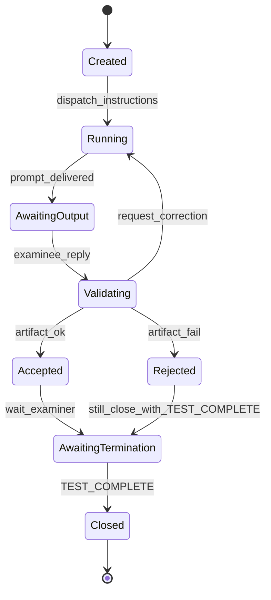
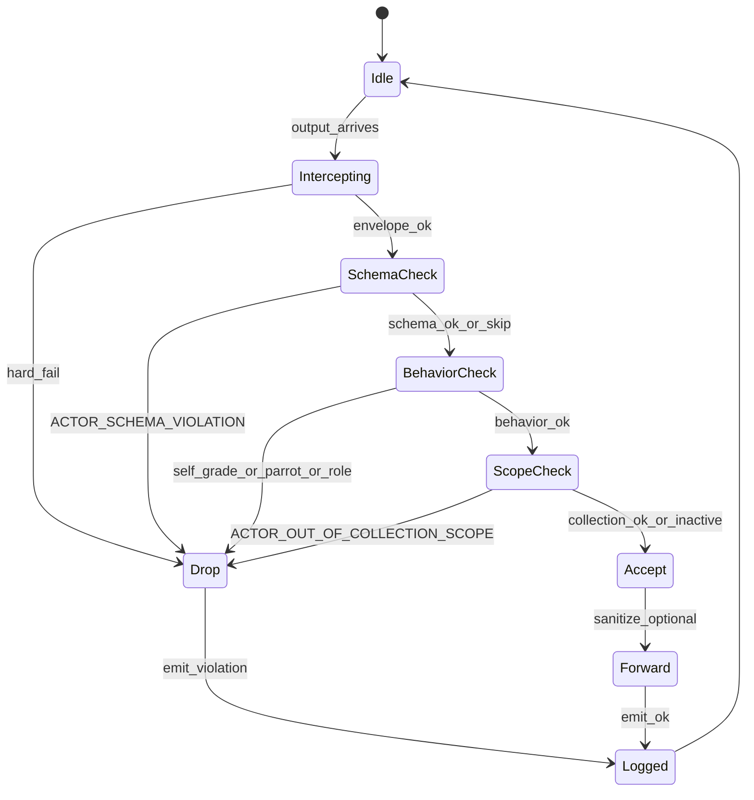
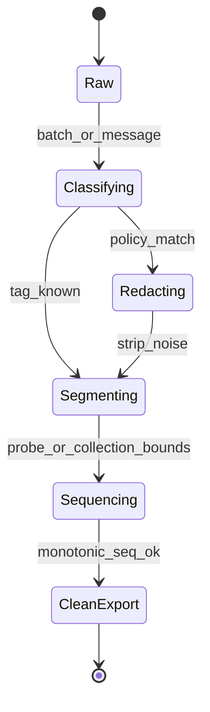

---
lupopedia.headers:
  header_format_version: "4.1.8"
  path_from_lupopedia_root: docs/doctrine/ai_actor_probe_harness_and_guards.md
  web_path: https://www.lupopedia.com/lupopedia/docs/doctrine/ai_actor_probe_harness_and_guards.md
  status: active
  when_updated: '20260513033046'
  trust_tier: canonical
  questions_toon: null
  memory_toon: memory/development/canonical/1026/04/ai-actor-probe-harness-and-guards.toon
  atoms_toon: null
  transcript_jsonl: 0/development/ai-actor-probe-harness-guards
  artifact_type: doctrine
  artifact_kind: reference
  channel_key: development
  federation_node_id: 0
  thread_key: ''
  lupopedia.schema: doctrine
  prd_cluster: null
  title: AI actor probe harness, runtime guard, and transcript filtering
  summary: 'Probe harness+guard doctrine: PRD 61 twelve invariants; full violation codes incl. collection+ack; deterministic ordering; faucet+channel+ingestion; state machines; anti-tab; edges incl. PRD 61.'
---
# AI actor probe harness, runtime guard, and transcript filtering

**Problem:** When agents drive agents without a **moderator** or **harness**, each reply becomes a fresh instruction surface. Token use explodes; **parroting** and **self-grading** amplify. This is not “broken models” alone — it is **missing control planes**.

**Companion norms:** [`AI_ACTOR_COMPETENCY_TEST_PATTERN.md`](AI_ACTOR_COMPETENCY_TEST_PATTERN.md) (roles, **`<TEST_COMPLETE>`**, anti-parrot), [`AI_ACTOR_KNOWLEDGE_UPDATE_PROTOCOL.md`](AI_ACTOR_KNOWLEDGE_UPDATE_PROTOCOL.md) (graph persistence after failure).

**PRD alignment:** [PRD 50 sections 1.2–1.4](../prd/50_agent_coordination_protocol.md) (probes, knowledge update, collection ingestion), [PRD 53](../prd/53_runtime_guard.md) (runtime guard product spec), [PRD 56](../prd/56_probe_harness_v2.md) (probe harness v2), [PRD 58](../prd/58_transcript_filter.md) (transcript filter), [`collection_payload_format_v1_0_0.md`](collection_payload_format_v1_0_0.md) (v1.0.0 payload). This doctrine is the **cross-layer** glue; numeric depth lives in those PRDs.

**PRD 61 (Doctrine consolidation):** The **twelve invariants** in **[PRD 61 section 2](../prd/61_doctrine_consolidation_shorthand_compiler.md)** are the **checklist** this doctrine **MUST NOT** contradict — violation strings, contracts, **browser-tab prohibition**, **deterministic ordering**, **faucet** / **channel-thread** validation, **collection scope**, **ingestion-mode**, **provenance actor**, and **graph edges** (see **Outbound `doctrine_rule` edge** below).

---

## Normative contracts

These contracts are **stable** for orchestrators, harness implementers, and validators. They **MUST NOT** be reinterpreted per IDE vendor.

### Input contract (what the harness receives)

The harness/orchestrator **MUST** supply (by value or by session-bound reference):

| Field / input | Required | Meaning |
|-----------------|----------|---------|
| **`probe_id`** (or equivalent thread key) | yes | Stable idempotency key for the probe round. |
| **`examiner_actor_id`** / **`examinee_actor_id`** | yes | Registry-backed **`lupo_actors.actor_id`**; roles **MUST** match [competency pattern](AI_ACTOR_COMPETENCY_TEST_PATTERN.md). |
| **`probe_instructions`** | yes | Single coherent instruction block (Markdown or structured) defining the task. |
| **`expected_artifact_profile`** | yes | e.g. *one fenced block*, *raw JSON only*, MIME or language tag. |
| **`expected_artifact_schema`** | when applicable | JSON Schema or equivalent; absence means “no machine schema,” not “any shape.” |
| **`channel_key`**, **`federation_node_id`** | yes for DB-backed paths | Per [PRD 16](../prd/16_lupopedia_headers.md) / [PRD 50](../prd/50_agent_coordination_protocol.md). |
| **Optional: collection payload** | per [PRD 50 section 1.4](../prd/50_agent_coordination_protocol.md) | v1.0.0 JSON or transport equivalent; sets **collection scope** when present. |

**MUST NOT** be used as authoritative **instruction surface** for the examinee:

- **Browser tab lists**, **IDE “open files”**, **`edge_all_open_tabs`**, or any **ambient browsing graph** not explicitly exported as part of the **input contract** above. Those signals are **telemetry or UX hints** only; treating them as **normative task input** is **forbidden** (see **Instruction surface hygiene** below).

### Output contract (what the examinee must emit)

| Output | When | Rule |
|--------|------|------|
| **Primary artifact** | Always (unless probe explicitly allows prose-only — rare) | **Exactly** the deliverable implied by **`expected_artifact_profile`**; typically **one** fenced block or one JSON document. |
| **Preamble / epilogue** | Default **forbidden** where harness declares **artifact-only** | Orchestrator **MAY** strip; guard **MAY** treat as violation if profile forbids. |
| **`Node received.`** / **`Collection loaded.`** | Collection or knowledge handoffs | [PRD 50 section 1.3–1.4](../prd/50_agent_coordination_protocol.md): **exact** strings, **first line** / **own line** as specified. |
| **Self-judgment** | Never | No pass/fail, scores, or “I complied” assertions (**`ACTOR_SELF_EVAL_FORBIDDEN`**). |

### Violation contract (stable error codes)

Implementations **MUST** emit these **string codes** (and **MUST NOT** rename) when the condition holds. Full coordination table: [PRD 50 section 1.2](../prd/50_agent_coordination_protocol.md). Additional codes **MUST** be registered in [PRD 53](../prd/53_runtime_guard.md) before use in shared tooling.

| Code | Meaning (summary) |
|------|-------------------|
| `PROBE_BOUNDARY_VIOLATION` | No extractable artifact per harness rules (reference: [`probe_runtime_guard.py`](../../scripts/probe_runtime_guard.py)). |
| `ACTOR_CONTINUED_AFTER_TERMINATION` | Traffic after valid probe termination for that **`probe_id`**. |
| `ACTOR_SELF_EVAL_FORBIDDEN` | Examinee self-grading or unsolicited compliance claim. |
| `ACTOR_PARROT_LOOP` | Disallowed mirroring without examiner instruction. |
| `ACTOR_ROLE_COLLISION` | Examiner/examinee role conflict for the round. |
| `ACTOR_OUT_OF_COLLECTION_SCOPE` | Citation or reasoning outside ingested collection nodes when collection context is active. |
| `ACTOR_SCHEMA_VIOLATION` | Artifact failed **`expected_artifact_schema`**. |
| `EXTERNAL_ACTOR_UNCONSTRAINED` | External model outside containment policy ([PRD 50 section 1.2](../prd/50_agent_coordination_protocol.md)). |
| `KNOWLEDGE_ACK_INVALID` | Required first-line **`Node received.`** (or mandated collection ack) missing or wrong when protocol demands it ([PRD 50 section 1.3–1.4](../prd/50_agent_coordination_protocol.md)). |
| `COLLECTION_PAYLOAD_INVALID` | Collection JSON fails required keys, version, or shape ([`collection_payload_format_v1_0_0.md`](collection_payload_format_v1_0_0.md)). |
| `COLLECTION_NODE_ID_COLLISION` | Duplicate **`nodes[].node_id`** in one payload or unstable correlators ([`collection_payload_format_v1_0_0.md`](collection_payload_format_v1_0_0.md) section **1.2**). |

### Termination contract (`<TEST_COMPLETE>` ownership + rules)

| Rule | Text |
|------|------|
| **Owner** | Only the **examiner** (human or designated examiner **`actor_id`**) **MAY** emit **`<TEST_COMPLETE>`** for a given **`probe_id`**. |
| **Examinee** | **MUST NOT** emit **`<TEST_COMPLETE>`** as if closing the probe. **MUST NOT** send further **probe-scoped** messages after the examiner’s **`<TEST_COMPLETE>`** for that probe. |
| **Token** | Normative token is **`<TEST_COMPLETE>`** unless a **written** policy registers an additional termination token for a closed environment ([PRD 53](../prd/53_runtime_guard.md) termination registry). |
| **Effect** | After termination, the harness **MUST** treat the probe as **closed** for scheduling and guard purposes; new work **requires** a new **`probe_id`** or explicit new context ([PRD 50 section 1.4.6](../prd/50_agent_coordination_protocol.md)). |

---

## State machines

These are **normative control-flow shapes**. Detailed stage names **MAY** vary by implementation if behavior is equivalent.

### Probe harness state machine

### Runtime guard state machine

### Transcript filter state machine

---

## Integration edges (documentation graph)

Normative **outbound** references for importers (`lupo_metadata`, sidecars, HERMES). **`relationship`** is descriptive.

| From (this doctrine) | To | `edge_type` | `relationship` |
|----------------------|-----|-------------|----------------|
| `AI_ACTOR_PROBE_HARNESS_AND_GUARDS.md` | `docs/prd/56_probe_harness_v2.md` | `doctrine_rule` | `harness_spec` |
| `AI_ACTOR_PROBE_HARNESS_AND_GUARDS.md` | `docs/prd/53_runtime_guard.md` | `doctrine_rule` | `runtime_guard_spec` |
| `AI_ACTOR_PROBE_HARNESS_AND_GUARDS.md` | `docs/prd/58_transcript_filter.md` | `doctrine_rule` | `transcript_filter_spec` |
| `AI_ACTOR_PROBE_HARNESS_AND_GUARDS.md` | `docs/prd/50_agent_coordination_protocol.md` | `doctrine_rule` | `coordination_protocol` |
| `AI_ACTOR_PROBE_HARNESS_AND_GUARDS.md` | `docs/doctrine/VALIDATION_PATTERNS.md` | `doctrine_rule` | `validator_index` |

**Pipeline flow (informative):** Probe Harness **invokes** Runtime Guard on examinee output; Runtime Guard **feeds** violation events to Transcript Filter and compliance paths; Transcript Filter **emits** clean segments aligned with **PRD 50** transcript semantics.

---

## Actor responsibilities

### Examinee — MUST / MUST NOT

**MUST**

- Emit the **primary artifact** conforming to **`expected_artifact_profile`** and **`expected_artifact_schema`** when provided.
- Acknowledge collection/knowledge handoffs with **exact** **`Node received.`** / **`Collection loaded.`** per [PRD 50](../prd/50_agent_coordination_protocol.md) when instructed.
- Stay within **active collection** node set when **`Collection loaded.`** (or equivalent) has established scope — see **Collection-scoped reasoning**.
- Stop **probe-scoped** output when the examiner has emitted **`<TEST_COMPLETE>`** for that probe.

**MUST NOT**

- Grade its own output, assert probe pass/fail, or claim full doctrine compliance (**`ACTOR_SELF_EVAL_FORBIDDEN`**).
- Mirror the examiner’s or another actor’s message without explicit examiner instruction (**`ACTOR_PARROT_LOOP`**).
- Act as **examiner** for the same **`probe_id`** (**`ACTOR_ROLE_COLLISION`**).
- Emit **`<TEST_COMPLETE>`** as probe closer.
- Treat **browser tabs**, **open-file lists**, or **`edge_all_open_tabs`**-style dumps as **authoritative task definition** unless the orchestrator **explicitly** copies them into the **input contract**.

### Examiner — MUST / MUST NOT

**MUST**

- Own **`<TEST_COMPLETE>`** for the probe being closed.
- Declare **`probe_id`**, roles, and **artifact profile** before the examinee acts (or use a harness that does so).
- Close formal probes with **`<TEST_COMPLETE>`** when the round is finished.

**MUST NOT**

- Ask the examinee to **self-grade** or to confirm “you passed.”
- Continue **probe-scoped** instructions after emitting **`<TEST_COMPLETE>`** for that **`probe_id`**.
- Rely on **ambient IDE tabs** as the sole specification of work without a **written** input contract for the examinee.

---

## Failure modes (examinee / guard detection)

The following **MUST** be detectable and **MUST** map to the **violation contract** codes:

| Failure | Code |
|---------|------|
| Output or messages after probe termination | `ACTOR_CONTINUED_AFTER_TERMINATION` |
| Self-grading or unsolicited compliance verdict | `ACTOR_SELF_EVAL_FORBIDDEN` |
| Parrot / mirror loop | `ACTOR_PARROT_LOOP` |
| Role confusion (examiner/examinee) | `ACTOR_ROLE_COLLISION` |
| References outside ingested collection when scoped | `ACTOR_OUT_OF_COLLECTION_SCOPE` |
| Artifact shape fails schema | `ACTOR_SCHEMA_VIOLATION` |
| No extractable artifact | `PROBE_BOUNDARY_VIOLATION` |
| Malformed collection payload on ingest path | `COLLECTION_PAYLOAD_INVALID` |
| Duplicate **`node_id`** in payload | `COLLECTION_NODE_ID_COLLISION` |
| Wrong first-line knowledge/collection ack | `KNOWLEDGE_ACK_INVALID` |

### Deterministic ordering, faucet, channel, ingestion (normative)

- **Deterministic ordering ([PRD 61](../prd/61_doctrine_consolidation_shorthand_compiler.md) invariant 4):** Guard and harness **MUST** process **multi-artifact** and **collection-shaped** extracts in **documented stable order** only ([`TOON_ORDERING_SPEC.md`](TOON_ORDERING_SPEC.md), [`collection_payload_format_v1_0_0.md`](collection_payload_format_v1_0_0.md) section **1.2**).
- **Faucet identity (PRD 61 invariant 5):** Missing or incorrect **faucet** envelope **MUST** map to **`ACTOR_SCHEMA_VIOLATION`** when required ([`AGENT_REGISTRY.md`](AGENT_REGISTRY.md)).
- **Channel / thread (PRD 61 invariant 6):** Invalid **`channel_id` / `thread_id`** **MUST** map to **`ACTOR_SCHEMA_VIOLATION`** before persistence ([PRD 50 section 1.5.1](../prd/50_agent_coordination_protocol.md)).
- **Ingestion-mode (PRD 61 invariant 9):** **L3–L5** mutation-class probes **MUST NOT** run under **`ingestion_mode: read-only`** ([PRD 56 section 3.1](../prd/56_probe_harness_v2.md), [PRD 60 section 1.3](../prd/60_orchestrator_scheduler.md)).

## Outbound `doctrine_rule` edge (PRD 61)

| From | To | `edge_type` | `relationship` |
|------|-----|-------------|----------------|
| `AI_ACTOR_PROBE_HARNESS_AND_GUARDS.md` | `docs/prd/61_doctrine_consolidation_shorthand_compiler.md` | `doctrine_rule` | `invariant_checklist_harness_doctrine` |

---

## Guard behavior under failure

When a violation is detected, the guard **MUST** support **at least one** of the following actions per policy profile; **MUST** always support **log violation**.

| Action | Meaning |
|--------|---------|
| **Drop output** | Do not forward message to DB/UI/next agent; return failure to orchestrator. |
| **Request correction** | Return structured error + **violation code**; allow bounded retry if policy permits. |
| **Terminate probe** | Mark **`probe_id`** closed; require new probe for further examinee work. |
| **Log violation** | Persist **`guard_event`** / classified transcript row with **stable code** for [PRD 54](../prd/54_actor_compliance.md) and audit. |

Reference script behavior: [`probe_runtime_guard.py`](../../scripts/probe_runtime_guard.py) implements **fail-closed** extract for **`PROBE_BOUNDARY_VIOLATION`** (exit code **2**).

---

## Instruction surface hygiene (browser tabs and `edge_all_open_tabs`)

**Forbidden:** Using **browser tab metadata**, **IDE “all open editors”**, **`edge_all_open_tabs`**, or similar **ambient graphs** as the **normative instruction surface** for an examinee during a probe or collection-scoped task, **unless** the orchestrator **explicitly** exports that material into the **input contract** (e.g. as a collection payload node or pasted specification).

**Rationale:** Ambient tabs are **not** versioned, not **`<TEST_COMPLETE>`**-scoped, and not auditable as doctrine. They **contaminate** probes with unstructured context and defeat **collection closure** ([PRD 50 section 1.4.7](../prd/50_agent_coordination_protocol.md)).

---

## Collection-scoped reasoning

When **`Collection loaded.`** (or equivalent) has established an **active collection context** from a v1.0.0 payload ([`collection_payload_format_v1_0_0.md`](collection_payload_format_v1_0_0.md), [PRD 50 section 1.4](../prd/50_agent_coordination_protocol.md)):

- The examinee **MUST** treat **only** **`nodes`** (and **`tabs`** ordering) from that payload as **authoritative** for paths, titles, and **`node_id`** correlators.
- The examinee **MUST NOT** cite files, memory nodes, or URLs **outside** that set unless the **examiner** explicitly widens scope in writing (new payload or explicit allow-list).
- Violations **MUST** map to **`ACTOR_OUT_OF_COLLECTION_SCOPE`**.

---

## Layer 1 — Probe harness (structural “muzzle”)

**Intent:** Constrain the **examinee** so the probe measures **one artifact**, not an open-ended chat. **Normative shape:** **Input/output contracts** and **probe harness state machine** above.

**Practices:**

- **Single-artifact contract** — Align with **Output contract**; forbid preambles where the profile says so.
- **Role lock** — Examinee **emits**; does not negotiate (**Actor responsibilities**).
- **Stop sequences (vendor-specific)** — Optional API `stop` tokens; **not** a substitute for **Termination contract**.
- **Moderator** — Examiner owns start, close, and **`<TEST_COMPLETE>`**.

## Layer 2 — Runtime guard (output filter / kill switch)

**Intent:** Software between raw model output and **DB / UI / next agent** enforces contracts and **Failure modes**. **Normative spec:** [PRD 53](../prd/53_runtime_guard.md).

**Reference implementation:** `python scripts/probe_runtime_guard.py` (stdin, file, or import).

**Behavior (examinee channel):**

- Prefer the **first fenced code block** as the artifact when profile requires a fence.
- If the probe requires a fence and none is present → **`ERROR: PROBE_BOUNDARY_VIOLATION`** (stable string for tooling).
- **Guard behavior under failure** applies for broader profiles.

## Layer 3 — Transcript filter (noise cancellation)

**Intent:** Operator and IDE views show **results** and **policy-relevant** lines. **Normative spec:** [PRD 58](../prd/58_transcript_filter.md).

**Practices:**

- **Throttle UI** — Update after Layer 2 accepts an artifact or after examiner **`<TEST_COMPLETE>`**.
- **Classification** — `artifact`, `examiner_grade`, `probe_control`, `internal_monologue`, `self_grade` (forbidden for examinee); persist for routing.
- **Segmentation** — Align with **Transcript filter state machine** and monotonic sequence rules ([PRD 58](../prd/58_transcript_filter.md)).

---

## Related

- **PRD 50** sections **1.2**–**1.4** — coordination surface for probes, knowledge updates, collection ingestion.
- **PRD 53, 56, 58, 60** — runtime guard, probe harness v2, transcript filter, orchestrator scheduler.
- **PRD 61** — [Doctrine consolidation and shorthand compiler](../prd/61_doctrine_consolidation_shorthand_compiler.md).
- **Validation index:** [`VALIDATION_PATTERNS.md`](VALIDATION_PATTERNS.md).
- **Hub:** [`AGENT_ORCHESTRATION.md`](AGENT_ORCHESTRATION.md).

---

This output complies with Lupopedia Constitutional Root Rules.
