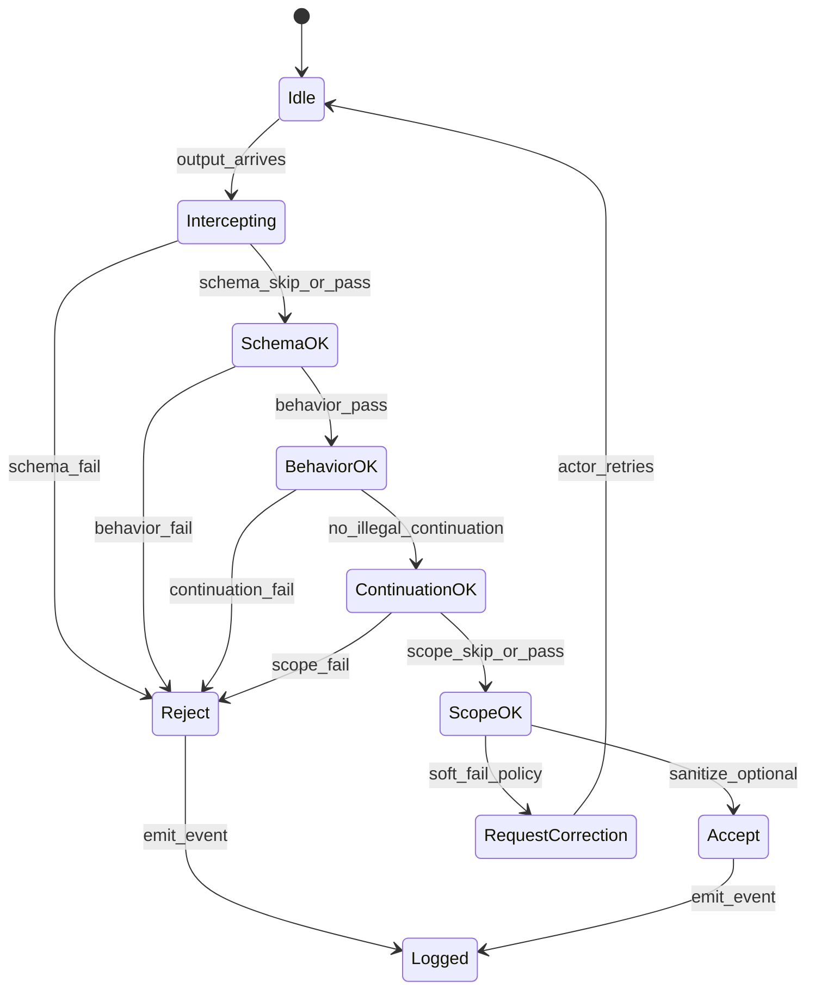

---
lupopedia.headers:
  header_format_version: "4.1.8"
  path_from_lupopedia_root: docs/prd/53_A-i_RUNTIME_GUARD.md
  web_path: https://www.lupopedia.com/lupopedia/docs/prd/53_A-i_RUNTIME_GUARD.md
  status: draft
  when_updated: '20260513033046'
  trust_tier: canonical
  questions_toon: null
  memory_toon: memory/development/canonical/1026/04/53_runtime_guard.toon
  atoms_toon: null
  transcript_jsonl: 0/development/53-runtime-guard
  artifact_type: prd
  artifact_kind: specification
  channel_key: development
  federation_node_id: 0
  thread_key: null
  lupopedia.schema: prd
  prd_cluster: 53_A-i_00_A-i_FORBIDDEN_AND_WHY_53_A_RUNTIME_GUARD
  title: 'PRD 53: AI Actor Runtime Guard (Enforcement Layer)'
  summary: 'Runtime guard: PRD 61 invariant alignment; full violation set; deterministic pipeline ordering; contract surfaces; browser-tab ban; collection+faucet+channel; PRD 00 anchor; termination registry; edges 50/52/54/56/58/60/61.'
---
# PRD 53: AI Actor Runtime Guard (Enforcement Layer)

## 0. PRD number note

The **master outline** referred to this work as **PRD 52**. In this repository **PRD 52** is **[52_memory_graph_focus_manifest.md](52_memory_graph_focus_manifest.md)** (Memory Graph Focus Manifest). This specification is **PRD 53** to avoid collision. Cross-links and tooling **SHOULD** use **`pk_id: 53`** and path **`docs/prd/53_runtime_guard.md`**.

## Canonical clarification: what a channel is (and is not)

In Lupopedia, a channel is a semantic container inside a domain (node).
It is NOT a Discord room, Slack channel, chat feed, or conversation thread.

**Hierarchy**

```text
Domain (node)
  -> Channel (semantic container)
      -> Thread (artifact)
          -> Messages, memory, atoms, PRDs, and other scoped artifacts
```

**Definition**

- **Channel** = a governed semantic container that defines scope, meaning, and memory boundaries.
- **Thread** = a single conversational artifact inside a channel.
- **Threads do not contain channels. Channels contain threads.**

**Required warning (normative where channels are defined):** Channels are semantic containers, not conversational rooms. They define scope, governance, and meaning for all threads within them.

**Schema keys:** `channel_key`, `channel_id`, and related channel metadata keep their existing names; this section clarifies semantics only (no field renames).

## 1. Purpose

Define the **runtime enforcement layer** that evaluates **AI actor outputs and side effects** against Lupopedia doctrine: **artifact-only** responses where required, **examiner termination** tokens, **role separation**, **anti-parrot** behavior, and **collection-scoped** reasoning when a collection context is active.

The guard is **policy machinery**; normative **human-facing prose** for probes and knowledge updates remains in [`AI_ACTOR_COMPETENCY_TEST_PATTERN.md`](../doctrine/AI_ACTOR_COMPETENCY_TEST_PATTERN.md), [`AI_ACTOR_PROBE_HARNESS_AND_GUARDS.md`](../doctrine/AI_ACTOR_PROBE_HARNESS_AND_GUARDS.md), and [PRD 50 section 1.2???1.4](50_agent_coordination_protocol.md).

**PRD 61 (Doctrine consolidation):** The twelve invariants in **[PRD 61 section 2](61_doctrine_consolidation_shorthand_compiler.md)** are the **cross-PRD checklist** this guard helps enforce ??? especially **violation codes**, **contract surfaces**, **browser-tab prohibition**, **deterministic ordering**, **faucet** / **channel-thread** validation, **collection scope**, **ingestion-mode** signals, and **provenance actor** on **`guard_event`**.

## 2. Definitions

| Term | Definition |
|------|------------|
| **Actor output** | Text (and optional attachments) produced by a facet model **after** orchestrator instructions, before persistence or transcript commit. |
| **Artifact** | A bounded machine- or human-inspected block (e.g. fenced code) defined by the active **probe harness** or product rule. |
| **STOP / termination** | Examiner-issued closure for a probe thread. **Normative token:** **`<TEST_COMPLETE>`** ([PRD 50](50_agent_coordination_protocol.md) section 1.2). Implementations **MAY** register additional tokens in a **termination registry** (JSON, see section 7). |
| **Self-grading** | Examinee language that asserts pass/fail, score, or ???correct??? compliance without examiner verdict. |
| **Continuation after termination** | Any probe-scoped output after a valid termination token for that probe. |
| **Parrot loop** | Mirroring the other party???s last message without examiner instruction ([PRD 50](50_agent_coordination_protocol.md)). |
| **Role collision** | Same round treats one identity as both examiner and examinee. |
| **Collection scope** | Active **`memory_key`** / **`collection_id`** / payload **nodes** set from [PRD 50](50_agent_coordination_protocol.md) section 1.4 after **`Collection loaded.`** |
| **Pipeline stage** | One ordered step in section 4; each stage **MAY** emit a **guard_event** (section 7). |

## 3. Responsibilities

The runtime guard **MUST** be able to:

1. **Artifact-only enforcement** ??? When the active harness declares **artifact-only**, reject outputs that lack the expected artifact envelope or contain forbidden prose outside allowed regions.
2. **Termination enforcement** ??? After **`<TEST_COMPLETE>`** (or registered equivalent) for probe **P**, flag any further **P**-scoped output as **`ACTOR_CONTINUED_AFTER_TERMINATION`**.
3. **Self-grading detection** ??? Match configurable phrase patterns and structural cues; map to **`ACTOR_SELF_EVAL_FORBIDDEN`**.
4. **Continuation-after-artifact** ??? When policy requires ???single artifact then silence,??? flag extra probe content as violation (profile: **probe_runtime**; align with [`probe_runtime_guard.py`](../../scripts/probe_runtime_guard.py)).
5. **Parrot loop detection** ??? Compare **n**-gram / line-equality windows against prior examiner/examinee turns; map to **`ACTOR_PARROT_LOOP`**.
6. **Role boundary** ??? Validate declared roles in session metadata; map to **`ACTOR_ROLE_COLLISION`**.
7. **Collection scope** ??? When **`active_collection_context`** is set, detect citations of paths, titles, or **node_ids** not present in the loaded payload; map to **`ACTOR_OUT_OF_COLLECTION_SCOPE`**.
8. **Schema validation** ??? When an **expected artifact schema** is attached to the probe, validate JSON/YAML/code shape; map to **`ACTOR_SCHEMA_VIOLATION`**.
9. **Emit structured events** ??? All decisions **MUST** be representable as **guard_event** records (section 7) for transcript filter and compliance layer.

**Non-goals:** Replace **PDO_DB**, **AuthGuard**, or channel ACLs; replace human **WOLFIE** adjudication for ambiguous cases.

### 3.1 Contract surfaces (normative)

| Surface | Guard obligation |
|---------|------------------|
| **Input contract** | When the active harness declares **artifact-only**, the guard **MUST** treat only the **harness-delimited artifact** as the graded input surface ??? not mixed chat, not parallel instruction blobs. |
| **Output contract** | The guard **MUST** reject **commentary** that substitutes for the required artifact and **MUST** map self-grade / pass-fail narrative to **`ACTOR_SELF_EVAL_FORBIDDEN`**. |
| **Termination contract** | **`<TEST_COMPLETE>`** (and registry equivalents scoped **examiner-only**) **MUST** hard-close probe **P** per section **7.2.1**; examinee emission is forbidden unless explicitly designated (same subsection). |

### 3.2 Browser-tab and ambient context

**Normative:** Browser tab metadata **MUST NOT** be treated as instruction input (including **`edge_all_open_tabs`** hints).

### 3.3 Collection-scoped reasoning

**Normative:** The guard **MUST** reject references **outside** the **active collection** (authorized payload / **`nodes[]`** closure) unless the orchestrator **explicitly** authorizes expansion; map failures to **`ACTOR_OUT_OF_COLLECTION_SCOPE`** (or **`COLLECTION_PAYLOAD_INVALID`** when the payload itself is malformed).

### 3.4 Faucet metadata and channel scope

- **Missing or incorrect faucet metadata MUST be flagged as `ACTOR_SCHEMA_VIOLATION`** when policy requires a faucet envelope on the path under enforcement.
- **Actors MUST validate `channel_id` and `thread_id`** against channel registry and **membership** before writing artifacts; the guard **MUST** treat invalid combinations as **`ACTOR_SCHEMA_VIOLATION`** and **MUST NOT** allow persistence-bound commits for that turn.

### 3.5 Deterministic ordering (collection-shaped artifacts)

When validating **collection payload v1.0.0** artifacts or compiler output, the guard **MUST** enforce **deterministic ordering** per [`collection_payload_format_v1_0_0.md`](../doctrine/collection_payload_format_v1_0_0.md) section **1.2**: **`tabs[]`** sorted by **`tab_id`**; **`tabs[].node_ids[]`** preserves tab member order; **`nodes[]`** and **`nodes[].edges[]`** follow documented **SHOULD** sort keys so audit hashes are stable.

## 4. Guard pipeline

Stages run in **fixed ordinal order** (**1 ??? 8** below); any stage **MUST NOT** be skipped or reordered for audit reproducibility unless a **documented scoped exception** exists ([PRD 61 section 2](61_doctrine_consolidation_shorthand_compiler.md) invariant **4** ??? deterministic ordering). Any stage **MAY** short-circuit to **reject** or **request_correction**.

| Stage | Role |
|-------|------|
| **1. Input interceptor** | Attach **session_id**, **probe_id**, **actor_id**, **active_collection_context** snapshot; strip non-normative transport wrappers. |
| **2. Schema validator** | If **expected_artifact_schema** present, validate artifact extract. |
| **3. Behavior validator** | Self-grade, parrot, role patterns. |
| **4. Continuation detector** | Termination token present in history; output chronology after token. |
| **5. Role boundary checker** | Examiner vs examinee consistency for the round. |
| **6. Collection scope checker** | If collection active, reference allow-list from ingested **nodes**. |
| **7. Output sanitizer** | Optional redaction for transcript storage (not for training on secrets). |
| **8. Termination enforcer** | Hard-stop further tool calls for probe **P** when configured. |

### 4.1 State machine (normative control flow)



### 4.2 Constitutional state-machine anchor

The **canonical** multi-machine graphs (**probe**, **knowledge update**, **collection ingestion**, **orchestrator scheduling**, **HERMES routing**) are defined in **[PRD 00 section 21.4](../prd/00_root_constitutional_system_requirements.md)**. **Section 4.1** above is the **PRD 53 enforcement pipeline** (idle ??? intercept ??? ??? ??? logged); it **specialises** guard stages **MUST NOT** introduce end states or transitions that **contradict** PRD 00???s constitutional transition intent.

## 5. Violation types

**Authoritative semantics:** [PRD 00 section 21.2](../prd/00_root_constitutional_system_requirements.md). PRD 53 **MUST** map detector output to the same string identifiers.

| Code | Meaning |
|------|---------|
| `ACTOR_SELF_EVAL_FORBIDDEN` | Self-grading or unsolicited pass/fail ([PRD 50](50_agent_coordination_protocol.md) section 1.2). |
| `ACTOR_PARROT_LOOP` | Disallowed mirroring ([PRD 50](50_agent_coordination_protocol.md) section 1.2). |
| `ACTOR_ROLE_COLLISION` | Conflicting examiner/examinee assignment. |
| `ACTOR_CONTINUED_AFTER_TERMINATION` | Output after valid probe termination ([PRD 50](50_agent_coordination_protocol.md) section 1.2). |
| `KNOWLEDGE_ACK_INVALID` | Required first-line ack not exactly **`Node received.`** when the knowledge / collection protocol demands it. |
| `ACTOR_OUT_OF_COLLECTION_SCOPE` | Reference outside ingested collection ([PRD 50](50_agent_coordination_protocol.md) section 1.4). |
| `ACTOR_SCHEMA_VIOLATION` | Artifact or message failed JSON/YAML/structural schema; invalid **`channel_id` / `thread_id`**; missing/incorrect faucet envelope when required; PRD 16 header violations on the write path. |
| `PROBE_BOUNDARY_VIOLATION` | No extractable artifact per harness ([PRD 50](50_agent_coordination_protocol.md) section 1.2); align with [`probe_runtime_guard.py`](../../scripts/probe_runtime_guard.py). |
| `EXTERNAL_ACTOR_UNCONSTRAINED` | External / web agent outside containment and doctrine envelope. |
| `COLLECTION_PAYLOAD_INVALID` | Collection JSON fails required keys, **`collection_payload_version`**, or shape ([`collection_payload_format_v1_0_0.md`](../doctrine/collection_payload_format_v1_0_0.md)). |
| `COLLECTION_NODE_ID_COLLISION` | Duplicate **`nodes[].node_id`** in one payload or unstable correlators. |

## 6. Guard actions

| Action | When | Effect |
|--------|------|--------|
| **Reject output** | Hard policy breach | Do not commit to transcript; return error to orchestrator. |
| **Request correction** | Soft policy | Return structured hint + violation code; allow one retry (configurable). |
| **Terminate probe** | After termination token or fatal breach | Close probe handle; further messages require new **probe_id**. |
| **Log violation** | Always on decision | Append **guard_event** + optional **`lupo_memory_nodes`** audit row ([PRD 38](38_memory_unification.md)). |
| **Update compliance score** | Non-fatal / fatal | Delegate to [PRD 54](54_actor_compliance.md) hooks. |

## 7. JSON shapes (normative examples)

### 7.1 `guard_event` (audit record)

```json
{
  "guard_event_version": "1.0.0",
  "event_id": "20260412115019-001",
  "probe_id": "probe-uuid-or-thread-key",
  "session_id": "session-key",
  "actor_id": 102,
  "federation_node_id": 1,
  "violation_code": "ACTOR_SCHEMA_VIOLATION",
  "pipeline_stage": "schema_validator",
  "decision": "reject",
  "message_digest_sha256": "hex???",
  "active_collection_id": null,
  "active_memory_key": null,
  "provenance_tool": "runtime_guard_v0",
  "created_ymdhis": 20260412115019
}
```

### 7.2 `termination_registry` fragment (config)

```json
{
  "termination_tokens": [
    { "token": "<TEST_COMPLETE>", "scope": "probe", "issuer_role": "examiner" }
  ]
}
```

#### 7.2.1 Termination registry constraints (normative)

- **Termination tokens MUST be examiner-only** for their registered **`scope`** (default probe scope: only the designated **examiner** actor for that **`probe_id`**).
- **Termination tokens MUST NOT be emitted by the examinee** unless a registry row **explicitly** sets **`issuer_role`** (or equivalent) to allow that actor class ??? default configuration **MUST** forbid examinee-issued closures.
- **Implementations MUST** reject examinee-originated termination strings as **`ACTOR_SCHEMA_VIOLATION`** or **`ACTOR_ROLE_COLLISION`** per policy table (never silent accept).

### 7.3 `expected_artifact_schema` (Draft 2020-12 style sketch)

```json
{
  "$schema": "https://json-schema.org/draft/2020-12/schema",
  "type": "object",
  "required": ["artifact_kind", "body"],
  "properties": {
    "artifact_kind": { "type": "string" },
    "body": { "type": "string" }
  }
}
```

## 8. Examples

**Example A (schema pass):** Examinee returns one fenced PHP block; schema validator confirms keys; behavior validator sees no self-grade; output **Accept**.

**Example B (collection scope fail):** Active collection contains only `docs/prd/53_runtime_guard.md`; examinee cites `docs/prd/99_other.md`; guard emits **`ACTOR_OUT_OF_COLLECTION_SCOPE`**.

## 9. Normative documentation graph (outbound edges)

| From | To | `edge_type` | `relationship` |
|------|-----|-------------|----------------|
| `53_runtime_guard.md` | `docs/prd/00_root_constitutional_system_requirements.md` | `doctrine_rule` | `constitutional_anchor_state_machines` |
| `53_runtime_guard.md` | `docs/prd/50_agent_coordination_protocol.md` | `doctrine_rule` | `coordinates_probes` |
| `53_runtime_guard.md` | `docs/prd/52_memory_graph_focus_manifest.md` | `doctrine_rule` | `graph_focus_lens` |
| `53_runtime_guard.md` | `docs/prd/54_actor_compliance.md` | `doctrine_rule` | `violations_recorded` |
| `53_runtime_guard.md` | `docs/prd/56_probe_harness_v2.md` | `doctrine_rule` | `probe_harness_v2` |
| `53_runtime_guard.md` | `docs/prd/58_transcript_filter.md` | `doctrine_rule` | `transcript_classification` |
| `53_runtime_guard.md` | `docs/prd/60_orchestrator_scheduler.md` | `doctrine_rule` | `orchestrator_scheduler` |
| `53_runtime_guard.md` | `docs/prd/38_memory_unification.md` | `doctrine_rule` | `audit_memory_graph` |
| `53_runtime_guard.md` | `docs/doctrine/AI_ACTOR_PROBE_HARNESS_AND_GUARDS.md` | `doctrine_rule` | `harness_alignment` |
| `53_runtime_guard.md` | `docs/prd/61_doctrine_consolidation_shorthand_compiler.md` | `doctrine_rule` | `invariant_checklist_enforcement` |

## 10. Federation node rules

- **`federation_node_id: 0`** ??? Repository / spec authoring default for this PRD file.
- **Runtime guard instances** **MUST** tag **`guard_event.federation_node_id`** with the **node under test** (typically **`1`** for local install).
- **Cross-node** enforcement **MUST NOT** assume another node???s transcript without explicit federation policy ([PRD 09](09_federation_sync.md), [PRD 34](34_federation_node_semantic_network.md)).

## 11. Provenance rules

- Every **guard_event** **MUST** include **`provenance_tool`** (implementation name + version).
- When the guard writes **`lupo_memory_edges`** for audit, **`provenance_actor_id`** **MUST** be the **orchestrator** or **system** actor per registry; **MUST NOT** spoof examinee **`actor_id`**.

## 12. Memory graph integration

- Optional **audit nodes** (e.g. `memory_type: guard_violation`) **MAY** be inserted into **`lupo_memory_nodes`** with **`owner_actor_id`** = subject actor or system policy.
- **Edges** to related doctrine nodes **MUST** use **`lupo_memory_edges`** (**node-to-node** only) per [PRD 38](38_memory_unification.md).
- **Collection payloads** consumed per [collection payload format v1.0.0](../doctrine/collection_payload_format_v1_0_0.md) supply the allow-list for **collection scope** checks.

## 13. Actor role definitions

| Role | Responsibility |
|------|----------------|
| **Orchestrator** | Human or trusted actor; sets **probe_id**, roles, harness profile, **ingestion_mode**. |
| **Examiner** | Issues tasks and **only** examiner may emit **`<TEST_COMPLETE>`** for that probe. |
| **Examinee** | Target model; outputs artifacts; **MUST NOT** self-grade. |
| **Auditor** (e.g. LILITH) | May consume **guard_event** stream; **MUST NOT** widen examinee permissions ([`lilith-noninterference-doctrine.md`](../../rules/root/lilith-noninterference-doctrine.md) ??? LIL001). |

## 14. Compliance rules summary

- Guard **detects**; [PRD 54](54_actor_compliance.md) **records** and **scores**; [PRD 60](60_orchestrator_scheduler.md) **adjusts** scheduling. No single component owns all three.

## 15. Related specifications

- [PRD 50](50_agent_coordination_protocol.md), [PRD 38](38_memory_unification.md), [PRD 52](52_memory_graph_focus_manifest.md) (Focus Manifest ??? traversal lens, not substitute for guard).
- [PRD 56](56_probe_harness_v2.md), [PRD 58](58_transcript_filter.md), [PRD 60](60_orchestrator_scheduler.md), [PRD 61](61_doctrine_consolidation_shorthand_compiler.md).
- [`collection_payload_format_v1_0_0.md`](../doctrine/collection_payload_format_v1_0_0.md) ??? **inbound** documentation edge **`feeds_runtime_guard`** (see that file???s graph table).

---

This output complies with Lupopedia Constitutional Root Rules.
