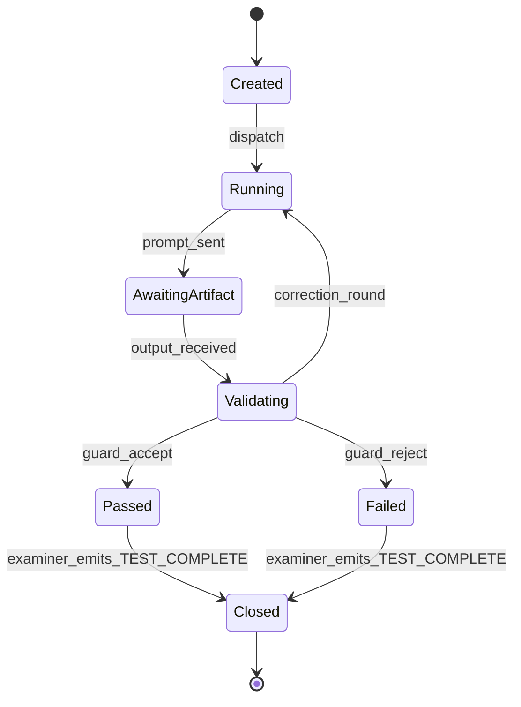

---
lupopedia.headers:
  header_format_version: "4.1.8"
  path_from_lupopedia_root: docs/prd/56_A-i_PROBE_HARNESS_V2.md
  web_path: https://www.lupopedia.com/lupopedia/docs/prd/56_A-i_PROBE_HARNESS_V2.md
  status: draft
  when_updated: '20260513033046'
  trust_tier: canonical
  questions_toon: null
  memory_toon: memory/development/canonical/1026/04/56_probe_harness_v2.toon
  atoms_toon: null
  transcript_jsonl: 0/development/56-probe-harness-v2
  artifact_type: prd
  artifact_kind: specification
  channel_key: development
  federation_node_id: 0
  thread_key: null
  lupopedia.schema: prd
  prd_cluster: 56_A-i_00_A-i_FORBIDDEN_AND_WHY_56_A_PROBE_HARNESS_V2
  title: 'PRD 56: Probe Harness v2 (Controlled AI Actor Testing)'
  summary: 'Probe harness v2: PRD 61+00 alignment; full violations; deterministic multi-artifact/schema/collection order; faucet+channel+ingestion+provenance; termination registry; state PRD 00 section 21.4; edges 00/50/52-54/58/60/61.'
---
# PRD 56: Probe Harness v2 (Controlled AI Actor Testing)

## Canonical clarification: what a channel is (and is not)

In Lupopedia, a channel is a semantic container inside a domain (node).
It is NOT a Discord room, Slack channel, chat feed, or conversation thread.

**Hierarchy**

```text
Domain (node)
  -> Channel (semantic container)
      -> Thread (artifact)
          -> Messages, memory, atoms, PRDs, and other scoped artifacts
```

**Definition**

- **Channel** = a governed semantic container that defines scope, meaning, and memory boundaries.
- **Thread** = a single conversational artifact inside a channel.
- **Threads do not contain channels. Channels contain threads.**

**Required warning (normative where channels are defined):** Channels are semantic containers, not conversational rooms. They define scope, governance, and meaning for all threads within them.

**Schema keys:** `channel_key`, `channel_id`, and related channel metadata keep their existing names; this section clarifies semantics only (no field renames).

## 1. Purpose

Define **Probe Harness v2**, the successor operational pattern to ad-hoc scripting + [`probe_runtime_guard.py`](../../scripts/probe_runtime_guard.py) alone. The harness **delivers** reproducible probe packages, **binds** [collection payload v1.0.0](../doctrine/collection_payload_format_v1_0_0.md) when needed, **enforces** termination, and **coordinates** with [PRD 53](53_runtime_guard.md), [PRD 54](54_actor_compliance.md), [PRD 58](58_transcript_filter.md), and [PRD 60](60_orchestrator_scheduler.md).

**Relationship to v1 docs:** [`AI_ACTOR_PROBE_HARNESS_AND_GUARDS.md`](../doctrine/AI_ACTOR_PROBE_HARNESS_AND_GUARDS.md) remains conceptual background; **this PRD** is the **product-shaped** interface.

### 1.1 Contract surfaces (constitutional alignment)

Harness packaging and dispatch **MUST** align with **[PRD 00 section 21.3](../prd/00_root_constitutional_system_requirements.md)** and **[PRD 50 section 1.5](50_agent_coordination_protocol.md)**:

- **Input contract** ??? When **artifact-only** is declared, the harness **MUST** deliver instructions and payloads so the **only** graded input surface is the harness-defined artifact envelope (no mixed **edge_all_open_tabs** blobs as co-instructions).
- **Output contract** ??? The harness **MUST** route examinee output through [PRD 53](53_runtime_guard.md) expecting **no** self-grade or commentary-as-artifact substitutions.
- **Termination contract** ??? **`<TEST_COMPLETE>`** (and registry equivalents) **MUST** be **examiner-only**; see **section 5.4.1**.

### 1.2 Violation codes (canonical set)

**Authoritative semantics:** [PRD 00 section 21.2](../prd/00_root_constitutional_system_requirements.md). The harness **MUST** surface the **same** **`violation_code`** strings to the guard and compliance layers (no aliases):

| Code | Harness touchpoint |
|------|--------------------|
| `ACTOR_SELF_EVAL_FORBIDDEN` | Capture + guard phrase pass. |
| `ACTOR_PARROT_LOOP` | Multi-turn compare windows. |
| `ACTOR_ROLE_COLLISION` | Header **`examiner_actor_id` / `examinee_actor_id`** validation. |
| `ACTOR_CONTINUED_AFTER_TERMINATION` | Post-close capture attempts. |
| `KNOWLEDGE_ACK_INVALID` | Knowledge / collection ack line checks before **`Collection loaded.`** path. |
| `ACTOR_OUT_OF_COLLECTION_SCOPE` | Active collection allow-list vs examinee citations. |
| `ACTOR_SCHEMA_VIOLATION` | Schema, faucet envelope, **`channel_id` / `thread_id`**, header failures. |
| `PROBE_BOUNDARY_VIOLATION` | Missing fenced / expected artifact. |
| `EXTERNAL_ACTOR_UNCONSTRAINED` | External-band containment flags. |
| `COLLECTION_PAYLOAD_INVALID` | Payload compile/validate gate before dispatch. |
| `COLLECTION_NODE_ID_COLLISION` | Deterministic **`node_id`** uniqueness check on ingest. |

### 1.3 PRD 61 invariant alignment (normative)

This PRD **implements** the probe / harness slice of **[PRD 61 section 2](61_doctrine_consolidation_shorthand_compiler.md)**: **violation codes** ??? **section 1.2**; **contract surfaces** ??? **section 1.1** + PRD 00 **21.3**; **browser-tab prohibition** ??? **section 3.1**; **deterministic ordering** ??? **section 3.1** (including **multi-artifact sequences** ??? fixed JSON array order, **no** shuffle); **faucet** / **channel-thread** ??? **section 3.1**; **collection scope** ??? **section 3.1**; **state machines** ??? **section 6** + **6.1**; **ingestion-mode** ??? **section 3.1**; **provenance actor** ??? **section 11**; **doctrine graph** ??? **section 9**.

## 2. Definitions

| Term | Definition |
|------|------------|
| **Probe package** | One versioned object: header + body + schemas + hooks (section 5). |
| **Level (L1???L5)** | Complexity tier (section 4). |
| **Capture** | Persist examinee output + metadata for audit. |
| **Clean close** | Examiner **`<TEST_COMPLETE>`** + harness flushes buffers + compliance finalizes score. |

## 3. Harness responsibilities

1. Deliver **probe instructions** to the examinee channel with stable **`probe_id`**.
2. Deliver **collection payloads** when the probe declares **`requires_collection: true`** ([PRD 50](50_agent_coordination_protocol.md) section 1.4).
3. Enforce **termination** visibility to [PRD 53](53_runtime_guard.md) (token registry).
4. **Capture** artifacts verbatim (before sanitizer) to encrypted-at-rest storage if policy requires.
5. Run **schema validation** via guard stage 2.
6. **Detect violations** using shared **violation_code** enum ([PRD 53](53_runtime_guard.md) section 5).
7. **Close cleanly**: freeze transcript segment; notify [PRD 58](58_transcript_filter.md) for segmentation pass.

### 3.1 Normative harness constraints

- **Browser-tab context:** The probe harness **MUST** ignore browser-tab metadata (**`edge_all_open_tabs`** and similar) as **instruction input** when assembling **probe packages** or **dispatch** payloads.
- **Deterministic ordering ([PRD 61](61_doctrine_consolidation_shorthand_compiler.md) invariant 4):** The harness **MUST** enforce **deterministic ordering** for: **(a)** multiple **artifacts** within a package (**lexicographic `id`**, declared **`artifacts_expected[]`** order, or monotonic **`ordinal`** ??? pick one per package version and document it); **(b)** **schemas** referenced by URI (stable sort by URI string); **(c)** **multi-artifact sequences** ??? **`artifacts_expected[]`** **MUST** be processed in **ascending array index order** only (same fingerprint ??? same extract order for audit); **(d)** **collection payload** delivery steps (validate ??? send single JSON object per [PRD 50](50_agent_coordination_protocol.md) section **1.4.2** ??? no interleaved chat).
- **Faucet identity:** **Missing or incorrect faucet metadata** (when required) **MUST** be flagged as **`ACTOR_SCHEMA_VIOLATION`** before dispatch.
- **Channel / thread:** The harness **MUST** validate **`channel_id`** and **`thread_id`** against registry + membership **before** dispatching **probe instructions** to a write-bound or channel-posting path.
- **Collection-scoped reasoning:** The harness **MUST** **reject** examinee references **outside** the **active collection** unless the orchestrator **explicitly** authorizes expansion (surface **`ACTOR_OUT_OF_COLLECTION_SCOPE`** via guard).
- **Ingestion mode:** The harness **MUST NOT** run **L3**, **L4**, or **L5** probes when **`ingestion_mode`** is **read-only**; **L1/L2** **MAY** run subject to artifact-only policy ([PRD 60](60_orchestrator_scheduler.md) scheduling alignment).
- **Provenance actor:** The harness **MUST NOT** attribute **violations**, **probe metadata**, or **capture** rows to the wrong **`actor_id`**; stamped header IDs **MUST** match server-resolved session identities ([PRD 54](54_actor_compliance.md) section **11**, [PRD 53](53_runtime_guard.md) section **11**).

## 4. Probe types (levels)

| Level | Description | Typical harness features |
|-------|-------------|-------------------------|
| **L1** | Output discipline | Single artifact, schema optional. |
| **L2** | Multi-artifact | Ordered extracts, multiple schemas. |
| **L3** | Mutation | Requires **read-write** **`ingestion_mode`** sandbox; rollback plan. |
| **L4** | Adversarial audit | Stricter parrot/role checks; may include **red team** examiner script. |
| **L5** | Multi-actor | Two+ examinees or examiner automation; **MUST** use [PRD 50](50_agent_coordination_protocol.md) section 1.2. |

## 5. Harness structure

### 5.1 Probe header (JSON)

```json
{
  "probe_package_version": "2.0.0",
  "probe_id": "uuid",
  "level": "L2",
  "examiner_actor_id": 1,
  "examinee_actor_id": 102,
  "requires_collection": false,
  "collection_memory_key": null,
  "termination_tokens": ["<TEST_COMPLETE>"],
  "expected_artifact_schema": null,
  "guard_profile": "strict",
  "federation_node_id": 1
}
```

### 5.2 Probe body

Human- or machine-readable **instructions** (Markdown **SHOULD** use LUPOPEDIA HEADERS when stored as repo file).

### 5.3 Expected artifact schema

JSON Schema or language-specific grammar reference (URI or embedded).

### 5.4 Termination token

**MUST** include **`<TEST_COMPLETE>`** unless a **registered** alternative is approved in writing for a closed environment.

#### 5.4.1 Termination registry constraints (normative)

- **Termination tokens MUST be examiner-only** for their registered scope (default: only **`examiner_actor_id`** in the **probe header** may emit **`<TEST_COMPLETE>`** for that **`probe_id`**).
- **Examinee MUST NOT emit termination tokens** unless a **registry row** explicitly authorizes that actor class (default: **forbidden**).
- **Harness MUST reject examinee-emitted STOP tokens** (including strings visually similar to **`<TEST_COMPLETE>`** when policy enables fuzzy match) as **`ACTOR_SCHEMA_VIOLATION`** or **`ACTOR_ROLE_COLLISION`** ??? **never** treat them as a valid close.

### 5.5 Compliance hooks

References **`hook_point`** values from [PRD 54](54_actor_compliance.md) section 6.

## 6. State machine ??? probe lifecycle



### 6.1 Constitutional state-machine anchoring

The **probe lifecycle** graph above **MUST** remain consistent with the **constitutional** **probe** state machine in **[PRD 00 section 21.4](../prd/00_root_constitutional_system_requirements.md)** (INIT through TERMINATE intent). This PRD???s **Created ??? ??? ??? Closed** diagram is a **harness operational refinement** and **MUST NOT** re-open a **Closed** probe without a **new** **`probe_id`**.

## 7. Integration points

| System | Integration |
|--------|-------------|
| **Runtime Guard** | [PRD 53](53_runtime_guard.md) ??? all **post_response** checks. |
| **Scheduler** | [PRD 60](60_orchestrator_scheduler.md) ??? allocates examiner/examinee slots. |
| **Transcript Filter** | [PRD 58](58_transcript_filter.md) ??? emits **clean** transcript + audit log. |
| **Compliance Layer** | [PRD 54](54_actor_compliance.md) ??? scores on **Closed**. |

## 8. Example ??? L2 multi-artifact snippet

```json
{
  "artifacts_expected": [
    { "id": "php_fragment", "language": "php", "fenced": true },
    { "id": "json_manifest", "schema_ref": "lupo://schemas/probe_manifest_v1.json" }
  ]
}
```

## 9. Normative documentation graph (outbound edges)

**Hub note:** Includes **PRD 00** (constitutional contracts + graphs), **PRD 52** (focus manifest for graph-backed probes), **PRD 58** (transcript segmentation + **clean** close), **PRD 60** (slot allocation), plus guard/compliance/coordination.

| From | To | `edge_type` | `relationship` |
|------|-----|-------------|----------------|
| `56_probe_harness_v2.md` | `docs/prd/00_root_constitutional_system_requirements.md` | `doctrine_rule` | `constitutional_contracts_state_machines` |
| `56_probe_harness_v2.md` | `docs/prd/50_agent_coordination_protocol.md` | `doctrine_rule` | `probe_protocol` |
| `56_probe_harness_v2.md` | `docs/prd/52_memory_graph_focus_manifest.md` | `doctrine_rule` | `graph_focus_lens` |
| `56_probe_harness_v2.md` | `docs/prd/53_runtime_guard.md` | `doctrine_rule` | `enforcement` |
| `56_probe_harness_v2.md` | `docs/prd/54_actor_compliance.md` | `doctrine_rule` | `compliance_hooks` |
| `56_probe_harness_v2.md` | `docs/prd/58_transcript_filter.md` | `doctrine_rule` | `telemetry_hygiene` |
| `56_probe_harness_v2.md` | `docs/prd/60_orchestrator_scheduler.md` | `doctrine_rule` | `slot_allocation` |
| `56_probe_harness_v2.md` | `docs/doctrine/collection_payload_format_v1_0_0.md` | `doctrine_rule` | `optional_payload` |

## 10. Federation node rules

**`probe_package.federation_node_id`** **MUST** match the environment under test; **MUST NOT** run **L3** mutation probes against production peer nodes without explicit ops policy.

## 11. Provenance rules

**`provenance_tool`** on harness-generated rows **MUST** identify harness name + semver. **`examiner_actor_id`**, **`examinee_actor_id`**, and any **`provenance_actor_id`** fields on captured rows **MUST** match **server-resolved** identities ??? the harness **MUST NOT** stamp a spoofed examinee id for violations or probe metadata ([PRD 53](53_runtime_guard.md) section **11**, [PRD 54](54_actor_compliance.md) section **11**).

## 12. Memory graph integration

Store **probe summary** nodes linking to **doctrine** fragments remediated after failure (same pattern as [AI_ACTOR_KNOWLEDGE_UPDATE_PROTOCOL.md](../doctrine/AI_ACTOR_KNOWLEDGE_UPDATE_PROTOCOL.md)).

## 13. Actor role definitions

Same as [PRD 53](53_runtime_guard.md) section 13; harness **MUST** stamp roles into **probe header** to avoid collision.

## 14. Related specifications

- [PRD 00](00_root_constitutional_system_requirements.md) (sections **21.2???21.4**), [PRD 50](50_agent_coordination_protocol.md), [PRD 52](52_memory_graph_focus_manifest.md), [PRD 53](53_runtime_guard.md), [PRD 54](54_actor_compliance.md), [PRD 58](58_transcript_filter.md), [PRD 60](60_orchestrator_scheduler.md), [PRD 61](61_doctrine_consolidation_shorthand_compiler.md), [`AI_ACTOR_PROBE_HARNESS_AND_GUARDS.md`](../doctrine/AI_ACTOR_PROBE_HARNESS_AND_GUARDS.md).

---

This output complies with Lupopedia Constitutional Root Rules.
