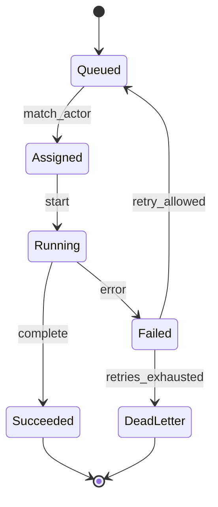

---
lupopedia.headers:
  header_format_version: "4.1.8"
  path_from_lupopedia_root: docs/prd/60_A-i_ORCHESTRATOR_SCHEDULER.md
  web_path: https://www.lupopedia.com/lupopedia/docs/prd/60_A-i_ORCHESTRATOR_SCHEDULER.md
  status: draft
  when_updated: '20260513033046'
  trust_tier: canonical
  questions_toon: null
  memory_toon: memory/development/canonical/1026/04/60_orchestrator_scheduler.toon
  atoms_toon: null
  transcript_jsonl: 0/development/60-orchestrator-scheduler
  artifact_type: prd
  artifact_kind: specification
  channel_key: development
  federation_node_id: 0
  thread_key: null
  lupopedia.schema: prd
  prd_cluster: 60_A-i_00_A-i_FORBIDDEN_AND_WHY_60_A_ORCHESTRATOR_SCHEDULER
  title: 'PRD 60: Orchestrator Scheduler (Tasks, Context, Collections)'
  summary: 'Orchestrator scheduler: PRD 61+00 alignment; five contracts + full violation escalate/fallback/quarantine; deterministic task queues+persona; faucet/channel/collection; read-only blocks L3-L5; provenance; graph 00/38/50-61/60 self-ref.'
---
# PRD 60: Orchestrator Scheduler (Tasks, Context, Collections)

## Canonical clarification: what a channel is (and is not)

In Lupopedia, a channel is a semantic container inside a domain (node).
It is NOT a Discord room, Slack channel, chat feed, or conversation thread.

**Hierarchy**

```text
Domain (node)
  -> Channel (semantic container)
      -> Thread (artifact)
          -> Messages, memory, atoms, PRDs, and other scoped artifacts
```

**Definition**

- **Channel** = a governed semantic container that defines scope, meaning, and memory boundaries.
- **Thread** = a single conversational artifact inside a channel.
- **Threads do not contain channels. Channels contain threads.**

**Required warning (normative where channels are defined):** Channels are semantic containers, not conversational rooms. They define scope, governance, and meaning for all threads within them.

**Schema keys:** `channel_key`, `channel_id`, and related channel metadata keep their existing names; this section clarifies semantics only (no field renames).

## 1. Purpose

Define the **Orchestrator Scheduler**: how **tasks** move between **actors**, how **context** (collection, memory graph, probe) is **stacked** and **switched**, and how **failures** escalate. This PRD bridges **human operators**, **IDE facets**, and server-side workers without introducing Laravel-style middleware ([`no-laravel-no-middleware.md`](../../rules/root/no-laravel-no-middleware.md) ??? scheduler is **explicit** application code).

### 1.1 Contract surfaces (constitutional alignment)

The scheduler is the **bridge** between **human operators**, **IDE facets**, and **probe** / **task** execution. Scheduling and task packaging **MUST** enforce **[PRD 00 section 21.3](../prd/00_root_constitutional_system_requirements.md)** and **[PRD 50 section 1.5](50_agent_coordination_protocol.md)** across **all** contract surfaces below (no partial enforcement).

- **Input contract** ??? Only orchestrator-published instruction streams and **validated** payloads **MAY** drive **task_type** selection; when **artifact-only** is active, the scheduler **MUST NOT** treat **browser-tab** blobs or other non-orchestrator surfaces as instruction input (see **section 1.3**).
- **Output contract** ??? Queued work **MUST NOT** assume self-graded examinee output or **commentary-as-substitute** satisfies a probe; downstream **validation** remains subject to [PRD 53](53_runtime_guard.md) and [PRD 54](54_actor_compliance.md) (**no commentary, no self-grade** on graded paths).
- **Header contract** ??? Scheduler **MUST** propagate **LUPOPEDIA HEADERS** / probe-header fields that PRD 00 marks normative (**`examiner_actor_id`**, **`examinee_actor_id`**, **`ingestion_mode`**, faucet envelope, **`channel_id`**, **`thread_id`**, **`probe_id`**) only after **schema-valid** parse; invalid headers **MUST** surface **`ACTOR_SCHEMA_VIOLATION`** and follow **section 1.2**.
- **Collection contract** ??? Active collection frame, **collection payload** compile rules ([PRD 50](50_agent_coordination_protocol.md) section **1.4**), and **`node_id`** uniqueness **MUST** match PRD 00 collection rows in section **21.3**; violations **MUST** map to **`COLLECTION_PAYLOAD_INVALID`**, **`COLLECTION_NODE_ID_COLLISION`**, or **`ACTOR_OUT_OF_COLLECTION_SCOPE`** per **section 1.2**.
- **Termination contract** ??? **`<TEST_COMPLETE>`** (and **registry-equivalent** examiner termination tokens) **MUST** be **examiner-only**; the scheduler **MUST NOT** enqueue new **probe_id** work on a **closed** probe without a **new** round ([PRD 50](50_agent_coordination_protocol.md) section **1.2**, [PRD 56](56_probe_harness_v2.md) section **5.4.1**).

### 1.2 Violation codes (full canonical set)

The scheduler **MUST** interpret **`guard_event.violation_code`** and compliance signals using the **complete** canonical set in **[PRD 00 section 21.2](../prd/00_root_constitutional_system_requirements.md)** ??? **not** a PRD-53-only or PRD-54-only subset. For **every** code below, the scheduler **MUST** implement **escalate**, **fallback**, or **quarantine** behavior (policy tables **MAY** vary by deployment, but **MUST** be documented; default: **quarantine** unknown codes, **fallback** to **audit** for ambiguous ingest).

| Code | Scheduler obligation (escalate / fallback / quarantine) |
|------|-----------------------------------------------------------|
| `ACTOR_SELF_EVAL_FORBIDDEN` | **Fallback:** prefer **validation** / **audit** tasks; **throttle** **mutation** until reprobe. |
| `ACTOR_PARROT_LOOP` | **Escalate** to examiner review or **probe-mode** cooldown; **quarantine** repeat-offender **task_id** if policy requires. |
| `ACTOR_ROLE_COLLISION` | **Quarantine** dispatch until roles reconciled in **context manager**; **escalate** to orchestrator if stuck. |
| `ACTOR_CONTINUED_AFTER_TERMINATION` | **Hard-close** **probe_id** handle; **quarantine** further probe tasks until **new** envelope; **escalate** compliance snapshot. |
| `KNOWLEDGE_ACK_INVALID` | **Fallback:** requeue **ingestion** / knowledge handoff with explicit ack drill; **escalate** if repeated ([PRD 53](53_runtime_guard.md) alignment). |
| `ACTOR_OUT_OF_COLLECTION_SCOPE` | **Fallback:** restrict **reasoning** tasks to **read-only** / in-collection paths until new collection frame; **escalate** if examinee keeps violating scope. |
| `ACTOR_SCHEMA_VIOLATION` | **Lower priority**; **fallback** to **audit**; **block** **mutation** until schema / faucet / channel fixed ([PRD 54](54_actor_compliance.md)). |
| `PROBE_BOUNDARY_VIOLATION` | **Fallback:** requeue harness retry or **needs_correction** per [PRD 54](54_actor_compliance.md); **quarantine** after N failures. |
| `EXTERNAL_ACTOR_UNCONSTRAINED` | **Quarantine** external-band tasks per policy registry; **escalate** if policy mandates human review. |
| `COLLECTION_PAYLOAD_INVALID` | **Reject** **ingestion** task; **return** to orchestrator compile step; **do not** assign dependent **reasoning** until fixed. |
| `COLLECTION_NODE_ID_COLLISION` | **Reject** **ingestion** task; require deterministic re-export ([`collection_payload_format_v1_0_0.md`](../doctrine/collection_payload_format_v1_0_0.md) section **1.2**); **quarantine** duplicate-ingest queue slice if needed. |

### 1.3 Normative scheduling constraints

- **Browser-tab context:** The scheduler **MUST** ignore browser-tab metadata (**`edge_all_open_tabs`** and similar) as **instruction input** when building **tasks** or **context frames** (prevents accidental **UI-context** cross-contamination).
- **Deterministic persona selection:** The scheduler **MUST** select **personas** (routing targets) **deterministically** for **identical context + artifact** (same **routing context** and same **inbound artifact** fingerprint **MUST** yield the same persona choice). Use **documented** tie-breakers only; **no** wall-clock randomness for audit-grade routing (extends **section 4** determinism rule).
- **Faucet identity:** **Missing or incorrect faucet metadata** (when required) **MUST** be flagged as **`ACTOR_SCHEMA_VIOLATION`** and **MUST** **reduce scheduling priority** (and **block** **mutation** until resolved) ??? aligns [PRD 53](53_runtime_guard.md) / [PRD 54](54_actor_compliance.md).
- **Channel / thread:** The scheduler **MUST** validate **`channel_id`** and **`thread_id`** against registry + membership **before** allocating **tasks** (any task that **binds** a channel/thread for write, post, or probe dispatch).
- **Collection-scoped reasoning:** The scheduler **MUST NOT** assign tasks that **require** **out-of-collection** reasoning unless the orchestrator **explicitly** authorizes expansion (new collection payload or directive) ??? aligns [PRD 50](50_agent_coordination_protocol.md) and [PRD 53](53_runtime_guard.md).
- **Deterministic ordering:** The scheduler **MUST** enforce **deterministic ordering** for **task queues**, **tie-breakers** (e.g. equal **priority**), and **actor selection** among eligible peers, plus **retry** ordering and merged **violation** feeds ??? **stable sorts** only (e.g. lexicographic **`task_id`**, ascending **`created_ymdhis`**, lexicographic **`violation_code`**, then lexicographic **`actor_id`**) so operator diffs match [PRD 54](54_actor_compliance.md) section **4.5** and support **audit-grade reproducibility**.
- **Ingestion mode:** When **`ingestion_mode`** is **read-only**, the scheduler **MUST NOT** assign **L3**, **L4**, or **L5** probes ([PRD 56](56_probe_harness_v2.md) section **3.1**, **section 4**); **read-write** mode **MAY** schedule them per policy.
- **Provenance actor:** The scheduler **MUST NOT** attribute **scheduling decisions** (assignment logs, **context frame** owners, **retry** attribution) to the wrong **`actor_id`**; effective **`actor_id`** is always **server-resolved** ([PRD 54](54_actor_compliance.md) section **11**, [PRD 53](53_runtime_guard.md) section **11**).

### 1.4 PRD 61 invariant alignment (normative)

The scheduler **MUST** implement **[PRD 61 section 2](61_doctrine_consolidation_shorthand_compiler.md)** as specialised in **sections 1.1???1.4**, **4**, **9.1**, **12** ??? **violation codes** (escalate / fallback / quarantine), **contract surfaces**, **browser-tab prohibition**, **deterministic ordering** (**task queues**, tie-breakers, **actor selection**), **faucet** / **channel-thread** / **collection scope**, **ingestion-mode** (**no L3???L5** in read-only), **provenance actor**, **state-machine anchoring** (PRD 00 **21.4**), **doctrine graph** (**section 10**), **memory graph** (**section 13**).

## 2. Definitions

| Term | Definition |
|------|------------|
| **Task** | Unit of work with **task_type** (section 5), **priority**, **capability_tags**. |
| **Schedule slot** | Permission for one actor to run one task at a time (configurable parallelism). |
| **Context frame** | Snapshot: active collection, graph focus, probe, actor. |
| **Hydration** | Load **`lupo_memory_nodes`** / **`lupo_memory_edges`** subset into working set ([PRD 38](38_memory_unification.md), [PRD 52](52_memory_graph_focus_manifest.md)). |

## 3. Scheduler responsibilities

1. **Actor selection** ??? Match **capability_tags** + **actor state** ([PRD 54](54_actor_compliance.md)).
2. **Task routing** ??? Enqueue/dequeue per channel + **federation_node_id**.
3. **Context switching** ??? Push/pop **context frames**; **MUST** log switches.
4. **Collection loading** ??? Invoke [PRD 50](50_agent_coordination_protocol.md) section **1.4** handshake.
5. **Probe lifecycle** ??? Start/pause/close **probe_id** with [PRD 56](56_probe_harness_v2.md).
6. **Memory graph hydration** ??? Apply **Focus Manifest** ([PRD 52](52_memory_graph_focus_manifest.md)) when loading graph-backed tasks.
7. **Capability matching** ??? Map task ??? facet registry ([PRD 07](07_agents_faucets.md), [PRD 15](15_actors.md)).

## 4. Scheduling model

| Mode | Behavior |
|------|----------|
| **Round-robin** | Fair rotation across eligible actors in pool. |
| **Capability-based** | Choose first actor satisfying **required_capabilities**. |
| **Priority-based** | **`priority`** integer; stable tie-break by **created_ymdhis**. |
| **Probe-mode** | Only **examiner/examinee** paths; blocks unrelated tasks unless escalated. |
| **Work-mode** | Default productive tasks; probes **MAY** preempt on policy flag. |

**Determinism:** Tie-breakers **MUST** be documented; **MUST NOT** use wall-clock randomness for audit-grade ordering. **Actor selection** among actors with **identical** capability match **MUST** use the same stable ordering as **section 1.3** (deterministic ordering).

## 5. Context manager

Logical object (persisted or session-scoped JSON):

```json
{
  "context_manager_version": "1.0.0",
  "active_collection_id": null,
  "active_collection_memory_key": null,
  "active_memory_graph_focus_ref": null,
  "active_actor_id": 102,
  "active_probe_id": null,
  "federation_node_id": 1
}
```

**Operations:** `push_frame`, `pop_frame`, `replace_collection`, `clear_probe`.

## 6. Task types

| Type | Description |
|------|-------------|
| **ingestion** | Collection or knowledge node load ([PRD 50](50_agent_coordination_protocol.md) 1.3???1.4). |
| **reasoning** | Open Q&A under current context. |
| **transformation** | Code/doc edit tasks. |
| **validation** | Run guard/filter without mutation. |
| **mutation** | **L3** harness ??? sandboxed writes only. |
| **audit** | Read-only compliance review. |

## 7. Failure handling

| Failure | Response |
|---------|----------|
| **Actor timeout** | Requeue task once; then **actor fallback** pool. |
| **Actor error** | Log; **retry** with backoff (bounded). |
| **Policy breach** | [PRD 53](53_runtime_guard.md) emits violation; [PRD 54](54_actor_compliance.md) updates state; **escalate** to **auditor actor** if configured. |
| **System fault** | Operator alert; **no silent drop** of tasks. |

## 8. Integration ??? compliance + harness

1. **Scheduler** reads **actor state** + **session_ema** ([PRD 54](54_actor_compliance.md)).
2. **Scheduler** dispatches **Probe Harness v2** packages ([PRD 56](56_probe_harness_v2.md)).
3. **Post-run**, scheduler triggers [PRD 58](58_transcript_filter.md) **segmentation** job.

## 9. State machine ??? task lifecycle



### 9.1 Constitutional state-machine anchoring

**Scheduler state transitions** (task queue, assignment, probe handoff, and **context frame** changes driven by the scheduler) **MUST** follow the **constitutional** state machines defined in **[PRD 00 section 21.4](../prd/00_root_constitutional_system_requirements.md)** (**probe**, **knowledge update**, **collection ingestion**, **orchestrator scheduling**, **HERMES routing**). The **section 9** diagram defines **work-queue** states only; it **MUST NOT** introduce transitions or terminal semantics that **contradict** PRD 00 (for example: silently **Succeeded** on a **closed** probe, or **Assigned** without validated **channel_id** / **thread_id** when writes are implied).

## 10. Normative documentation graph (outbound edges)

**Hub note:** **PRD 00** (contracts + state machines), **PRD 52** (focus manifest / hydration), **PRD 56** (probe harness), **PRD 58** (transcript segmentation), **PRD 60** (self ??? scheduler invariants in this document), plus coordination, guard, compliance, and memory graph sources.

| From | To | `edge_type` | `relationship` |
|------|-----|-------------|----------------|
| `60_orchestrator_scheduler.md` | `docs/prd/00_root_constitutional_system_requirements.md` | `doctrine_rule` | `constitutional_contracts_state_machines` |
| `60_orchestrator_scheduler.md` | `docs/prd/38_memory_unification.md` | `doctrine_rule` | `graph_load` |
| `60_orchestrator_scheduler.md` | `docs/prd/50_agent_coordination_protocol.md` | `doctrine_rule` | `coordination_transport` |
| `60_orchestrator_scheduler.md` | `docs/prd/52_memory_graph_focus_manifest.md` | `doctrine_rule` | `focus_hydration` |
| `60_orchestrator_scheduler.md` | `docs/prd/53_runtime_guard.md` | `doctrine_rule` | `guard_pipeline` |
| `60_orchestrator_scheduler.md` | `docs/prd/54_actor_compliance.md` | `doctrine_rule` | `reads_actor_state` |
| `60_orchestrator_scheduler.md` | `docs/prd/56_probe_harness_v2.md` | `doctrine_rule` | `dispatches_probes` |
| `60_orchestrator_scheduler.md` | `docs/prd/58_transcript_filter.md` | `doctrine_rule` | `transcript_segmentation` |
| `60_orchestrator_scheduler.md` | `docs/prd/60_orchestrator_scheduler.md` | `doctrine_rule` | `scheduler_invariants_self_anchor` |
| `60_orchestrator_scheduler.md` | `docs/prd/61_doctrine_consolidation_shorthand_compiler.md` | `doctrine_rule` | `invariant_checklist_scheduler` |

## 11. Federation node rules

Tasks **MUST** carry **`federation_node_id`**; scheduler **MUST NOT** execute **mutation** tasks sourced from node **A** against node **B** assets without explicit policy.

## 12. Provenance rules

Assignment events **MUST** log **orchestrator_actor_id**, **`provenance_tool`**, **`task_id`**. The scheduler **MUST NOT** attribute **scheduling decisions** ??? assignments, **retries**, **priority** changes, **quarantine** flags, or **context frame** ownership ??? to a **spoofed**, **client-supplied**, or otherwise **incorrect** **`actor_id`**; resolved identity **MUST** match session + registry ([PRD 54](54_actor_compliance.md) section **11**, [PRD 53](53_runtime_guard.md) section **11**).

## 13. Memory graph integration

**Hydration** pulls **TOON**/DB per [PRD 51](51_memory_graph_as_source_of_truth.md); **writes** follow allocator doctrine ([PRD 38](38_memory_unification.md)).

## 14. Actor role definitions

**Scheduler** identity **MAY** be **system** or dedicated **`actor_id`**; **MUST NOT** impersonate human **WOLFIE** without binding to **`auth_user`** session.

## 15. Related specifications

- [PRD 00](00_root_constitutional_system_requirements.md) (sections **21.2???21.4**), [PRD 50](50_agent_coordination_protocol.md), [PRD 52](52_memory_graph_focus_manifest.md), [PRD 53](53_runtime_guard.md), [PRD 54](54_actor_compliance.md), [PRD 56](56_probe_harness_v2.md), [PRD 58](58_transcript_filter.md), [PRD 61](61_doctrine_consolidation_shorthand_compiler.md), [PRD 38](38_memory_unification.md), [PRD 51](51_memory_graph_as_source_of_truth.md).

---

This output complies with Lupopedia Constitutional Root Rules.
