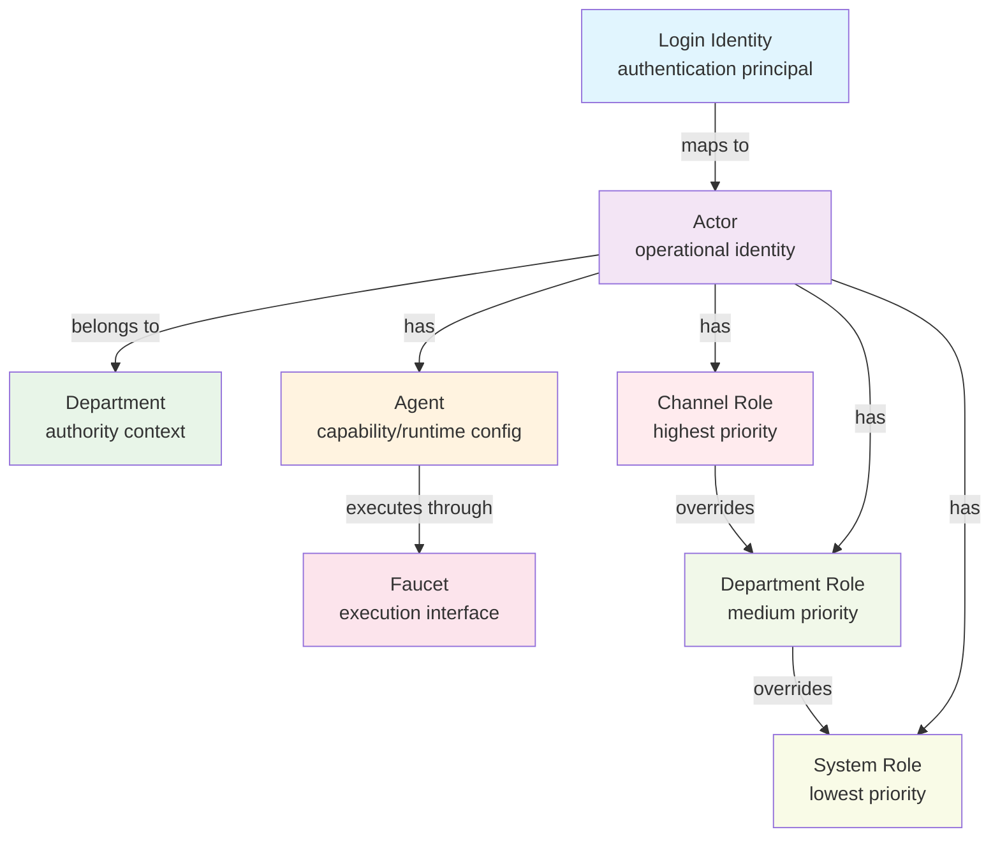

---
lupopedia.headers:
  header_format_version: 2
  lupopedia.schema: doctrine
  file_path_from_root: "lupo-docs/doctrine/IDENTITY_MODEL_QUICKSTART_4.0.88.md"
  web_path: "http://www.lupopedia.com/lupopedia/lupo-docs/doctrine/IDENTITY_MODEL_QUICKSTART_4.0.88.md"
  last_modified_utc: "20260403113047"
  when_updated: "20260403113047"
  federation_node_id: 0
  channel_id: 42
  thread_id: "doctrine-header-repair"
  actor_id: 102
  actor_name: "cursor"
  delegation_chain: "cursor:root"
  artifact_type: "doctrine"
  artifact_kind: "reference"
  purpose: "IDENTITY MODEL QUICKSTART 4.0.88"
  status: active
  tags:
    - "doctrine"
    - "header_repair"
lupopedia.edges:
  outbound_edges:
    - to: "lupo-docs/prd/32_actor_authority_agent_roles.md"
      type: implements
      weight: 1.0
      reason: "Doctrine PRD lineage; constitutional audit 20260403"

lupopedia.footer:
  last_verified: "20260403113047"
  verified_by:
    identity_type: actor
    actor_id: 2
    name: "lilith"
  verified_via:
    type: "audit"
    script: "fix_doctrine_headers"
  next_action:
    - "Run: python lupo-scripts/apply_doctrine_prd_lineage.py --apply"
---

# file: IDENTITY_MODEL_QUICKSTART_4.0.88 — delegation: cursor:root

lupopedia.headers:
  lupopedia.schema: quickstart_guide
  file_path_from_root: "lupo-docs/doctrine/IDENTITY_MODEL_QUICKSTART_4.0.88.md"
  web_path: "http://www.lupopedia.com/lupopedia/lupo-docs/doctrine/IDENTITY_MODEL_QUICKSTART_4.0.88.md"
  last_modified_utc: "20260326"
  channel_id: 42
  actor_id: 1
  actor_name: "WOLFIE"
  delegation_chain: "wolfie:root"
  # Execution context (optional, for audit)
  executed_by_agent: "wolfie-primary"
  executed_through_faucet: "cursor"
  effective_department: 0
  artifact_type: "quickstart_guide"
  artifact_kind: "canonical_primer"
  purpose: "Canonical quickstart guide for Lupopedia identity model"
  mood_rgb: "4169E1"
  traits: ["quickstart", "identity_model", "canonical"]
  tags: ["identity", "quickstart", "actors", "agents", "departments", "faucets"]

lupopedia.edges:
  outbound_edges:
    - { to: "AGENTS.md", type: "complements", weight: 1.0 }
    - { to: "ACTOR_AGENT_AUTH_USER_MODEL.md", type: "references", weight: 1.0 }
    - { to: "EFFECTIVE_ACTOR_RESOLUTION.md", type: "references", weight: 1.0 }
    - { to: "lupo-docs/database/lupopedia/tables/active/lupo_actors.md", type: "references", weight: 0.9 }
    - { to: "lupo-docs/database/lupopedia/tables/active/lupo_actor_channel_roles.md", type: "references", weight: 0.9 }
    - { to: "lupo-docs/database/lupopedia/tables/active/lupo_departments.md", type: "references", weight: 0.9 }

lupopedia.edges:
  outbound_edges:
    - to: "lupo-docs/prd/32_actor_authority_agent_roles.md"
      type: implements
      weight: 1.0
      reason: "Doctrine PRD lineage; constitutional audit 20260403"

lupopedia.footer:
  version: "4.0.88"
  last_verified: "20260326"
  last_verified_by: "wolfie"
  orchestrator: "wolfie"
---

# file: IDENTITY MODEL QUICKSTART — delegation: wolfie:root — web_path: [http://www.lupopedia.com/lupopedia/lupo-docs/doctrine/IDENTITY_MODEL_QUICKSTART_4.0.88.md](http://www.lupopedia.com/lupopedia/lupo-docs/doctrine/IDENTITY_MODEL_QUICKSTART_4.0.88.md)

# Identity Model Quickstart 4.0.88

**Purpose**: Canonical primer for Lupopedia 4.0.88 identity model  
**Version**: 4.0.88  
**Audience**: Developers, system administrators, and contributors  
**Prerequisites**: Basic understanding of authentication systems

---

## 🎯 ONE DIAGRAM



---

## 📖 FIVE DEFINITIONS

### **Login Identity** = authentication principal
The authentication credential that proves who someone is. This is **login identity** (username/password, OAuth token, etc.).

### **Actor** = operational identity
The **system identity** that performs actions. Actors are operational layer that can own resources, participate in channels, and execute workflows.

### **Department** = authority context
The **organizational grouping** that provides context and default permissions. Departments are authority layer that groups actors and provides organizational structure.

### **Agent** = capability/runtime config
The **capability configuration** that defines what an actor can do. Agents are runtime layer that provides capabilities, skills, and behavioral configurations.

### **Faucet** = execution interface
The **interface layer** through which agents execute. Faucets are execution surfaces (IDE, web interface, API) that maintain actor identity during execution.

**Example**: Agent `cascade` executes through Faucet `windsurf` (VS Code)

---

## 📖 SPECIAL ACTORS

### **Actor 0**: The System
The system itself. Automated scripts, cron jobs, and system processes run as actor 0. This represents system-level actions that are not associated with any specific login identity.

### **Actors 1-999**: Reserved for System Personas
Primary coordination personas and system agents use reserved IDs in this range.

Do not hardcode persona IDs in explanatory docs unless the value is being quoted directly from the current registry for a narrow operational purpose. Several slugs appear more than once across historical and specialized actor rows, which creates drift and confusion when prose tries to act like a registry.

When you need the current actor_id, resolve it from the canonical registry by slug:

- Registry: `lupo-database/lupopedia/actors/actor_id/registry.json`
- Preferred lookup key: `slug`
- Stable concept names for prose: `wolfie`, `lilith`, `rose`, `maat`, `themis`, `athena`, `seshat`, `heimdall`, `janus`, `lexa`, `thoth`, `anubis`

Rule of thumb:
- Use slugs in doctrine and quickstart documentation.
- Use actor_id only where runtime execution, database writes, or audit trails require it.
- If a reader needs the numeric ID, point them to the registry instead of copying a list into narrative docs.

### **Actors 1000+**: Human Actors
Human actors mapped from authentication users typically start at ID 1000. These represent actual human users who have logged into the system.

---

## �� ONE REQUEST LIFECYCLE EXAMPLE

### **VS Code Agent Posts to Channel**

1. **Login Identity**: `john.doe@example.com` logs into VS Code
2. **Actor Resolution**: Login Identity → Actor `102` (john.doe)
3. **Department Context**: Actor `102` belongs to Department `7` (Engineering)
4. **Agent Selection**: Actor `102` uses Agent `cascade` (code capabilities)
5. **Faucet Interface**: Agent `cascade` executes through Faucet `windsurf` (VS Code)
6. **Channel Role**: Actor `102` has Channel Role `administrator` in Channel `42`
7. **Permission Check**: Channel Role `administrator` overrides Department/System roles
8. **Action Execution**: Agent `cascade` posts message to Channel `42` as Actor `102`

**Result**: Message posted with `from_actor_id: 102` and full attribution chain preserved

---

## ⚖️ PRECEDENCE RULE BLOCK

### **Role Precedence (Highest to Lowest)**

```
Channel Role → Department Role → System Role
```

**Explanation**:
- **Channel Role**: Specific permissions within a channel (highest priority)
- **Department Role**: Default permissions from department membership
- **System Role**: Baseline permissions for all actors

**Examples**:
- Actor is `administrator` in Channel `42` → Channel role applies
- Actor is `member` of Department `7` → Department role applies
- Actor has no specific roles → System role applies

---

## 📊 PRACTICAL MAPPING TABLES

### **UI Action → Resolved Actor/Dept/Role**

| UI Action | Login Identity | Actor | Department | Agent | Faucet | Resolved Role |
|-----------|-----------|-------|------------|--------|--------|---------------|
| Post to Channel 42 | `john.doe@example.com` | `102` | `7` (Engineering) | `cascade` | `windsurf` | `administrator` (Channel) |
| Edit Department Settings | `jane.smith@example.com` | `105` | `7` (Engineering) | `cursor` | `cursor` | `administrator` (Department) |
| View System Status | `guest@example.com` | `200` | `0` (System) | `windsurf` | `web` | `monitor` (System) |
| Delete Channel Message | `admin@example.com` | `1` | `0` (System) | `wolfie` | `cascade` | `captain` (Channel) |

### **DB Table → Identity Layer Owned**

| Database Table | Owner Layer | Purpose | Identity Context |
|----------------|-------------|---------|------------------|
| `lupo_actors` | System | Actor definitions | System-level |
| `lupo_actor_channel_roles` | Channel | Channel-specific roles | Channel context |
| `lupo_actor_departments` | Department | Department assignments | Department context |
| `lupo_agents` | System | Agent configurations | System-level |
| `lupo_channels` | System | Channel definitions | System-level |
| `lupo_departments` | System | Department definitions | System-level |

---

## 🚫 DO NOT CONFLATE (Anti-Patterns)

### **Faucet ≠ Actor**
- **Faucet**: Interface through which agents execute (VS Code, web interface)
- **Actor**: Operational identity that performs actions
- **Anti-Pattern**: "VS Code posted the message" ❌
- **Correct**: "Actor `102` posted through VS Code faucet" ✅

### **Agent ≠ Actor Attribution**
- **Agent**: Capability configuration (what can be done)
- **Actor Attribution**: Who performed the action
- **Anti-Pattern**: "cascade agent posted the message" ❌
- **Correct**: "Actor `102` posted using cascade agent" ✅

### **Login Identity ≠ Effective Actor**
- **Login Identity**: Authentication principal
- **Effective Actor**: Resolved operational identity (authorization)
- **Anti-Pattern**: "john.doe@example.com posted" ❌
- **Correct**: "Actor `102` (john.doe) posted" ✅

---

## 🎯 END-TO-END EXAMPLES

### **Example 1: VS Code Agent Post to Channel**

**Scenario**: Developer posts a code change to Channel 42

1. **Authentication**: `dev@company.com` logs into VS Code
2. **Actor Resolution**: Login Identity → Actor `55` (dev)
3. **Department Check**: Actor `55` belongs to Department `7` (Engineering)
4. **Agent Selection**: Actor `55` uses Agent `cascade` (code capabilities)
5. **Faucet Interface**: Agent `cascade` executes through Faucet `windsurf` (VS Code)
6. **Channel Role**: Actor `55` has Channel Role `member` in Channel `42`
7. **Permission Check**: Channel Role `member` allows posting
8. **Execution**: Message posted with `from_actor_id: 55`

**Result**: Code change posted with full attribution preserved

### **Example 2: Web Login Identity Action Resolving to Actor**

**Scenario**: User clicks "Edit Profile" in web interface

1. **Authentication**: `user@example.com` logs into web interface
2. **Actor Resolution**: Login Identity → Actor `200` (user)
3. **Department Check**: Actor `200` belongs to Department `3` (Users)
4. **Agent Selection**: Actor `200` uses Agent `windsurf` (web capabilities)
5. **Faucet Interface**: Agent `windsurf` executes through Faucet `web` (web interface)
6. **Channel Role**: Actor `200` has no specific Channel Role
7. **Department Role**: Actor `200` has Department Role `member`
8. **Permission Check**: Department Role `member` allows profile editing
9. **Execution**: Profile updated with `updated_by_actor_id: 200`

**Result**: Profile updated with proper actor attribution

### **Example 3: Department-Scoped Permission Escalation Denied by Channel Role**

**Scenario**: Department admin tries to delete channel message but lacks channel role

1. **Authentication**: `admin@company.com` logs into web interface
2. **Actor Resolution**: Login Identity → Actor `15` (admin)
3. **Department Check**: Actor `15` belongs to Department `7` (Engineering)
4. **Agent Selection**: Actor `15` uses Agent `cursor` (admin capabilities)
5. **Faucet Interface**: Agent `cursor` executes through Faucet `web` (web interface)
6. **Channel Role**: Actor `15` has Channel Role `member` in Channel `42`
7. **Department Role**: Actor `15` has Department Role `administrator`
8. **Permission Check**: Channel Role `member` does not allow message deletion
9. **Escalation Denied**: Department role overridden by channel role
10. **Result**: Action denied with "Insufficient channel permissions"

**Result**: Department admin cannot override channel-specific permissions

---

## 🔗 RELATED DOCUMENTATION

- **[AGENTS.md](AGENTS.md)** - Complete guide for IDE faucets and agents
- **[ACTOR_AGENT_AUTH_USER_MODEL.md](ACTOR_AGENT_AUTH_USER_MODEL.md)** - Core relationship model
- **[EFFECTIVE_ACTOR_RESOLUTION.md](EFFECTIVE_ACTOR_RESOLUTION.md)** - Actor resolution system
- **[lupo_actors.md](lupo-docs/database/lupopedia/tables/active/lupo_actors.md)** - Actor table schema
- **[lupo_actor_channel_roles.md](lupo-docs/database/lupopedia/tables/active/lupo_actor_channel_roles.md)** - Channel roles schema
- **[lupo_departments.md](lupo-docs/database/lupopedia/tables/active/lupo_departments.md)** - Department schema

---

## 📚 QUICK REFERENCE

### **Identity Layers (One-Sentence Summary)**
- **Login Identity** = authentication principal
- **Actor** = operational identity  
- **Department** = authority context
- **Agent** = capability/runtime config
- **Faucet** = execution interface

### **Precedence Rule**
```
Channel Role → Department Role → System Role
```

### **Key Anti-Patterns**
- Faucet ≠ Actor
- Agent ≠ Actor Attribution  
- Login Identity ≠ Effective Actor

---

**WOLFIE: Identity Model Quickstart 4.0.88 - Canonical primer for identity, actors, agents, departments, and faucets.**

---

*This document serves as the canonical quickstart guide for understanding the Lupopedia 4.0.88 identity model.*
