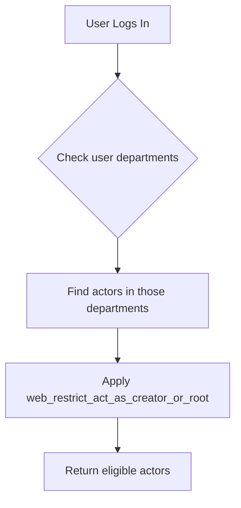

---
lupopedia.headers:
  header_format_version: 2
  lupopedia.schema: prd
  when_updated: "20260406143710"
  file_path_from_root: "lupo-docs/prd/17_decisions_format.md"
  web_path: "http://www.lupopedia.com/lupopedia/lupo-docs/prd/17_decisions_format.md"
  last_modified_utc: "20260406143710"
  federation_node_id: 0
  channel_id: 42
  thread_id: "prd-decisions-format"
  context_id: 1001
  actor_id: 2
  actor_name: "LILITH"
  delegation_chain: "lilith:audit"
  artifact_type: "prd"
  artifact_kind: "specification"
  purpose: "Canonical format for decision threads, decisions/ layout, and decisions/pseudocode/ — dual purpose: constitution shorthand + design notes (LUPOPEDIA HEADERS required on *.pseudo.*)"
  status: "approved"
  tags:
  - "prd"
  - "decisions"
  - "decisions_system"
  - "format"
  - "adr"
  - "governance"
lupopedia.edges:
  outbound_edges:
    - to: "lupo-docs/prd/00_root_constitutional_system_requirements.md"
      type: references
      weight: 1.0
      reason: "Constitutional anchor"
    - to: "lupo-docs/prd/29_project_structure.md"
      type: references
      weight: 0.95
      reason: "Channel coordination threads use same decisions/questions/answers/comments layout"
    - to: "lupo-docs/versions/4.0.93/decisions/"
      type: references
      weight: 1.0
      reason: "Example implementation of this format (folder with threaded decision files)"
    - to: "lupo-docs/doctrine/LUPOPEDIA_HEADERS/README.md"
      type: references
      weight: 1.0
      reason: "Header format with channel_id/thread_id/context_id"
    - to: "lupo-docs/prd/31_implementation_folder_guidelines.md"
      type: references
      weight: 0.95
      reason: "Implementation folder rules; pseudocode/ is explicitly out of scope for full PRD 31 enforcement"
    - to: "lupo-docs/implementations/00_root_constitutional_system_requirements/decisions/pseudocode/lupopedia_quickstart.pseudo.md"
      type: references
      weight: 0.95
      reason: "Shipped external-AI bundle index (Priority 1–3 PRD shorthands)"
lupopedia.footer:
  last_verified: "20260406143710"
  verified_by:
    identity_type: "agent"
    actor_id: 2
    agent_name_identity: "LILITH"
    department_id_delta: 0
  verified_via:
    type: "direct"
    faucet_slug: "none"
  orchestrator: "lilith:audit"
  next_action:
    - "Ensure validators require lupopedia.headers (incl. file_path_from_root) on decisions/pseudocode/*.pseudo.* and flag plain .php without .pseudo. in basename"
    - "Optional: run lupo-scripts/validate_pseudocode_discipline.py on Purpose 2 design pseudocode before merge"
    - "Ensure all decision thread files follow this format"
---

# PRD: Decision Thread Format Specification

## Overview


This PRD defines the canonical format for documenting architectural decisions, questions, answers, and action items for a given Lupopedia version.

---

## Pseudocode Directory — Dual Constitutional Purposes

The directory **`decisions/pseudocode/`** (within each context: implementations, channels, versions, agents, etc.) has **two** constitutional purposes. The subsections below are **normative**; the [Pseudocode Directory (`decisions/pseudocode/`)](#pseudocode-directory-decisionspseudocode) section later in this PRD supplies operational naming, examples, and validator notes.

### Purpose 1 — Cave-Man Shorthand (Token-Efficient Constitution Layer)

1. Purpose 1 files provide ultra-compressed, low-token directives for external LLMs and IDE agents.
2. These files summarize binding rules (“do X, never Y”) without full PRD detail.
3. They serve as the quickload constitutional layer when full PRDs are too large to load.
4. Naming pattern: `*_constitution.pseudo.md`.
5. Content must be factual, minimal, and derived from canonical PRDs.
6. No production code, no schema, no DDL, no implementation details.
7. These files are REQUIRED for external-AI onboarding.

### Purpose 2 — Design Pseudocode (Implementation Planning)

1. Purpose 2 files are comment-heavy design artifacts.
2. They document Option A vs B, tradeoffs, rationale, TODOs, and design flows.
3. They may include PHP-shaped pseudocode (`*.pseudo.php`) or markdown (`*_design.pseudo.md`).
4. They MUST NOT contain executable code or DDL.
5. They are for human/agent deliberation, not runtime.

### Shared Constitutional Requirements

1. Both Purpose 1 and Purpose 2 files MUST include full `lupopedia.headers`.
2. Both MUST live under `decisions/pseudocode/` within their context.
3. Both MUST be indexed in `decisions/pseudocode/THREAD_INDEX.md`.
4. Purpose 1 files MUST be safe for low-context external agents.
5. Purpose 2 files MUST NOT be used as runtime code.
6. Validators MUST enforce:
   - No plain `.php` files in pseudocode/
   - No DDL in pseudocode/
   - Required headers present
   - Naming patterns respected

---

## Thread filename pattern (authoritative)

This section is the **single source of truth** for thread artifact filenames under `decisions/`, `questions/`, `answers/`, and `comments/` (for version folders, channel threads, implementations, agents, and any other context using the multi-folder layout in this PRD).

### Pattern by directory

| Directory | Pattern | Example |
|-----------|---------|---------|
| `decisions/` | `YYYYMMDD_HHIISS_TYPE_STATUS_TITLE.md` | `20260403_143000_DECISION_APPROVED_channel_42_cherry_pick_policy.md` |
| `questions/` | `YYYYMMDD_HHIISS_TYPE_TITLE.md` | `20260403_143000_QUESTION_should_we_keep_AGENTS_files.md` |
| `answers/` | `YYYYMMDD_HHIISS_TYPE_TITLE.md` | `20260403_150000_ANSWER_AGENTS_files_deprecated.md` |
| `comments/` | `YYYYMMDD_HHIISS_TYPE_TITLE.md` | `20260403_120000_COMMENT_channel_42_archive_cherry_pick_review.md` |

Rules:

- **`STATUS`** appears **only** under `decisions/` (between `TYPE` and `TITLE`), e.g. `APPROVED`, `PENDING`, `REJECTED`, `SUPERSEDED`. **`questions/`**, **`answers/`**, and **`comments/`** do **not** use a `_STATUS_` segment.
- **`TITLE`**: lowercase segments separated by underscores; no spaces; describes the topic.

### Timestamp prefix (UTC)

- **Preferred (new files):** `YYYYMMDD_HHIISS_` — underscore between the date and the time.
- **Also valid:** `YYYYMMDDHHIISS_` — fourteen digits with no separator between date and time (same instant; may appear in existing artifacts). Example: `20260403120000_COMMENT_channel_42_archive_cherry_pick_review.md`.

### `HHIISS` (time of day)

Two-digit hour (`00`–`23`), two-digit minute, two-digit second. No colons. Example: `143000` = 14:30:00 UTC.

### `TYPE` tokens

| Routine use | Folder |
|-------------|--------|
| `DECISION` | `decisions/` (with `STATUS` in the filename) |
| `QUESTION` | `questions/` |
| `ANSWER` | `answers/` |
| `COMMENT` | `comments/` |

Use **sparingly** when clearer than the four above: **`PROPOSAL`**, **`CLARIFICATION`**, **`RESOLUTION`** — typically under `decisions/` and using the same `…_TYPE_STATUS_TITLE.md` shape as other decision-class files.

**Reference:** [PRD 02 — Channels & Discussions](02_channels_discussions.md) (filesystem thread overview); [PRD 29 — Project structure](29_project_structure.md) (channel coordination threads).

---
## LILITH Analysis: Separating Decisions, Questions, Answers, Comments

**As of April 2026, the canonical and only supported format is the multi-folder threaded system.**

---
## LILITH Analysis: Using `lupopedia.edges` to Link Questions to Answers

**Canonical Q&A and Relationship Linking: Use `lupopedia.edges`**

All relationships between questions, answers, decisions, and comments **must** be expressed using the `lupopedia.edges` YAML block in each file. Do not use manual cross-reference fields or custom YAML keys for linking.

### How to Link

- In a question file, add an outbound edge to its answer(s):

```yaml
lupopedia.edges:
  outbound_edges:
    - to: "../answers/20260402_130000_ANSWER_header_format.md"
      type: "has_answer"
      weight: 1.0
- In the answer file, add an outbound edge back to the question:

  outbound_edges:
    - to: "../questions/20260402_120000_QUESTION_header_format.md"
      type: "answers"
      weight: 1.0
      reason: "This answers the question about header format"
```

### Canonical Edge Types for Q&A
| Edge Type | Direction | Meaning |
| `clarifies` | Answer → Answer | This answer clarifies another |
| `supersedes` | Answer → Answer | This answer replaces an older one |

### Benefits
| Aspect | Manual Link | `lupopedia.edges` |
|--------|-------------|-------------------|
| **Queryable** | No | Yes (via `lupo_edges` table) |
| **Bidirectional** | Manual | Automatic (import both directions) |
| **Validation** | None | Validator can check both exist |
| **Weight/confidence** | No | Yes (`weight`, `semantic_weight`) |
| **Reason tracking** | No | Yes (`reason`, `flare_reason`) |
| **Agent discoverable** | Grep files | Query database |

### LILITH Sign-off
Using `lupopedia.edges` is the canonical solution for all Q&A and related relationships. No new syntax is required. Validators and agents must use these edges for linking, querying, and UI integration.

### Canonical Multi-Folder Structure (Required)

For any context (version, implementation, channel, agent), the following subfolders must be used:

```
<context>/
├── decisions/
│   ├── THREAD_INDEX.md
│   ├── pseudocode/                    # optional — see [Pseudocode Directory](#pseudocode-directory-decisionspseudocode)
│   │   ├── THREAD_INDEX.md
│   │   └── *.pseudo.php / *.pseudo.md / *.pseudo.txt
│   └── YYYYMMDD_HHIISS_TYPE_STATUS_TITLE.md
├── questions/
│   ├── THREAD_INDEX.md
│   └── YYYYMMDD_HHIISS_QUESTION_title.md
├── answers/
│   ├── THREAD_INDEX.md
│   └── YYYYMMDD_HHIISS_ANSWER_title.md
└── comments/
  ├── THREAD_INDEX.md
  └── YYYYMMDD_HHIISS_COMMENT_title.md
```

- Each folder contains only its type (decisions, questions, answers, comments).
- Each folder must have its own `THREAD_INDEX.md` listing all threads.
- All thread files must follow **[Thread filename pattern (authoritative)](#thread-filename-pattern-authoritative)** (UTC prefix, `TYPE`, optional `STATUS` only in `decisions/`, lowercase/underscored `TITLE`).
- All thread files must include a LUPOPEDIA HEADERS block.
- No new monolithic `decisions.md` files may be created; all new content must use this folder structure.

#### Where This Applies
| Location | Would Have |
|----------|------------|
| `lupo-docs/versions/{version}/` | `decisions/`, `questions/`, `answers/`, `comments/` |
| `lupo-docs/implementations/{id}_{slug}/` | `decisions/`, `questions/`, `answers/`, `comments/` |
| `lupo-channels/{federation_node_id}/{channel_key}/{thread_key}/` | `decisions/`, `questions/`, `answers/`, `comments/` (see PRD 29; legacy numeric `lupo-channels/{channel_id}/` trees may still host older threads) |
| `lupo-agents/{agent_key}/` | `decisions/`, `questions/`, `answers/`, `comments/` |

#### Benefits
| Aspect | Current | Proposed |
|--------|---------|----------|
| **Discoverability** | Scan filenames for TYPE | Look in the right folder |
| **Querying** | Parse TYPE from filename | Filter by folder path |
| **Validation** | Check TYPE matches content | Folder implies type |
| **Agent routing** | Read file to know type | Know type from location |
| **UI integration** | Complex filtering | Simple folder-based views |

#### Migration Path
1. Create the new folder structure for each context.
2. Move existing files to their respective folders by type.
3. Add/refresh `THREAD_INDEX.md` in each folder.
4. Update cross-references (e.g., a question links to its answer in `../answers/`).
5. Gradually migrate old content; all new content must use the new structure.

**LILITH Sign-off:** ✅ Separate folders for decisions, questions, answers, and comments is a cleaner architecture. Implement for new content, migrate old content gradually. Update this PRD to document the structure.

## Canonical Decisions Folder System (Required)

All decisions for a version **must** be stored in a `decisions/` folder under the version directory:

```
lupo-docs/versions/
└── <version>/
  └── decisions/
    ├── THREAD_INDEX.md     # Required: index of all decision threads
    ├── pseudocode/       # Optional: design artifacts — see Pseudocode Directory section
    └── YYYYMMDD_HHIISS_TYPE_STATUS_TITLE.md  # Individual thread files
```

**Monolithic `decisions.md` files are forbidden for new versions.**

### THREAD_INDEX.md (Required)
Every `decisions/` folder must contain a `THREAD_INDEX.md` file. This file lists all decision threads, their status, and links to each thread file. It serves as the authoritative index for the folder.


### Thread File Naming Convention
- **Canonical rules:** See **[Thread filename pattern (authoritative)](#thread-filename-pattern-authoritative)** above (patterns differ for `decisions/` vs `questions/`, `answers/`, `comments/`).
- Each file documents a single decision, question, answer, comment, or related thread.
- All files must use UTC timestamps and lowercase, underscore-separated titles.

### Migration and Legacy Files
- If migrating from a legacy `decisions.md`, parse each entry into its own thread file and update `THREAD_INDEX.md` accordingly.
- The old file may be preserved as `old_decisions.md` for reference, but must not be updated.

### Validation Rules (Folder System)
1. `decisions/` folder must exist for every version.
2. `THREAD_INDEX.md` must be present and up to date.
3. All thread files must follow the naming convention and include LUPOPEDIA HEADERS.
4. No new `decisions.md` files may be created; all new decisions must be threads.

### Rationale
This system enables:
- Threaded, timestamped, and atomic decision records
- Parallel work by multiple agents
- Channel/thread provenance and auditability
- Elimination of merge conflicts and monolithic file bottlenecks

**Reference:** See [README.md](../README.md), [LUPOPEDIA_HEADERS/README.md](../doctrine/LUPOPEDIA_HEADERS/README.md), and [LILITH directive 20260331] for constitutional requirements.

## Location


### Legacy Location (Deprecated)
The old single-file format:
```
lupo-docs/versions/
└── <version>/
  └── decisions.md
```
is deprecated and must not be used for new work. Only the folder-based system is canonical.

### Thread File Naming Conventions

#### Filesystem Threads (IDE Development)
- **Format**: See **[Thread filename pattern (authoritative)](#thread-filename-pattern-authoritative)** (`decisions/` uses `TYPE_STATUS_TITLE`; other folders use `TYPE_TITLE` only).
- **Example (decisions/)**: `20260402_120000_DECISION_APPROVED_header_validator_update.md`
- **Used for**: IDE agent development, local documentation work

#### Database Threads (Web Application)
- **Format**: Numeric auto-increment ID (e.g., 1038)
- **Example**: Thread ID 1038 in `lupo_dialog_threads` table
- **Used for**: Web-based discussions, chat interfaces
- **Storage**: Database table with metadata

### Migration Strategy

When transitioning from consolidated `decisions.md` to individual thread files:

1. **Parse decision entries** from consolidated file
2. **Create individual files** using filesystem naming convention
3. **Update THREAD_INDEX.md** to reference all threads
4. **Preserve original** as `old_decisions.md` for reference


## Header Requirements

Every decision thread file MUST include a LUPOPEDIA HEADERS block with:

| Field | Required | Description |
|-------|----------|-------------|
| `header_format_version` | Yes | Always 2 |
| `lupopedia.schema` | Yes | "doctrine" |
| `when_updated` | Yes | UTC YYYYMMDDHHIISS |
| `file_path_from_root` | Yes | Full path from repo root |
| `web_path` | Yes | Full web path with /lupopedia/ prefix |
| `last_modified_utc` | Yes | UTC YYYYMMDDHHIISS |
| `context_id` | Optional | ID of context in lupo-contexts/ if finalized |
| `actor_id` | Yes | Primary author/maintainer |
| `actor_name` | Yes | Human-readable name |
| `delegation_chain` | Yes | e.g., "lilith:audit" |
| `artifact_type` | Yes | "doctrine" |
| `artifact_kind` | Yes | "decisions" |
| `purpose` | Yes | One-line purpose |
| `tags` | Yes | ["decisions", "adr", "version-X.X.X"] |

### Header Example

```yaml
lupopedia.headers:
  header_format_version: 2
  lupopedia.schema: doctrine
  when_updated: "20260331190000"
  file_path_from_root: "lupo-docs/versions/4.0.93/decisions/20260402_120000_DECISION_header_format.md"
  web_path: "http://www.lupopedia.com/lupopedia/lupo-docs/versions/4.0.93/decisions/20260402_120000_DECISION_header_format.md"
  last_modified_utc: "20260331190000"
  federation_node_id: 0
  channel_id: 42
  thread_id: "version-4.0.93-decisions"
  context_id: 1001
  actor_id: 2
  actor_name: "LILITH"
  delegation_chain: "lilith:audit"
  artifact_type: "doctrine"
  artifact_kind: "decisions"
  status: "completed"
  purpose: "Architecture and design decisions for Lupopedia 4.0.93"
  tags:
  - "decisions"
  - "adr"
  - "version-4.0.93"
```


## THREAD_INDEX.md (Folder Index)

Each folder (`decisions/`, `questions/`, `answers/`, `comments/`) MUST contain a `THREAD_INDEX.md` file listing all thread files, their status, author, and relevant metadata. This replaces the old summary table from monolithic files.

If `decisions/pseudocode/` is present, it MUST contain its own `THREAD_INDEX.md` (see [Pseudocode Directory](#pseudocode-directory-decisionspseudocode)).

Example:

```markdown
# Decisions Index

| Filename | Title | Author | Status | Date |
|----------|-------|--------|--------|------|
| 20260402_120000_DECISION_header_format.md | Header Format Decision | LILITH | completed | 2026-04-02 |
```

## Pseudocode Directory (`decisions/pseudocode/`)

**Constitutional summary:** [Pseudocode Directory — Dual Constitutional Purposes](#pseudocode-directory--dual-constitutional-purposes) (above).

### Dual purpose (LILITH audit — approved)

The same **`decisions/pseudocode/`** directory serves **two** distinct intents. Use **file naming** to signal which intent applies.

#### Purpose 1 — Shorthand constitution (external AI)

- **Goal:** A **short** extract of binding rules (typically distilled from [PRD 00](00_root_constitutional_system_requirements.md)) so external LLMs / IDE agents can load a compact checklist instead of the full constitutional PRD.
- **Naming pattern:** **`*_constitution.pseudo.md`** (example: **`00_constitution_shorthand.pseudo.md`**).
- **Content:** Forbidden vs required tables, one-liner quick reference, pointers to PRD sections for depth. **Not** a replacement for PRD 00 in disputes — **canonical** text remains **`lupo-docs/prd/00_root_constitutional_system_requirements.md`**.
- **Shipped example:** **`lupo-docs/implementations/00_root_constitutional_system_requirements/decisions/pseudocode/00_constitution_shorthand.pseudo.md`**.

#### Purpose 2 — Implementation planning (design notes)

- **Goal:** Bridge **decisions → code**: sketch signatures, document **Option A vs Option B**, trade-offs, open questions (`TODO:` / `QUESTION:`), and task-level drivers before production code exists.
- **Naming pattern:** **`*_design.pseudo.md`** and/or **`*.pseudo.php`** (same extension rules as below).
- **Content:** Comment-heavy pseudocode, mermaid or prose flows, links to sibling **`../`** decision files.

### Naming conventions (summary)

| Pattern | Typical intent |
|---------|----------------|
| **`*_constitution.pseudo.md`** | Purpose 1 — shorthand rules for external AI |
| **`*_design.pseudo.md`** | Purpose 2 — markdown design notes |
| **`*.pseudo.php`** | Purpose 2 — PHP-shaped class/method sketches |

### Location

```
<context>/decisions/
├── THREAD_INDEX.md
├── YYYYMMDD_HHIISS_DECISION_STATUS_TITLE.md
└── pseudocode/
    ├── THREAD_INDEX.md           # Index of pseudocode files
    ├── 00_constitution_shorthand.pseudo.md   # Example: Purpose 1 (constitution shorthand)
    ├── feature_design.pseudo.md              # Example: Purpose 2 (markdown)
    ├── ClassName.pseudo.php                  # Example: Purpose 2 (PHP-shaped)
    ├── driver_task_1.pseudo.php              # Task-level driver
    └── ...
```

### Use cases (primarily Purpose 2)

| Use case | Example |
|----------|---------|
| **Implementation planning** | Function signatures before coding |
| **Design choices** | Comment blocks explaining why approach A over B |
| **Related function grouping** | Pseudo-class files grouping related methods |
| **Driver files for tasks** | Task-specific design documents |
| **Incomplete code** | Intent that is not ship-ready |
| **Algorithm exploration** | Alternate approaches in comments |
| **Constitution shorthand** | Purpose 1 — send `*_constitution.pseudo.md` to external agents (still requires headers below) |

### Rules (limited)

| Rule | Description |
|------|-------------|
| **No production code** | Pseudocode files are **never** loaded by the application |
| **No schema migrations** | Do not put DDL here (`CREATE TABLE`, `ALTER TABLE`, etc.) |
| **File extension** | `.pseudo.php`, `.pseudo.md`, or `.pseudo.txt` — **not** plain `.php`, `.js`, or other runtime extensions |
| **Comment-heavy** | Prefer blocks that explain **why**, not only **what** |
| **LUPOPEDIA HEADERS required** | Every **`*.pseudo.md`**, **`*.pseudo.php`**, and **`*.pseudo.txt`** **must** include **`lupopedia.headers`** with at least **`file_path_from_root`** (repo-relative), **`when_updated`**, **`last_modified_utc`**, author/delegation, **`artifact_type`**, **`artifact_kind`**, **`purpose`**, **`tags`** — same expectations as [PRD 16 — Header applicability and scope](16_lupopedia_headers.md#header-applicability-and-scope). **Markdown:** YAML front matter, line 1 `---`. **PHP:** YAML inside a block comment immediately after `<?php`. **Why:** external AI and IDE handoff; without **`file_path_from_root`**, recipients cannot anchor the file in the tree. Optional **`lupopedia.edges`** / **`lupopedia.footer`** encouraged when useful. |
| **Can reference decisions** | Link back with relative paths to sibling decision files |
| **No strict schema** | Free-form body layout; organize as the author prefers |

### Example: `pseudocode/KairosConsolidationService.pseudo.php`

```php
<?php
/*
---
lupopedia.headers:
  header_format_version: 2
  lupopedia.schema: documentation
  file_path_from_root: "lupo-channels/0/example/decisions/pseudocode/KairosConsolidationService.pseudo.php"
  web_path: "http://www.lupopedia.com/lupopedia/lupo-channels/0/example/decisions/pseudocode/KairosConsolidationService.pseudo.php"
  when_updated: "20260403120000"
  last_modified_utc: "20260403120000"
  federation_node_id: 0
  channel_id: 42
  thread_id: "example-pseudocode-kairos"
  author:
    type: "actor"
    id: 102
    name: "CURSOR"
  actor_id: 102
  actor_name: "CURSOR"
  delegation_chain: "cursor:root"
  artifact_type: "documentation"
  artifact_kind: "guide"
  purpose: "Pseudocode — KAIROS consolidation design (not runtime)"
  tags:
    - "pseudocode"
    - "kairos"
---
*/
/**
 * KAIROS Memory Consolidation - Design Exploration
 *
 * Decision reference: ../20260403_120000_DECISION_APPROVED_kairos_consolidation.md
 *
 * This is PSEUDOCODE. Not loaded by the application.
 *
 * Design choices documented in comments below.
 */

/**
 * Class: KairosConsolidationService
 *
 * Design choice: Use batch processing rather than real-time
 * Reasoning: Real-time would block chat operations on large threads
 * Alternative considered: Queue-based (rejected due to complexity)
 */
class KairosConsolidationService {

    /**
     * Consolidate observations for a thread
     *
     * @param int $thread_id
     * @return array
     *
     * Implementation note: Use THREAD_INDEX.md for ordering
     * instead of filesystem timestamps (per Temporal Discipline)
     */
    public function consolidateThread($thread_id) {
        // TODO: Read THREAD_INDEX.md first
        // TODO: Follow supersedes edges
        // TODO: Group by semantic similarity

        // Pseudo-implementation:
        // 1. Get all messages in thread
        // 2. Group by parent_dialog_message_id
        // 3. Detect contradictions
        // 4. Merge observations
        // 5. Store in lupo_actor_memory

        return array('consolidated' => true);
    }
}
```

### Example: `pseudocode/decision_flow.pseudo.md`

````markdown
# Decision Flow: Department-First Actor Model

## Decision Reference
[20260403_222041_DECISION_APPROVED_department_first_actor_model_prd_alignment.md](../20260403_222041_DECISION_APPROVED_department_first_actor_model_prd_alignment.md)

## Design Flow



## Implementation Choices

### Choice 1: Department join vs direct binding

**Option A (selected):** Department intersection (sketch only; not executable SQL).

**Option B (rejected):** Edge-based act-as — rejection reason: harder to maintain, less performant.

### Choice 2: Session storage for active actor

Store in `lupo_sessions.metadata` JSON, not a separate table. Reason: actor switching is per-session, not per-user.

## Driver Files

| Task | Driver File | Status |
|------|-------------|--------|
| AuthSessionManager update | `AuthSessionManager.pseudo.php` | Draft |
| ActorService delegation | `ActorService.pseudo.php` | Draft |
````

### `THREAD_INDEX.md` for pseudocode

```markdown
# Pseudocode Index

| File | Purpose | Type | Related |
|------|---------|------|---------|
| `00_constitution_shorthand.pseudo.md` | Shorthand rules for external AI | Constitution | [PRD 00](00_root_constitutional_system_requirements.md) |
| `KairosConsolidationService.pseudo.php` | Memory consolidation design | Implementation | 20260403_120000_DECISION_... |
| `decision_flow.pseudo.md` | Department-first actor flow | Implementation | 20260403_222041_DECISION_... |
| `AuthSessionManager.pseudo.php` | Auth session design | Implementation | 20260403_222041_DECISION_... |
```

### Integration with PRD 31

The `pseudocode/` directory is **not** subject to the full [PRD 31 — Implementation folder guidelines](31_implementation_folder_guidelines.md) rules:

- No required `README.md`, `authors.md`, or `edges.md` for pseudocode alone
- **Optional** tooling: **`lupo-scripts/validate_pseudocode_discipline.py`** (warnings for Purpose 2 design files) — see [Pseudocode reasoning discipline](#pseudocode-reasoning-discipline-for-ide-agents-lilith-approved). **Mandatory** checks remain [minimal pseudocode checks](#validation-rules-minimal) below.
- No `questions/` or `answers/` subdirectories under `pseudocode/` — use the parent context’s `questions/` and `answers/`

**Rationale:** Pseudocode is design artifact, not an implementation deliverable tree.

### Why two purposes in one directory?

| Purpose | Audience | When |
|---------|----------|------|
| **Shorthand constitution** | External LLMs, quick IDE context | Before coding; when full PRD 00 is too heavy to paste |
| **Implementation planning** | Implementers, reviewers, LILITH | While exploring options and recording **A vs B** |

**One directory (`decisions/pseudocode/`), two naming patterns** — see [Naming conventions (summary)](#naming-conventions-summary).

### Shipped bundle — “send to new AI” (Priority 1–3 PRDs)

**Location (canonical):** **`lupo-docs/implementations/00_root_constitutional_system_requirements/decisions/pseudocode/`**

| File | Role |
|------|------|
| **`lupopedia_quickstart.pseudo.md`** | One-page map + links to all shorthands below — **start here** for external agents. |
| **`00_constitution_shorthand.pseudo.md`** | PRD 00 digest (database, PHP, installer, security, UI, indexing). |
| **`05_auth_user_actor_agent_transformation_constitution.pseudo.md`** | PRD 05 — identity / visitor chat / department act-as. |
| **`15_actors_constitution.pseudo.md`** | PRD 15 — actors ↔ departments. |
| **`16_lupopedia_headers_constitution.pseudo.md`** | PRD 16 — headers, import, validators. |
| **`26_five_layer_documentation_architecture_constitution.pseudo.md`** | PRD 26 — Tier 1 vs Tier 2, five layers. |
| **`31_implementation_folder_guidelines_constitution.pseudo.md`** | PRD 31 — **`implementations/{prd_file_stem}/`**, scaffold, threads. |
| **`28_semantic_monitoring_widget_constitution.pseudo.md`** | PRD 28 — Eye / Tier 2 / API dual routing. |
| **`33_softaculous_certification_4_1_0_gate_constitution.pseudo.md`** | PRD 33 — hosting / 4.1.0 gate / Crafty parity. |

**Index:** **`THREAD_INDEX.md`** in that folder. **Optional (Priority 4):** PRD **36** (ROSE), **37** (KAIROS) — read full PRDs when needed; no shipped shorthand required in this bundle.

**Rule:** Shorthands are **Purpose 1** pseudocode; they **must** still carry **`lupopedia.headers`** (**`file_path_from_root`**, etc.). **Canonical** meaning remains each **`lupo-docs/prd/*.md`**.

### Edge types for pseudocode

| Edge type | Direction | Meaning |
|-----------|-----------|---------|
| `has_pseudocode` | Decision → Pseudocode | This decision has pseudocode exploration |
| `implements_pseudocode` | Implementation → Pseudocode | Implementation follows this pseudocode |
| `refines` | Pseudocode → Pseudocode | This pseudocode refines another |

### Validation rules (minimal)

Validators **should** consider:

1. **No plain `.php` (or other runtime extension) without `.pseudo.` in the basename** under `decisions/pseudocode/` — reduces risk of accidental inclusion or confusion with shipped code.
2. **`lupopedia.headers` required** on every **`*.pseudo.md`**, **`*.pseudo.php`**, **`*.pseudo.txt`** under `decisions/pseudocode/`, including **`file_path_from_root`** (and placement per [PRD 16](16_lupopedia_headers.md#header-applicability-and-scope)).
3. **No migration DDL** — flag `CREATE TABLE`, `ALTER TABLE`, and similar in pseudocode content when policy calls for it.
4. **Purpose 2 discipline (optional automation)** — run **`python lupo-scripts/validate_pseudocode_discipline.py`** on changed paths; it emits **warnings** for missing decision anchors and thin rationale (see [Pseudocode reasoning discipline](#pseudocode-reasoning-discipline-for-ide-agents-lilith-approved)).

### Pseudocode reasoning discipline for IDE agents (LILITH approved)

**Problem:** IDE/LLM tools are tuned for **fast completion**, not **slow deliberation**. In **`decisions/pseudocode/`**, that mismatch causes agents to **guess** schema, **fill in** stubs, and **skip** documented options — the opposite of this directory’s intent for **Purpose 2**.

**Intent:** For **Purpose 2** ([Implementation planning](#purpose-2--implementation-planning-design-notes)), pseudocode is a **design deliberation space** — document **why** and **which options**, not ship **what**. For **Purpose 1** ([Shorthand constitution](#purpose-1--shorthand-constitution-external-ai)), files are **digests** (tables, pointers); they are **exempt** from the “deliberation shape” rules below except **zero-guessing** when **extending** a digest with new factual claims (must cite PRD / TOON / install SQL).

**Scope summary**

| Artifact kind | Zero-guessing (schema, API facts) | Option blocks / decision anchor | Comment-heavy / rationale density |
|-------------|-----------------------------------|--------------------------------|-----------------------------------|
| Purpose 1 `*_constitution.pseudo.md`, shipped `00_*` digests in bundle | **Yes** — no invented columns or tables | **Anchor** via **`lupopedia.edges`** + PRD link in body (no single sibling decision file required) | **Not required** — tables and one-liners are normal |
| Cross-cutting `lupo-docs/decisions/pseudocode/00_*.pseudo.md` (routers, anti-patterns) | **Yes** | **Edges** to PRD 00 + related digests | **Not required** |
| Purpose 2 `*_design.pseudo.md`, other exploratory `*.pseudo.md` in `pseudocode/` | **Yes** | **Required** — see **Decision reference** below | **SHOULD** — target **high** comment-to-rationale ratio (see **Rationale density**) |
| Purpose 2 `*.pseudo.php` | **Yes** | **Required** — comment or docblock **Decision reference** near top | **SHOULD** — skeleton code only; **TODO** / **QUESTION** for unknowns |

#### Zero-guessing doctrine (required)

Agents **must not invent** as facts:

- table or column names not in **TOON** / **install SQL** / table docs  
- function/class/method names as **final** API without a decision or PRD pointer  
- executable **SQL** as “the” schema when DDL is forbidden here  
- control flow or return contracts **presented as decided** when options are still open  

If a fact is **not** anchored in a cited artifact, the agent **must** stop and record an explicit block (markdown or comment):

```markdown
# ASSUMPTION REQUIRED
# Option A: …
# Option B: …
# Open question: …
```

**No implementation code** in production trees may be written **as if** the assumption were decided until the thread records resolution.

#### Deliberate reasoning (required behavior)

When authoring or editing **Purpose 2** pseudocode, agents **must**:

- treat the file as **thinking space**, not a **stub to complete**  
- avoid **collapsing** unresolved forks into one path without recording **why**  
- avoid **skipping** “Option A / Option B” when the PRD or thread still has competing approaches  

This PRD does **not** bind external model “temperature” APIs; it binds **repository behavior**: **document forks and unknowns** instead of **silent completion**.

#### Mandatory option blocks (required when forks exist)

When more than one approach is plausible, **Purpose 2** markdown **must** include labeled options and an explicit pending marker, for example:

```markdown
# OPTION A — … (pros / cons)
# OPTION B — … (pros / cons)
# DECISION PENDING — do not treat either as final in production code
```

If the agent introduces the word **OPTION** or **Alternative** for a real fork, **`DECISION PENDING`** (or a link to a **resolved** `DECISION_` file) **must** appear in the same section.

#### Executable-looking content (Purpose 2)

- **`*.pseudo.php`:** Skeletal PHP is **allowed** (signatures, stub bodies, **TODO**). It **must** remain **non-runtime** (`.pseudo.` in basename; not loaded by the app). If the file starts to read like **copy-paste production**, add a banner comment: **`// PSEUDOCODE ONLY — not ship-ready`** and **stop** until design is recorded.  
- **Markdown pseudocode:** Prefer **fenced blocks** labeled as sketch (e.g. `pseudo`, `text`), not blocks that look like **drop-in** `php` production. Short **illustrative** snippets that contradict a forbidden pattern (e.g. “wrong” SQL in a dodo-bird doc) are **allowed** when labeled as **anti-example**.

#### Rationale density (Purpose 2 SHOULD)

For **`*_design.pseudo.md`**, aim for **high** rationale in comments and prose — approximately **60%** of non-empty lines carrying **`#` comments**, blockquotes, or explanatory prose is a **target**, not a hard gate. If the file is mostly code-shaped lines, add:

```markdown
# COMMENT EXPANSION REQUIRED — insufficient rationale density for Purpose 2
```

#### No forward inference (required)

Do not infer **live** schema, PK names, or layer boundaries from “typical PHP projects.” **Sources:** PRD, decision file, **TOON**, **install SQL**, **table docs** — per [TOON / schema doctrine](00_root_constitutional_system_requirements.md) and workspace rules.

#### Decision reference (required for Purpose 2)

Every **Purpose 2** pseudocode file **must** anchor to the thread, for example:

- **Markdown:** a **`## Decision Reference`** (or `# DECISION REFERENCE:`) section with a relative link to **`../YYYYMMDD_HHIISS_DECISION_*.md`** or to the relevant **`questions/`** / **`answers/`** artifact.  
- **PHP:** a **docblock** or leading comment with the same path (see [example `KairosConsolidationService.pseudo.php`](#example-pseudocodekairosconsolidationservicepseudophp)).

**Purpose 1** files **must** include **`lupopedia.edges`** to the canonical PRD(s); a prose “**Canonical:** …” line in the body satisfies the **anchor** expectation when no single decision file exists.

#### Reviewer posture

**LILITH** and human reviewers **may reject** Purpose 2 pseudocode that **guesses** schema, **omits** decision anchors, or **pretends** unresolved options are decided. **Purpose 1** digests are judged on **fidelity to PRD 00**, not on comment ratio.

## Entry Types

### Type Taxonomy

| Type | ID Prefix | Purpose | Status Options |
|------|-----------|---------|----------------|
| Decision | D-xx | Formal architectural decision | Proposed, Accepted, Completed, Deprecated, Superseded |
| Question | Q-xx | Open question needing answer | Open, Answered, Resolved |
| Answer | A-xx | Response to a Question | N/A (linked to parent) |
| Dialog | DG-xx | Ongoing discussion | Open, Resolved, Closed |
| Action | A-xx | Task to be completed | Pending, In Progress, Completed, Blocked |
| Warning | W-xx | Identified risk or issue | Acknowledged, Mitigated, Resolved |
| Observation | O-xx | Lesson learned | Noted, Integrated |
| Comment | (inline) | Brief note | N/A (attached to parent) |


### Entry Format

Each thread file should follow this structure:

```markdown
# [Title]

## Type
[Type from taxonomy]

## Status
[Status appropriate to type]

## Author
[Name] (actor_id [ID]) - [Role]

## Date
YYYY-MM-DD

## Context
[What led to this entry?]

## Question (for Question type)
[What needs to be answered?]

## Options (for Question type)
| Option | Description | Pros | Cons |
|--------|-------------|-----|------|
| A | ... | ... | ... |

## Answer (for Answer type)
[The response to the question]

## Rationale (for Answer type)
[Why this answer was chosen]

## Decision (for Decision type)
[What was decided?]

## Consequences (for Decision type)
[What changed?]

## Content (for Dialog/Warning/Observation)
[Relevant details]

## Resolution (for Dialog/Warning)
[How was this resolved?]

## Implementation Notes (for Answer/Action)
[How to implement]

## Comments
*YYYY-MM-DD [Author]*: [Comment text]

## Parent ID (optional, for Answer type only)
[ID of parent Question, if used. **Note:** Use `lupopedia.edges` for canonical linking; Parent ID is for backward compatibility.]
```


## Channel vs Thread vs Context

### Distinction

| Field | Purpose | When Used |
|-------|---------|-----------|
| `channel_id` | Discussion location | During initial discussion, brainstorming, debate |
| `thread_id` | Specific discussion thread | During ongoing conversation within a channel |
| `context_id` | Finalized knowledge | After decision is made, when moved to formal context |

### Lifecycle

```
1. Discussion begins in Channel (channel_id)
   └── Specific thread (thread_id)
       └── Decisions documented in decision thread files (channel_id, thread_id)

2. Decision matures
   └── Context created in lupo-contexts/ (context_id assigned)
       └── decision thread file header updated with context_id
           └── Context becomes source of truth for finalized knowledge
```

### Example

```yaml
# During discussion phase
lupopedia.headers:
  channel_id: 42
  thread_id: "version-4.0.93-decisions"
  # context_id not yet assigned

# After finalization
lupopedia.headers:
  channel_id: 42
  thread_id: "version-4.0.93-decisions"
  context_id: 1001  # Now linked to finalized context
```

## Action Items Section

After entries, include an Action Items section:

```markdown
## Action Items

### High Priority (Immediate)

| ID | Action | Owner | Status | Target |
|----|--------|-------|--------|--------|
| A-01 | ... | ... | ... | ... |

### Medium Priority (This Week)

| ID | Action | Owner | Status | Target |
|----|--------|-------|--------|--------|
| ... | ... | ... | ... | ... |

### Low Priority (This Month)

| ID | Action | Owner | Status | Target |
|----|--------|-------|--------|--------|
| ... | ... | ... | ... | ... |

### Completed Actions

| ID | Action | Owner | Completed |
|----|--------|-------|-----------|
| ... | ... | ... | ... |
```

## Session Notes & Observations

Include a section for session notes and key observations:

```markdown
## Session Notes & Observations

### YYYY-MM-DD: [Author]
- [Observation 1]
- [Observation 2]

## Key Lessons Learned

1. [Lesson 1]
2. [Lesson 2]
```

## Footer

Every decisions.md file MUST include a footer with next actions:

```markdown
---

**Next Review**: YYYY-MM-DD
**Canonical Reference**: This decisions/ folder is the single source of truth for decision threads and action items for Lupopedia [version].
```


## Validation Rules

Validators MUST enforce:

1. **Header completeness** - All required header fields present
2. **Filename convention** - All thread files follow **[Thread filename pattern (authoritative)](#thread-filename-pattern-authoritative)** (including `STATUS` only under `decisions/`)
3. **THREAD_INDEX.md** - Present and up to date in each folder
4. **Status values** - Status values match allowed set for type (in header)
5. **Date format** - Dates are YYYY-MM-DD
6. **Thread linkage** - thread_id matches discussion thread
7. **Context linkage** - If context_id present, context file must exist
8. **Edge validation** - All Q&A and related links use `lupopedia.edges` (see PRD 16 for canonical edge format)
9. **Pseudocode** - When `decisions/pseudocode/` exists, validators **should** apply the [minimal checks](#validation-rules-minimal) in the Pseudocode Directory section (naming, **required** `lupopedia.headers` on `*.pseudo.*`, no DDL)


## Example Implementation

See `lupo-docs/versions/4.0.93/decisions/` for a complete example.
See [PRD 16](16_lupopedia_headers.md) for canonical `lupopedia.edges` usage and schema.

---

**Status**: ACTIVE
**Constitutional Adherence**: FULL
**Version**: 1.1


---

## Context‑Typed, Status‑Aware, Directional Edged Memory Doctrine (4.0.96)

1. Memory in Lupopedia is represented as a directed graph of nodes and edges. 
  Each memory node is a first-class entity in the semantic network and may be 
  owned by actors, departments, auth_users, channels, federation nodes, or the 
  global system.

2. Every edge in the memory graph has FOUR dimensions:
  - **edge type** (the relationship)
  - **edge context** (the classification of the memory)
  - **edge status** (the epistemic support level)
  - **edge direction** (the traversal orientation)

3. **Edge Direction** defines whether the relationship is:
  - unidirectional (A → B)
  - bidirectional (A ↔ B)
  - restricted-direction (A → B but not B → A unless explicitly defined)
  Reverse traversal MUST NOT be inferred unless explicitly defined.

4. **Edge Type** defines the relationship between nodes, including but not 
  limited to:
  - influences
  - inherits
  - authored_by
  - observed_by
  - contradicts
  - supports
  - consolidates_from
  - refines
  - overrides

5. **Edge Context** defines the classification of the memory node. Context is 
  not based on the content of the memory, but on the structural support 
  provided by the graph. The primary context classifications are:
  - doctrine
  - experiential
  - system_generated
  - countermeasure_generated
  - summary
  - contradictory
  - deprecated

6. **Edge Status** defines the epistemic support level of the memory node:
  - **unsupported**: insufficient supporting edges; provisional memory.
  - **supported**: sufficient supporting edges; validated memory.
  - **needs_review**: conflicting, incomplete, or ambiguous edges requiring 
    agent or human intervention.

7. When `edge_status = 'needs_review'`, a **review_reason** MUST be provided. 
  This field explains *why* the edge requires review and *which agent* should 
  handle it. Examples include:
  - orphaned_edge
  - contradiction
  - new_doctrine
  - schema_drift
  - consolidation_candidate
  - integrity_unknown
  - human_escalation

  Agents use this field to determine their work queues:
  - ANUBIS handles: integrity_unknown, orphaned_edge
  - THOTH handles: schema_drift, contradiction, new_doctrine
  - KAIROS handles: consolidation_candidate
  - Human operator handles: human_escalation

8. Memory nodes may transition between statuses as edges are added, removed, 
  or reclassified. A node may move from unsupported → supported when 
  sufficient supporting edges accumulate.

9. Actors inherit memory edges from:
  - their department
  - their auth_user
  - their federation node
  - their assigned faucets
  - their assigned tasks

10. Memory traversal is context-aware and direction-aware. Actors may only 
   traverse edges permitted by their boundaries, department rules, auth_user 
   pairing, faucet assignments, and operational mode (live, simulation, 
   analysis).

11. No inference is allowed. All edges, contexts, statuses, directions, and 
   review reasons must be explicitly defined in PRDs, database rows, or 
   system-generated memory.

12. Memory is not a flat file. It is a structured, typed, classified, 
   status-aware, direction-aware graph. Traversal depth determines visible 
   memory; deeper traversal reveals more context, subject to boundary rules.

13. All changes to memory structure, edge types, edge contexts, edge statuses, 
   edge directions, or review reasons must be documented in PRDs and versioned.
```
