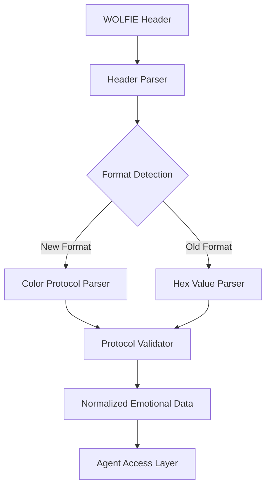

# Design Document

## Overview

The Color Protocol Integration system introduces a structured emotional metadata encoding system into Lupopedia's WOLFIE header architecture. Using the syntax `{FF} |77| [[00]]`, the protocol maps emotional geometry to a standardized format that maintains backwards compatibility while providing enhanced semantic richness for emotional metadata across the system.

The design integrates seamlessly with existing WOLFIE header parsing, maintains full backwards compatibility with existing `mood_RGB` hex values, and provides a foundation for future UI and analytics layers without requiring immediate implementation.

## Architecture

### Component Overview

The Color Protocol Integration system consists of four main components:

1. **Protocol Definition** - Formal specification of syntax, semantics, and validation rules
2. **Header Parser Extension** - Enhanced WOLFIE header parser supporting both old and new formats
3. **Documentation System** - Comprehensive documentation updates across all relevant specifications
4. **Developer Guide** - Implementation guidelines and examples for protocol usage

### System Integration

The system integrates with existing Lupopedia infrastructure:

- **WOLFIE Headers**: Extends existing header parsing without breaking changes
- **Emotional Geometry**: Aligns with established 3-axis emotional model
- **Agent System**: Provides consistent API for emotional metadata access
- **Documentation**: Updates all relevant specifications and examples

### Protocol Architecture



## Components and Interfaces

### Protocol Definition

**Purpose**: Provides formal specification of the color protocol syntax, semantics, and validation rules.

**Key Elements**:
- `syntax_specification` - Formal definition of `{RR} |GG| [[BB]]` format
- `emotional_axis_mapping` - Maps each channel to emotional geometry dimensions
- `value_range_specification` - Defines allowed values (0-255 or discrete -1/0/1)
- `validation_rules` - Comprehensive validation and error handling procedures

**Input**: Protocol design requirements and emotional geometry model
**Output**: Formal specification document with examples and validation rules

### Header Parser Extension

**Purpose**: Extends existing WOLFIE header parser to support color protocol while maintaining backwards compatibility.

**Key Methods**:
- `parseEmotionalMetadata(headerValue)` - Detects and parses both old and new formats
- `validateColorProtocol(protocolString)` - Validates color protocol syntax and values
- `normalizeEmotionalData(rawValue)` - Converts both formats to standard internal representation
- `getEmotionalMetadata(parsedHeader)` - Provides consistent API for emotional data access

**Input**: WOLFIE header content with emotional metadata
**Output**: Normalized emotional data structure

### Documentation System

**Purpose**: Updates all relevant documentation to reflect color protocol integration and usage.

**Key Deliverables**:
- Updated emotional geometry doctrine with protocol details
- Enhanced WOLFIE header specification with new field definitions
- Updated dialog specification with protocol examples
- Comprehensive developer guidelines and troubleshooting documentation

**Input**: Protocol specification and integration requirements
**Output**: Updated documentation across all relevant system specifications

### Developer Guide

**Purpose**: Provides implementation guidelines, examples, and best practices for color protocol usage.

**Key Sections**:
- Protocol generation guidelines with code examples
- Interpretation guidelines for emotional metadata consumption
- Validation procedures and error handling examples
- Migration strategies from existing hex format

**Input**: Protocol specification and developer requirements
**Output**: Comprehensive implementation guide with examples

## Data Models

### Color Protocol Structure

```yaml
ColorProtocol:
  syntax: "{RR} |GG| [[BB]]"
  channels:
    red_channel: 
      format: "{RR}"
      range: "00-FF or -1/0/1"
      emotional_axis: "axis_1"
    green_channel:
      format: "|GG|"
      range: "00-FF or -1/0/1"
      emotional_axis: "axis_2"
    blue_channel:
      format: "[[BB]]"
      range: "00-FF or -1/0/1"
      emotional_axis: "axis_3"
```

### Emotional Metadata Model

```yaml
EmotionalMetadata:
  format_type: enum [hex, color_protocol]
  raw_value: string
  normalized_values:
    axis_1: number (-1 to 1 or 0 to 255)
    axis_2: number (-1 to 1 or 0 to 255)
    axis_3: number (-1 to 1 or 0 to 255)
  validation_status: enum [valid, invalid, warning]
  error_messages: array[string]
```

### WOLFIE Header Integration

```yaml
WolfieHeaderExtension:
  mood_RGB: string # Supports both "FF0000" and "{FF} |00| [[00]]"
  emotional_metadata: EmotionalMetadata # Parsed and normalized data
  backwards_compatible: boolean # Always true
```

## Correctness Properties

*A property is a characteristic or behavior that should hold true across all valid executions of a system-essentially, a formal statement about what the system should do. Properties serve as the bridge between human-readable specifications and machine-verifiable correctness guarantees.*

### Property 1: Syntax Validation Accuracy
*For any* color protocol string, the validator should correctly identify valid syntax according to the formal specification.
**Validates: Requirements 1.1, 1.4, 3.2, 7.1**

### Property 2: Backwards Compatibility Preservation
*For any* existing mood_RGB hex value, the parser should continue to process it correctly without errors.
**Validates: Requirements 2.7, 3.6, 5.1, 5.2, 5.3**

### Property 3: Emotional Axis Mapping Consistency
*For any* valid color protocol value, the emotional axis mapping should be consistent with the formal specification.
**Validates: Requirements 1.2, 3.3, 7.2**

### Property 4: Value Range Validation
*For any* color protocol channel value, it should be validated against the specified allowed ranges.
**Validates: Requirements 1.3, 3.2, 7.3**

### Property 5: Error Handling Completeness
*For any* malformed color protocol input, the system should provide clear, actionable error messages.
**Validates: Requirements 1.5, 2.3, 3.4, 7.4**

### Property 6: Documentation Consistency
*For any* protocol feature documented in multiple locations, the information should be consistent across all documentation.
**Validates: Requirements 4.1, 4.2, 4.3, 4.7**

### Property 7: API Compatibility
*For any* existing agent or system component accessing emotional metadata, the API should continue to function without modification.
**Validates: Requirements 3.7, 5.5, 5.6**

### Property 8: Normalization Consistency
*For any* emotional metadata input (hex or protocol), the normalized output should follow consistent format and value ranges.
**Validates: Requirements 3.3, 8.2**

## Error Handling

### Protocol Syntax Errors

**Invalid Bracket Types**
- **Detection**: Validate bracket characters match specification exactly
- **Recovery**: Provide clear error message indicating correct bracket format
- **Example**: `{FF} (77) [[00]]` should error on parentheses usage

**Missing Bracket Pairs**
- **Detection**: Ensure all channels have proper opening and closing brackets
- **Recovery**: Identify which channel has missing brackets
- **Fallback**: Attempt to parse as hex format if protocol parsing fails

**Invalid Channel Values**
- **Detection**: Validate each channel value against allowed ranges
- **Recovery**: Provide specific error for out-of-range values
- **Normalization**: Clamp values to valid range with warning if configured

### Backwards Compatibility Errors

**Hex Format Conflicts**
- **Detection**: Distinguish between hex values and malformed protocol syntax
- **Recovery**: Default to hex parsing for ambiguous cases
- **Logging**: Log format detection decisions for debugging

**API Access Errors**
- **Detection**: Monitor existing agent access patterns for failures
- **Recovery**: Provide compatibility wrapper for legacy access methods
- **Migration**: Offer gradual migration path with deprecation warnings

### Documentation Consistency Errors

**Cross-Reference Validation**
- **Detection**: Validate all protocol references across documentation
- **Recovery**: Generate report of inconsistent references
- **Maintenance**: Automated checking for documentation drift

**Example Validation**
- **Detection**: Validate all protocol examples against formal specification
- **Recovery**: Flag invalid examples for correction
- **Testing**: Include example validation in test suite

## Testing Strategy

### Dual Testing Approach

The Color Protocol Integration will use both unit testing and property-based testing:

**Unit Tests**: Verify specific examples, edge cases, and error conditions
- Test parsing of known protocol formats and hex values
- Test validation of specific syntax variations
- Test error handling with known malformed inputs
- Test backwards compatibility with existing files

**Property Tests**: Verify universal properties across all inputs
- Test that any valid protocol syntax is parsed correctly
- Test that any existing hex value continues to work
- Test that any emotional metadata produces consistent normalization
- Test that any malformed input produces appropriate errors

### Property-Based Testing Configuration

**Testing Framework**: Use PHPUnit with Eris property testing library for PHP implementation
**Test Iterations**: Minimum 100 iterations per property test
**Test Tagging**: Each property test tagged with format: **Feature: color-protocol-integration, Property {number}: {property_text}**

### Property Test Implementation

**Property 1 Test**: Generate protocol strings with various syntax, verify validation accuracy
```php
/**
 * Feature: color-protocol-integration, Property 1: Syntax Validation Accuracy
 * For any color protocol string, validator should correctly identify valid syntax
 */
```

**Property 2 Test**: Generate existing hex values, verify continued compatibility
```php
/**
 * Feature: color-protocol-integration, Property 2: Backwards Compatibility Preservation
 * For any existing mood_RGB hex value, parser should process correctly
 */
```

**Property 3 Test**: Generate valid protocols, verify consistent axis mapping
```php
/**
 * Feature: color-protocol-integration, Property 3: Emotional Axis Mapping Consistency
 * For any valid protocol, emotional axis mapping should match specification
 */
```

**Property 4 Test**: Generate channel values, verify range validation
```php
/**
 * Feature: color-protocol-integration, Property 4: Value Range Validation
 * For any protocol channel value, should be validated against allowed ranges
 */
```

**Property 5 Test**: Generate malformed inputs, verify error message quality
```php
/**
 * Feature: color-protocol-integration, Property 5: Error Handling Completeness
 * For any malformed input, system should provide clear error messages
 */
```

**Property 6 Test**: Cross-validate documentation examples, verify consistency
```php
/**
 * Feature: color-protocol-integration, Property 6: Documentation Consistency
 * For any protocol feature, documentation should be consistent across locations
 */
```

**Property 7 Test**: Test existing agent access patterns, verify API compatibility
```php
/**
 * Feature: color-protocol-integration, Property 7: API Compatibility
 * For any existing agent, emotional metadata API should continue functioning
 */
```

**Property 8 Test**: Generate various inputs, verify normalization consistency
```php
/**
 * Feature: color-protocol-integration, Property 8: Normalization Consistency
 * For any emotional metadata input, normalized output should be consistent
 */
```

### Integration Testing

**WOLFIE Header Integration Tests**
- Test protocol integration with complete WOLFIE header parsing
- Verify no interference with other header fields
- Test performance impact of enhanced parsing

**Agent Compatibility Tests**
- Test existing agent access to emotional metadata
- Verify no breaking changes in agent workflows
- Test gradual migration scenarios

**Documentation Validation Tests**
- Validate all protocol examples in documentation
- Test cross-reference accuracy across specifications
- Verify example code functionality