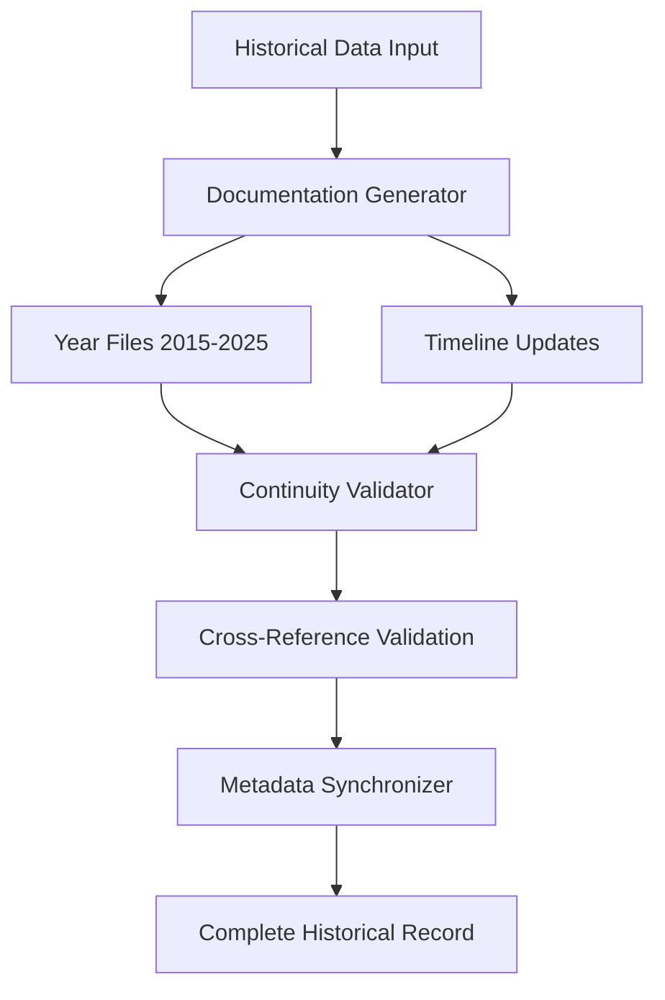

# Design Document

## Overview

The History Reconciliation Pass is a documentation-focused feature that addresses the 11-year gap (2014-2025) in Lupopedia's historical records. This system will create comprehensive documentation files, update timeline indexes, and establish narrative continuity between the Crafty Syntax era (2002-2013), the absence period (2014-2025), and the Lupopedia resurgence (2025-2026).

The design follows Lupopedia's established documentation patterns using WOLFIE headers, atom-based versioning, and consistent metadata structures. All generated documentation will integrate seamlessly with the existing `docs/history/` structure and maintain cross-reference integrity.

## Architecture

### Component Overview

The History Reconciliation system consists of four main components:

1. **Documentation Generator** - Creates and updates historical documentation files
2. **Timeline Manager** - Maintains chronological continuity and cross-references
3. **Continuity Validator** - Ensures no gaps exist and validates consistency
4. **Metadata Synchronizer** - Maintains consistent WOLFIE headers and atom references

### System Integration

The system integrates with existing Lupopedia infrastructure:

- **File System**: Uses established `docs/history/` directory structure
- **Atom System**: References `GLOBAL_CURRENT_LUPOPEDIA_VERSION` and other atoms
- **WOLFIE Headers**: Follows established metadata patterns
- **Cross-References**: Maintains links to existing documentation

### Data Flow



## Components and Interfaces

### Documentation Generator

**Purpose**: Creates and updates historical documentation files with consistent formatting and metadata.

**Key Methods**:
- `generateYearFile(year, content)` - Creates individual year documentation
- `updateTimelineFile(events)` - Updates main timeline with new events
- `generateHistoryIndex()` - Creates navigation index for historical documents
- `applyWolfieHeaders(file, metadata)` - Adds consistent WOLFIE headers

**Input**: Historical events, timeline data, metadata specifications
**Output**: Formatted markdown files with WOLFIE headers and cross-references

### Timeline Manager

**Purpose**: Maintains chronological continuity and manages timeline cross-references.

**Key Methods**:
- `validateChronology(events)` - Ensures chronological order and consistency
- `generateCrossReferences(files)` - Creates navigation links between documents
- `updateTimelineIndex(newFiles)` - Updates master timeline with new documentation
- `validateDateFormats(dates)` - Ensures consistent date formatting

**Input**: Timeline events, existing documentation files
**Output**: Updated timeline files with validated chronology and cross-references

### Continuity Validator

**Purpose**: Ensures no gaps exist in the historical timeline and validates consistency.

**Key Methods**:
- `validateTimelineContinuity(startYear, endYear)` - Checks for missing years
- `validateCrossReferences(files)` - Verifies all internal links work
- `validateMetadataConsistency(files)` - Ensures consistent WOLFIE headers
- `generateValidationReport()` - Creates report of any issues found

**Input**: Complete set of historical documentation files
**Output**: Validation report with any gaps or inconsistencies identified

### Metadata Synchronizer

**Purpose**: Maintains consistent WOLFIE headers and atom references across all historical files.

**Key Methods**:
- `synchronizeVersionAtoms(files)` - Updates version references to current atoms
- `validateHeaderConsistency(files)` - Ensures all files have proper WOLFIE headers
- `updateFileMetadata(file, metadata)` - Updates individual file metadata
- `generateMetadataTemplate(fileType)` - Creates standard metadata templates

**Input**: Historical documentation files, current atom values
**Output**: Files with synchronized and consistent metadata

## Data Models

### Historical Event

```yaml
HistoricalEvent:
  year: integer (1996-2026)
  title: string
  description: string
  category: enum [personal, technical, system, milestone]
  impact_level: enum [low, medium, high, critical]
  related_systems: array[string]
  cross_references: array[string]
```

### Timeline Entry

```yaml
TimelineEntry:
  date: string (YYYY or YYYY-MM-DD)
  event_type: enum [beginning, milestone, transition, achievement, gap_start, gap_end]
  title: string
  description: string
  context: string
  related_files: array[string]
```

### Documentation File Metadata

```yaml
DocumentationMetadata:
  file_path: string
  year_range: string
  status: enum [placeholder, draft, complete]
  last_modified: string (YYYY-MM-DD)
  cross_references: array[string]
  wolfie_headers: WolfieHeader
```

### WOLFIE Header Template

```yaml
WolfieHeader:
  wolfie.headers: "explicit architecture with structured clarity for every file"
  file.last_modified_system_version: GLOBAL_CURRENT_LUPOPEDIA_VERSION
  header_atoms:
    - GLOBAL_CURRENT_LUPOPEDIA_VERSION
    - GLOBAL_CURRENT_AUTHORS
  tags:
    categories: ["documentation", "history"]
    collections: ["core-docs"]
    channels: ["dev"]
  file:
    title: string
    description: string
    version: GLOBAL_CURRENT_LUPOPEDIA_VERSION
    status: enum [placeholder, draft, published]
    author: GLOBAL_CURRENT_AUTHORS
```

## Correctness Properties

*A property is a characteristic or behavior that should hold true across all valid executions of a system-essentially, a formal statement about what the system should do. Properties serve as the bridge between human-readable specifications and machine-verifiable correctness guarantees.*

### Property 1: Complete Year Coverage
*For any* year range from 2015-2025, all years in the range should have corresponding documentation files created with no gaps.
**Validates: Requirements 1.1, 1.4**

### Property 2: Consistent WOLFIE Headers
*For any* generated historical documentation file, it should contain valid WOLFIE headers that match the established metadata patterns.
**Validates: Requirements 1.2, 6.1, 6.2**

### Property 3: Timeline Continuity
*For any* timeline update, all years from 2014-2025 should be represented with major milestones included and chronological order maintained.
**Validates: Requirements 1.3, 5.1, 5.2**

### Property 4: Cross-Reference Integrity
*For any* cross-reference or internal link in the historical documentation, it should resolve to valid, existing content.
**Validates: Requirements 5.5, 7.1, 7.4, 7.5**

### Property 5: Formatting Consistency
*For any* set of historical documentation files, they should all follow consistent date formatting, terminology usage, and structural patterns.
**Validates: Requirements 1.5, 6.3, 6.4, 6.5**

### Property 6: System Evolution Documentation
*For any* major system (Crafty Syntax, WOLFIE, Lupopedia), its complete evolution and version progression should be documented with technical details and cross-system connections.
**Validates: Requirements 3.1, 3.3, 4.3**

### Property 7: Content Preservation
*For any* existing historical documentation, updates should only add content or improve formatting without removing existing information, and backups should be created before modifications.
**Validates: Requirements 8.1, 8.2, 8.3, 8.4, 8.5**

### Property 8: Navigation Index Completeness
*For any* history index file, it should contain navigation links to all existing historical documentation files and maintain accurate file path references.
**Validates: Requirements 5.3, 5.4, 7.2**

<function_calls>
<invoke name="prework">
<parameter name="featureName">history-reconciliation

## Error Handling

### File System Errors

**Missing Directory Structure**
- **Detection**: Check for existence of `docs/history/` and subdirectories
- **Recovery**: Create missing directories with proper permissions
- **Logging**: Log directory creation events for audit trail

**File Access Permissions**
- **Detection**: Test write permissions before file operations
- **Recovery**: Report permission issues to user with specific paths
- **Fallback**: Provide alternative output location if needed

**Disk Space Issues**
- **Detection**: Check available disk space before large operations
- **Recovery**: Clean up temporary files, warn user of space constraints
- **Graceful Degradation**: Continue with essential files only if space limited

### Data Validation Errors

**Invalid Timeline Data**
- **Detection**: Validate chronological order and date formats
- **Recovery**: Correct minor date format issues automatically
- **Escalation**: Report major chronological inconsistencies to user

**Missing Historical Information**
- **Detection**: Check for required historical events and milestones
- **Recovery**: Use placeholder content with clear markers for missing data
- **Documentation**: Log missing information for future completion

**Cross-Reference Failures**
- **Detection**: Validate all internal links and file references
- **Recovery**: Update broken links to correct paths when possible
- **Reporting**: Generate report of unresolvable references

### Content Generation Errors

**Template Processing Failures**
- **Detection**: Validate template syntax and required variables
- **Recovery**: Use fallback templates for critical content
- **Logging**: Log template errors with specific failure details

**Metadata Synchronization Issues**
- **Detection**: Validate WOLFIE header structure and atom references
- **Recovery**: Regenerate headers using current atom values
- **Consistency**: Ensure all files maintain metadata consistency

**Version Atom Resolution Failures**
- **Detection**: Test atom resolution before file generation
- **Recovery**: Use fallback version values if atoms unavailable
- **Alert**: Notify user of atom resolution issues

## Testing Strategy

### Dual Testing Approach

The History Reconciliation Pass will use both unit testing and property-based testing to ensure comprehensive coverage:

**Unit Tests**: Verify specific examples, edge cases, and error conditions
- Test specific historical events are documented correctly
- Test WOLFIE header generation with known inputs
- Test file creation with various permission scenarios
- Test cross-reference generation for known file sets

**Property Tests**: Verify universal properties across all inputs
- Test that any year range produces complete file coverage
- Test that any generated file set maintains consistent formatting
- Test that any timeline update preserves chronological order
- Test that any cross-reference set resolves correctly

### Property-Based Testing Configuration

**Testing Framework**: Use PHPUnit with Eris property testing library for PHP implementation
**Test Iterations**: Minimum 100 iterations per property test
**Test Tagging**: Each property test tagged with format: **Feature: history-reconciliation, Property {number}: {property_text}**

### Property Test Implementation

**Property 1 Test**: Generate random year ranges, verify all years have files
```php
/**
 * Feature: history-reconciliation, Property 1: Complete Year Coverage
 * For any year range from 2015-2025, all years should have documentation files
 */
```

**Property 2 Test**: Generate files with various content, verify WOLFIE headers
```php
/**
 * Feature: history-reconciliation, Property 2: Consistent WOLFIE Headers  
 * For any generated file, it should contain valid WOLFIE headers
 */
```

**Property 3 Test**: Generate timeline updates, verify continuity maintained
```php
/**
 * Feature: history-reconciliation, Property 3: Timeline Continuity
 * For any timeline update, chronological order should be maintained
 */
```

**Property 4 Test**: Generate cross-references, verify all links resolve
```php
/**
 * Feature: history-reconciliation, Property 4: Cross-Reference Integrity
 * For any cross-reference, it should resolve to valid content
 */
```

**Property 5 Test**: Generate multiple files, verify consistent formatting
```php
/**
 * Feature: history-reconciliation, Property 5: Formatting Consistency
 * For any file set, formatting should be consistent across all files
 */
```

**Property 6 Test**: Generate system documentation, verify completeness
```php
/**
 * Feature: history-reconciliation, Property 6: System Evolution Documentation
 * For any major system, complete evolution should be documented
 */
```

**Property 7 Test**: Update existing files, verify content preservation
```php
/**
 * Feature: history-reconciliation, Property 7: Content Preservation
 * For any existing file, updates should preserve original content
 */
```

**Property 8 Test**: Generate navigation indexes, verify completeness
```php
/**
 * Feature: history-reconciliation, Property 8: Navigation Index Completeness
 * For any index file, it should link to all existing documentation
 */
```

### Integration Testing

**End-to-End Workflow Tests**
- Test complete reconciliation process from start to finish
- Verify integration with existing Lupopedia documentation structure
- Test rollback capabilities if reconciliation fails

**Performance Testing**
- Test reconciliation performance with large historical datasets
- Verify memory usage remains reasonable during processing
- Test concurrent access scenarios

**Compatibility Testing**
- Test integration with existing WOLFIE header system
- Verify compatibility with current atom resolution system
- Test cross-reference compatibility with existing documentation