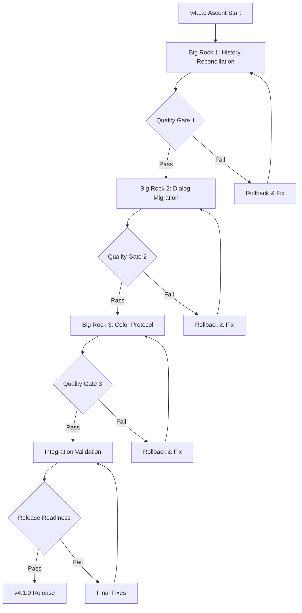

# Design Document

## Overview

The v4.1.0 Ascent Master Plan orchestrates three major Big Rocks to transform Lupopedia into a historically complete, dialog-modernized, and emotionally enhanced semantic operating system. The design ensures coordinated execution, quality assurance, and seamless integration while maintaining system stability and backwards compatibility throughout the ascent process.

## Architecture

### Master Plan Overview

The Ascent Master Plan coordinates three sequential Big Rocks:

1. **Big Rock 1**: History Reconciliation Pass - Establishes complete historical continuity (2014-2025 gap resolution)
2. **Big Rock 2**: Dialog Channel Migration - Modernizes dialog system (file-based → MySQL-backed)
3. **Big Rock 3**: Color Protocol Integration - Enhances emotional metadata (structured protocol integration)

### Execution Flow



## Components and Interfaces

### Ascent Orchestrator

**Purpose**: Master coordination system managing execution, dependencies, and quality gates across all Big Rocks.

**Key Methods**:
- `executeAscentPlan()` - Orchestrates complete v4.1.0 ascent process
- `validateBigRockCompletion(bigRockId)` - Validates Big Rock completion criteria
- `runQualityGate(gateId)` - Executes quality validation at checkpoints
- `generateProgressReport()` - Creates unified progress tracking across all initiatives

**Dependencies**: All three Big Rock specifications and their task lists
**Output**: Coordinated execution with quality assurance and progress tracking

### Dependency Manager

**Purpose**: Manages execution sequencing and inter-Big Rock dependencies.

**Key Methods**:
- `validateExecutionSequence()` - Ensures proper Big Rock ordering
- `checkPrerequisites(bigRockId)` - Validates prerequisites before Big Rock execution
- `manageParallelExecution()` - Coordinates parallel tasks where dependencies allow
- `handleExecutionFailures()` - Manages rollback procedures for failed executions

**Dependencies**: Big Rock task dependencies and completion criteria
**Output**: Proper execution sequencing with dependency validation

### Quality Gate System

**Purpose**: Integrated quality assurance across all Big Rocks with comprehensive validation.

**Key Methods**:
- `runBigRockValidation(bigRockId)` - Validates individual Big Rock completion
- `runIntegrationTests()` - Validates integration between completed Big Rocks
- `validateBackwardsCompatibility()` - Ensures no breaking changes introduced
- `generateQualityReport()` - Creates comprehensive quality assessment reports

**Dependencies**: Test suites from all Big Rocks and integration test specifications
**Output**: Quality validation reports with pass/fail status and remediation guidance

### Release Coordinator

**Purpose**: Manages final integration, validation, and release preparation for v4.1.0.

**Key Methods**:
- `validateSystemIntegration()` - Ensures all Big Rocks work cohesively together
- `prepareReleaseDocumentation()` - Generates unified v4.1.0 release documentation
- `validateMigrationProcedures()` - Ensures smooth upgrade path for existing installations
- `certifyReleaseReadiness()` - Final certification that v4.1.0 is ready for public release

**Dependencies**: Completed Big Rocks and comprehensive system validation
**Output**: Release-ready v4.1.0 with complete documentation and migration procedures

## Data Models

### Big Rock Status Model

```yaml
BigRockStatus:
  big_rock_id: enum [history-reconciliation, dialog-migration, color-protocol]
  status: enum [not_started, in_progress, completed, failed, rolled_back]
  completion_percentage: number (0-100)
  tasks_completed: number
  tasks_total: number
  quality_gate_status: enum [pending, passed, failed]
  start_timestamp: string
  completion_timestamp: string
  dependencies_met: boolean
  blocking_issues: array[string]
```

### Ascent Progress Model

```yaml
AscentProgress:
  overall_completion_percentage: number (0-100)
  current_phase: enum [history, dialog, color, integration, release]
  big_rocks_completed: number (0-3)
  quality_gates_passed: number (0-3)
  estimated_completion: string
  risk_level: enum [low, medium, high, critical]
  active_issues: array[Issue]
  next_milestone: string
```

### Quality Gate Model

```yaml
QualityGate:
  gate_id: enum [history_complete, dialog_complete, color_complete, integration_complete]
  status: enum [pending, running, passed, failed]
  test_suites_run: array[string]
  tests_passed: number
  tests_failed: number
  critical_issues: array[string]
  warnings: array[string]
  remediation_required: boolean
  gate_timestamp: string
```

## Correctness Properties

*A property is a characteristic or behavior that should hold true across all valid executions of a system-essentially, a formal statement about what the system should do. Properties serve as the bridge between human-readable specifications and machine-verifiable correctness guarantees.*

### Property 1: Sequential Execution Order
*For any* ascent execution, Big Rocks should be executed in the correct dependency order (History → Dialog → Color Protocol).
**Validates: Requirements 2.1, 2.2, 2.3, 2.5**

### Property 2: Quality Gate Enforcement
*For any* Big Rock completion, the system should not proceed to the next Big Rock until quality gates are passed.
**Validates: Requirements 3.1, 3.2, 3.7**

### Property 3: Progress Tracking Accuracy
*For any* point in the ascent process, progress tracking should accurately reflect the current state of all Big Rocks.
**Validates: Requirements 4.1, 4.2, 4.3**

### Property 4: Integration Validation Completeness
*For any* completed Big Rock, integration with previously completed Big Rocks should be validated before proceeding.
**Validates: Requirements 5.1, 5.2, 5.3, 5.4**

### Property 5: Documentation Consistency
*For any* documentation update across Big Rocks, terminology and cross-references should remain consistent.
**Validates: Requirements 6.2, 6.3, 6.6**

### Property 6: Backwards Compatibility Preservation
*For any* Big Rock completion, existing system functionality should continue to work without breaking changes.
**Validates: Requirements 3.4, 5.6**

### Property 7: Rollback Capability
*For any* failed Big Rock or quality gate, the system should be able to rollback to the previous stable state.
**Validates: Requirements 2.6, 3.7, 8.4**

### Property 8: Release Readiness Validation
*For any* v4.1.0 release candidate, all completion criteria should be met before certification.
**Validates: Requirements 7.1, 7.2, 7.7**

## Error Handling

### Big Rock Execution Errors

**Task Failure Within Big Rock**
- **Detection**: Monitor individual task completion status within each Big Rock
- **Recovery**: Attempt task retry with error analysis and remediation
- **Escalation**: Mark Big Rock as failed if critical tasks cannot be completed
- **Rollback**: Provide rollback to pre-Big Rock state if necessary

**Quality Gate Failures**
- **Detection**: Comprehensive test suite execution at each quality gate
- **Analysis**: Detailed failure analysis with specific remediation recommendations
- **Recovery**: Allow fixes and re-execution of quality gate validation
- **Blocking**: Prevent progression to next Big Rock until quality standards met

**Integration Conflicts**
- **Detection**: Cross-Big Rock integration testing at each completion
- **Analysis**: Identify specific integration points causing conflicts
- **Resolution**: Coordinate fixes across multiple Big Rocks if necessary
- **Validation**: Re-run integration tests after conflict resolution

### System-Level Errors

**Resource Constraints**
- **Detection**: Monitor system resources during Big Rock execution
- **Mitigation**: Optimize resource usage and provide scaling recommendations
- **Recovery**: Pause execution if resources insufficient, resume when available

**Data Integrity Issues**
- **Detection**: Comprehensive data validation at each quality gate
- **Recovery**: Data repair procedures for corrupted or inconsistent data
- **Prevention**: Enhanced validation to prevent future data integrity issues

**Performance Degradation**
- **Detection**: Performance monitoring throughout ascent process
- **Analysis**: Identify performance bottlenecks introduced by Big Rock changes
- **Optimization**: Performance tuning and optimization recommendations
- **Validation**: Performance regression testing at each quality gate

## Testing Strategy

### Comprehensive Testing Approach

The v4.1.0 Ascent Master Plan uses multi-level testing:

**Unit Tests**: Individual Big Rock component validation
**Integration Tests**: Cross-Big Rock integration validation  
**System Tests**: Complete v4.1.0 system validation
**Performance Tests**: System performance under integrated load
**Regression Tests**: Ensure no functionality degradation

### Quality Gate Testing

**Quality Gate 1 (History Complete)**
- Validate all historical documentation created and cross-referenced
- Test timeline continuity and navigation functionality
- Verify no breaking changes to existing documentation structure

**Quality Gate 2 (Dialog Migration Complete)**  
- Validate all dialog data migrated accurately to database
- Test agent compatibility with new database-backed dialog system
- Verify backwards compatibility with existing dialog access patterns

**Quality Gate 3 (Color Protocol Complete)**
- Validate color protocol parsing and backwards compatibility
- Test emotional metadata consistency across all system components
- Verify no breaking changes to existing WOLFIE header processing

**Integration Quality Gate**
- Test complete system functionality with all Big Rocks integrated
- Validate cross-component interactions and data flow
- Test system performance under realistic load conditions

### Release Readiness Testing

**Migration Testing**
- Test upgrade procedures from v4.0.x to v4.1.0
- Validate data preservation during migration process
- Test rollback procedures for failed migrations

**Production Readiness Testing**
- Load testing with realistic usage patterns
- Security validation of all new components
- Documentation completeness and accuracy validation
- Deployment procedure validation