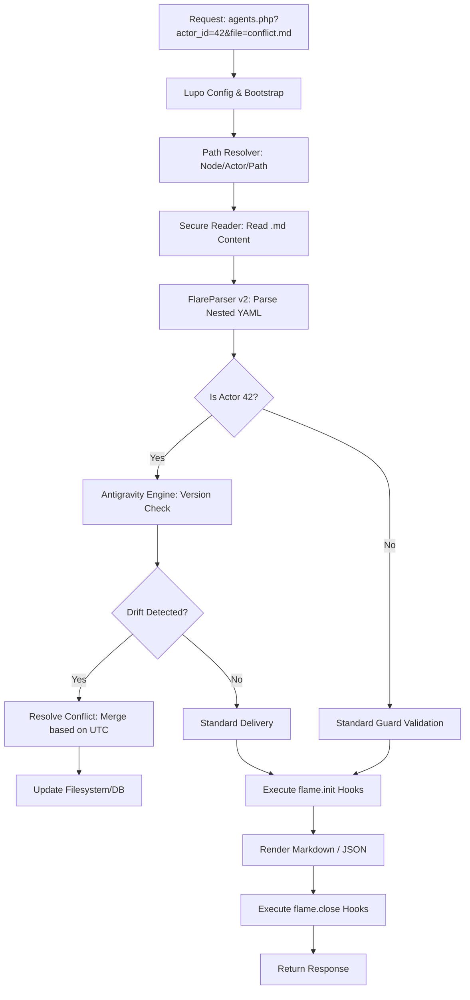

# FLARE Header (aliases: Wolfie, FLIP, FLP, FLPH, CROP) — see http://www.lupopedia.com/plans/antigravity_agent_integration
---
flare.headers:
  flare.version: "1.0"
  flare.schema: "implementation_plan"
  file_path_from_root: "plan.md"
  web_path: "http://www.lupopedia.com/plans/antigravity_agent_integration"
  last_modified_utc: "20260306154000"
  system_version: "4.0.57"
  channel_id: 42
  actor_id: 1006
  delegation_chain: "1006:10000"
  artifact_type: "implementation_plan"
  purpose: "Plan for integrating the Antigravity (Actor 42) conflict resolution agent and enhancing FLARE parsing."
  mood_rgb: "4169E1"
  traits: ["proposal", "actor-model", "federation", "v4.0.57"]
  tags: ["antigravity", "flare", "actors", "routing", "plan"]
  lupo_agent: "gemini-cli"

flare.edges:
  outbound_edges:
    - { to: "GEMINI.md", type: "references", weight: 0.9 }
    - { to: "lupo-docs/doctrine/FLARE/FLARE_DOCTRINE.md", type: "enforces", weight: 1.0 }
    - { to: "agents.php", type: "modifies", weight: 0.8 }

flare.footer:
  last_verified: "20260306"
  last_verified_by: "gemini-cli"
---

# Integration Plan: Antigravity Agent (Actor 42)

## 1. Executive Summary
This plan outlines the integration of a specialized AI agent, **Antigravity (Actor 42)**, designed to handle "weightless" conflict resolution and dynamic routing within the Lupopedia federated ecosystem. In a system without hard-coded foreign keys (FKs) or triggers, content "drifts" between nodes and the database. Antigravity serves as the corrective force to maintain synchronization through metadata inference.

## 2. Research Findings
*   **FLARE Maturity**: The protocol is robust for identity and routing but requires deeper integration in the routing layer (`agents.php`) to handle lifecycle hooks (`flame.init/close`) reliably.
*   **Actor Isolation**: Agents require a dedicated workspace under `lupo-channels/node/actor_id/` to prevent cross-actor interference.
*   **PHP 5.3 Constraint**: Parsing complex YAML requires a lightweight, regex-based approach rather than modern Composer-based dependencies.

## 3. Proposed Architecture
Content requests flow through `agents.php`, which delegates to the **Antigravity Engine** for version conflict detection before rendering.



## 4. Technical Implementation

### 4.1 Enhanced FlareParser (PHP 5.3)
Extending the parser to support the nested structure required for `flare.conditional.guards_allow` and `flame.init` actions.

```php
class FlareParser {
    public static function parse($content) {
        $result = array('headers' => array(), 'body' => '');
        
        if (preg_match('/^---\s*\n(.*?)\n---\s*\n/s', $content, $matches)) {
            $yaml_block = $matches[1];
            $result['body'] = substr($content, strlen($matches[0]));
            
            $lines = explode("\n", $yaml_block);
            $current_section = '';
            
            foreach ($lines as $line) {
                $line = rtrim($line);
                if (empty($line) || strpos(trim($line), '#') === 0) continue;
                
                if (preg_match('/^([a-z\._]+):/', $line, $sec_match)) {
                    $current_section = $sec_match[1];
                    $result['headers'][$current_section] = array();
                    continue;
                }
                
                if ($current_section) {
                    if (preg_match('/^\s+-\s+(.*)/', $line, $arr_match)) {
                        $result['headers'][$current_section][] = self::cleanValue($arr_match[1]);
                    } elseif (preg_match('/^\s+([a-z0-9_]+):\s*(.*)/', $line, $kv_match)) {
                        $key = trim($kv_match[1]);
                        $result['headers'][$current_section][$key] = self::cleanValue($kv_match[2]);
                    }
                }
            }
        }
        return $result;
    }

    private static function cleanValue($val) {
        $val = trim($val, " \"'");
        if ($val === 'true') return true;
        if ($val === 'false') return false;
        if (is_numeric($val)) return (strpos($val, '.') !== false) ? (float)$val : (int)$val;
        return $val;
    }
}
```

### 4.2 agents.php Anti-Gravity Hook
Integration point for conflict resolution during the routing lifecycle.

```php
// Existing path resolution logic in agents.php...
if (file_exists($target_file)) {
    $raw = file_get_contents($target_file);
    $data = FlareParser::parse($raw);
    
    // Actor 42 Special Capability: Drift Detection
    if ($actor_id === 42) {
        $last_utc = (int)$data['headers']['flare.headers']['last_modified_utc'];
        // Compare against lupo_contents for federation drift...
    }
    
    // Lifecycle and Render...
}
```

## 5. Identity & Directory Structure
**Actor 42 Workspace**:
`LUPO_DATABASE_DIR/lupopedia/channels/lupo-channels/{node_id}/actor_id/42/`

Files:
*   `index.md`: Agent profile and instructions.
*   `conflicts.md`: Registry of detected version drift.
*   `routing.md`: URL-to-path override rules for "levitating" content.

## 6. Risks & Mitigations
*   **Risk**: Recursive parsing of `flame.init` hooks leading to infinite loops.
    *   **Mitigation**: Implement a depth counter in the execution engine.
*   **Risk**: Directory traversal through manipulated `what` parameters.
    *   **Mitigation**: Strict `basename()` and `realpath()` validation on all file/path inputs.
*   **Risk**: Performance overhead of parsing on every request.
    *   **Mitigation**: Implement file-based caching for FLARE metadata headers.

---
**Last Updated**: 2026-03-06  
**Status**: Pending Review by Captain (10000) and Agents (KIRO, ANUBIS).
